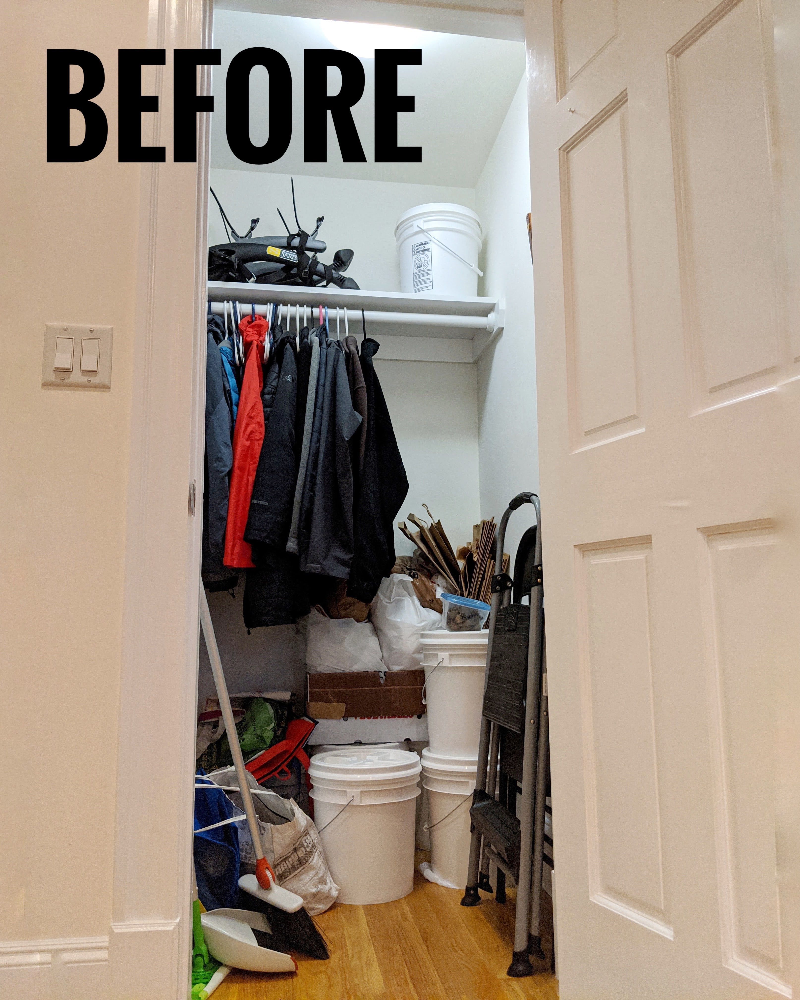
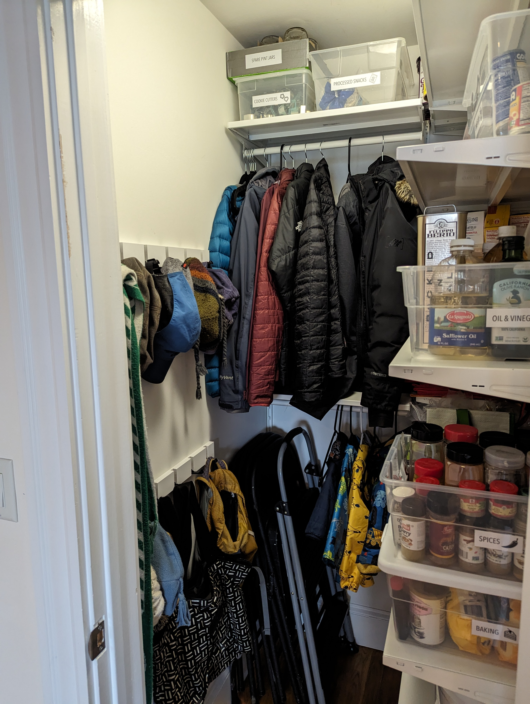
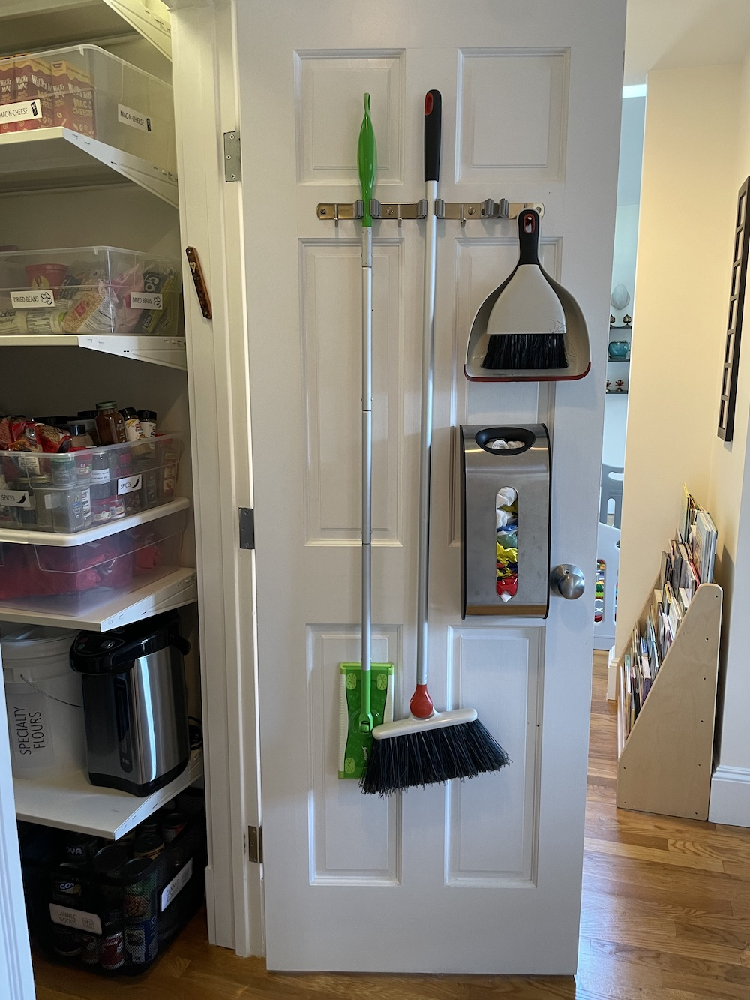
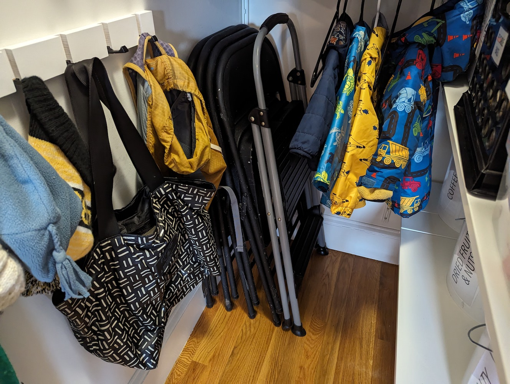
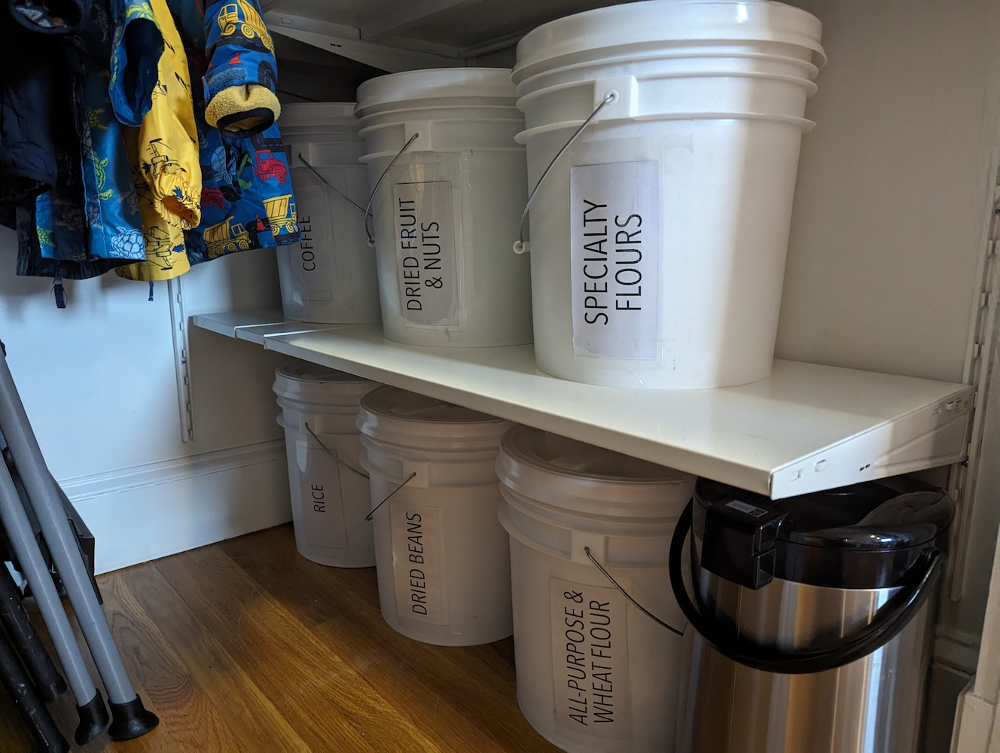
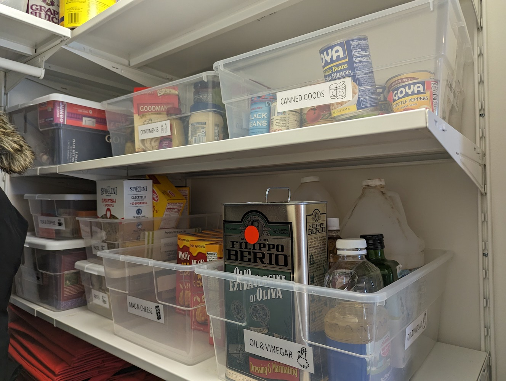
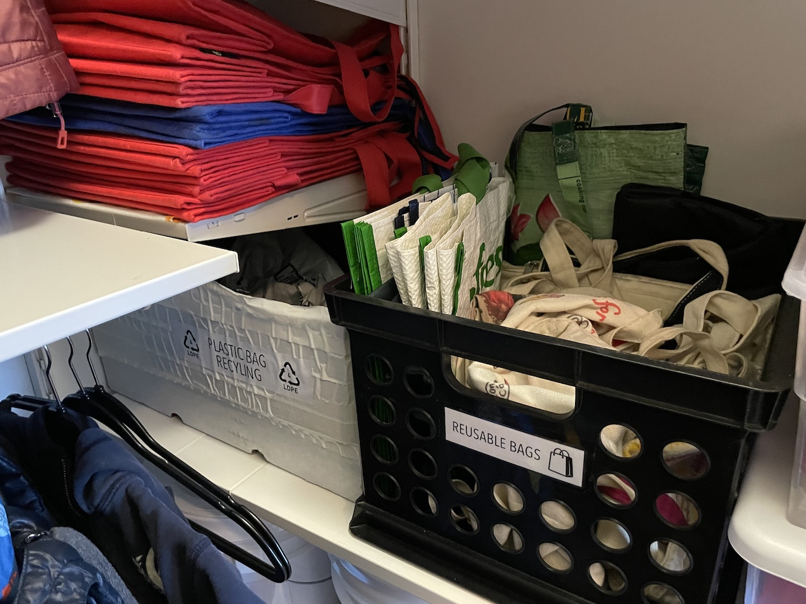

Our (third floor walkup) condo has no entryway, no pantry, and a single hallway closet. This tiny 3'8"x3'3" closet is the 
*most utilized* square footage in our home and has an enormous number of functions to fulfill. 

{: .mx-auto.d-block :}
*The current setup was failing our family and desperately needed some intentional planning to improve.*

### Kids' independently get and put away
* stepstool
* their own backpacks
* their own coats/hats/mittens
* some food while helping in the kitchen

### Adults' (easy/fast) access requirements
* get and put back
  * coats/hats/mittens
  * cloth/plastic bags
  * ingredients while cooking 
  * broom and dustpan for quick cleanup (IYKYK)
  * extra folding chairs for (sometimes spontaneous) guests
* know what food we have and what we are running low on
* stash plastic packaging for eventual recycling

### Additional storage requirements
* backstock and overflow (bulk) food
* oversized appliances and seldom-used cookware
* extra paper towels, sponges, trash bags

*That's a long list!* Space planning and optimization takes real effort, but the payoff is totally worth it for 
improving the efficiency of everyday life. Here's how our closet looks now: 

{: .mx-auto.d-block :}
*WOOO we checked off ALL of our requirements (so far)!*

## The Details

{: .mx-auto.d-block :}
*I hung the broom, dustpan, and Swiffer (used primarily to fish toy cars out from under couches) and a 
plastic bag dispenser directly on the back of the closet door.*

{: .mx-auto.d-block :}
*Installed two [rows of hooks](https://www.amazon.com/gp/product/B08TLX2Y75/) so that kids can reach the bottom level. These hooks fold back to save space and 
don't clobber your back when you're facing the other way. The stepstool is also accessible to our toddler and the folding chairs accessible for the grown-ups.*

{: .mx-auto.d-block :}

**Bulk food storage** was essential during the pandemic when the grocery options were buy (1) a restaurant-supply quantity or (2) nothing. 
These days, we're using the bins for storing all sorts of dried goods, and they're great! I cut some [transparencies](https://www.amazon.com/dp/B091BVB3GF) to make pockets (and cover the ugly "don't fall in" warning labels), then slid labels in.

{: .mx-auto.d-block :}

**About the bins:** I cannot think of a more effective solution for being able to immediately see what we have (and what we're low on) 
than clear plastic bins. Also c'mon, don't you love my labels with the little ICONS?! The idea came to me for organizing my (pre-reading) 2-year-old's stuff, 
but these seem to be easier for me (and random guests) to read, too!

{: .mx-auto.d-block :}

**Reusable grocery bags:** It's easier to stuff 'em in a bin or on the shelf than actually hang 'em up. 
It became *easiest* when we pared down the bag collection (why does this happen). 

**Plastic bag recycling:** Do you know the best/most intuitive spot for plastic bag recycling!? Me neither. This spot (in the pantry) was really our only option.
Seems to be working GREAT so far to ditch (plastic #4) packaging promptly without getting in anyone's way!

## Process and Cost

I explored *so many* organizer options before finally settling on the [Ikea Boaxel system](https://www.ikea.com/us/en/cat/boaxel-system-47394/), which seemed to maximize 
our specific space and included an option for a coat rod that did *not* span wall to wall. 
I prefer shelves attached directly to the wall, since standing units with front vertical supports block your view, access, and flexibility. 
**The total cost for the entire shelving system was only $167** (plus $10.44 in tax and a drive to Stoughton for late-night pickup). My mom watched our kids for one weekend day, and
it was surprisingly easy to take down the existing shelf/rod and get this new system installed in a few hours. 

*Shilpa Kobren is a research fellow in biomedical informatics at Harvard Medical School where she focuses on analyzing genomic data and
patient clinical information to derive insights into human diseases. Shilpa lives in a 1890 urban apartment in Cambridge, Massachusetts
with her husband and two energetic baby boys. She loves to create systems that optimize daily efficiency in family's constrained living space.*