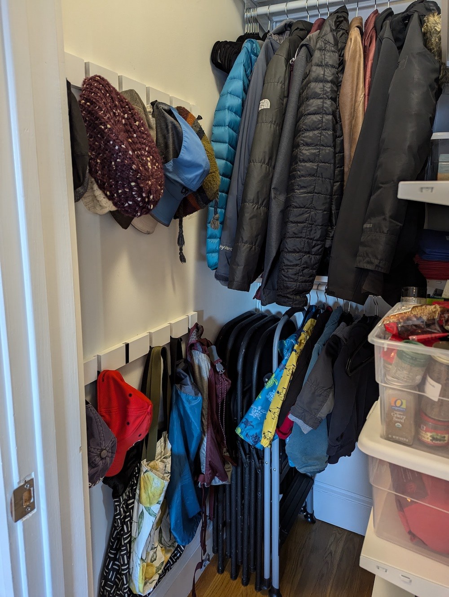

We have a single closet in our hallway and *no other entryway* in our (third floor walkup) condo. This tiny 3'8"x3'3" space is the 
most utilized square footage in our entire space and has an enormous number of required functions to check off. 

{: .mx-auto.d-block :}
*Clearly, the closet was not optimized and not even remotely functional for everything we needed...*

### Storage requirements
* coats
* hats, scarves, mittens
* kids' backpacks for daycare
* extra packaged food
* oversized appliances and seldom-used cookware
* extra paper towels, sponges, trash bags
* bulk food 
* folding chairs 
* stepstool
* broom, Swiffer, dustpan
* reusable plastic bags
* reusable grocery bags
* plastic bag recycling

### Kids' independently get and put away
* stepstool
* their own backpacks
* their own coats
* their own hats
* some food while helping in the kitchen

### Adults' (easy/fast) access requirements
* put groceries away 
* know what food we have and what we are running low on 
* access and put away ingredients while cooking 
* grab broom and dustpan for spills 
* pull out extra folding chairs for (sometimes spontaneous) guests

*That's a long list!* Here's the final project: 

{: .mx-auto.d-block :}
*This solution checks off every one of our requirements (so far) and required a lot of cerebral planning effort!*

## The Details

{: .mx-auto.d-block :}
*I hung the broom, dustpan, and Swiffer (which is used primarily to fish toy cars out from under couches) and a 
plastic bag dispenser directly on the back of the closet door. Best possible location!*

{: .mx-auto.d-block :}
*Installed two rows of hooks, the bottom level that the kids can reach. They do end up leaving their backpacks right on the
floor, but that's fine! The stepstool is also accessible and our 4-year-old can pull it out himself to watch and "help" 
my husband cook dinner. Bottom rod enables hanging by kiddos, and our folding chairs are accessible, too!*

{: .mx-auto.d-block :}
*Bulk storage of food items was essential during the Covid pandemic when going to a grocery store was potentially risky 
(and anyway the options were restaurant-supply quantities or nothing). We now use these bins 
for storing and organizing dry goods of all varieties!*

{: .mx-auto.d-block :}
*Clear bins are the BEST for immediately seeing what you have (and what you're low on). I understand that there may be 
prettier (wood, basket-weave) options, but I was going for **functionality first** in this tiny space. Putting groceries away (and making a grocery shopping list) is now a breeze. 
Don't you love the icons with each label? The idea came to me for organizing my 3-year-old's stuff (since he can't quite read), but it turns out they're useful for adults, too!*

{: .mx-auto.d-block :}
*We do not hang our reusable grocery bags. It's easier to stuff them in a bin, actually (and we keep the large ones organized on a mini shelf). I also 
spent a long time trying to figure out where our plastic bag recycling bin should go, and this was the only spot I could find. It is in fact better to have 
this out of the kitchen so that packaging can be put away immediately without getting in the way of someone cooking or ashing dishes in the kitchen.*

## The Process and Cost

I explored *so many* organizer options before finally settling on the [Ikea Boaxel system](https://www.ikea.com/us/en/cat/boaxel-system-47394/), because it seemed to maximize 
the space and included an option for a coat rod that did *not* span wall to wall. I also like having fully open shelves attached 
directly to the walls so that there are no vertical rods in front of the shelves to block your view, access, and storage flexibility. 
**The total cost for the entire shelving system was only $167** (plus $10.44 in tax and a drive to Stoughton for late-night pickup). 