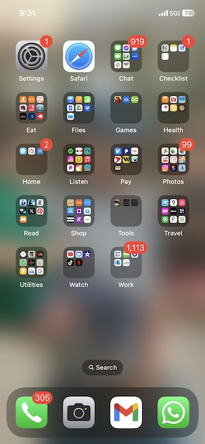
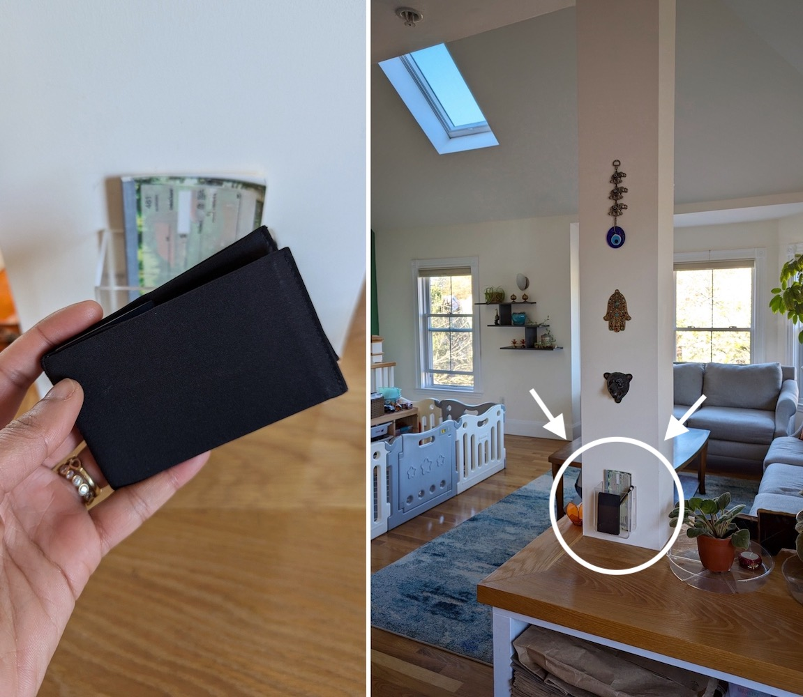
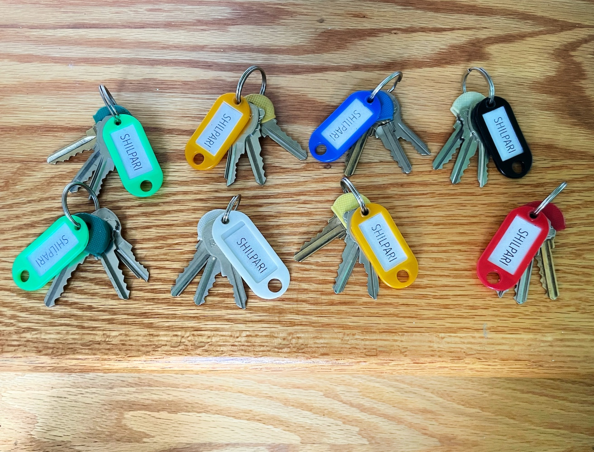
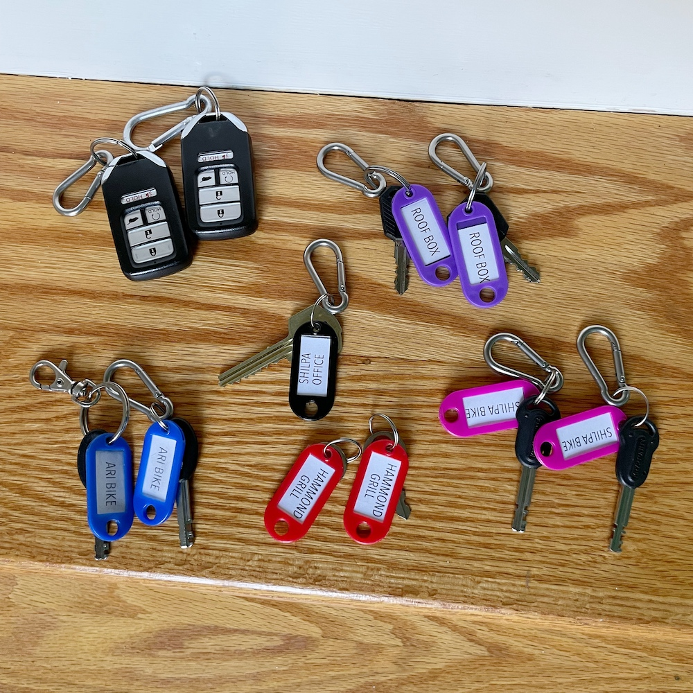
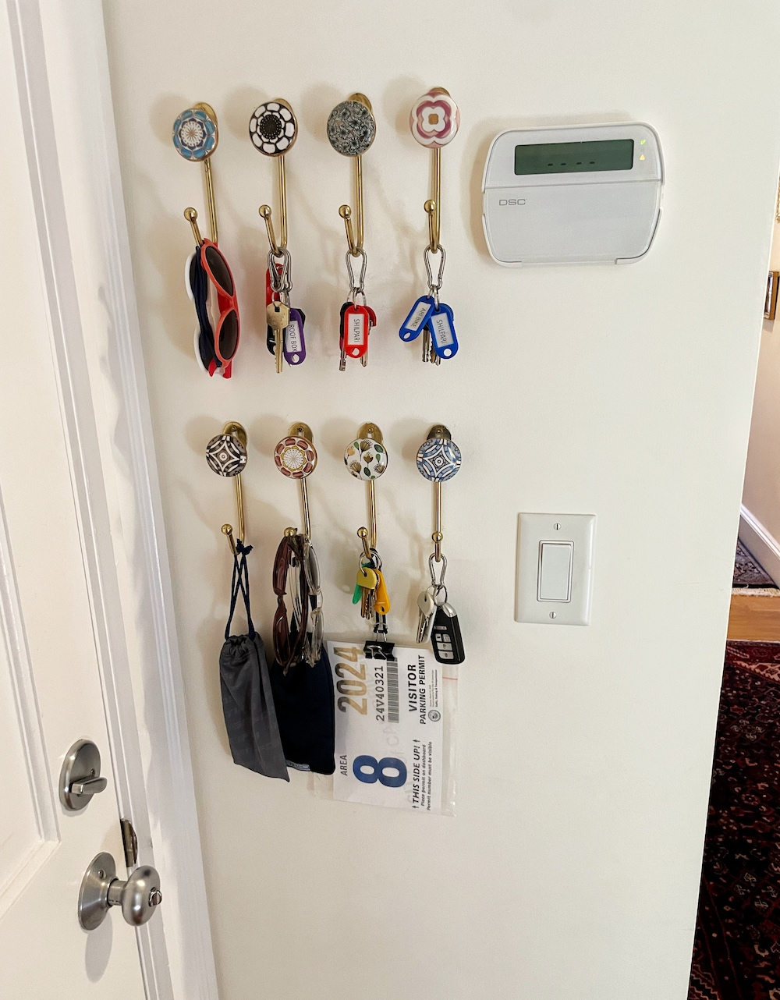
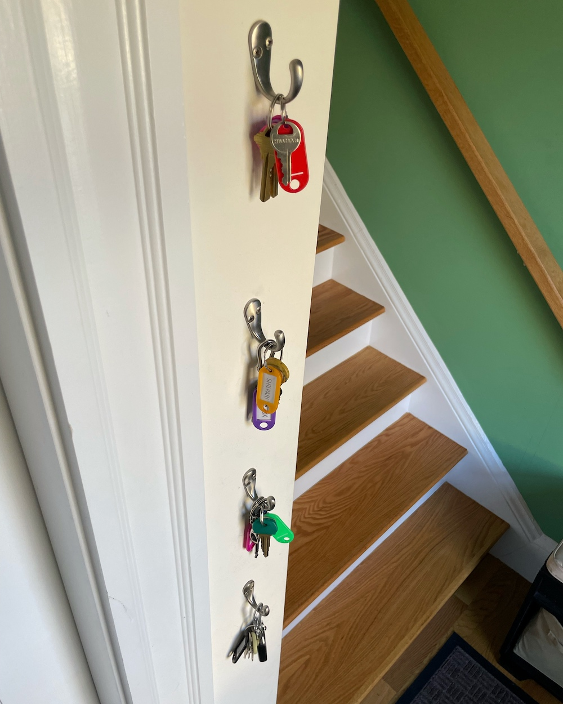

[Adam Sandler said it first](https://open.spotify.com/track/72GwyI9zO3bGEzNE5PDFus): 
"Good things come in threes: need my phone :iphone:, wallet :moneybag:, keys :key:." It's true! We need this trifecta *every single day*, 
and so micro-optimizing how we interact with these things has enabled us to start our days efficiently and stressfree. :relaxed: :relieved:

# 1. Phone

My [brother-in-law](https://med.emory.edu/departments/medicine/divisions/rheumatology/profile/?u=CCASTRI) was the first
person I knew who organized his phone apps into directories, and it was the coolest thing I'd ever seen. :exploding_head: :heart_eyes:

{: .mx-auto.d-block :}

I also alphabetized my home screen directories, which makes it easier to find less frequently used categories and apps.

# 2. Wallet

Wallets in our family (ahem, not naming names) used to go missing in the car :car:, 
in work bags :luggage:, in gym bags :weight_lifting:, in pant pockets :jeans:, behind our night stand :bed:...
I don't have a wallet (just saying), since I keep what I need in a [Smartish wallet phone case](https://www.amazon.com/gp/product/B00N3K42BM) :iphone:.
My husband's wallet (okay, so we named names) *also* had another problem: it needed to be packed 1.5" thick or everything would fall out, 
*and* it etched wallet-shaped marks into all of his jeans. :raised_eyebrow:

* **Solution Part 1:** We found the [SlimFold Nano Soft Shell](https://www.slimfoldwallet.com/products/thin-wallet-nano-soft-shell?variant=311736631297) wallet which fit *exactly what was needed* and slid easily into pant pockets.
* **Solution Part 2:** I installed this [acrylic remote control storage box](https://www.amazon.com/gp/product/B08XB5GZMD/ref=ppx_yo_dt_b_search_asin_title?th=1) in our dining room 
as his wallet's home. It's conveniently located (whether he's coming or going), 
  *and* we can always see whether the wallet is in its spot. :mag:
  Took <1 week to form a habit of returning his wallet there, 
  and we no longer spend any time searching for it on our way out the door! :detective: :raised_hands:
  
{: .mx-auto.d-block :}

# 3. Keys

I saved the best for last. Our key situation is *awesome.* 

### Considerations

* :car: **Car:** We rarely drive (our single, shared car), so it's better to keep those keys separately. 
* :jeans: **Pockets:** Keys that fit in pockets let us be hands-free outside.
* :people_holding_hands: **Friends:** It's convenient to give friends labeled, spare key sets as needed. 
* :bike: **Bikes:** Our bike lock keys look almost identical (and came in two-packs). 
* :door: **Entrances:** We alternate between using the front entrance *and* the back entrance. 
* :mailbox_with_mail: **Mailbox:** It's annoying to come in through the front entrance and not have the mail key (did I mention we live in a 3rd-floor walkup?) 

*Ta-da!* I made several house key bunches with [colored key ring label tags](https://www.amazon.com/gp/product/B01G8L4T74/?th=1). 
Each bundle has an outside door key (with a [key cap](https://www.amazon.com/Uniclife-Assorted-Colors-Identifier-Covers/dp/B071D9XD4C/)), 
the indoor key, and a mail key. 
We can grab any set on our way out (and hand over sets to friends as needed). Because of the spare sets, we also aren't slowed down 
if we forgot yesterday's keys in a different bag.

{: .mx-auto.d-block :}

I keep car keys, bike keys, office keys, and other [specialty keys](https://www.rei.com/product/143756/thule-force-xt-l-roof-box) 
on their [own rings](https://www.amazon.com/gp/product/B08PSZMZRQ?th=1) 
with these [mini caribiner clips](https://www.amazon.com/gp/product/B08DTCM52N) to attach to other bunches as needed. 
Duplicate keys are *always* labeled with matching colored key tags and split between the front and back entrances. 

{: .mx-auto.d-block :}

*Big hooks* are key (pun intended)! I found [these gorgeous hooks on Etsy](https://www.etsy.com/listing/1261490508/decorative-ceramic-gold-coat-hooks) 
for the back entrance, and we keep our sunglasses and parking pass (on a binder clip and hair elastic) here, too. 

{: .mx-auto.d-block :}

The front entrance has [big (robe) hooks](https://www.amazon.com/dp/B01LWJB9D4/), too, which I find to be more 
functional for key bunches than "specialized" key hooks.

{: .mx-auto.d-block :}
