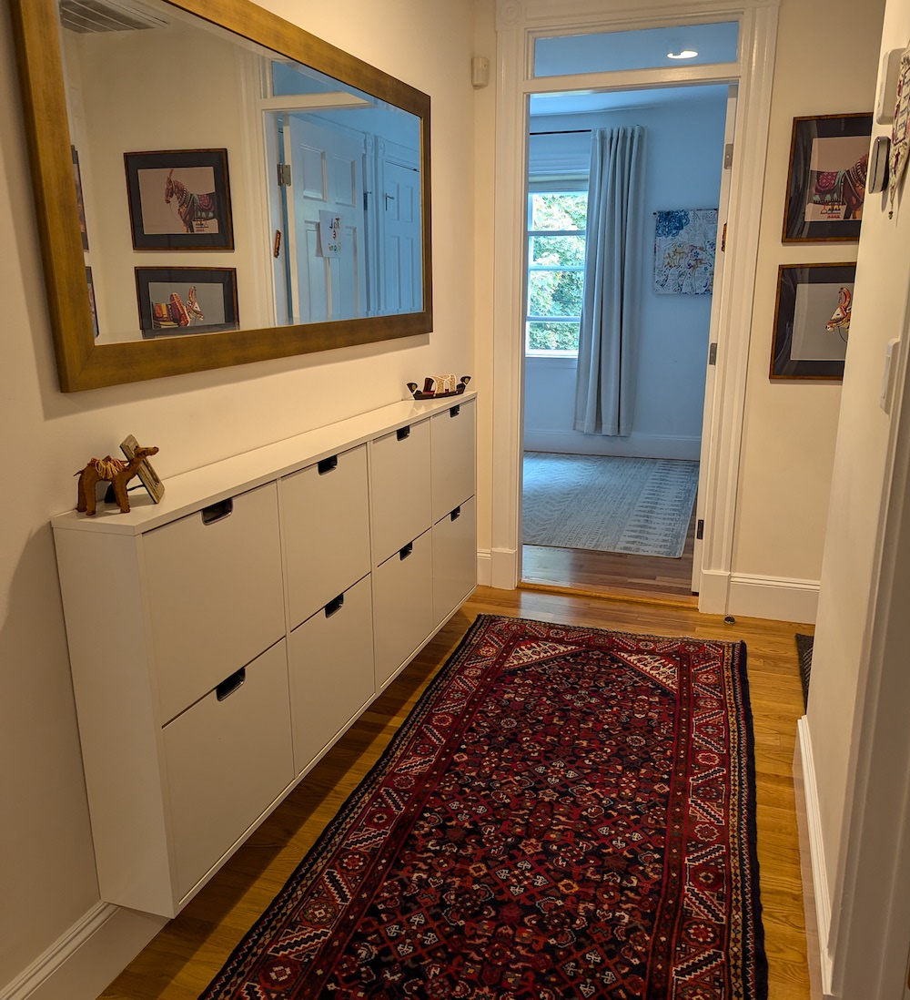
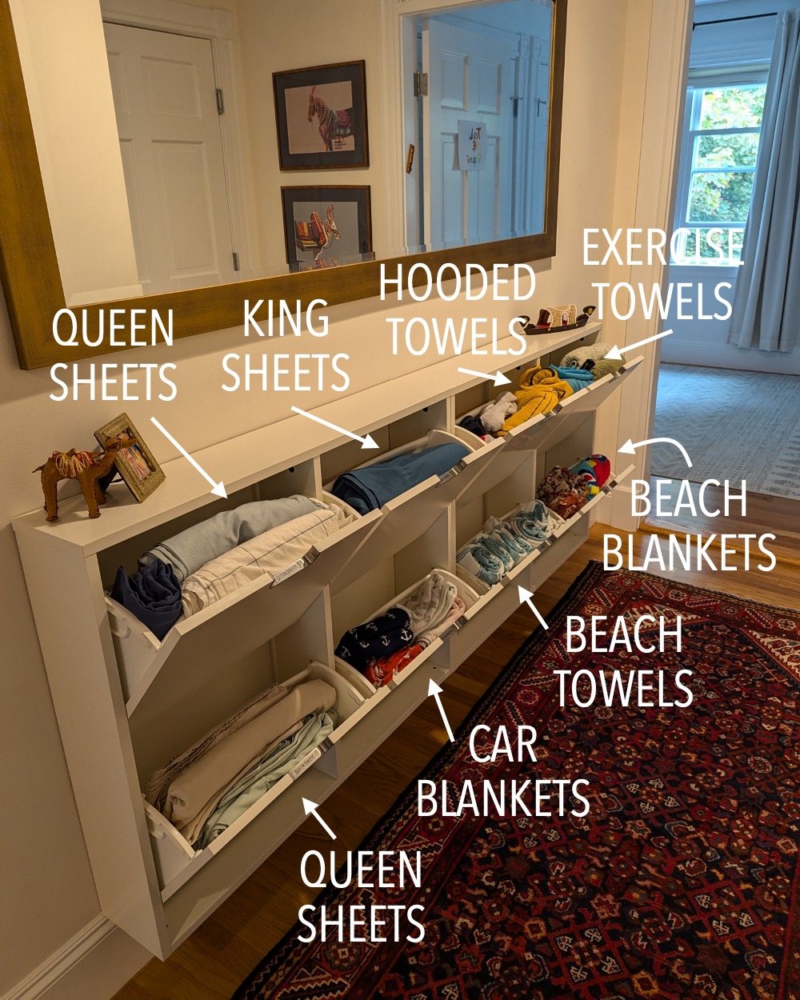
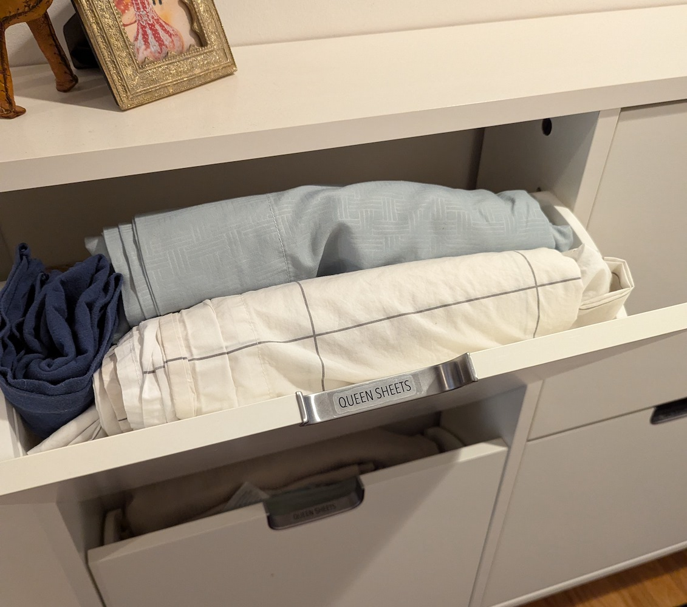

I used to keep spare sheets and towels in [our laundry room](../2024-09-20-laundry) (like a normal person) until detergent dripped 
all over them one day... :sob: Finding a new spot for our linens was necessary but nonobvious, since bedroom 
closets are less accessible, and we don't have a linen closet. I needed a unique solution! :bulb:

***Check it out!*** I installed two of these 
[Ikea STÄLL shoe cabinets](https://www.ikea.com/us/en/p/staell-shoe-cabinet-with-4-compartments-white-60530266/) 
in the wider back half of our hallway (between the bedrooms).
(They're [available in oak veneer now](https://www.ikea.com/us/en/p/staell-shoe-cabinet-with-4-compartments-oak-veneer-40530229/), which I totally would have gotten instead.) 
[My sister](https://www.nadimpallilab.org/) insists they look like mailboxes. :mailbox_closed: :raised_eyebrow:

{: .mx-auto.d-block :}

I filled the compartments with [queen sheets](https://www.brooklinen.com/collections/organic-sheets) (x2), 
king sheets (for the [upstairs pull-out couch](https://www.americanleather.com/products/gaines/)), 
"car" blankets (for nighttime rides), quick-dry [beach towels](https://www.amazon.com/gp/product/B07PMDN5MM/), 
beach blankets, hooded bath towels (other bath towels are in [our bathroom](../2022-06-25-bathroom-reno)), and exercise towels.
Kids' (twin, crib, pack-n-play) sheets are in their room.

{: .mx-auto.d-block :}

And of course, we need labels! I printed labels onto [transparencies](https://www.amazon.com/gp/product/B091BVB3GF) 
and attached them to the handles with [shipping tape](https://www.amazon.com/Scotch-Heavy-Packaging-Inches-Clear/dp/B00RSB6I1E). 

{: .mx-auto.d-block :}

As a bonus, keeping linens in the hallway seems to help with dampening noise! :runner: :hear_no_evil: *Super functional solution!* :grinning: