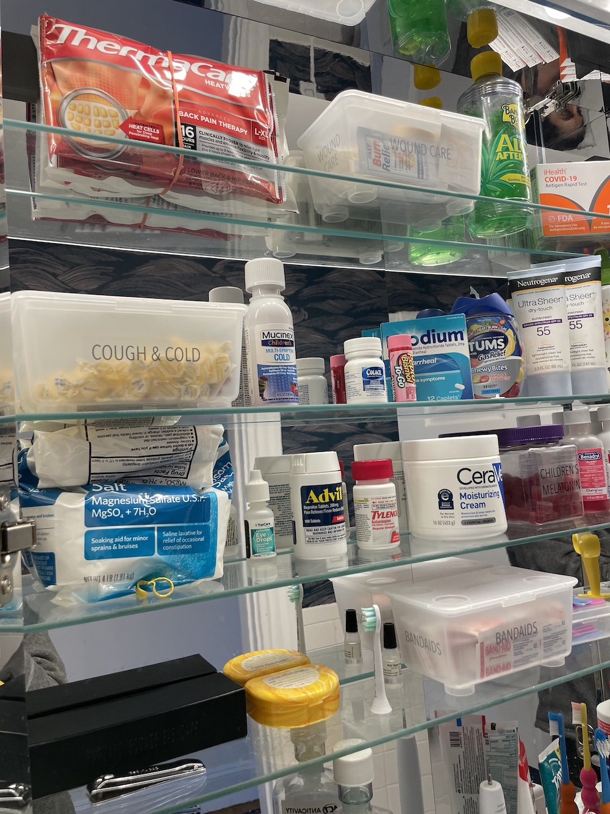

Ah, the joys and horrors of **POTTY TRAINING** !!! Let me tell you what is **NOT** going to work: 
A bathroom that the kids... :x: can't access, :x: can't turn the light on for, and :x: can't wash/dry their hands in. 
(Plus anyway this bathroom was gross and weird.)

### The problems: too many to list?!
* Floor grout is crumbly and stinks
* Bathroom vanity has a single sink (that the door nearly hits when opening)
* Toilet is behind said door (can't be accessed until door is closed)
* No kid-reachable towel bar/hook
* No kid-reachable light switch
* No spot for a stool
* Windowless white bathroom = dingy (in my opinion)

{: .mx-auto.d-block :}
***Check it out now!** Replaced the floor, toilet, vanity, and mirror (and added hooks, towel bars, and peel and stick wallpaper.
Also added this clever [light switch extender](https://www.amazon.com/gp/product/B01HKJY5Z4) (out of frame of this pic),
which is delightful and perfectly functional. Notice that the stepstool now slides right under the wall-mounted vanity.*

### Organization treats

{: .mx-auto.d-block :}
**Drawers.** There are *four* drawers in this 
[Ikea Godmorgon vanity](https://www.ikea.com/us/en/p/godmorgon-bathroom-vanity-with-4-drawers-high-gloss-white-30344096/) 
with [double sinks](https://www.ikea.com/us/en/p/odensvik-double-bowl-sink-80148328/) that I was able to fit everything we needed into.

{: .mx-auto.d-block :}
**Travel toiletries.** I used to have an enormous pile of TSA-sized toiletries (most of which were empty, or nearly empty).
Packing for flights was therefore *super annoying* and inefficient. I got rid of expired products, emptied out bottles, and
then organized what was left so that I can quickly grab what I need when traveling. Time to pack toiletries is now <5 minutes.

{: .mx-auto.d-block :}
**Medicine cabinet.** I've always preferred these over deep cabinets, because you can immediately see what you have without losing
anything in the back. This is actually two medicine cabinets, with this fancy pants faux mirror on the inside, too! 

{: .mx-auto.d-block :}
*Yet again, I have found a use for the [Ikea Glis boxes](https://www.ikea.com/us/en/p/glis-box-with-lid-clear-40466148/): this time to organize cough/cold meds and drops, bandaids, and miscellaneous
wound care supplies.*

### The BEFORE pics

{: .mx-auto.d-block :}

{: .mx-auto.d-block :}

### The AFTER :heart_eyes:

{: .mx-auto.d-block :}
*You can see the [light switch extender](https://www.amazon.com/gp/product/B01HKJY5Z4) reflected in the mirror!*

### Cost & time breakdown

Coming soon! 