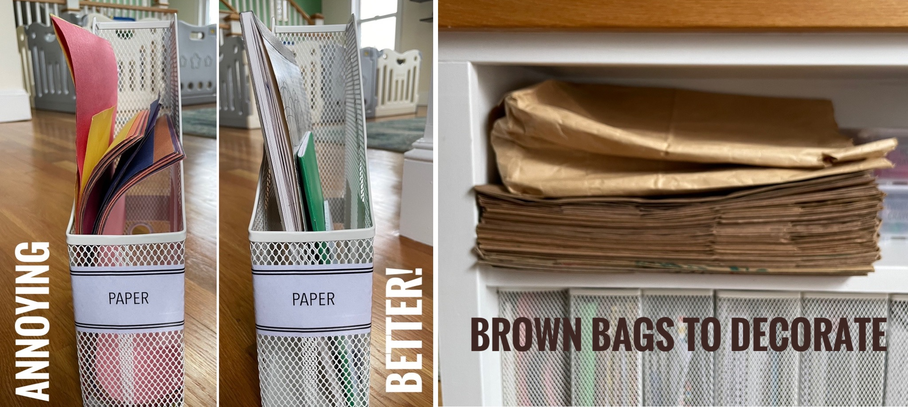
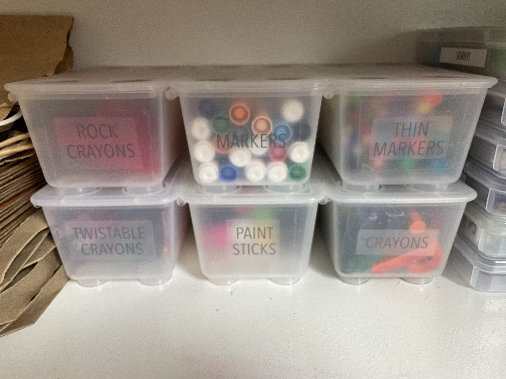
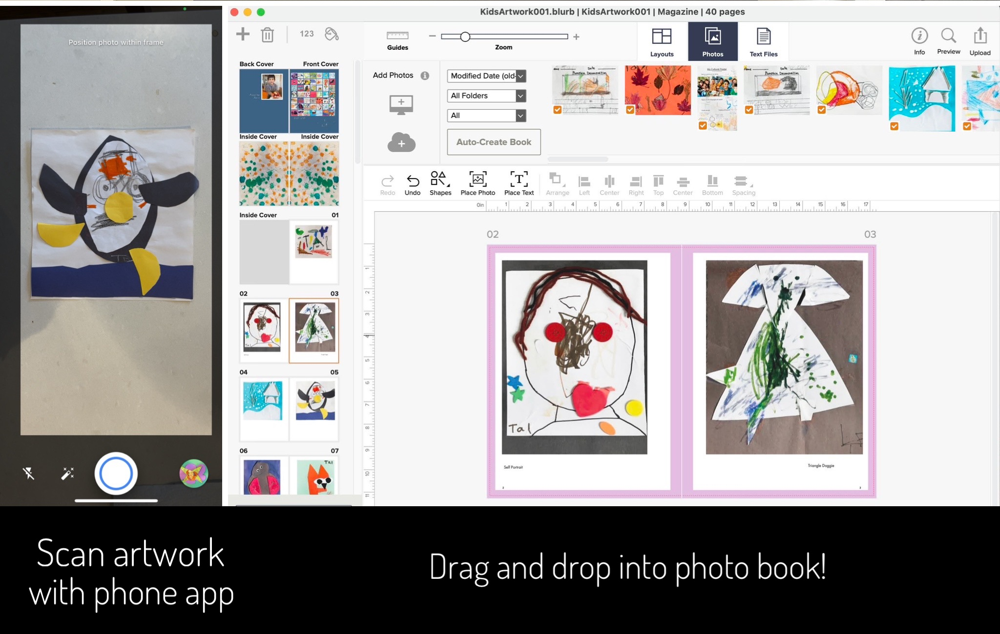

Enabling kids' independent "art" and then shamelessly getting rid of the results without triggering any tantrums is most definitely an art in and of itself.

**The perpetual issue:** I probably mentioned once (twice? a million times?) how rough it is to have toddlers home without
childcare while you are trying to work a full time job. :cold_sweat: :dizzy_face: Fall of 2022 marked the first semester that kids were *finally*
allowed back in school (mask-free), and it unsurprisingly also marked a *record-breaking "tridemic" surge* of 
Covid, [RSV](https://www.ncbi.nlm.nih.gov/pmc/articles/PMC9844019/), and the [flu](https://www.vox.com/2022/12/6/23494948/flu-influenza-rsv-covid-vaccine-chart-tripledemic-tridemic). 
Our 3-year-old was chronically absent from school for TWENTY days (and our 1-year-old home from daycare for at least that much time). 
*The adults in our household were also not spared... c'mon B-cells.*

**One fun solution:** In the (few, fleeting) moments when they weren't actively throwing up all over the couch, 
I wanted the boys to entertain themselves while sitting still (joke's on me, I know). 
In addition to organizing their toys, I also enabled easy artwork that didn't lead to a huge mess! 
Finding a way to *throw away the resulting trash artwork* also required inventive thinking! 

{: .mx-auto.d-block :}
*The art station is right next to the (glass-covered) dining table, and our house rule is that all art stays at the table. Working very well so far!*

## Details

{: .mx-auto.d-block :}

**Paper:** Paper and all workbooks/coloring books and stickers are stored in these [Ikea magazine files](https://www.ikea.com/us/en/p/droenjoens-magazine-file-white-10439694/) 
which are super easy for kids to pull out, look less cluttered than clear acrylic versions, and are made of metal so aren't easily squashed or broken. It's a mistake to store
loose paper in these (oops), but [bound drawing pads](https://www.amazon.com/Melissa-Doug-Drawing-Paper-inches/dp/B01AW5V7PE) are excellent. We also keep
brown paper grocery and takeout bags here because they are perfect for 
art with [markers](https://www.amazon.com/Crayola-Pip-Squeaks-Skinnies-Washable-Markers/dp/B0019665DK) and [paint sticks](https://www.amazon.com/Giftable-Twistable-Including-Scrapbooking-Journaling/dp/B01AUP5U04)!
Using these decorated bags as gift bags are a huge hit, too.

{: .mx-auto.d-block :}

**Writing and drawing:** I have found *so many uses* for these [Ikea Glis clear boxes](https://www.ikea.com/us/en/p/glis-box-with-lid-clear-40466148/). They are easy to open/close, stack nicely, and seem to be utterly indestructible.
Yeah... I do give away gifted art supplies that don't fit in these boxes.

{: .mx-auto.d-block :}

**Play dough and crafts:** Some of our play dough is homemade, and the usual containers are opaque and hard to open. I divvied our play 
dough into these [clear cosmetic jars](https://www.amazon.com/gp/product/B08X1MM1HT) and pared down the tool collection to what the kids actually 
use (and added some plastic butter knives). Crafts include bulky artwork that comes home from school (pipe cleaners, beads, ribbons, dowels) and 
glue sticks and kid scissors.

## Getting rid of the artwork!

It's amazing how quickly artwork begins to pile up. I have a magazine file for artwork (that immediately overflowed) and keep a 
rotating selection on our fridge in these [clear binder sheet protectors](https://www.amazon.com/Count-Diamond-Heavyweight-Protectors-Strong/dp/B085PP4D5S) 
so they don't get torn apart by baby brother. 

{: .mx-auto.d-block :}

But it wasn't enough! Now, when artwork comes home, I immediately scan it using my [Google Photo Scan phone app](https://www.google.com/photos/scan/) 
and show it to our 3-year-old (so he knows we have a digital copy).
Then I tell him that we can get rid of the original to make space for more (and he is fine with it). I go the extra mile and (once a month) add the newly-scanned artwork to a 
[magazine-style photo book](https://www.blurb.com/pricing#/tab/magazines) that is only ~$20 for 100 double-sided pages on [Blurb](https://www.blurb.com/magazine)! 
I suspect some companies might bind your kids' artwork into a book for you, too.

{: .mx-auto.d-block :}

*Et voilà!* 

*Shilpa Kobren is a research fellow in biomedical informatics at Harvard Medical School where she focuses on analyzing genomic data and
patient clinical information to derive insights into human diseases. Shilpa lives in a 1890 urban apartment in Cambridge, Massachusetts
with her husband and two energetic baby boys. She loves to create systems that optimize daily efficiency in family's constrained living space.*