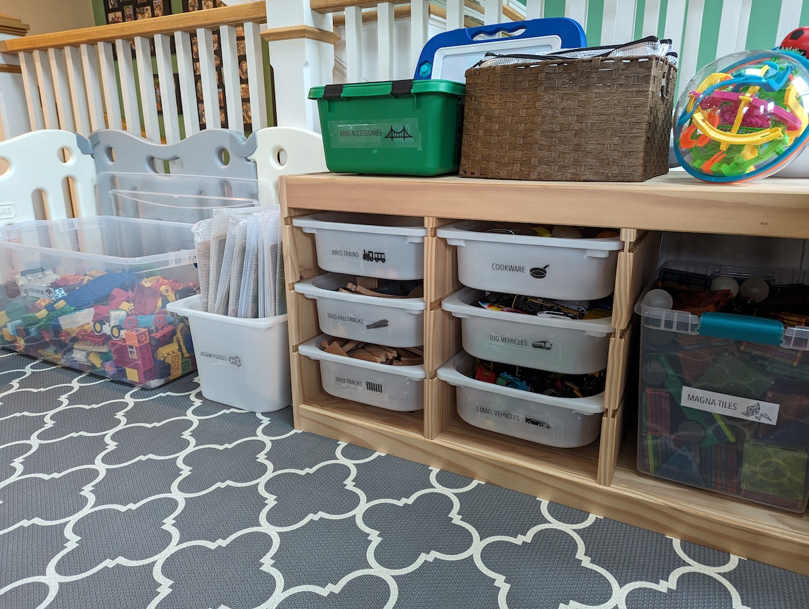
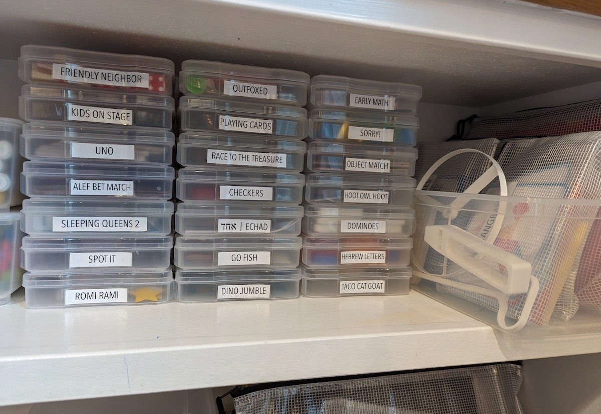

You’re well aware of the problem. So let’s cut straight to my fun solutions, all inspired by one of the best pieces of *mom advice* I’ve gotten: 
**“Don’t focus on having a perfectly clean house, focus on having an EASY TO CLEAN house.”**

It turns out, too many toys = too chaotic for creative play for my kids (so it’s not just me)! 
Some psychology research also suggests that household chaos is correlated with adverse effects for kids *and* adults *in general*
\[[1](https://www.ncbi.nlm.nih.gov/pmc/articles/PMC7175577/)\]. 
I needed a toy organization solution ASAP that checked off the following boxes: 

| Requirement | Solution | 
| --- | --- | 
| (prereader) kids know where to find things | bin labels have icons / clip art | 
| kids can put their stuff away | no (difficult to open/close) lids on (difficult to access) bins |
| only toys in active use are visible | white (opaque) bins > clear options | 
| only a subset of toys are accessible | some toy categories stay in the closet to be rotated in/out | 

For any naysayers out there, don't forget that kids this young CAN navigate preschool classrooms where items are clearly and logically laid out and labeled (and expectations for play and cleanup are set). 

And now for the details! I address [Legos](#legos), [board games](#board-games), and [puzzles](#puzzles) in their own sections below. 

## General toy categories

We have a baby jail set up in our living room (rather than a separate dedicated play room) because: 

* We don’t have a spare room just for play.
* Keeping toys in the kids’ bedroom is too distracting for them at nighttime.
* The kids insist on bringing their toys out to play near us anyway.
* It’s easier for the grown-ups (us and friends!) to keep an eye on kiddos as needed. 

These play space constraints meant that I *desperately* needed to find functional 
(and not aesthetically defunct) systems to corral the mess and give me peace in my home. 
Here’s the baby jail with everything put away: 

{: .mx-auto.d-block :}

Notice that the labels all have cute black and white icons! I don’t even own a label maker... 
I print these out directly onto [transparencies](https://www.amazon.com/gp/product/B091BVB3GF) from my printer 
(since I had a pack lying around after my [entry closet organization project](../2021-04-01-entry-closet) anyway) and 
put [clear packaging tape](https://www.amazon.com/Scotch-Shipping-Packaging-Dispenser-142-6/dp/B000J07BRQ) over them. 
These labels hold up super well and are easy to remove! 

{: .mx-auto.d-block :}

{: .mx-auto.d-block :}

The pull out drawers are [Ikea Trofast](https://www.ikea.com/us/en/p/trofast-storage-combination-with-boxes-light-white-stained-pine-white-s79102958/). 
I did some (excessive?) blog/influencer/FB moms groups sleuthing to figure out pros/cons of toy storage options. 
*This Trofast system is the most perfect, functional toy organization system for our space.* 

{: .mx-auto.d-block :}

Now I’ll take you to the kids’ closet…

{: .mx-auto.d-block :}

Fixing the custom shelving in here is a project for another day...
but notice that the bins have [matching lids](https://www.ikea.com/us/en/p/trofast-lid-white-57454500/) that allow them to stack and still 
slide into the organizers! Every month we swap out some toy bins in the main area with toy bins in the closet. 
The toys in bins that the kids never ask for are very good candidates for donation… 

## Legos 

There are a million options (and a million more opinions) for organizing Legos. 
My older son loves to have his stuff organized logically (like me!), so, 
I 3D-printed [these custom Trofast bin inserts](https://www.printables.com/model/58061-ikea-trofast-box-insert) to organize his loose Legos by color:

{: .mx-auto.d-block :}

Sadly, the “little Legos” have to stay in the bedroom and only come down from the closet shelf with the door closed and baby brother otherwise occupied (out of the room). 

Our older kiddo is also very into Lego sets (...and assembling furniture with me). He works on these 
sets *entirely independently* from cutting open the plastic packets, finding each piece and following 
all instructions in order. (I only step in to help with those irksome stickers sometimes.) 
We don’t have space to display his creations, but I keep his Lego sets in these [plastic zippered bags](https://www.amazon.com/gp/product/B08V11D68N) in the closet: 

{: .mx-auto.d-block :}

**The process:** I cut up the Lego box cover and tape it to these bags when we receive new sets. 
The instructions and all pieces go right in. For older sets (where I only had the instructions but 
recycled the box), I looked up the model number (always on the front of the instruction booklet), 
downloaded an image of the cover, and printed it out in color with some minor edits. 

## Board games 

It’s rather trendy (I am fully aware) to “decant” (this word actually means transfer of *liquid* and is consistently used incorrectly by organization influencers) 
board games into these [4”x6” photo boxes](https://www.amazon.com/gp/product/B00GLQX3CO). To h*ll with Chem 101: consider me influenced! 
The board games are next to our [art station](../2022-09-01-kids-artwork) and we play games at the glass table (to avoid losing pieces). 

{: .mx-auto.d-block :}

Some board games didn’t fit in these boxes. I keep the corresponding boards (with extra labels, as needed), in a bin on the shelf below: 

{: .mx-auto.d-block :}

A couple of our favorite games for younger kids are by [Peaceable Kingdom](https://www.amazon.com/stores/PeaceableKingdom/PeaceableKingdom/page/30A15467-0E59-464F-8D42-0DE016FBE907) 
(e.g., [Race to the Treasure](https://boardgamegeek.com/boardgame/121806/race-to-the-treasure) [:star: 6.2], 
[Hoot Owl Hoot](https://boardgamegeek.com/boardgame/94483/hoot-owl-hoot) [:star: 6.4]) where the instructions were 
printed onto the box! 

**Resizing game instructions:** I found PDF copies of the instructions online and then color-printed them in size 4”x6”. 
I [laminated](https://www.amazon.com/gp/product/B0010JEJPC) the cards and stick them inside the game boxes.  

{: .mx-auto.d-block :}

## Puzzles

Toddler puzzles are kept in these [gold mesh cinch bags](https://www.amazon.com/gp/product/B01LZXZ2VS) (that I had leftover from putting together [mishloach manot](https://en.wikipedia.org/wiki/Mishloach_manot)). 
Our 1.5-year-old can open and close them (and the pieces stay together): 

{: .mx-auto.d-block :}

There are a few more advanced puzzles that came with boards that I put into these 
[zippered plastic bags](https://www.amazon.com/gp/product/B08V11D68N) (see below). Unfortunately, 
it was tough to tell what the puzzles were without opening every bag. We spent an hour one morning 
finishing all the puzzles, and I took a photo of each one with my [Google PhotoScan phone app](https://www.google.com/photos/scan/). 
I printed out the completed puzzle pictures, laminated them, and taped them onto the bags. 

{: .mx-auto.d-block :}

I also stuck this [mesh file divider](https://www.amazon.com/gp/product/B09LSYKLFX) in the bottom of the Trofast bin so that the puzzles stayed 
upright and distributed. Working well! 

## Conclusions and Limitations

* The solutions I’ve presented here work for *our kids right now* (3-year-old and a 1-year-old). New (future) toys may require new organization solutions. 
* Getting rid of old toys properly (for free on FB to families who actually want them) still takes time and might be more difficult when original packaging has been ditched. 
* Keeping toys tidy requires *regular decluttering* of toys that are no longer used. It takes *active effort* before/after birthdays and holidays to choose and donate toys that other kids might enjoy more. 
* Sometimes categories expand: my “vehicles” bin has grown into “small vehicles”, “big vehicles” and “monster trucks”.

I’ll end with a PSA: If you can help it, please stop buying and gifting cheap plastic toys that are designed to break after minimal use. 
Too often, these just end up in the landfill... 

Hope you find some inspiration here to get your kids’ toys under control! It's worth it (for everyone's sanity), I promise!
