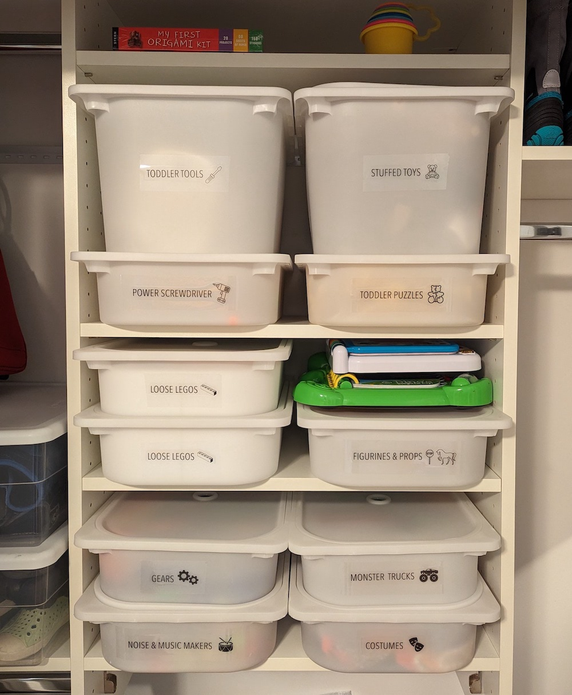

You’re well aware of the problem. So let’s cut straight to my fun solutions, all inspired by one of the best pieces of *mom advice* I’ve gotten: 
**“Don’t focus on having a perfectly clean house, focus on having an EASY TO CLEAN house.”**

It turns out, too many toys = too chaotic for creative play for my kids.
Some psychology research also suggests that **household chaos is correlated with adverse effects for kids *and* adults *in general***
\[[1](https://www.ncbi.nlm.nih.gov/pmc/articles/PMC7175577/)\]. (So it's not just me!)
I needed a toy organization solution ASAP that checked off the following boxes: 

| Requirement | Solution | 
| --- | --- | 
| :mag_right: (prereader) kids know where to find things | :heavy_check_mark: bin labels have pictures | 
| :muscle: kids can put their stuff away | :heavy_check_mark: no difficult-to-open/close lids or hard-to-reach bins |
| :eyes: only toys in active use are visible | :heavy_check_mark: opaque white bins rather than clear | 
| :door: only a reasonable amount of toys are out | :heavy_check_mark: some toys stay in the closet | 

And now for the details! **TL;DR: you can jump straight to the following sections:**
* [general toys](#general-toy-categories) :car: :teddy_bear:
* [Legos](#legos) :bricks:
* [games](#games) :game_die:
* [puzzles](#puzzles) :jigsaw:

## General toy categories

We have a [baby jail](https://www.amazon.com/Baby-Care-Play-Mat-Grey/dp/B0789XTPCR) and [play mat](https://www.amazon.com/dp/B07DS449CY/) set up in our living room (rather than a separate dedicated play room) because: 

* We don’t have a spare room.
* Toys in the bedroom are too distracting for bedtime.
* Kids bring their toys to wherever the grown-ups are anyway.
* Grown-ups can keep an eye on kiddos as needed. 

These play space constraints meant that I needed to find functional 
(and aesthetic) systems to corral the mess and give me peace in my home. 
Here’s the baby jail with everything put away: 

{: .mx-auto.d-block :}

*Can you see that my labels have cute little pictures?* :heart_eyes: Here's a closeup: 

{: .mx-auto.d-block :}

I don’t even own a label maker! I print labels out onto [8.5"x11" transparencies](https://www.amazon.com/gp/product/B091BVB3GF) 
(that I had leftover from my [entry closet organization project](../2021-04-01-entry-closet) anyway). 
I stick them onto bins with [clear packaging tape](https://www.amazon.com/Scotch-Shipping-Packaging-Dispenser-142-6/dp/B000J07BRQ). 
These labels hold up super well and are easy to remove!

The pull out drawers are [Ikea Trofast](https://www.ikea.com/us/en/p/trofast-storage-combination-with-boxes-light-white-stained-pine-white-s79102958/).
*This Trofast system is the most perfect, functional toy organization system for our space!* No complaints.  

{: .mx-auto.d-block :}

I keep some toys that come with many smaller pieces in these [plastic zippered bags](https://www.amazon.com/gp/product/B08V11D68N). 
You'll see these bags pop up for all sorts of organizing solutions.

{: .mx-auto.d-block :}

Now I’ll take you to the kids’ closet…

{: .mx-auto.d-block :}

The Trofast bins have [matching lids](https://www.ikea.com/us/en/p/trofast-lid-white-57454500/) that allow them to stack! (They'll still slide into the organizers with the lids on, too.)
Every month (give or take) we swap out some toy bins in the main area with toy bins in the closet. 

## Legos 

There are a million options (and a million more opinions) for organizing Legos. 
My older son loves to have his stuff organized logically (like me!), so, 
I 3D-printed [these custom Trofast bin inserts](https://www.printables.com/model/58061-ikea-trofast-box-insert) to organize his loose Legos by color. (We may switch it up to organize by block type instead later.)

{: .mx-auto.d-block :}

Our older kiddo is also very into Lego sets (...and assembling furniture with me). He works on these 
sets *entirely independently*, from opening the box through finished product. (I only step in to help with those irksome stickers sometimes.) 
I keep his unstarted, in-progress, and completed Lego sets in these [plastic zippered bags](https://www.amazon.com/gp/product/B08V11D68N) in the closet: 

{: .mx-auto.d-block :}

**Organizing Lego sets:** For newly-received sets, I cut the Lego box cover and then tape it onto these bags with clear packaging tape. 
The instructions and all pieces slide right in. For older sets (where I only have the instruction booklet), I Google the model number, 
download an image of the cover, then reformat, color-print, and [laminate](https://www.amazon.com/gp/product/B0010JEJPC) it before taping it onto the bag.

## Games 

It’s rather trendy (I am fully aware) to “decant” games into these [4”x6” photo boxes](https://www.amazon.com/gp/product/B00GLQX3CO). 
"Decant" really means *transfer of liquid* and is consistently used incorrectly by organization influencers... but consider me influened!
Our kids' games are next to our [art station](../2022-09-01-kids-artwork), and we play at the glass table (to avoid losing pieces). 

{: .mx-auto.d-block :}

Some games with larger boards didn’t fit in these boxes. I keep the corresponding boards (with extra labels, as needed), in a bin on the shelf below: 

{: .mx-auto.d-block :}

**Storing game instructions:** A couple of our favorite games for younger kids 
(e.g., [Race to the Treasure](https://boardgamegeek.com/boardgame/121806/race-to-the-treasure) [:star: 6.2], 
[Hoot Owl Hoot](https://boardgamegeek.com/boardgame/94483/hoot-owl-hoot) [:star: 6.4] by [Peaceable Kingdom](https://www.amazon.com/stores/PeaceableKingdom/PeaceableKingdom/page/30A15467-0E59-464F-8D42-0DE016FBE907)) 
have instructions printed directly onto the box! For these (or any other game with too-large instructions), 
I find PDF copies of game instructions online, color-print them in size 4”x6”, 
[laminate](https://www.amazon.com/gp/product/B0010JEJPC) the cards, and stick them inside the game boxes. 
For games with instruction booklets that tear and crumple easily; I laminate these too.

{: .mx-auto.d-block :}

## Puzzles

Toddler puzzles are kept in these [gold mesh cinch-close bags](https://www.amazon.com/gp/product/B01LZXZ2VS) (that I had leftover from putting together [mishloach manot](https://en.wikipedia.org/wiki/Mishloach_manot)). 
Our 1-year-old can open and close them (and the pieces stay together): 

{: .mx-auto.d-block :}

We also have jigsaw puzzles for older kids, some of which came with boards. I put these (with and without boards) into 
[zippered plastic bags](https://www.amazon.com/gp/product/B08V11D68N) (see below).

**Organizing jigsaw puzzles:** It is tough to tell what the puzzles are (and how to complete them) when they are in these bags. 
For puzzles that come in boxes, I cut the box covers and tape them onto the bags. 
For other puzzles, I take a photo of each completed puzzle with my [Google PhotoScan phone app](https://www.google.com/photos/scan/), 
reformat and color-print the pictures, [laminate](https://www.amazon.com/gp/product/B0010JEJPC) them, and tape them onto the bags. 

{: .mx-auto.d-block :}

I also stuck this [mesh file divider](https://www.amazon.com/gp/product/B09LSYKLFX) in the bottom of the Trofast bin so that puzzle boards stay 
upright and distributed. Working extremely well! 

## Conclusions and Limitations

* **Dynamic solutions.** The solutions I’ve presented here *work for our kids right now* (3-year-old and a 1-year-old). New (future) toys may require new organization solutions! :bulb: 
* **Declutter!** Keeping toys tidy requires *regular decluttering of toys*:
  * Some *large* toys are not used often enough to justify the amount of space they take up.
  * Before/after birthdays and holidays is a great (consistent, recurring) time to declutter toys. :gift:
  * It takes *active effort* to donate toys that other kids might enjoy more. Giving toys away on FB to local families who actually want them is an easy option (in our urban location)!
* **Expanding categories.** Sometimes categories need to expand. Our *vehicles* bin has grown into *small vehicles*, *big vehicles* and *monster trucks* now! :car: :truck: :tractor: :auto_rickshaw: :bus: :fire_engine:
* **Garbage.** Cheap plastic toys that are designed to break after minimal use are annoying for kids *and* adults *AND* are bad for the environment. :wastebasket: :recycle: 

Hope you find some inspiration here to get your kids’ toys under control! *It's worth it (for everyone's sanity), I promise!*
