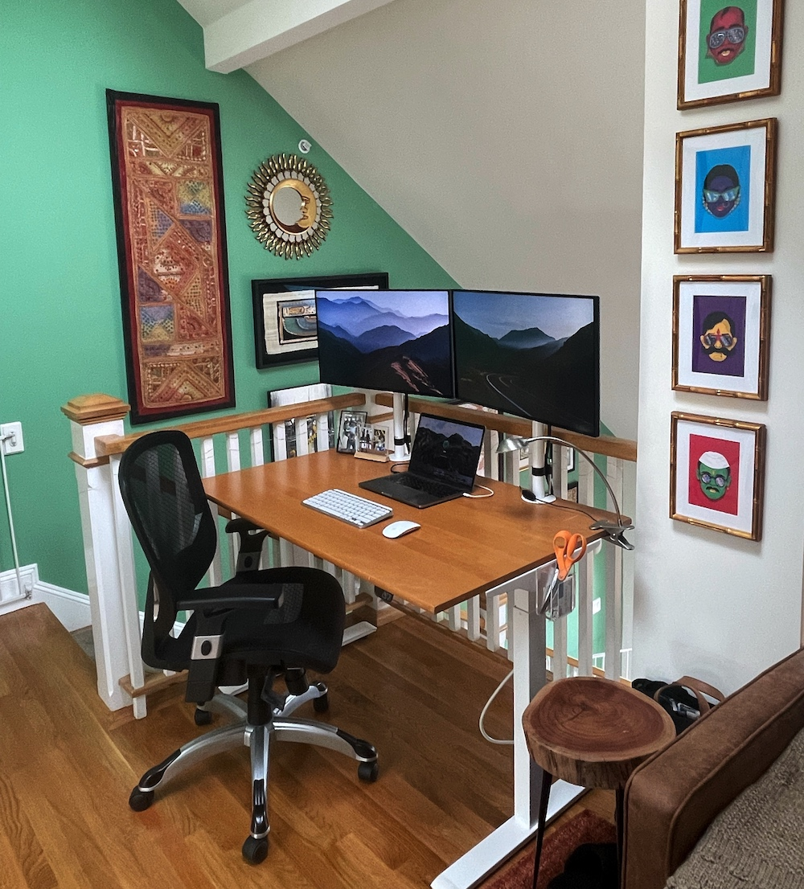
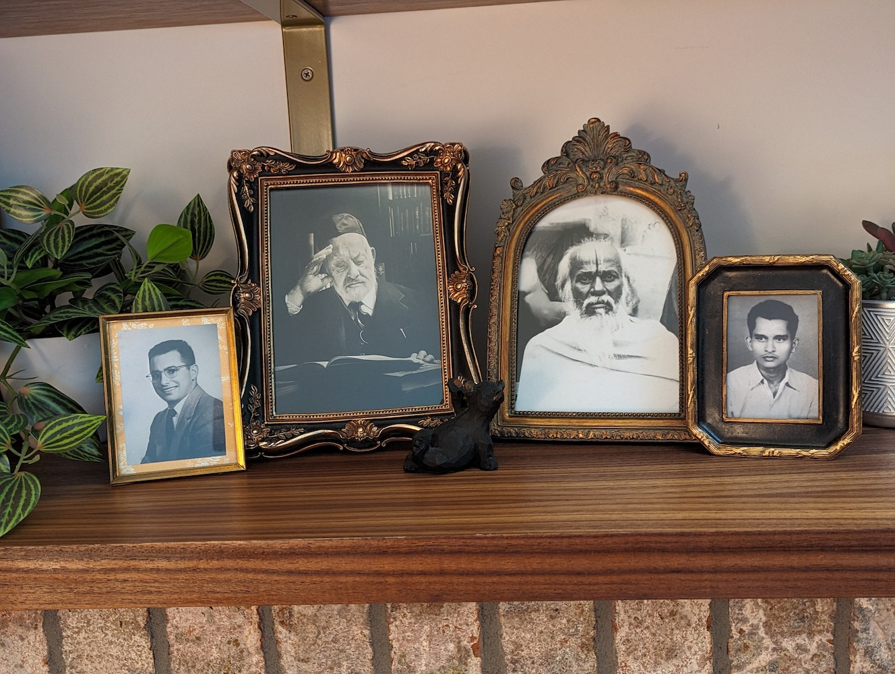

Is there anything cozier than a warm fire crackling in a brick-surround fireplace in your own home to get you through the long, dark, cold Boston winter? 
No way! So I needed to find a way to get one!

### Requirements for the fireplace
* looks like a fire (in my blurry periph behind a book)
* sounds like a fire
* feels like a fire
* won't require neighbors' approval
* won't require permitting
* won't require busting open the roof
* won't burn the house down

### Requirements for the space
* cozy
* storage for books 
* storage for board games

Here's the final(ish) product:

{: .mx-auto.d-block :}

Not bad, eh?! And I did the whole thing myself! 

**The cabinets:** Bought a couple of these [unfinished prefabricated cabinets](https://www.homedepot.com/p/Hampton-Bay-27-in-W-x-12-in-D-x-30-in-H-Assembled-Wall-Kitchen-Cabinet-in-Unfinished-with-Recessed-Panel-KW2730-UF/302969965), 
painted them with two coats of [chalk mineral paint](https://dixiebellepaint.com/caviar-chalk-mineral-paint/), and
installed [gold knobs](https://www.amazon.com/dp/B0BXNVQ17S/). I leveled the cabinets (wow the floors in this 1890 building slope a LOT) and secured them directly to the wall studs. 
I added quarter round to cover 
the wood shims between the cabinets and floor, [caulked](https://www.homedepot.com/p/DAP-ALEX-FLEX-10-1-oz-White-Premium-Molding-and-Trim-Sealant-18542/206034500) that junction, and repainted. 

**The fireplace:** I bought a relatively cheap [plug-in fireplace](https://www.amazon.com/PuraFlame-Western-Electric-Fireplace-Control/dp/B00R7347RU/) and some 
[loose brick veneers](https://shop.oldmillbuildingproducts.com/products/seaside). I cut a piece of birch plywood to size between the cabinets 
(a trapezoid, thanks to the slanted floor) and cut an opening for the fireplace to slide in. I secured the plywood to the 
two side cabinets with [small corner braces](https://www.homedepot.com/p/Everbilt-2-in-Zinc-Plated-Double-Wide-Corner-Brace-2-Pack-15051/202033994). 
Then I cut my bricks to size on a wet tile saw and secured them to the plywood with
[construction adhesive](https://www.homedepot.com/p/Loctite-Power-Grab-Heavy-Duty-Instant-Grab-9-oz-Latex-Construction-Adhesive-White-Cartridge-each-2032666/206432103), 
[grouted](https://www.homedepot.com/p/Custom-Building-Products-SimpleGrout-09-Natural-Gray-1-qt-Pre-Mixed-Grout-PMG09QT/100676322) 
[between](https://www.homedepot.com/p/Anvil-Grout-Bag-57542/300997951) the bricks, then [sealed the whole thing](https://www.homedepot.com/p/Custom-Building-Products-SimpleSealer-165-Delorean-Gray-1-qt-Premixed-Sealer-TLPS24Z/202919172).

{: .mx-auto.d-block :}
*Late night action shot securing bricks to the plywood.*

{: .mx-auto.d-block :}
*Woo! This borrowed miter saw was a BEAST but did the trick!*

**The shelves:** I made the aesthetic decision to use walnut for this project before realizing that solid walnut is *wildly expensive!* 
So I ended up special-ordering [0.75" walnut plywood](https://www.homedepot.com/p/Columbia-Forest-Products-3-4-in-x-2-ft-x-8-ft-PureBond-Walnut-Plywood-Project-Panel-Free-Custom-Cut-Available-2344/204635489) 
instead and had it ripped down to the right depth using a table saw at Home Depot.
I [glued](https://www.homedepot.com/p/Titebond-III-16-oz-Ultimate-Wood-Glue-1414/100522343) 
two pieces of plywood together for the countertop and used a [rasp](https://www.rockler.com/4-way-shoe-rasp) to shave the edge of the plywood to fit snugly against the sloped ceiling. 
Then I borrowed a miter saw that could cut beveled edges to cut angles into two shelves to fit against the ceiling, too. 
I finished the shelves and countertop with [walnut edge banding](https://www.rockler.com/2-x-25-pre-glued-edge-banding-walnut) and sealed it all with three coats of [clear flat finish](https://www.rockler.com/general-finishes-high-performance-water-based-top-coat-flat) (sanding in-between coats), and mounted the shelves with a 
few [shelf L brackets](https://www.amazon.com/gp/product/B08QFVZXL8/). 

{: .mx-auto.d-block :}
*Here is how the space looked before...*

{: .mx-auto.d-block :}
*And really before (during the open house).*

{: .mx-auto.d-block :}
*Here's the same space NOW! I covered the router cables and, in lieu of a coffee table, added [acrylic ledge shelves](https://www.amazon.com/gp/product/B081RVTZVB/) to display family photo books that I designed and printed through [Blurb](https://www.blurb.com/).*

## Other angles and details of the loft space!

{: .mx-auto.d-block :}
*Found the [perfect (tiny) couch](https://www.wayfair.com/furniture/pdp/corrigan-studio-alverce-58-square-arm-loveseat-w006875006.html) and a lamp and side tables at Good Will.*

{: .mx-auto.d-block :}
*Sit-to-stand desk worked well in this corner only because I screwed my monitor stands directly into the desktop (so the monitors won't fall over the railing)!*

{: .mx-auto.d-block :}
*That light switch was annoyingly placed, so I put peel-and-stick wallpaper around the whole thing (including the switch cover) as some faux artwork. I mitered the corners of fancy wood rail trim, glued it together, stained it, and attached it to the wall with command strips as a frame for my faux art. 
The picture on the back of the door is a Ravi Varma print from ~1920 that once hung in my great-grandfather's home.*

{: .mx-auto.d-block :}
*We needed board game storage in these cabinets! Success! (The other cabinet is equally packed.)*

{: .mx-auto.d-block :}
*I moved our smaller games into these 4x6" photo boxes. I couldn't find perfectly-sized baskets to put the boxes into (to pull out like drawers), so I just made my own with scrap cardboard and duct tape.*

{: .mx-auto.d-block :}
*From left to right: My husband's grandfather who my 2-year-old is named for, that grandfather's grandfather (!), my great-great-grandfather, and his grandson (my grandfather) who my 4-year-old is named for. 
I enhanced the pictures with MyHeritage's AI tool (the best of the six options I tried) to print.*