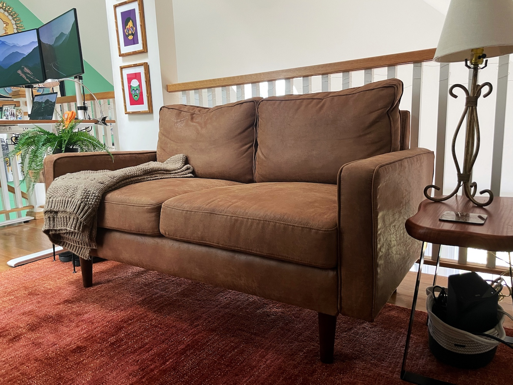
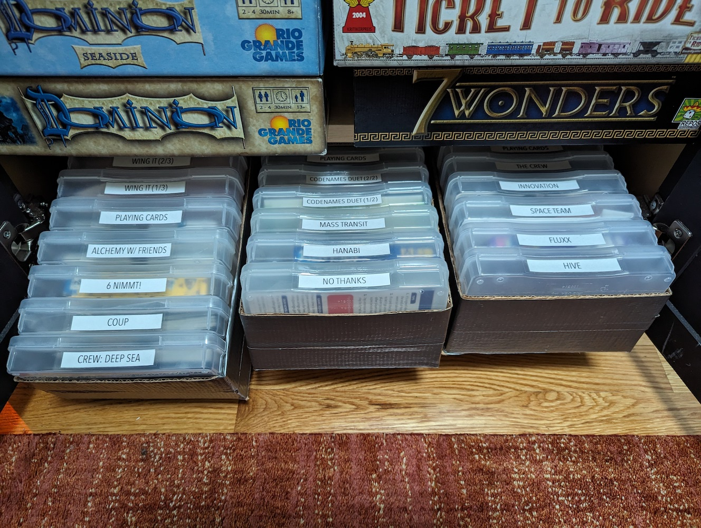

Is there anything cozier than a warm fire crackling in a brick-surround fireplace in your own home to get you through the long, dark, cold Boston winter? 
No way! So I needed to find a way to get one!

### Requirements for the fireplace
* looks like a fire (in my blurry periph behind a book)
* sounds like a fire
* feels like a fire
* won't require neighbors' approval
* won't require permitting
* won't require busting open the roof
* won't burn the house down
* won't be a hazard for babies

### Requirements for the space
* cozy
* storage for books 
* (lockable, child-proof) storage for board games
* breakables out of reach
* looks good as a backdrop to Zoom calls
* $2000 maximum budget for everything (I came in at $2173.04)
* finished within 6 weeks during evenings/weekends (since my baby niece would be coming to stay with us)

Here's the finished project: 

{: .mx-auto.d-block :}

Not bad, eh?! And I did the whole thing myself! 

**The cabinets:** Bought a couple of these [unfinished prefabricated cabinets](https://www.homedepot.com/p/Hampton-Bay-27-in-W-x-12-in-D-x-30-in-H-Assembled-Wall-Kitchen-Cabinet-in-Unfinished-with-Recessed-Panel-KW2730-UF/302969965), 
painted them with two coats of [chalk mineral paint](https://dixiebellepaint.com/caviar-chalk-mineral-paint/), and
installed [gold knobs](https://www.amazon.com/dp/B0BXNVQ17S/). I leveled the cabinets (wow the floors in this 1890 building slope a LOT) and secured them directly to the wall studs. 
I added quarter round to cover 
the wood shims between the cabinets and floor, [caulked](https://www.homedepot.com/p/DAP-ALEX-FLEX-10-1-oz-White-Premium-Molding-and-Trim-Sealant-18542/206034500) that junction, and repainted. 

**The fireplace:** I bought a relatively cheap [plug-in fireplace](https://www.amazon.com/PuraFlame-Western-Electric-Fireplace-Control/dp/B00R7347RU/) and some 
[loose brick veneers](https://shop.oldmillbuildingproducts.com/products/seaside). I cut a piece of BCX plywood to size between the cabinets 
(a trapezoid, thanks to the slanted floor) and cut an opening for the fireplace to slide in. I secured the plywood to the 
two side cabinets with [small corner braces](https://www.homedepot.com/p/Everbilt-2-in-Zinc-Plated-Double-Wide-Corner-Brace-2-Pack-15051/202033994) and wood glue. 
Then I cut my bricks to size on a wet tile saw and secured them to the plywood with
[construction adhesive](https://www.homedepot.com/p/Loctite-Power-Grab-Heavy-Duty-Instant-Grab-9-oz-Latex-Construction-Adhesive-White-Cartridge-each-2032666/206432103), 
[grouted](https://www.homedepot.com/p/Custom-Building-Products-SimpleGrout-09-Natural-Gray-1-qt-Pre-Mixed-Grout-PMG09QT/100676322) 
[between](https://www.homedepot.com/p/Anvil-Grout-Bag-57542/300997951) the bricks, then [sealed the whole thing](https://www.homedepot.com/p/Custom-Building-Products-SimpleSealer-165-Delorean-Gray-1-qt-Premixed-Sealer-TLPS24Z/202919172).

{: .mx-auto.d-block :}
*Late night action shot securing bricks to the plywood.*

{: .mx-auto.d-block :}
*Woo! This borrowed miter saw was a BEAST but did the trick!*

**The shelves:** I made the aesthetic decision to use walnut for this project before realizing that solid walnut is *wildly expensive!* 
So I ended up special-ordering 
[0.75" walnut plywood](https://www.homedepot.com/p/Columbia-Forest-Products-3-4-in-x-2-ft-x-8-ft-PureBond-Walnut-Plywood-Project-Panel-Free-Custom-Cut-Available-2344/204635489) 
instead and had it ripped down to the right depth using a table saw at Home Depot.
I [glued](https://www.homedepot.com/p/Titebond-III-16-oz-Ultimate-Wood-Glue-1414/100522343) 
two pieces of plywood together for the countertop and used a [rasp](https://www.rockler.com/4-way-shoe-rasp) to shave the edge of the plywood to fit snugly against the sloped ceiling. 
Then I borrowed a miter saw that could cut beveled edges to cut angles into two shelves to fit against the ceiling, too. 
I finished the shelves and countertop with [walnut edge banding](https://www.rockler.com/2-x-25-pre-glued-edge-banding-walnut) and sealed it all with three coats of 
[clear flat finish](https://www.rockler.com/general-finishes-high-performance-water-based-top-coat-flat) (sanding in-between coats), and mounted the shelves with a 
few [shelf L brackets](https://www.amazon.com/gp/product/B08QFVZXL8/). 

{: .mx-auto.d-block :}
*Here is how the space looked before...*

{: .mx-auto.d-block :}
*And really before (during the open house).*

{: .mx-auto.d-block :}
*Here's the same space NOW! I covered the router cables and, in lieu of a coffee table, added 
[acrylic ledge shelves](https://www.amazon.com/gp/product/B081RVTZVB/) to display family photo books that I designed and printed through [Blurb](https://www.blurb.com/).*

## Other angles and details of the loft space

{: .mx-auto.d-block :}
*Found the [perfect (tiny) couch](https://www.wayfair.com/furniture/pdp/corrigan-studio-alverce-58-square-arm-loveseat-w006875006.html) and a lamp and side tables at Good Will.*

{: .mx-auto.d-block :}
*[Sit-to-stand desk](https://www.imovr.com/studio470-electric-standing-desk-base.html) worked well in this corner 
only because I screwed my [monitor stands](https://www.amazon.com/gp/product/B09LCL9JHS/) directly into the desktop (so the monitors won't fall over the railing)!*

{: .mx-auto.d-block :}
*That light switch was annoyingly placed, so I put [peel-and-stick wallpaper](https://www.wayfair.com/decor-pillows/pdp/millwood-pines-wunsch-birch-18-l-x-205-w-peel-and-stick-wallpaper-roll-mxwx1133.html) 
around the whole thing (including the switch cover). I got wood picture-frame moulding trim, mitered the corners, glued it together, stained it, and attached it to the wall with command strips as a frame for my faux art. 
The picture on the back of the door is a [Ravi Varma](https://en.wikipedia.org/wiki/Raja_Ravi_Varma) print from ~1900 that once hung in my great-grandfather's (and my childhood) home.*

{: .mx-auto.d-block :}
*We needed board game storage in these cabinets! Success! (The other cabinet is equally packed.)*

{: .mx-auto.d-block :}
*I moved our smaller games into these [4x6" photo boxes](https://www.amazon.com/dp/B00GLQX3CO). I couldn't find perfectly-sized baskets to put the boxes into (to pull out like drawers), so I just made my own with scrap cardboard and duct tape.*

{: .mx-auto.d-block :}
*From left to right: My husband's grandfather who my 1-year-old is named for, that grandfather's grandfather, my great-great-grandfather, and his grandson (my grandfather) who my 4-year-old is named for. 
I enhanced the pictures with MyHeritage's AI tool (the best of the six options I tried) to print.*

## Cost breakdown

| Construction materials | Cost (+ tax/shipping) | 
| --- | ---: | 
| [fireplace](https://www.amazon.com/PuraFlame-Western-Electric-Fireplace-Control/dp/B00R7347RU/) | $350.61 |
| two [prefabricated cabinets](https://www.homedepot.com/p/Hampton-Bay-27-in-W-x-12-in-D-x-30-in-H-Assembled-Wall-Kitchen-Cabinet-in-Unfinished-with-Recessed-Panel-KW2730-UF/302969965) | $348.50 |
| 2 sheets [walnut plywood](https://www.homedepot.com/p/Columbia-Forest-Products-3-4-in-x-2-ft-x-8-ft-PureBond-Walnut-Plywood-Project-Panel-Free-Custom-Cut-Available-2344/204635489) | $259.25 |
| [brick veneers](https://shop.oldmillbuildingproducts.com/products/seaside) | $123.25 |
| [BCX plywood](https://www.homedepot.com/p/Handprint-23-32-in-x-4-ft-x-4-ft-BCX-Sanded-Plywood-Actual-0-703-in-x-47-75-in-x-47-75-in-211799/205723975) | $41.11 |
| [walnut edge banding](https://www.rockler.com/2-x-25-pre-glued-edge-banding-walnut) | $37.18 |
| [clamps](https://www.homedepot.com/p/DEWALT-Trigger-Clamp-Set-6-Piece-DWHT83200D/315634040) | $37.06 |
| [32 oz chalk paint](https://dixiebellepaint.com/caviar-chalk-mineral-paint/) | $33.42 |
| [acrylic shelf ledges](https://www.amazon.com/gp/product/B081RVTZVB/) | $31.86 |
| [picture frame moulding](https://www.homedepot.com/p/HOUSE-OF-FARA-3-4-in-x-3-4-in-x-96-in-Hardwood-Picture-Frame-Moulding-3U/204296123) for frame | $31.28 |
| [pack of shelf brackets](https://www.amazon.com/gp/product/B08QFVZXL8/) | $24.43 |
| [cabinet knobs](https://www.amazon.com/dp/B0BXNVQ17S/) | $23.99 |
| [wood sealant](https://www.rockler.com/general-finishes-high-performance-water-based-top-coat-flat) | $23.36 |
| [rasp](https://www.rockler.com/4-way-shoe-rasp) | $19.11 |
| [brick and grouter spray sealer](https://www.homedepot.com/p/Custom-Building-Products-SimpleSealer-165-Delorean-Gray-1-qt-Premixed-Sealer-TLPS24Z/202919172) | $18.35 |
| [cable covers](https://www.amazon.com/gp/product/B07RZQXRQK) | $18.05 |
| [1 qt premixed sanded grout](https://www.homedepot.com/p/Custom-Building-Products-SimpleGrout-09-Natural-Gray-1-qt-Pre-Mixed-Grout-PMG09QT/100676322) | $17.82 |
| [special chalk paintbrush](https://www.amazon.com/gp/product/B07CQ8G86Z) | $16.97 |
| double sided edge banding trimmer | $14.82 |
| sandpaper | $8.49 |
| [wood screws](https://www.supplyworks.com/Sku/204275495/everbilt-8-x-1-in-zinc-plated-phillips-flat-head-wood-screw-100-pack-887480018226-801822)| $8.47 |
| [grout bag](https://www.homedepot.com/p/Anvil-Grout-Bag-57542/300997951) | $7.09 |
| [construction adhesive](https://www.homedepot.com/p/Loctite-Power-Grab-Heavy-Duty-Instant-Grab-9-oz-Latex-Construction-Adhesive-White-Cartridge-each-2032666/206432103) | $6.88 |
| [wood shims](https://www.homedepot.com/p/8-in-Pine-Shims-12-Pack-WSSHW08/300723328) | $6.71 |
| [quarter-round trim](https://www.homedepot.com/p/Kelleher-11-16-in-x-11-16-in-MDF-Pre-Finished-White-Quarter-Round-Molding-FE331A/203446331) | $6.59 |
| [paintable caulk](https://www.homedepot.com/p/DAP-ALEX-FLEX-10-1-oz-White-Premium-Molding-and-Trim-Sealant-18542/206034500) | $6.35 |
| [angle braces](https://www.homedepot.com/p/Everbilt-2-in-Zinc-Plated-Double-Wide-Corner-Brace-2-Pack-15051/202033994) | $5.60 |
| [caulk dispenser tool](https://www.homedepot.com/p/Anvil-10-oz-Drip-Free-Smooth-Rod-Caulk-Gun-HD-109T1/315070926) | $4.55 |
| ["caulk-saver" strip](https://www.homedepot.com/p/Frost-King-0-375-in-x-20-in-Grey-Poly-Foam-Tape-Weatherstrip-Caulk-Saver-C21H/100067266) to fill wall/floor gap (once baseboards were removed) | $4.18 |
| [wood glue](https://www.homedepot.com/p/Titebond-III-16-oz-Ultimate-Wood-Glue-1414/100522343) (leftover from previous project) | $0 |
| wood gel stain (leftover from previous project) | $0 |
| command-strip tape (leftover from previous project) | $0 |
| [peel-and-stick wallpaper](https://www.wayfair.com/decor-pillows/pdp/millwood-pines-wunsch-birch-18-l-x-205-w-peel-and-stick-wallpaper-roll-mxwx1133.html) (leftover from previous project) | $0 | 
| wet tile saw (borrowed) | $0 |
| multitool to cut baseboard (borrowed) | $0 |
| miter saw with beveler (borrowed) | $0 |
| circular saw (borrowed) | $0 |
| **TOTAL** | **$1535.33** |

 

| Furniture & decorations | Cost ( + tax/shipping) | 
| --- | ---: |
| [tiny couch](https://www.wayfair.com/furniture/pdp/corrigan-studio-alverce-58-square-arm-loveseat-w006875006.html) | $361.24 |
| [rectangular end table](https://www.amazon.com/gp/product/B08BJDR5XN) | $85.79 |
| four picture frames ([1](https://www.amazon.com/gp/product/B0B3N9SYRX), [2](https://www.amazon.com/gp/product/B07RHYHZJY), [3](https://www.amazon.com/gp/product/B0BF5G1FT4), [4](https://www.amazon.com/gp/product/B07QWSPND9)) | $75.38 |
| round end table | $62.00 |
| [fake plant in pot](https://www.amazon.com/gp/product/B0928L6SJQ) | $20.96 |
| [clear book ends](https://www.amazon.com/gp/product/B08DD521S1) | $16.99 |
| [picture prints](https://www.mpix.com/) | $9.35 |
| lamp (purchased at Good Will years ago) | $6? |
| **TOTAL** | **$637.71** | 

*Shilpa Kobren is a research fellow in biomedical informatics at Harvard Medical School where she focuses on analyzing genomic data and
patient clinical information to derive insights into human diseases. Shilpa lives in a 1890 urban apartment in Cambridge, Massachusetts
with her husband and two energetic baby boys. She loves to create systems that optimize daily efficiency in family's constrained living space.*