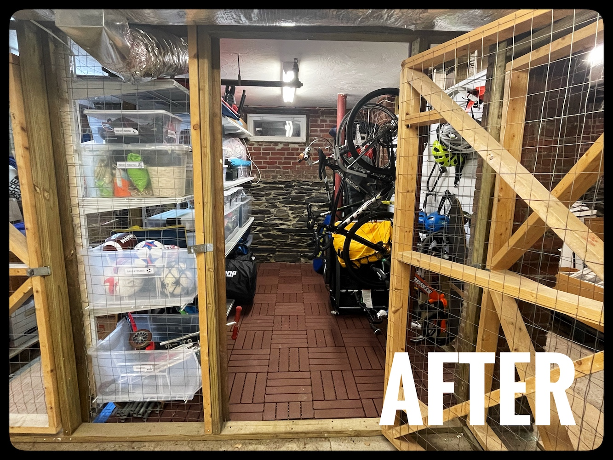
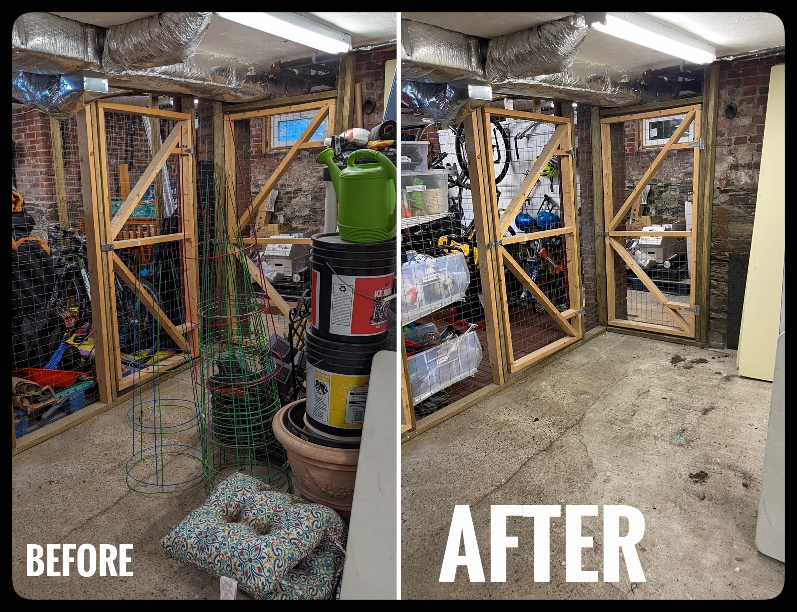
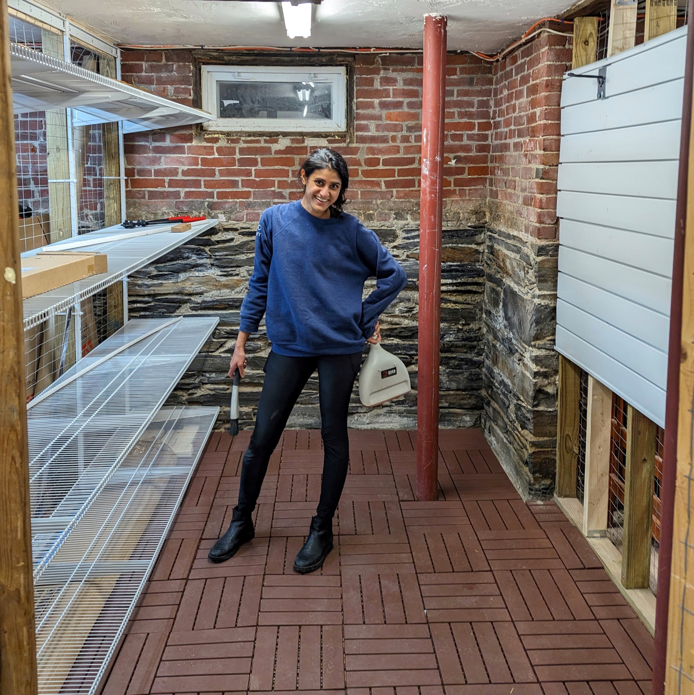
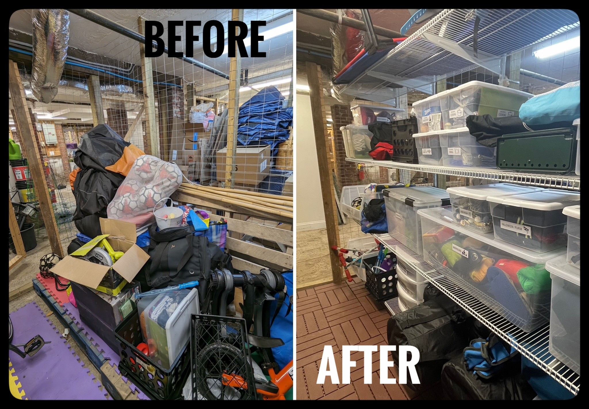
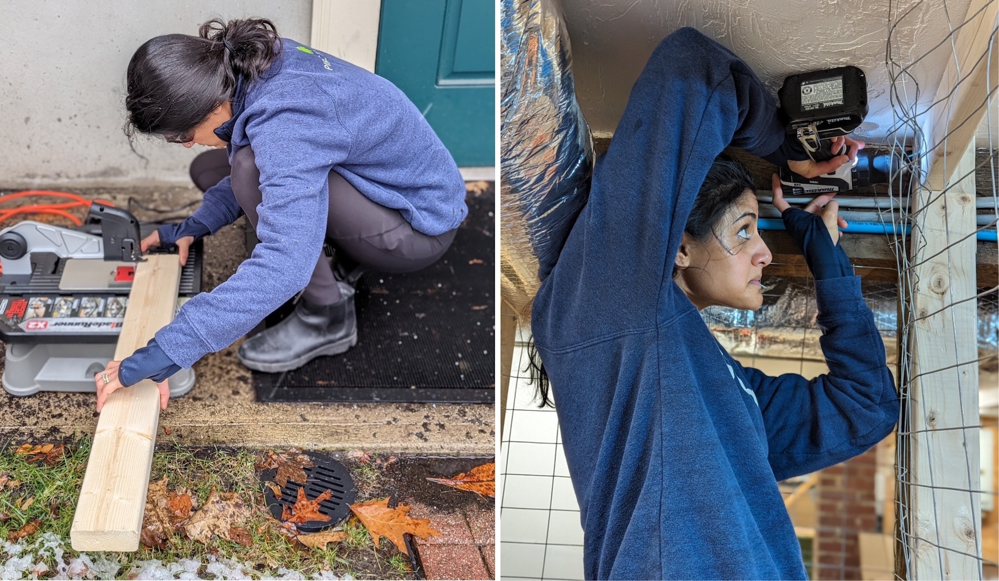
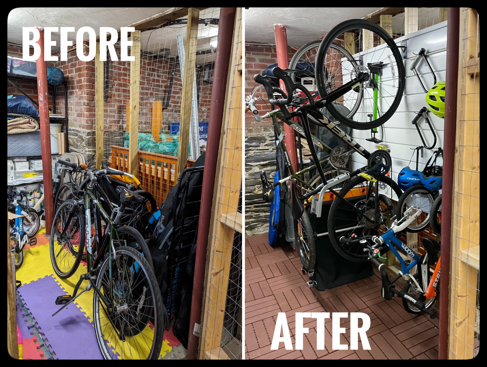
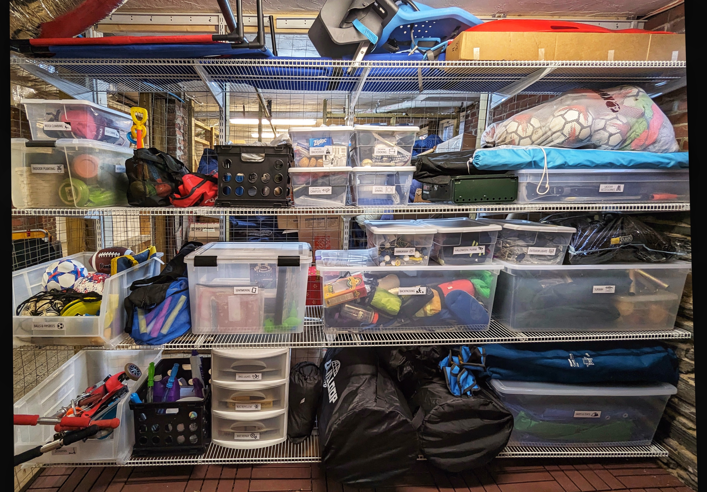
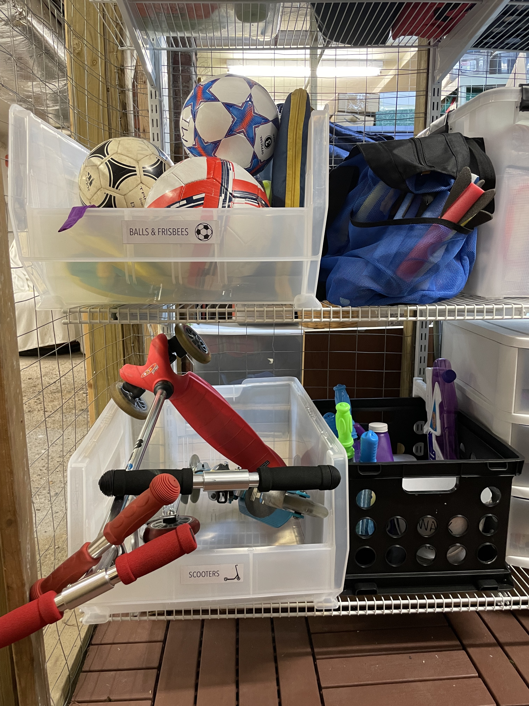
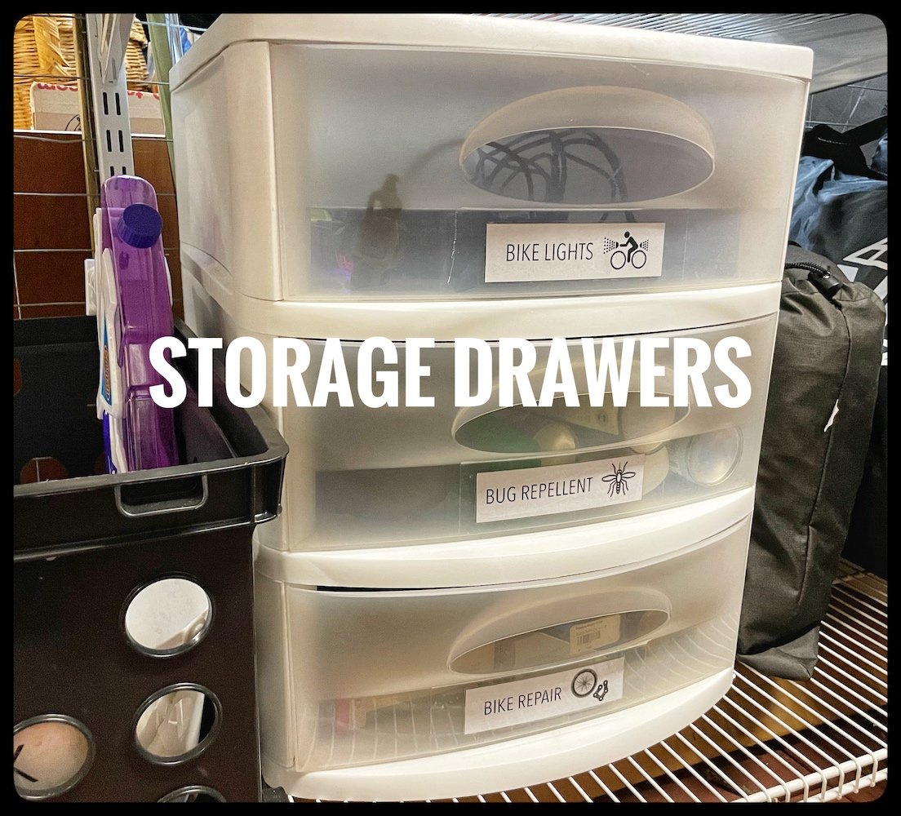
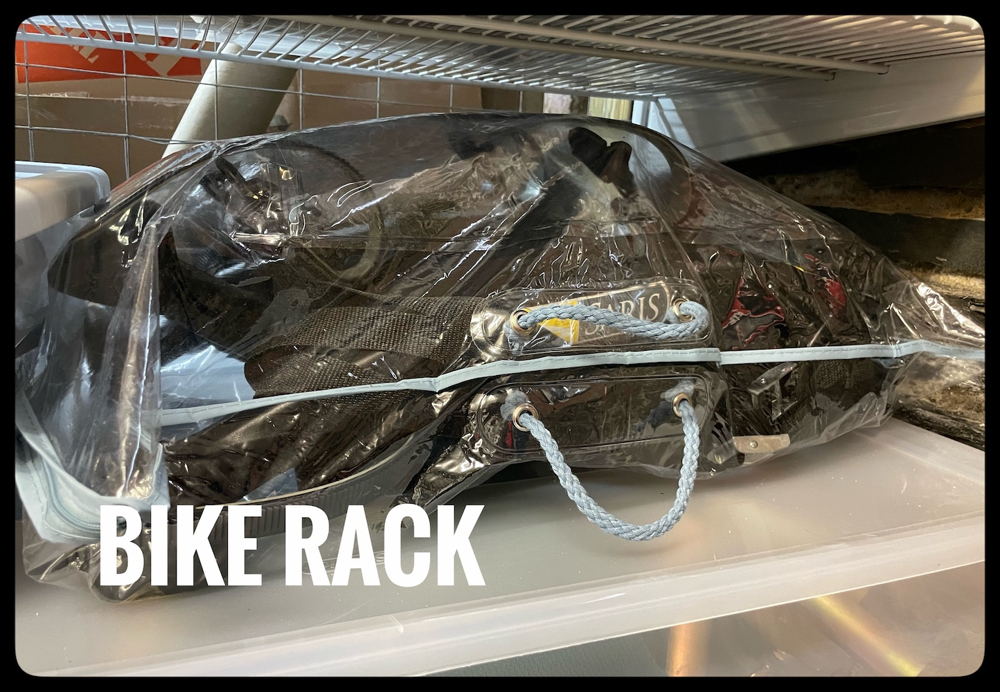

Our storage unit in the shared, unfinished basement of our 1890 condo had turned into a **dark, scary** dumping ground for stuff *we didn't
need* (but didn't want to deal with) and a whole bunch of stuff *we did need* but couldn't access! Time for a fix!

### Constraints
* nothing stored against the (damp, dusty, floodable) walls and floor
  * *floor storage units* are tricky because of the uneven, crumbly floors
  * *wall storage units* are tricky because there are no actual walls, and the exposed "studs" are >18" apart
* everything sealed because of said dampness, dust, and silverfish (ew!)

### Storage Requirements
* easy access to:
  * all 4 bikes and helmets
  * bike accessories
  * kids' outdoor toys
* organized storage for:
  * holiday accessories
  * car camping
  * sentimental items
  * backpacking gear
  * beach stuff

{: .mx-auto.d-block :}
*Yikes. :expressionless:*

It occurred to me that our problem is a widely-cited reason for parents to ditch urban living and move to the 'burbs for *space* (like a *garage*).
:anguished: I spent several post-kids-bedtime evenings over the course of two months heading down to our storage unit to take
measurements and scour the internet for inspiration pictures and products that might meet our requirements.

**Here is how the space looks now:**

{: .mx-auto.d-block :}
*HUGE IMPROVEMENT! :heart_eyes: :relaxed:*

## The Process

After deciding on the solution, I ordered everything I (thought) I'd need in advance. My parents watched my 2- and 4-year-old
for ~36 hours over the weekend, and that was my timeframe constraint to *finish all construction*.

{: .mx-auto.d-block :}
***Step 1:** Move **our junk** out of our unit, AND relocate **everyone else's junk** that had been blocking access to our unit.*

**The floor:** We first laid down these
[interlocking deck tiles](https://www.homedepot.com/p/326396808). I didn't realize how uneven the floor was until we
moved all of our stuff out. Our in-the-moment decision was to fill the giant ditches with foam mats. *(TBD if that was a good idea...)* I borrowed a [circular saw](https://www.homedepot.com/p/RYOBI-ONE-HP-18V-Brushless-Cordless-7-1-4-in-Circular-Saw-Tool-Only-PBLCS300B/314109411) and
[tabletop jigsaw](https://www.amazon.com/Rockwell-BladeRunner-Portable-Tabletop-Accessories/dp/B00L47FZ8A/) to cut the tiles to fit into corners, against the 130-year-old stackstone foundation, and around support posts.

{: .mx-auto.d-block :}
***11:42 P.M.** My only picture before loading everything back in (so you can see the floor).*

**The shelves:** The lack of drywall and nonstandard stud spacing limited our wall shelf options drastically.
The optimal solution given our constraints was this [Everbilt heavy-duty wire frame](https://www.homedepot.com/p/Everbilt-6-ft-x-20-in-Heavy-Duty-Wire-Shelf-90257/314183866)
system where we could cut the 12' shelves to size exactly with a [bolt cutter](https://www.homedepot.com/p/Milwaukee-18-in-Bolt-Cutter-with-3-8-in-Maximum-Cut-Capacity-48-22-4018/312620426) and had flexibility with where the vertical rails attached to studs. IMHO, this is overpriced
for what it is (but was the only way to have shelves that spanned this full "wall").

{: .mx-auto.d-block :}
*No front vertical supports = flexible bin size and access to move and put things away easily.*

**The slat wall:** How do we get **four bikes** to fit? :persevere: Vertical storage! :smile: I went with the
[Proslat system](https://www.homedepot.com/p/Proslat-PVC-Slatwall-8-ft-x-4-ft-White-88102/203496104) because I could cut the slats to fill the whole wall and [hang helmets and the bike pump](https://www.homedepot.com/p/Proslat-Slatwall-4-in-Hooks-12-Pack-13002/204743455) with the [hanging bikes](https://www.homedepot.com/p/Proslat-Slatwall-Vertical-Bike-Hook-2-Pack-13028/204743464).

{: .mx-auto.d-block :}
*We needed to add vertical support framing for the slats to take the weight of the bikes. It was snowing during construction day, but it was the only time we had to get the project done! :muscle:*

{: .mx-auto.d-block :}
*SUCCESS! How cute are those little 14-inch and balance bikes? :bicyclist: In truth, my 4- and 2-year-old can't get their bikes on and off this wall (yet). But the grown-ups can finally walk in to help them, though!*

## Getting rid of stuff

Surprise? The *biggest and most time-consuming* part of this project was getting rid of stuff! I...
* made trips to our [local recycling center](https://www.cambridgema.gov/services/recyclingcenter) to get rid of broken appliances and spare metal parts.
* drove out to Roxbury over two nights to recycle scrap wood and warped wood risers at a [construction debris dropoff](https://resourcewasteservices.com/our-facilities/resource-roxbury/) site.
* returned (years overdue) unused supplies to Ikea.
* donated an absurd amount of white paint to our local [Somerville theater group](https://www.theatreatfirst.org/).
* sold extra wall and flooring tiles on FB Marketplace
* gave away unused furniture (folding chairs, carts), baby items, construction materials (grout, wood floor finish, paint samples)
and *so many other things* on the [FB Buy Nothing Cambridge](https://www.facebook.com/groups/476638806418590) group.

**My proudest moment of this project has been that nothing ended up in the trash.**

## Final touches

{: .mx-auto.d-block :}
*Shelves reloaded with organized, labeled bins (my fave) !*

{: .mx-auto.d-block :}
***Kids' corner** for kids to access their stuff! This [big mesh shoulder bag](https://www.amazon.com/gp/product/B0B2RHFXCB/) is AMAZING for heading outdoors with babies.*

{: .mx-auto.d-block :}
*I have had this set of drawers since my freshman year of college, and it continues to work for us! I popped off the bottom drawer and keep small, highly-accessed items here now.*

{: .mx-auto.d-block :}
*An extremely annoying thing to store is our [amazing Saris bike rack](https://www.amazon.com/dp/B085WTVV18/) (with its straps and hooks catching on everything).
A fancy pillow purchased years ago came in this clear PVC bag with handles, and storing our bike rack in this has been **perfect** :astonished:.*

## Cost breakdown

| Item | Cost (+ tax/shipping) |
| --- | ---: |
| Everbilt [shelves](https://www.homedepot.com/p/Everbilt-12-ft-x-20-in-Heavy-Duty-Wire-Shelf-90175/314183873), [shelf brackets](https://www.homedepot.com/p/Everbilt-20-in-L-White-Steel-Heavy-Duty-Support-Bracket-90316/314700560), [vertical supports](https://www.homedepot.com/p/Everbilt-84-in-L-White-Steel-Heavy-Duty-Vertical-Rail-90290/314586379), [horizontal hang tracks](https://www.homedepot.com/p/Everbilt-80-in-Heavy-Duty-Steel-Hang-Track-90288/314586388), [end caps](https://www.homedepot.com/p/Everbilt-Small-End-Caps-20-Pack-90234/314184189) | 750.35 |
| [ProSlat 8'x4' set](https://www.homedepot.com/p/Proslat-PVC-Slatwall-8-ft-x-4-ft-White-88102/203496104) | 212.49 |
| [interlocking deck tiles](https://www.homedepot.com/p/11-8-in-x-11-8-in-Outdoor-Square-Plastic-Interlocking-Flooring-Deck-Tiles-for-Courtyard-Garden-44-pieces-in-Brown-C-F-B-90469/326396808) | 212.48 |
| [ProSlat bike wall hooks](https://www.homedepot.com/p/Proslat-Slatwall-Vertical-Bike-Hook-2-Pack-13028/204743464) | 63.73 |
| two used [clear ball bins](https://www.amazon.com/gp/product/B0085U20JG/) | 57.20 |
| [sukkah and s'chach storage bag](https://www.sukkot.com/shop/sukkah-storage-bags/) | 56.39 |
| [bolt cutter](https://www.homedepot.com/p/Milwaukee-18-in-Bolt-Cutter-with-3-8-in-Maximum-Cut-Capacity-48-22-4018/312620426) | 50.97 |
| wood screws and metal joint supports | 43.66 |
| [IRIS 74qt WeatherPro box](https://www.homedepot.com/p/IRIS-74-Qt-WeatherPro-Storage-Box-in-Clear-110586/300735908) | 37.20 |
| two [110qt clear bins](https://www.target.com/p/sterilite-110qt-clear-view-storage-bin-with-latch-purple/-/A-13794501) | 31.85 |
| [ProSlat other wall hooks](https://www.homedepot.com/p/Proslat-Slatwall-4-in-Hooks-12-Pack-13002/204743455) | 30.80 |
| [long "underbed" 56qt box](https://www.containerstore.com/s/closet/closet-boxes-bins/our-clear-storage-boxes/12d?productId=11004743) | 30.68 |
| heavy-duty [long cable ties](https://www.acehardware.com/departments/lighting-and-electrical/cable-management-cable-ties-and-electrical-tape/cable-ties/3004703) | 21.23 |
| extra 2x4 lumber for wall studs | 19.55 |
| SOLD baby carrier backpack | +175 |
| SOLD baby beach toys, beach tent, and kiddie pool | +50 |
| SOLD 10 sq ft of porcelain tiles | +50 |
| SOLD clip-on high chair | +35 |
| SOLD camp tent storage bag | +15 |
| **TOTAL** | **$1293.58** |

