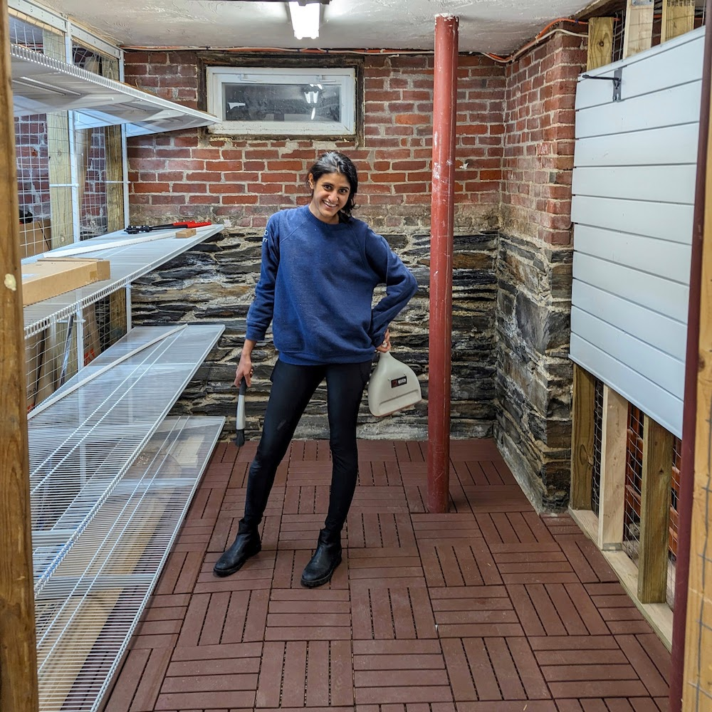

Our storage unit in the shared, unfinished basement of our 1890 condo had turned into a **dark, scary** dumping ground for stuff we *didn't
need* (but didn't want to deal with) and a whole bunch of stuff *we did need* but couldn't access! Our need to convert our storage unit into usable space was desperate.

### Constraints
* nothing stored against the (damp, dusty) walls
* nothing stored directly on the (floodable, dusty) floor
* floor storage units are tricky because of the uneven, crumbly floors
* wall storage units are tricky because there are no actual walls, and the exposed "studs" are >18" apart
* everything sealed because of said dampness, dust, and silverfish (ew!)

### Storage Requirements
* space for 2 adult and 2 child bicycles
* easy access to:
  * scooters, kids' bikes & helmets
  * soccer balls and nets
  * outdoor toys (chalk, rocket launchers, bubbles, cars, cornhole)
  * bike pump
  * bike trailer and kids' bike seat attachment
  * bug spray, bike lights, bike repair tools
* organized storage for:
  * holiday accessories
  * car camping (tents, tarps, chairs, cookware & stove, sleeping pads & bags)
  * sentimental items (cards, kids' art and toys)
  * backpacking gear
  * beach stuff

{: .mx-auto.d-block :}
*Yikes. :expressionless:*

It occurred to me that our problem is a widely-cited reason for parents to ditch urban living and move to the 'burbs for *space* (like a *garage*).
:anguished: I spent several post-kids-bedtime evenings over the course of two months heading down to our storage unit to take
measurements and scour the internet for inspiration pictures and products that might meet our requirements.

**Here is how the space looks now:**

{: .mx-auto.d-block :}
*HUGE IMPROVEMENT! :heart_eyes: :relaxed:*

## The Process

After deciding on the solution, I ordered everything I (thought) I'd need in advance. My parents watched my 2- and 4-year-old
for ~36 hours over the weekend, and that was my timeframe constraint to *finish all construction*.

{: .mx-auto.d-block :}
***Step 1:** Move **our junk** out of our unit, AND relocate **everyone else's junk** that had been blocking access to our unit.*

**The floor:** We first laid down these
[interlocking deck tiles](https://www.homedepot.com/p/326396808). I didn't realize how uneven the floor was until we
moved all of our stuff out, and we filled in giant ditches with some cut foam mats first. *(TBD if that was a good idea...)* I borrowed a [circular saw](https://www.homedepot.com/p/RYOBI-ONE-HP-18V-Brushless-Cordless-7-1-4-in-Circular-Saw-Tool-Only-PBLCS300B/314109411) and
[tabletop jigsaw](https://www.amazon.com/Rockwell-BladeRunner-Portable-Tabletop-Accessories/dp/B00L47FZ8A/) to cut the tiles to fit into corners, against the 130-year-old stackstone foundation, and around support posts.

{: .mx-auto.d-block :}
***11:42 P.M.** My only picture before loading everything back in (so you can see the floor).*

**The shelves:** The lack of drywall and nonstandard stud spacing limited our wall shelf options drastically.
The optimal solution given our constraints was this [Everbilt heavy-duty wire frame](https://www.homedepot.com/p/Everbilt-6-ft-x-20-in-Heavy-Duty-Wire-Shelf-90257/314183866)
system where we could cut the 12' shelves to size exactly with a [bolt cutter](https://www.homedepot.com/p/Milwaukee-18-in-Bolt-Cutter-with-3-8-in-Maximum-Cut-Capacity-48-22-4018/312620426) and had flexibility with where the vertical rails attached to studs. IMHO, this is overpriced
for what it is (but was the only way to have shelves that spanned this full "wall").

{: .mx-auto.d-block :}
*The heavy-duty, 20" deep wire shelves spanned the maximum width of the unit to take advantage of every last inch. No front vertical supports = flexible bin size and access to slide around and put away things easily.*

**The slat wall:** How do we get four bikes to fit? :persevere: Vertical storage! I went with the
[Proslat system](https://www.homedepot.com/p/Proslat-PVC-Slatwall-8-ft-x-4-ft-White-88102/203496104) because I could cut the slats to size and
[hang helmets and the bike pump](https://www.homedepot.com/p/Proslat-Slatwall-4-in-Hooks-12-Pack-13002/204743455) with the [hanging bikes](https://www.homedepot.com/p/Proslat-Slatwall-Vertical-Bike-Hook-2-Pack-13028/204743464).

{: .mx-auto.d-block :}
*Welp. We needed to add vertical support framing for the slats to take the weight of the bikes. It was snowing during construction day, but it was the only time we had to get the project done! :muscle:*

{: .mx-auto.d-block :}
*Check it out! How cute are those little 14-inch-bike and balance bikes? :bicyclist: In truth, the kids can't get their bikes on and off this wall (yet). But the grown-ups **can** walk in to get them now, though!*

## Getting rid of stuff

You might be surprised to learn that the *biggest and most time-consuming* part of this project was actually getting rid of stuff that we absolutely did not need!
I made trips to our [local recycling center](https://www.cambridgema.gov/services/recyclingcenter) to get rid of broken appliances and spare metal parts.
I drove out to Roxbury over two nights to recycle scrap wood and warped wood risers at a [construction debris dropoff](https://resourcewasteservices.com/our-facilities/resource-roxbury/) site.
I returned unused supplies to Ikea.
I donated an enormous amount of white paint to our local [Somerville theater group](https://www.theatreatfirst.org/).
I sold extra wall and flooring tiles on FB Marketplace and gave away unused furniture (folding chairs, carts, etc.), baby items, construction materials (grout, wood floor finish, paint samples)
and so many other things on the [FB Buy Nothing Cambridge](https://www.facebook.com/groups/476638806418590) group.
 **My proudest moment of this project has been that nothing ended up in the trash.**

## Final touches

{: .mx-auto.d-block :}
*Shelves reloaded with organized, labeled bins (my fave) !*

Stay tuned for an update with details for exactly why this space is so perfectly organized now (and a total cost breakdown)!

