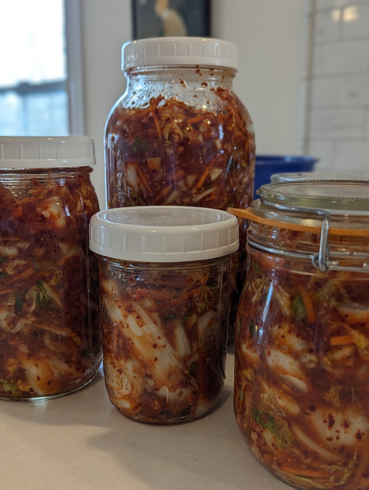
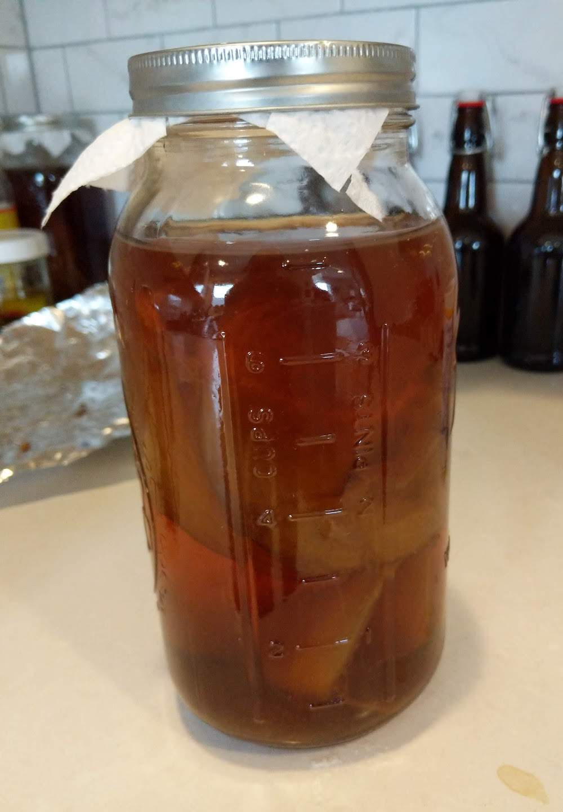
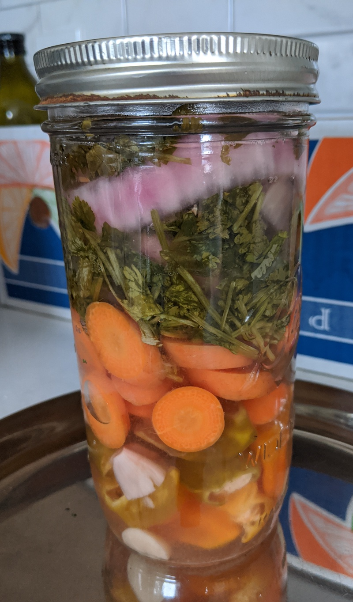
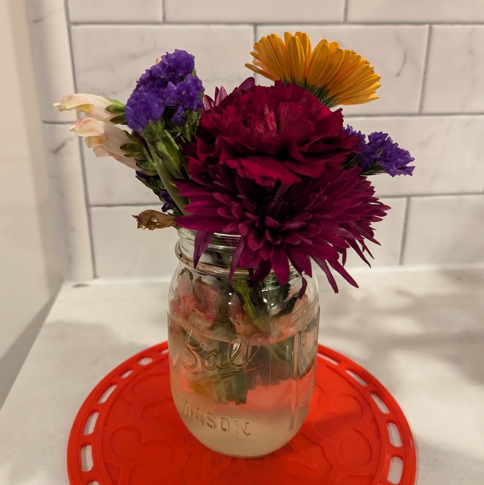
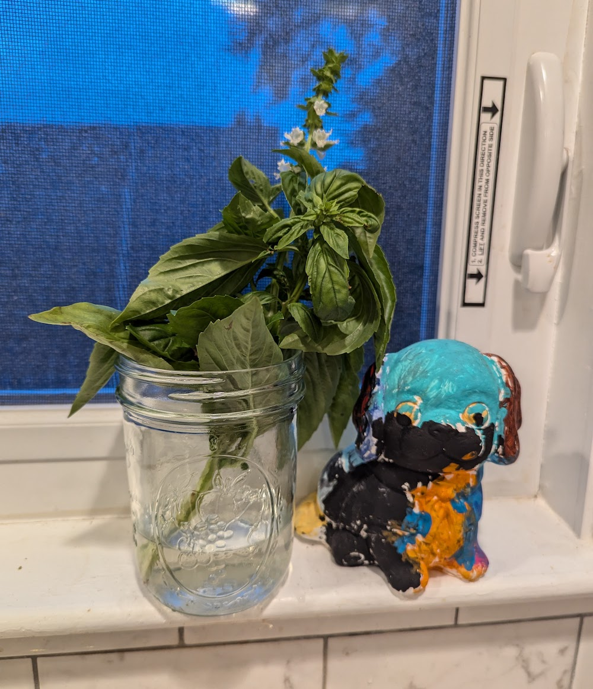

I love a good, multifunctional home product (even more than I despise single-purpose appliances). Jars are the *most ubiquitous*
kitchen item we own, and I'm here to give you the DL on why they're the absolute BEST. 

**Jump ahead to any section:** We use glass (Ball/Mason) jars for
[dry goods organization](#1-dry-goods-storage-and-organization), 
[storing leftovers](#2-leftovers), 
as [drinking glasses](#3-drinking-glasses), 
for [canning](#4-canned-goodies) and [fermenting](#5-fermented-goodies) veggies, fruits and tea, 
as [vases for flowers and fresh herbs](#6-flower-and-herbs-vases), 
as [measuring cups](#7-measuring-cups) (especially for cold brew coffee), and as 
[cookie cutters](#8-cookie-cutters)! And jars have some [special properties](#bonus-properties-) that make 
them *ideal* for all of these uses, too !

# 1. Dry goods storage and organization

We store various dried goods (lentils, beans, nuts, grains) in jars on a metal shelf between our kitchen and dining room. 

{: .mx-auto.d-block :}

I label only the tops of the jars! I don't own a label maker, so I actually print these out onto [sticky shipping label
paper](https://www.amazon.com/gp/product/B089XVPXL9) and cut them out. 

{: .mx-auto.d-block :}

The best part about these labeled lids are that the *same [wide-mouth lids](https://www.target.com/p/ball-12pk-wide-mouth-mason-jar-lids-without-bands/-/A-76431389)* fit 
[16oz pint jars](https://www.target.com/p/ball-16oz-12pk-glass-wide-mouth-mason-jar-with-lid-and-band/-/A-50624128), 
[32oz quart jars](https://www.target.com/p/ball-32oz-12pk-glass-wide-mouth-mason-jar-with-lid-and-band/-/A-49139680), and 
[64oz half gallon jars](https://www.target.com/p/ball-64oz-6pk-glass-wide-mouth-mason-jar-with-lid-and-band/-/A-88271632)! 
If we start to run low on something in a large container, we can move it to a smaller container and reuse the exact same lid.

{: .mx-auto.d-block :}

Also, notice that the lids come in two pieces: a lid and a band.

{: .mx-auto.d-block :}

During different times of the year, we keep and access different dried goods. I can save labeled lids *super efficiently*
and dig out certain ones when needed! For instance, we get a yearly [grain CSA](https://localgrain.org/) 
(community-sponsored agriculture, like a farm share) and then use up our buckwheat groats, barley, popcorn kernels and flours
over the course of the year.

{: .mx-auto.d-block :}

I was so delighted by my labeled Ball jars that I also made matching mini-labels for the [spices we keep in the cabinet](https://www.amazon.com/gp/product/B00K8MK384).

{: .mx-auto.d-block :}

# 2. Leftovers

We keep 16oz jars and [8oz jars](https://www.target.com/p/ball-8oz-12pk-glass-regular-mouth-mason-jar-with-lid-and-band/-/A-14898081)
with corresponding [plastic wide-mouth](https://www.amazon.com/WIDE-Mouth-Mason-Lids-Pack/dp/B0894RSTF8) and [regular-mouth lids](https://www.amazon.com/gp/product/B0894Q7W9N) for storing leftovers.
We decided years ago to keep leftovers in our fridge door because it's easier to see what we have on hand without digging through the fridge. We end up
with a lot less waste this way!

{: .mx-auto.d-block :}

Also the pint-size jars are perfect portions for a lunch or dinner. We use them for complete (mixed) meals sometimes, too!

{: .mx-auto.d-block :}

# 3. Drinking glasses

It used to be trendy to use glass jars as drinking glasses (maybe it still is)? But we use the *exact same jars* for glasses, too! 
This means we save a bunch of space in our kitchen cabinets. 

{: .mx-auto.d-block :}

# 4. Canned goodies

{: .mx-auto.d-block :}

{: .mx-auto.d-block :}

{: .mx-auto.d-block :}

# 5. Fermented goodies

{: .mx-auto.d-block :}

{: .mx-auto.d-block :}

{: .mx-auto.d-block :}

# 6. Flower (and herbs) vases

{: .mx-auto.d-block :}

{: .mx-auto.d-block :}

# 7. Measuring cups

{: .mx-auto.d-block :}

# 8. Cookie cutters

{: .mx-auto.d-block :}

{: .mx-auto.d-block :}

{: .mx-auto.d-block :}

# Bonus Properties !
