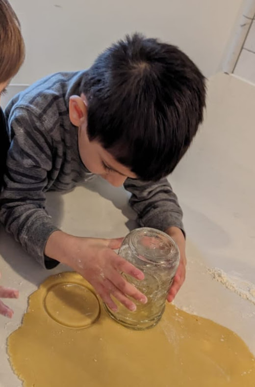
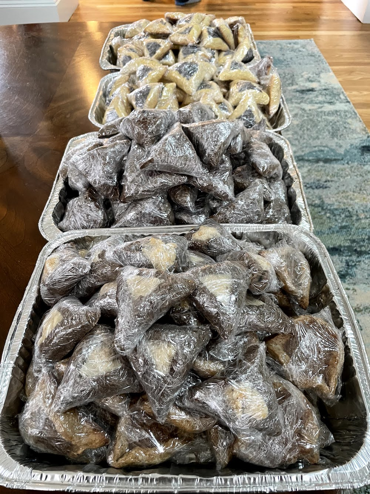

I love a good, multifunctional home product (even more than I despise single-purpose appliances). Mason jars are the *most ubiquitous*
kitchen item we own, and I'm here to give you the DL on why they're the absolute BEST. 

:scroll: **A little history:** A ["Mason" jar](https://en.wikipedia.org/wiki/Mason_jar) is the generic term referring 
to *any* glass jar with a threaded screw-top lid.
The name "Mason" came from John Landis Mason, who patented the jar with a two-piece lid in 1858. 
There are *brands* of Mason jars, including... Mason. (How confusing.) But also Ball (East Coast!) and Kerr (whatever that is...West Coasties).

**Jump ahead to any section:** We use Mason jars for
[dry goods organization](#1-dry-goods-storage-and-organization), 
[storing leftovers](#2-leftovers), 
as [drinking glasses](#3-drinking-glasses), 
for [canning](#4-canned-goodies) and [fermenting](#5-fermented-goodies) veggies, fruits and tea, 
as [vases for flowers and fresh herbs](#6-flower-and-herbs-vases), 
as [measuring cups](#7-measuring-cups) (especially for hot chocolate and cold brew coffee), and as 
[cookie cutters](#8-cookie-cutters)! And jars have some [special properties](#bonus-properties-) that make 
them *ideal* for all of these uses, too !

# 1. Dry goods storage and organization

We used to keep open bags of lentils, beans and grains that (although this never happened, phew :relieved:) had the constant *POTENTIAL*
for nasty bug infestations. :ant: :fearful: No longer, bébé! Check out our dried goods shelf:

{: .mx-auto.d-block :}

I only label the tops of the jars so that we can see how much we have. I don't own a label maker, so I actually print these onto [sticky shipping label
paper](https://www.amazon.com/gp/product/B089XVPXL9) and cut them out. 

{: .mx-auto.d-block :}

**Best part #1:** The standard [wide-mouth lids](https://www.target.com/p/ball-12pk-wide-mouth-mason-jar-lids-without-bands/-/A-76431389) fit 
[16oz pint jars](https://www.target.com/p/ball-16oz-12pk-glass-wide-mouth-mason-jar-with-lid-and-band/-/A-50624128), 
[32oz quart jars](https://www.target.com/p/ball-32oz-12pk-glass-wide-mouth-mason-jar-with-lid-and-band/-/A-49139680), and 
[64oz half gallon jars](https://www.target.com/p/ball-64oz-6pk-glass-wide-mouth-mason-jar-with-lid-and-band/-/A-88271632) ! :exploding_head:
As we use things up (or restock), we can transfer contents across jar sizes and just screw on the same lid.

{: .mx-auto.d-block :}

**Best part #2:** Notice that the lids come in two pieces: a lid and a band...

{: .mx-auto.d-block :}

I save my labeled lids *super efficiently!* :heart_eyes: When we rotate through different dried goods throughout the year, 
I just swap out lids as needed. Our yearly [grain CSA](https://localgrain.org/) 
(like a farm share), has deeeeelicious spelt, barley, popcorn kernels and flours. 
:yum: :ear_of_rice:

{: .mx-auto.d-block :}

*An aside.* I was so delighted by my labeled Mason jars that I also made matching 
mini-labels for the [spices we keep in the cabinet](https://www.amazon.com/gp/product/B00K8MK384). :star_struck: :nerd_face:

{: .mx-auto.d-block :}

# 2. Leftovers

We regularly store leftovers in 16oz pint and [8oz jars](https://www.target.com/p/ball-8oz-12pk-glass-regular-mouth-mason-jar-with-lid-and-band/-/A-14898081)
with  [plastic wide-mouth](https://www.amazon.com/WIDE-Mouth-Mason-Lids-Pack/dp/B0894RSTF8) and [regular-mouth lids](https://www.amazon.com/gp/product/B0894Q7W9N).

*Life hack PSA:* Storing leftovers on the fridge door means I can see what amazing meals my husband has left for me 
without having to dig through the fridge (or, more likely, give up and go out for lunch).

{: .mx-auto.d-block :}

Pint-size jars are perfect portions for a lunch or dinner. We use them for complete (mixed) meals sometimes, too!

{: .mx-auto.d-block :}

# 3. Drinking glasses

Is it still trendy to use Mason jars as drinking glasses?! Doesn't matter anyway. 
We use the *exact same jars* as glasses, too! 
This saves so much space in our kitchen cabinets. 

{: .mx-auto.d-block :}

# 4. Canned goodies

{: .mx-auto.d-block :}

{: .mx-auto.d-block :}

{: .mx-auto.d-block :}

# 5. Fermented goodies

{: .mx-auto.d-block :}

{: .mx-auto.d-block :}

{: .mx-auto.d-block :}

# 6. Flower (and herbs) vases

{: .mx-auto.d-block :}

{: .mx-auto.d-block :}

# 7. Measuring cups

{: .mx-auto.d-block :}

# 8. Cookie cutters

{: .mx-auto.d-block :}

{: .mx-auto.d-block :}

{: .mx-auto.d-block :}

# Bonus Properties !

Alright, relax. This post is clearly still **UNDER CONSTRUCTION**. I'll get to it soon, I promise!