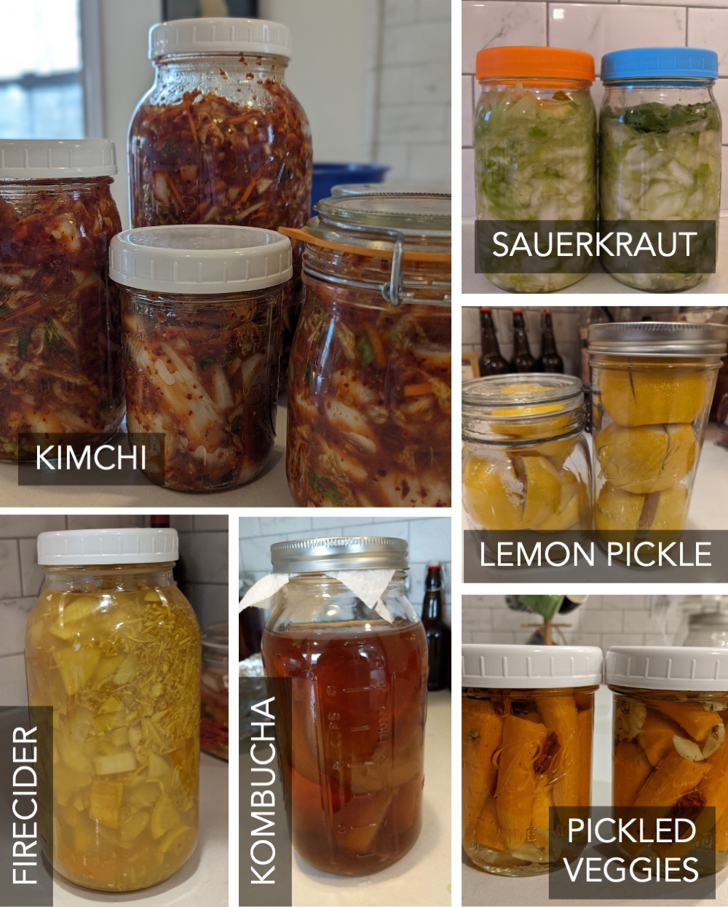

I love a good, multifunctional home product (even more than I despise single-purpose appliances). Mason jars are the *most ubiquitous*
kitchen item we own, and I'm here to give you the DL on why they're my absolute favorite. 

:scroll: **A little history:** A ["Mason" jar](https://en.wikipedia.org/wiki/Mason_jar) is the generic term referring 
to *any* glass jar with a threaded, screw-top lid.
The name "Mason" is after the guy who patented the jar with a two-piece lid in 1858. 
There are *brands* of Mason jars, including... Mason. (How confusing.) But also Ball (what we use) and Kerr.

**Jump ahead to any section:** We use Mason jars for
[dry goods organization](#1-dry-goods-storage-and-organization), 
[storing leftovers](#2-leftovers), 
as [drinking glasses](#3-drinking-glasses), 
for [canning](#4-canned-goodies) and [fermenting](#5-fermented-goodies) various goodies, 
as [vases for flowers and fresh herbs](#6-flower-and-herbs-vases), 
as [measuring cups](#7-measuring-cups) (especially for hot chocolate and cold brew coffee), and as 
[cookie cutters](#8-cookie-cutters)! And jars have some [special properties](#bonus-properties-) that make 
them *ideal* for all of these uses, too !

# 1. Dry goods storage and organization

We used to keep open bags of lentils, beans and grains that (although this never happened, phew :relieved:) had the *potential*
for bug infestations. :ant: :fearful: No longer, bébé! Check out our dry goods shelf:

{: .mx-auto.d-block :}

I only label the tops of the jars so that we can always see how much we have of any item. 
I make my labels in PowerPoint, then print them onto [sticky shipping label
paper](https://www.amazon.com/gp/product/B089XVPXL9) and cut them out. But you could probably find 
[jar lid stickers](https://www.amazon.com/Stickers-Different-Designs-Sticker-Canning/dp/B0BFSF9B2Z/?th=1)
and make labels with your [favorite label maker](https://www.amazon.com/gp/product/B07HB8LNSY/), too.

{: .mx-auto.d-block :}

**Best part #1:** The standard [wide-mouth lids](https://www.target.com/p/ball-12pk-wide-mouth-mason-jar-lids-without-bands/-/A-76431389) fit 
[16oz pint jars](https://www.target.com/p/ball-16oz-12pk-glass-wide-mouth-mason-jar-with-lid-and-band/-/A-50624128), 
[32oz quart jars](https://www.target.com/p/ball-32oz-12pk-glass-wide-mouth-mason-jar-with-lid-and-band/-/A-49139680), and 
[64oz half gallon jars](https://www.target.com/p/ball-64oz-6pk-glass-wide-mouth-mason-jar-with-lid-and-band/-/A-88271632) ! :exploding_head:
As we use things up (or restock), we can transfer contents across jar sizes and just screw on the same lid.

{: .mx-auto.d-block :}

**Best part #2:** Notice that the lids come in two pieces: a lid and a band...

{: .mx-auto.d-block :}

I save my labeled lid tops *super efficiently!* :heart_eyes: When we rotate through different dry goods throughout the year, 
I just swap out lids as needed. Our yearly [grain share haul](https://localgrain.org/) has deeeeelicious spelt, barley, popcorn kernels and flours. 
:yum: :ear_of_rice:

{: .mx-auto.d-block :}

*An aside.* I was so delighted by my labeled Mason jars that I also made matching 
mini-labels for the [spices we keep next to the stove](https://www.amazon.com/gp/product/B00K8MK384). :star_struck: :nerd_face:

{: .mx-auto.d-block :}
*We decant oils and vinegars into [pour spout containers](https://www.amazon.com/gp/product/B08SBF3SK8/) and 
keep them on a [lazy susan](https://www.amazon.com/gp/product/B0967Y7RLR/) for easy access.*

# 2. Leftovers

We regularly store leftovers in 16oz pint and 
[8oz jars](https://www.target.com/p/ball-8oz-12pk-glass-regular-mouth-mason-jar-with-lid-and-band/-/A-14898081)
closed with [plastic wide-mouth](https://www.amazon.com/WIDE-Mouth-Mason-Lids-Pack/dp/B0894RSTF8) and 
[regular-mouth lids](https://www.amazon.com/gp/product/B0894Q7W9N).

*Life hack PSA:* Storing leftovers in the fridge door means I can see what amazing meals my husband has left for me 
without having to dig through the fridge. :shallow_pan_of_food: :green_salad: :curry: :ramen: 
In our family, this has led to much less food waste.

{: .mx-auto.d-block :}

Pint-size jars are also perfect portions for a lunch or dinner!

{: .mx-auto.d-block :}

# 3. Drinking glasses

Is it [still trendy](https://food52.com/blog/25106-its-time-to-say-goodbye-to-mason-jars) to use 
Mason jars as drinking glasses?! :woman_shrugging:
By using the same jars for drinking glasses and for leftovers, we save quite a bit of kitchen cabinet space,
and unloading the dishwasher is one step easier, too. Trendy or not, this is undeniably efficient!

{: .mx-auto.d-block :}

# 4. Canned goodies

Mason jars were specifically designed for [home canning](https://www.amazon.com/gp/product/B0000DDVMH) and food preservation. :canned_food:
Every summer, we order a half bushel 
of pickling cucumbers from our farm share and spend an afternoon making enough 
[bread-and-butter pickles](https://www.billyparisi.com/bread-and-butter-pickle-recipe/) to last 
through the year. :cucumber: :hot_pepper:

{: .mx-auto.d-block :}

{: .mx-auto.d-block :}

{: .mx-auto.d-block :}

# 5. Fermented goodies

Like canning, fermenting foods is another homestead-y life skill "we" (my husband, really) picked up when we lived in Western Mass. The two-piece
lid on Mason jars allows fermenting goodies (like kombucha and sour-dough starter) to "breathe". 

{: .mx-auto.d-block :}
***Not pictured:** sour dough starter, fermented hot sauce, lacto pickles, and yogurt, all of which we also make in jars!*

# 6. Flower (and herbs) vases

My kids usually grab a flower bouquet from the grocery store each week. In the summertime, the kiddos cut and bring in herbs 
that they planted in our garden. 
I don't have to dedicate any space in our tiny kitchen to storing delicate vases, since Mason jars do the trick for
flower arrangements and herb storage, too! 

{: .mx-auto.d-block :}

# 7. Measuring cups

Mason jars have embossed liquid ounce measurements! :straight_ruler: 
These are our drinking glasses already anyway, but we skip the step
of using (and then washing) a measuring cup when making coffee from 
[cold brew concentrate](https://www.oxo.com/shop/coffee-beverage/coffee-tea/coffee-makers-grinders/cold-brew-coffee-maker.html) 
or measuring milk for 
[hot chocolate](https://shop.equalexchange.coop/collections/cocoa)! :coffee:

{: .mx-auto.d-block :}

# 8. Cookie cutters

Every year in early spring, we celebrate [Purim](https://en.wikipedia.org/wiki/Mishloach_manot) by baking 
triangle-shaped cookies called [hamentashen](https://lilmisscakes.com/2015/pumpkin-chai-hamantaschen). :cookie:
Mason jars
are the perfect size to cut the starting dough circles we need (before filling with something delicious and folding three sides in).

{: .mx-auto.d-block :}

We make *a lot of cookies* and mail them out to friends and family around the States. :mailbox_with_mail: 
Our Purim tradition is the only reason I bought [shipping label printer sheets](https://www.amazon.com/gp/product/B089XVPXL9) in the first place, which I then
also started using for custom labels around the house.
The Mason-jar-cut cookies can be tetris-ed perfectly into [USPS small flat rate boxes](https://store.usps.com/store/product/priority-mail-flat-rate-small-box-P_SMALL_FRB) that I prepay for and label from home. 

{: .mx-auto.d-block :}
*Our 2022 batch of 300+ cookies, featuring classic prune, chocolate peanut-butter, and pumpkin! :jack_o_lantern: We try out new fillings every year.*

# Bonus Properties !

Mason jars are the ideal vessel for so many use cases in our lives. *But it gets even better:*

1. :muscle: **Durable.** These jars are designed to withstand high heat and pressure for canning. That means they won't chip or crack or break when 
tossed in the sink with pots and pans.
2. :shopping: **Replaceable.** Mason jars are *easy to come by* in grocery, hardware, homegoods, and big box stores! I don't worry
   about breaking or losing these (like some people do over "drinking glass sets") since they're easy and inexpensive to replace. 
3. :recycle: **Recyclable.** We don't get rid of jars, but it's nice to know that these are "food grade containers" and therefore 
   can be recycled if needed instead of ending up in a landfill. 
   Glass is sand, so infinitely recyclable. 
4. :seedling: **Non-toxic.** Glass! Hot and cold liquids and leftovers won't soak up weird flavors or leeched microplastics, which is possible (probable?)
    when using plastic containers. 
   
