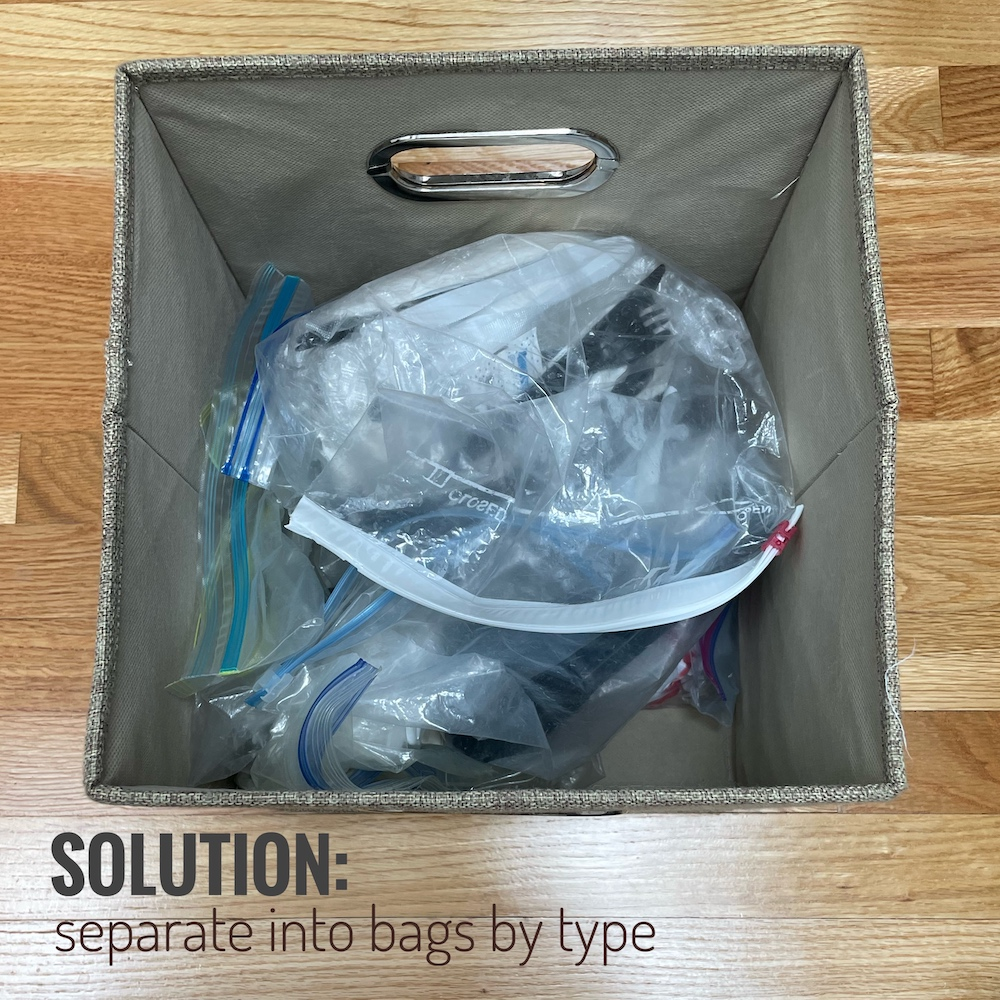

I was looking for an excuse to design a custom 3D print in [TinkerCad](https://www.tinkercad.com/) anyway, so what 
better project than to finally fix an irksome problem: organizing our disposible, takeout cutlery?!

**Argh excess plastic cutlery:** Despite specifically selecting *not* to receive disposable plates and utensils, restaurants stuff these things into our 
takeout bags anyway. After a while, we started to accumulate perfectly good paper/plastic dining products that I didn't 
want to just throw away. Better yet, I wanted to be able to use them when the occasion called for it.

**Space is a constraint:** We have a metal shelf between our kitchen and dining room with four lidded cloth bins (on unmovable shelves) that were *extremely difficult* to find in the right sizes: 
an [11"x11" cloth bin](https://www.amazon.com/gp/product/B07FNWZ4B7) and an [11"x15" cloth bin](https://www.amazon.com/gp/product/B07HNWKTD1). Non-negotiable: the bins are staying! The bottom-left cloth bin houses our 
disposable cutlery, since it's easy to clean up after a takeout meal (and easy to grab what's needed as needed later on):

{: .mx-auto.d-block :}

### Iteration 1

I tried to "organize" by separating items by type and keeping them in Ziploc bags. The result was *okay*, but 
we ended up pulling out each bag anyway because we couldn't really see what was inside from our aerial view. This slowed down clean up as well. 

{: .mx-auto.d-block :}

### Iteration 2

I couldn't find any custom dividers that would work with the size of this bin that didn't also block the handle cutouts, so 
I crafted my own dividers from an old diaper box and added labels. Unfortunately, we couldn't see the labels on the back side. I still couldn't take things out of their bags because of how they'd get mixed up under the divider.

This solution also *did not stand the test of time*. The cardboard got floppy, and the white duct tape started to crinkle and peel. 

{: .mx-auto.d-block :}

### Iteration 3: Let's 3D Print our solution!

Since no one seems to manufacture the perfect bin inserts, I decided to **design my own!** 

* First, I made a free account on [TinkerCad](https://www.tinkercad.com/). It turns out that my 8- and 11-year-old nieces already use this program in their middle school engineering classes! That gave me (and probably should give you) the confidence to try it out...
* I spent about 20 minutes working my way through their free tutorials. 
* In <1 hour, I designed two different types of bin inserts: one for the 4 boxes in the corners of the bins, and one for the middle 2 boxes (that wouldn't block the handle cutout).

{: .mx-auto.d-block :}

I exported my designs in .STL format and used the [Prusa slicer software app](https://www.prusa3d.com/en/page/prusaslicer_424/) to generate G-code files to print on our 3D printer.

{: .mx-auto.d-block :}

Here's a dorky picture of me utterly delighted with the progress of my bin prints: 

{: .mx-auto.d-block :}
*Photo credit to [Vicky Yao](https://www.cs.rice.edu/~vy/)*

**THE MOST SATISFYING SUCCESS!** *Check out the inside of this disposable cutlery bin now!* I printed out six box inserts total, which took ~15 hours each and less than [one reel of plastic filament](https://www.amazon.com/dp/B00J0GMMP6) in total. 

{: .mx-auto.d-block :}

I no longer needed Ziplock bags here because the inside of these bin inserts won't get dislocated and spill contents into each other, and the cutlery won't scratch or tear up the bottom of the cloth bin. 

I'm quite pleased with my engineered solution! 