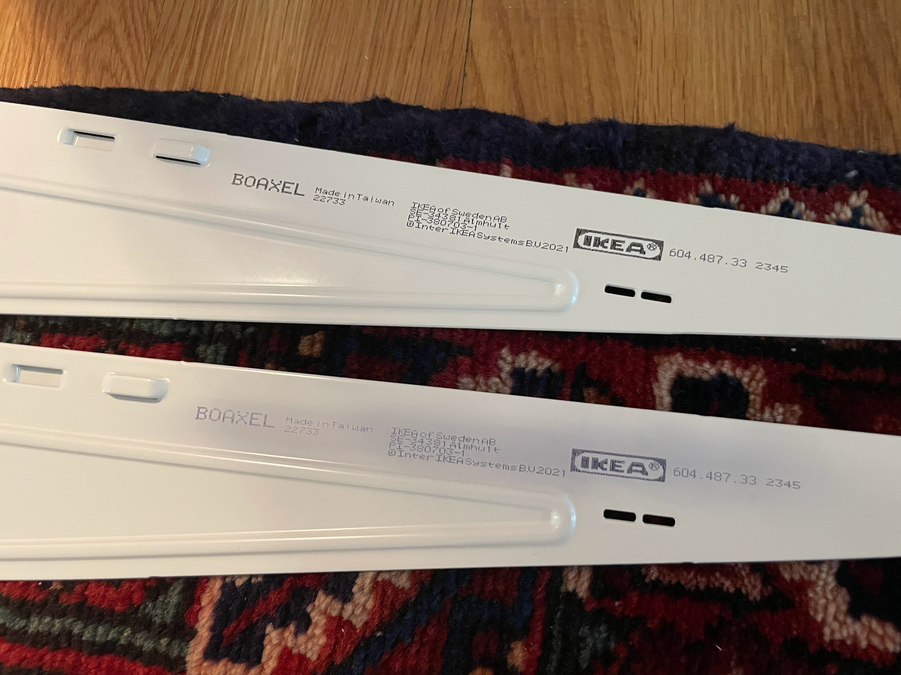

The phrase "tech debt" refers to the unavoidable cost of future maintenance or 
reworking of a (software) system where speed/hacks 
were prioritized over quality during development. 
Do we have a similar phrase for the time and energy expended when interacting with the catch-all "junk" spaces in our homes? 

Our laundry room doubles as a utility room where I stash my tools and spare parts, but it turns out I could never find
what I needed when I needed it! We all know by now that *I am not a fan of inefficiency*. 

## Constraints
* Water heater and water main filter cannot be blocked from access
* Two laundry baskets (that the kids can reach)
* Everything labeled! 
* I'll admit. I saw a targeted ad for the wallpaper 
  ["Gardens of Jaipur" from Marble Lotus](https://www.marble-lotus.com/collections/indian-wallpaper/products/gardens-of-jaipur) 
  and knew *I needed it.* [Surveillance capitalism](https://en.wikipedia.org/wiki/Surveillance_capitalism) at its finest! 

## Storage requirements
I've saved many spare/replacement/mystery parts for furniture and appliances over the years. 
Of course, I forgot about all of these things, which is effectively the same as not having them at all. My 
"save-everything-JUST-IN-CASE!" mentality (lingering from my graduate student days) are now over :roll_eyes:! *I cleared all of those bits and bobs out first* before figuring out what should stay: 
* **Wall repair:** Joint compound, spackle, plastic and metal putty knives, drywall sander block, primer, wall paint, rollers, brushes
* **Hardware:** Screws, nails, nuts and bolts, washers, drywall anchors, hooks, corner braces of all varieties
* **Tech:** Extension cords, power strips, cables, adapters, batteries
* **Tools!** Great opinions on Reddit for the [minimum stash of home tools](https://www.reddit.com/r/Tools/comments/13klh7x/what_are_some_home_essentialsmusthave_tools/).
* ...and yes, **replacement parts** that I actually use.

## Before-and-Afters! 

Let's start with some *extremely satisfying* before-and-afters before I share all the details!

{: .mx-auto.d-block :}

{: .mx-auto.d-block :}

# The Process

## Step 1: Wall covering.

I ended up ordering a [peel and stick version](https://www.giffywalls.com/jaipur-garden-wallpaper-c75) 
of the wallpaper I liked from [Giffy Walls](https://www.giffywalls.com/) for the exact dimensions of the wall. I found 
[Art3D peel and stick pink tile marble](https://www.amazon.com/dp/B0CTXZZRMS?ref=ppx_yo2ov_dt_b_product_details&th=1) for 
the other walls as well, which matched the wallpaper surprisingly well! *These were a beast to install*, especially around 
the water heater and filter. 

{: .mx-auto.d-block :}

Check out this *gnarly* hole in the wall! I cut four different pieces of foamboard to fit
around the exposed copper pipes, then spent seven days iteratively joint compounding and sanding to get the wall smooth.

{: .mx-auto.d-block :}

**Why the hole?** you ask. We put a [filter on our water main](https://www.masslive.com/news/2022/08/cambridges-drinking-water-has-high-levels-of-toxic-forever-chemicals-city-to-switch-to-alternative-water-source-officials-say.html) four years ago... and this drywall has been open since then. 
Finally checked this patch job off my to-do list! 

{: .mx-auto.d-block :}

## Step 2: Installing cabinetry.

I opted for two [Ikea 18" Sektion units](https://www.ikea.com/us/en/p/sektion-maximera-base-cabinet-6-fronts-6-low-drawers-white-vallstena-white-s59506432/) to get the number of heavy weight drawers I needed. 
Assembly and installation was pretty straightforward, but getting these to 
look built-in required skills and tools that I did not (yet) have.

{: .mx-auto.d-block :}

For instance! Check out this awesome cut I made on my new 
[tabletop jigsaw](https://www.amazon.com/dp/B071P6GZN5?ref=ppx_yo2ov_dt_b_product_details&th=1) to get 
edging to fit against the baseboard. I also used the baseboard from behind the cabinets (that I cut out) to craft 
a toekick for the front of the cabinets.

{: .mx-auto.d-block :}

I cut this side panel from [1/4" underlayment](https://www.homedepot.com/p/1-4-in-x-4-ft-x-4-ft-Underlayment-448821/202327790), 
secured it to the cabinets with [construction adhesive](https://www.homedepot.com/p/Loctite-Power-Grab-Heavy-Duty-Instant-Grab-9-oz-Latex-Construction-Adhesive-White-Cartridge-each-2032666/206432103) 
and [wood screws](https://www.homedepot.com/p/Everbilt-8-x-7-8-in-Zinc-Plated-Phillips-Flat-Head-Wood-Screw-12-Pack-829611/317479652), 
then applied [wood putty](https://www.homedepot.com/p/DAP-Plastic-Wood-X-with-DryDex-5-5-oz-All-Purpose-Wood-Filler-00540/206667344) and 
sanded the screw holes before 
[priming](https://www.benjaminmoore.com/en-us/interior-exterior-paints-stains/product-catalog/fspip/fresh-start-premium-interior-primers?product=046) and painting.
I plugged in [this power strip extension](https://www.amazon.com/dp/B0CSSFS5GG) before installing the cabinets, then taped and screwed it the side panel 
and [covered the cord](https://www.amazon.com/gp/product/B07GPFDL1K/ref=ppx_yo_dt_b_search_asin_title).

{: .mx-auto.d-block :}

One of my favorite parts of the laundry room are these [brass label drawer pulls](https://www.signaturehardware.com/rectangular-brass-drawer-pull-with-label-holder---polished-brass/365215.html).
They clattered like door knockers when I tried to use them, so I found some [1/8" screw thread protectors](https://www.amazon.com/DMiotech-Thread-Protectors-Rubber-Furniture/dp/B0B59MBP39) 
at the hardware store to put around the pull connections. I bolt cut all four provided screws per handle so that they wouldn't puncture through the drawer front. 

Finally, I had to cut my own transparencies, labels, and cardboard backings to size for padding. 
All worth it, since there was no other product that so perfectly fit what I was looking for! 

{: .mx-auto.d-block :}

## Step 3: Installing shelves.

I've used the [Ikea Boaxel system](https://www.ikea.com/us/en/cat/boaxel-system-47394/) in
[my entryway pantry](../2021-04-01-entry-closet/), and I chose to use it again because 
(1) it's cheap, (2) it fit, (3) it's easy to install, 
(4) it doesn't limit box depth like closed cabinets might, and 
(5) shelves pop off if the water heater ever needs servicing or replacement.

I [primed](https://www.amazon.com/Rust-Oleum-249090-Painters-Purpose-12-Ounce/dp/B002BWOS08) and painted the wall 
rails (in a custom colormatched pink) and had to use acetone nail polish remover
to scrub the matrix dot print from the brackets. 

{: .mx-auto.d-block :}

## Step 4: Organization and design! 

They say it gets worse before it gets better, and yep...

{: .mx-auto.d-block :}

**More to come!** I'll show you my organized drawers and shelves and a cost breakdown of the project when I'm less sleep-deprived. Thanks for your patience! 