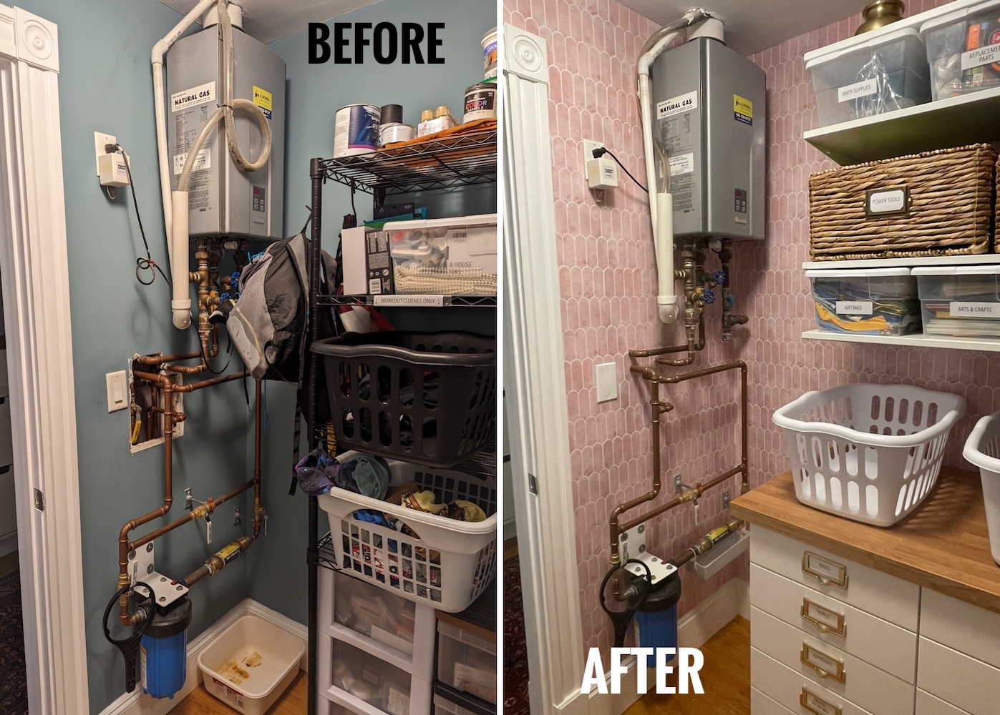
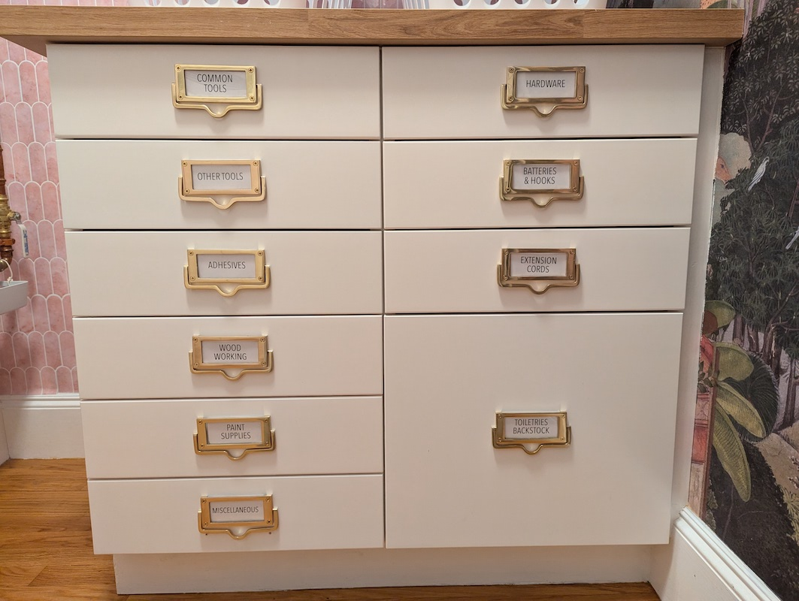

The phrase "technical debt" refers to the unavoidable cost of future maintenance or 
reworking of a (software) system where speed/hacks 
were prioritized over quality during development. :money_with_wings: :money_with_wings: 
*I had **lots of debt owed** to my catch-all "utility" (read: junk) corner of the laundry room, 
where I stashed tools and spare parts but could never actually find what I needed.* :woozy_face: :rage:

I had redesigned the space for functionality in my head, but it wasn't until I saw (a targeted ad for) the wallpaper ["Gardens of Jaipur" from Marble Lotus](https://www.marble-lotus.com/collections/indian-wallpaper/products/gardens-of-jaipur) 
that I decided to finally start the project. [Surveillance capitalism](https://en.wikipedia.org/wiki/Surveillance_capitalism) at its finest! 

## Constraints
* Small things (e.g., tools, screws) are visible, organized, and accessible.
* Water heater and water main filter are fully accessible if needed.
* Everyone in the family can find what they need *without asking me.*

## Before-and-Afters! 

I'll get you amped up with some *extremely satisfying* before-and-afters before I share all the details! :heart_eyes:

{: .mx-auto.d-block :}

{: .mx-auto.d-block :}

# The Process

Feel free to skip ahead to any of the following steps of this project: 

* [Step 1: Wallpapering, drywall patching](#step-1-wall-covering)
* [Step 2: Cabinetry construction](#step-2-installing-cabinetry)
* [Step 3: Flexible open shelving](#step-3-installing-shelves)
* [Step 4: Organization!](#step-4-organization)

## Step 1: Wall covering.

I ordered a [peel and stick version](https://www.giffywalls.com/jaipur-garden-wallpaper-c75) 
of the wallpaper I liked from [Giffy Walls](https://www.giffywalls.com/) for the exact dimensions of my wall. 

{: .mx-auto.d-block :}
*Here I am installing wallpaper at 11 P.M. the night it arrived because I have no chill.*

I found 
[Art3D peel and stick pink tile marble](https://www.thespruce.com/best-peel-and-stick-tiles-4776407) for 
the other walls as well, which matched the wallpaper surprisingly well! *The tiles were a beast to install around 
the water heater and filter.*

{: .mx-auto.d-block :}

Check out this *gnarly* hole in the wall! I cut four pieces of foamboard to fit
around the exposed copper pipes, then spent seven days iteratively joint compounding and sanding to get the wall smooth. 
[Plumbers' cloth](https://www.amazon.com/ChampNet-Plumbers-Aluminum-Sandpaper-Projects/dp/B0BPJQMRKM) for cleaning these pipes is a genius product.

{: .mx-auto.d-block :}

**Why the hole?** We put a 
[filter on our water main](https://www.masslive.com/news/2022/08/cambridges-drinking-water-has-high-levels-of-toxic-forever-chemicals-city-to-switch-to-alternative-water-source-officials-say.html) 
four years ago... and this drywall has been open since then. :flushed:
Feels great to have finally checked this patch job off my to-do list! :heavy_check_mark:

{: .mx-auto.d-block :}

## Step 2: Installing cabinetry.

I opted for two [Ikea 18" Sektion units](https://www.ikea.com/us/en/p/sektion-maximera-base-cabinet-6-fronts-6-low-drawers-white-vallstena-white-s59506432/) (and [faux butcherblock countertop](https://www.ikea.com/us/en/p/saeljan-countertop-oak-effect-laminate-80439214/)) 
to get the number of heavy duty drawers and [laundry bin](https://www.acehardware.com/departments/home-and-decor/laundry-care/laundry-bags-and-hampers/68601) space I needed. 
Assembly and installation (including constructing a custom base from 2x4"s) was straightforward, 
but making it all look built-in required skills and tools that I did not (yet) have. :carpentry_saw: :hammer_and_wrench: :woman_mechanic: :woman_artist:

{: .mx-auto.d-block :}

**Intricate cuts.** For instance! Check out this awesome cut I made with my new 
[contour gauge](https://www.amazon.com/General-Tools-Contour-Duplicator-6-Inch/dp/B00004T7RA) and new 
[tabletop jigsaw](https://www.amazon.com/dp/B071P6GZN5?ref=ppx_yo2ov_dt_b_product_details&th=1) to get 
edging to fit against the baseboard. I also used the baseboard from behind the cabinets (that I cut out with my new [multitool](https://www.amazon.com/gp/product/B07VBB55X5/ref=ppx_yo_dt_b_search_asin_title?th=1)) to craft 
a toekick for the front of the cabinets.

{: .mx-auto.d-block :}

I cut this side panel from [1/4" underlayment](https://www.homedepot.com/p/1-4-in-x-4-ft-x-4-ft-Underlayment-448821/202327790), 
secured it to the cabinets with [construction adhesive](https://www.homedepot.com/p/Loctite-Power-Grab-Heavy-Duty-Instant-Grab-9-oz-Latex-Construction-Adhesive-White-Cartridge-each-2032666/206432103) 
and [wood screws](https://www.homedepot.com/p/Everbilt-8-x-7-8-in-Zinc-Plated-Phillips-Flat-Head-Wood-Screw-12-Pack-829611/317479652), 
then applied [wood putty](https://www.homedepot.com/p/DAP-Plastic-Wood-X-with-DryDex-5-5-oz-All-Purpose-Wood-Filler-00540/206667344) and 
sanded (with my new [orbital sander](https://www.amazon.com/Ryobi-S652DGK-Squared-Orbital-Finishing/dp/B00OQOE73C)!) the screw holes before 
[priming](https://www.benjaminmoore.com/en-us/interior-exterior-paints-stains/product-catalog/fspip/fresh-start-premium-interior-primers?product=046) and painting.
I plugged in [this power strip extension](https://www.amazon.com/dp/B0CSSFS5GG) before installing the cabinets, then taped it onto and screwed it into the side panel 
and [covered the cord](https://www.amazon.com/gp/product/B07GPFDL1K/ref=ppx_yo_dt_b_search_asin_title).

{: .mx-auto.d-block :}

**Label holder drawer pulls.** Some of my favorite items in this space are these 
[brass label drawer pulls](https://www.signaturehardware.com/rectangular-brass-drawer-pull-with-label-holder---polished-brass/365215.html), 
despite the tweaking they required to work: 

* They clattered like door knockers :bell:, so I found some [1/8" screw thread protectors](https://www.amazon.com/DMiotech-Thread-Protectors-Rubber-Furniture/dp/B0B59MBP39) 
at the hardware store to put around the pull connections to soften/slow the pull.
* All four screws per handle needed to be shortened with a bolt cutter so that they wouldn't puncture through the drawer front. 
* I cut my own transparencies, labels, and cardboard padding to size for the labels.

All worth it, since there was no other product that so perfectly fit what I was looking for! :heart_eyes:

{: .mx-auto.d-block :}

## Step 3: Installing shelves.

I chose the [Ikea Boaxel system](https://www.ikea.com/us/en/cat/boaxel-system-47394/) (which I also used in 
[my entryway pantry](../2021-04-01-entry-closet/)) because it doesn't limit bin depth the way closed cabinets might,
and because it's easy to pop the shelves off to make space for servicing or replacing the water heater. 
I [primed](https://www.amazon.com/Rust-Oleum-249090-Painters-Purpose-12-Ounce/dp/B002BWOS08) and painted the wall 
rails to match the backsplash and scrubbed the brackets with acetone 
to [remove the printed product info](https://www.reddit.com/r/IKEA/comments/qehj0d/printing_on_boaxel_brackets/).

Here are the finished shelves, which happened to fit three of [these 16 qt. Sterilite bins](https://www.amazon.com/Sterilite-16448012-Quart-Storage-12-Pack/dp/B002BDTEU6) 
across perfectly.
I labeled the baskets by attaching [label frames](https://www.amazon.com/dp/B07P2NG8QZ) with [brass fasteners](https://www.amazon.com/dp/B08MPRHKP6).

{: .mx-auto.d-block :}
*The three brass pots on the top shelf belonged to my maternal grandmother (left), maternal grandfather's mother (middle) and maternal grandmother's mother (right) 
and used to be used to collect water from the village well ! :potable_water:*

## Step 4: Organization!

I've saved many spare/replacement/mystery parts for furniture and appliances over the years *just in case*. 
But then I forgot about all of these things, which is effectively the same as 
not having it... :roll_eyes:! *My first step was being realistic and clearing out all the mystery odds and ends.*

They say it gets worse before it gets better, and yep...

{: .mx-auto.d-block :}

I laid everything out to edit and organize. Here are some things that stayed, including an updated [minimum stash of home tools](https://www.reddit.com/r/Tools/comments/13klh7x/what_are_some_home_essentialsmusthave_tools/):

{: .mx-auto.d-block :}

{: .mx-auto.d-block :}

## Cost breakdown

| Materials | Cost (+ tax/shipping) | 
| --- | ---: | 
| Ikea Sektion [base cabinets](https://www.ikea.com/us/en/p/sektion-maximera-base-cabinet-6-fronts-6-low-drawers-white-vallstena-white-s59506432/), [drawers](https://www.ikea.com/us/en/p/sektion-base-cabinet-with-4-drawers-white-maximera-veddinge-white-s89034313/), [legs](https://www.ikea.com/us/en/p/sektion-leg-10265518/), [wall rail](https://www.ikea.com/us/en/p/sektion-suspension-rail-galvanized-60261527/), [countertop](https://www.ikea.com/us/en/p/saeljan-countertop-oak-effect-laminate-80439214/); Boaxel [suspension rail](https://www.ikea.com/us/en/p/boaxel-suspension-rail-white-60474270/), 3 [wall rails](https://www.ikea.com/us/en/p/boaxel-wall-upright-white-00448731/), 12 [brackets](https://www.ikea.com/us/en/p/boaxel-bracket-white-60448733/), 4 [long shelves](https://www.ikea.com/us/en/p/boaxel-shelf-white-90448736/), 4 [short shelves](https://www.ikea.com/us/en/p/boaxel-adjustable-shelf-white-30463744/) | 884.82 | 
| [Art3D peel-and-stick wall tile](https://www.amazon.com/dp/B0CTXZPHGD) (9 boxes) | 315.47 | 
| [Gardens of Jaipur peel-and-stick wall mural](https://www.giffywalls.com/jaipur-garden-wallpaper-c75) | 232.82 | 
| 10 [brass label drawer pulls](https://www.signaturehardware.com/rectangular-brass-drawer-pull-with-label-holder---polished-brass/365215.html) | 201.88 | 
| [multitool](https://www.amazon.com/dp/B07VBB55X5?ref=ppx_yo2ov_dt_b_product_details&th=1) | 95.71 | 
| Benjamin Moore [Fresh Start primer](https://store.benjaminmoore.com/storefront/us/en/coating/interior-exterior-primers/benjamin-moore/fresh-start-high-hiding-all-purpose-primer/fresh-start/p/0046?size=SIZE-004), 2 quarts of color-matched [semi-gloss paint](https://store.benjaminmoore.com/storefront/us/en/coating/interior-exterior-primers/benjamin-moore/fresh-start-high-hiding-all-purpose-primer/fresh-start/p/0046?size=SIZE-004), foam roller | 93.60 | 
| [tabletop jigsaw](https://www.amazon.com/dp/B071P6GZN5?ref=ppx_yo2ov_dt_b_product_details&th=1) | 56.56 | 
| [acrylic drawer organizer set](https://www.amazon.com/dp/B0CL28Y8Y6) | 40.36 | 
| shelf baskets and plastic mini bins from TJ Maxx | 40.34 | 
| [4'x4' underlayment](https://www.homedepot.com/p/1-4-in-x-4-ft-x-4-ft-Underlayment-448821/202327790), [2x4" fir stud](https://www.homedepot.com/p/2-in-x-4-in-x-96-in-Premium-Burrill-Fir-Stud-1000020053/206262176), [construction adhesive](https://www.homedepot.com/p/Loctite-Power-Grab-Heavy-Duty-Instant-Grab-9-oz-Latex-Construction-Adhesive-White-Cartridge-each-2032666/206432103) | 34.39 | 
| [bamboo drawer dividers](https://www.amazon.com/dp/B08B397DMF) | 33.99 | 
| [flat plug extension cord](https://www.amazon.com/dp/B0CSSFS5GG) | 18.16 | 
| [label holders](https://www.amazon.com/dp/B07P2NG8QZ) and [brass fasteners](https://www.amazon.com/dp/B08MPRHKP6) | 18.04 | 
| [contour gauge](https://www.amazon.com/General-Tools-Contour-Duplicator-6-Inch/dp/B00004T7RA) | 12.74 | 
| 2 [white laundry baskets](https://www.acehardware.com/departments/home-and-decor/laundry-care/laundry-bags-and-hampers/68601) | 12.73 | 
| [cable tie straps](https://www.amazon.com/dp/B001E1Y5O6) | 9.38 | 
| [wood filler](https://www.homedepot.com/p/DAP-Plastic-Wood-X-with-DryDex-5-5-oz-All-Purpose-Wood-Filler-00540/206667344) | 5.30 | 
| 20 [1/8" screw thread protectors](https://www.amazon.com/DMiotech-Thread-Protectors-Rubber-Furniture/dp/B0B59MBP39) | 3.19 | 
| [orbital sander](https://www.amazon.com/Ryobi-S652DGK-Squared-Orbital-Finishing/dp/B00OQOE73C) (gifted!) | 0 | 
| circular saw (borrowed) | 0 | 
| **TOTAL** | **$2109.48** |

Up next will be the laundry half of the laundry room... stay tuned! 