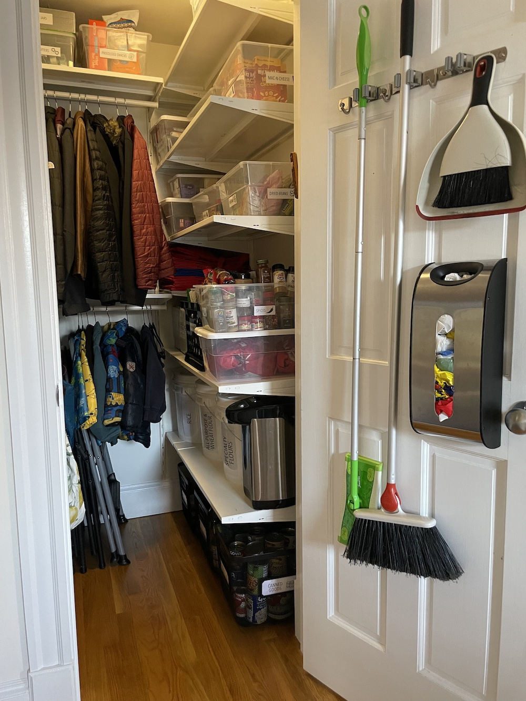
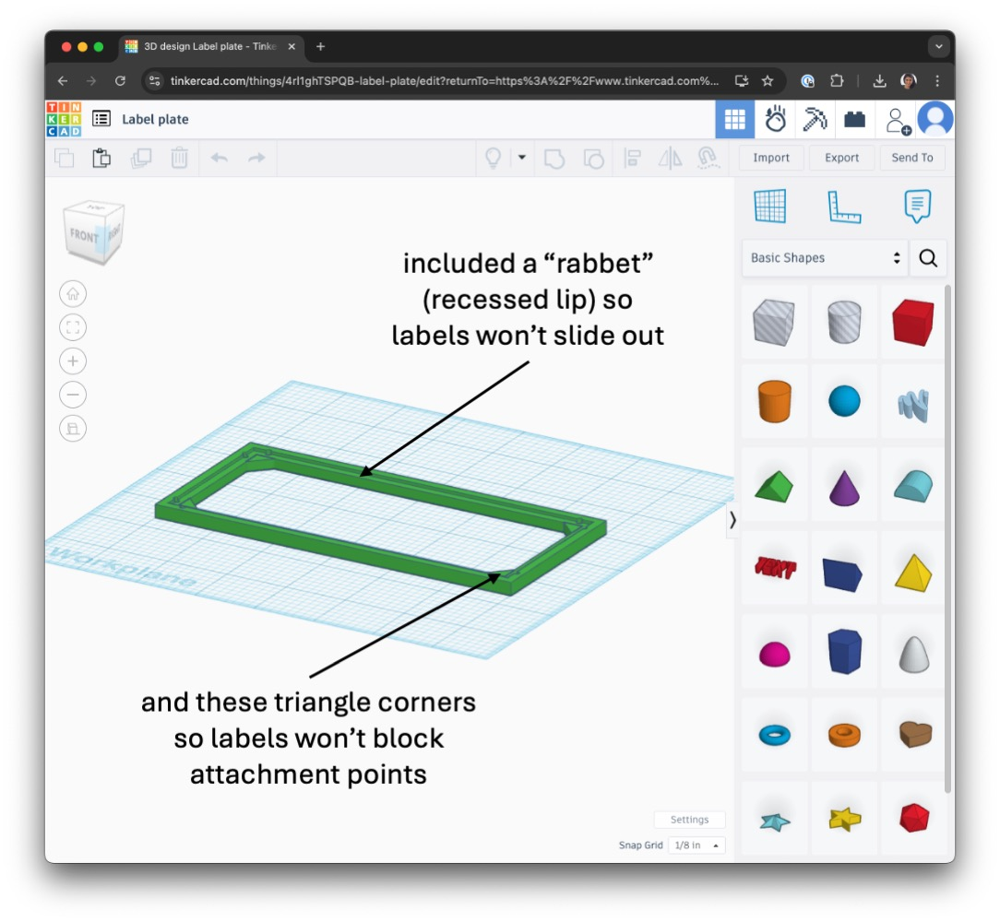
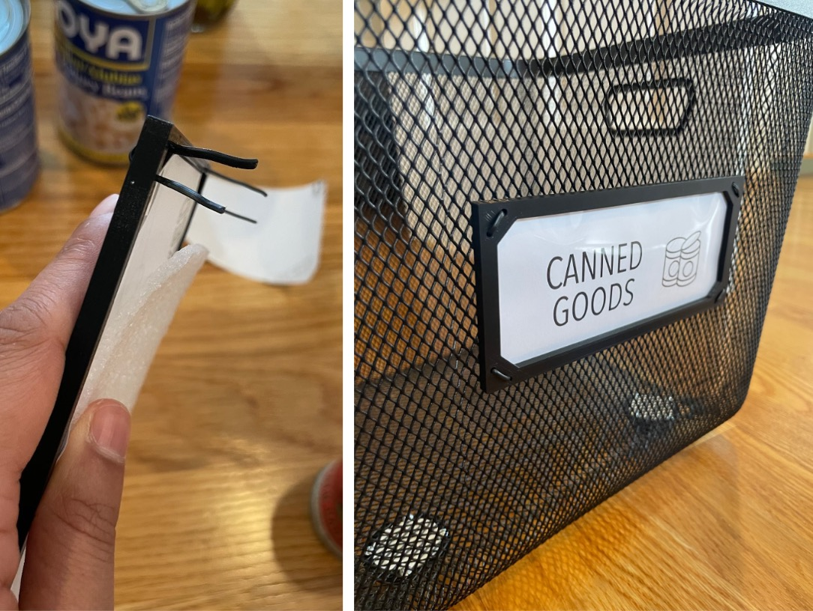
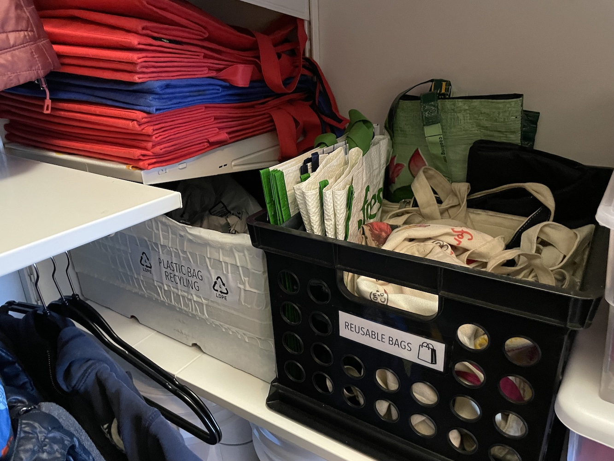

Our (third floor walkup) condo has no entryway, no pantry, and a single hallway closet. This tiny 3'8"x3'3" closet is the 
*most utilized* square footage in our home and has an enormous number of functions to fulfill. 

Here's the before. This setup was  failing our family and desperately needed some intentional planning to improve.

{: .mx-auto.d-block :}

These were the requirements (at the time, and for planning ahead): 

### Kids independently get and put away
* stepstool :ladder:
* their own backpacks :school_satchel:
* their own coats/hats/mittens :coat: :gloves: :scarf:
* some food while helping in the kitchen :canned_food: :salt:

### Adults' (easy/fast) access requirements
* get and put back
  * coats/hats/mittens :coat: :gloves: :scarf:
  * cloth/plastic bags :shopping:
  * ingredients while cooking :rice: :peanuts:
  * broom and dustpan for quick cleanup (IYKYK) :broom:
  * extra folding chairs for (sometimes spontaneous) guests :chair:
* know what food we have and what we are running low on
* stash plastic packaging for eventual recycling :recycle:

### Additional storage requirements
* backstock and overflow (bulk) food
* oversized appliances and seldom-used cookware :electric_plug:
* extra paper towels, sponges, trash bags :roll_of_paper: :sponge:

*That's a long list!* Space planning and optimization takes real effort, but the payoff is totally worth it for 
improving the efficiency of everyday life. 

Here's how our closet looks now! :heart_eyes:

{: .mx-auto.d-block :}

# The Details

**Jump ahead** to see how we organized [the door](#the-door), 
the [left and back (non-shelf) walls](#the-non-shelf-side), 
the [floor and bottom shelves](#bottom-shelves), [middle shelves](#middle-shelves) and [upper shelves](#upper-shelves).

### The Door

I hung the [broom](https://www.amazon.com/OXO-Good-Grips-Angle-Broom/dp/B00940DUFY), 
[dustpan](https://www.amazon.com/OXO-Grips-Dustpan-Brush-White/dp/B00004OCL4/), and 
[Swiffer](https://www.amazon.com/MOP-Dry-Wet-Starter-KIT/dp/B0CG4S4ZGQ/) :broom: (used primarily to fish toy cars out from under couches) and a 
[plastic bag dispenser](https://www.amazon.com/gp/product/B007ZF638G/) :shopping: directly on the [back of the closet door](https://www.amazon.com/Reliahom-Organization-Storage-Kitchen-Organizer/dp/B095RQ1F3T). :door:

{: .mx-auto.d-block :}

### The Non-Shelf Sides

**Fold-back hooks** are excellent space-savers and don't clobber your back when you're 
facing the other way. The bottom [row of hooks](https://www.amazon.com/gp/product/B08TLX2Y75/) is low enough for the kids to access
and hang up their hats and bags. :gloves: :scarf: :school_satchel:

{: .mx-auto.d-block :}

**Coat rods** that [connect directly to shelves](https://www.ikea.com/us/en/p/boaxel-clothes-rail-white-90448741/) 
(rather than spanning wall to wall) were
*exactly* what we needed. I find that matching, [space-saving hangers](https://www.amazon.com/gp/product/B0746SHPJ2/) make an otherwise cluttered
space feel more streamlined. :coat: *Tip: Buy NON-velvet-lined hangers to save yourself a lot of frustration...*

**[Stepstool](https://www.containerstore.com/s/garage-and-shelving/stepstools-and-ladders/premium-folding-step-stool/12d?productId=10031897) and folding chairs** are tucked away and yet still 
super accessible for toddlers (and grown-ups)! 
:ladder: :chair:

### Bottom Shelves

**Bulk food storage** was essential during the pandemic when the grocery options were buy (1) a restaurant-supply quantity or (2) nothing. 
These days, we're using these [large food-safe bins](https://www.amazon.com/gp/product/B01BLKPDHM/) with [gamma-seal lids](https://www.amazon.com/gp/product/B005CJVME2) (see below) for storing all sorts 
of dry goods, and they're great! 
I cut some [transparencies](https://www.amazon.com/dp/B091BVB3GF) to make pockets (and cover the ugly "don't fall in" warning labels), then slid labels in.

{: .mx-auto.d-block :}

**Heavy food categories** (canned goods :canned_food:, oils and vinegars :champagne: :sake:, 
condiments :baby_bottle: :honey_pot:) are safer on the ground than on high shelves. :weight_lifting:
The floor bins needed to (1) fit under the bottom [shelf brackets](https://www.ikea.com/us/en/p/boaxel-bracket-white-60448733/), 
(2) clean easily in case of spills :soap: :sponge:, 
(3) allow visibility of contents :window:, and 
(4) slide out without scratching the floor :skateboard:.

I attached four [1" appliance wheels](https://www.amazon.com/dp/B0C69FPVPB?th=1) to the bottom of each of these 
[13" metal mesh bins](https://www.target.com/p/large-metal-mesh-bin-black-brightroom-8482/-/A-86383818) 
using [#6 3/4" machine screws and hex nuts](https://www.homedepot.com/p/Everbilt-6-32-x-3-4-in-Stainless-Steel-Phillips-Flat-Head-Machine-Screw-6-Pack-833681/320773347). 

{: .mx-auto.d-block :}

If you didn't already know, *labeling wire mesh bins is not easy!*
Adhesives stick poorly to this patterned material, and clip-on labels are limited. 
I designed my own [label frames on TinkerCad](https://www.tinkercad.com/things/4rl1ghTSPQB-label-frame?sharecode=cwNn2gDKjLwdvM10SBTowvJ3qeFwapp3-Hj2iHge15o)! 

{: .mx-auto.d-block :}

I 3D-printed the frames with [black filament](https://www.amazon.com/HATCHBOX-3D-Filament-Dimensional-Accuracy/dp/B00J0ECR5I) to match the bins. 
I cut labels and [transparent covers](https://www.amazon.com/gp/product/B091BVB3GF) to fit into the frames, then 
attached the frames at each corner with black cable twist ties 
(saved in a drawer in my [newly organized utility room](../2024-06-26-laundry)). 

{: .mx-auto.d-block :}

These bins are holding up super well and make grabbing ingredients and putting away groceries much easier! :man_cook:

{: .mx-auto.d-block :}

### Middle Shelves

This is *prime pantry real estate* and is reserved exclusively for "high touch"
items that we access all the time.

**Reusable grocery bags.** It's easier to stuff 'em in a bin or on the shelf than actually hang 'em up. 
It became *easiest* when we pared down our bag collection. :shopping:

**Plastic bag recycling.** Optimizing our ability to grab reusable bags as needed simultaneously created 
this relatively inaccessible corner of shelving. I squeezed a perfectly-sized box in there for 
plastic bag recycling! 
Seems to be working GREAT so far to stash (plastic #4) packaging promptly 
(before [properly disposing of it](https://www.cambridgema.gov/Departments/publicworks/getridofitright#!rc-cpage=463661)) without getting in anyone's way! Win, win. :recycle:

{: .mx-auto.d-block :}

**Clear plastic bins** are the most 
effective solution for being able to immediately see what we have 
(and what we're low on). :mag: They're not made from the most 
environmentally-friendly material, *but* clear bins have near-infinite reuse potential 
(so I'll never throw them in the garbage), and they completely eliminate 
forgotten (and eventually wasted) food. :balance_scale:

{: .mx-auto.d-block :}

*Don't you love my labels with the little icons?!* :heart_eyes: The idea came to me when [organizing my (pre-reading) 2-year-old's toys](../2022-12-30-toys), 
but these seem to be easier for me (and random guests) to read, too!

### Upper Shelves

We stash extra paper towels, trash & compost bags, and sponges on this top shelf, since 
these items are *light* and are only ever *removed* (never returned). :roll_of_paper: :sponge:
We can glance up to 
see what we have, and use the stepstool ([it's right there!](#the-non-shelf-sides)) to grab what we need.

{: .mx-auto.d-block :}

## Process and Cost

I explored *so many* organizer options before finally settling on the [Ikea Boaxel system](https://www.ikea.com/us/en/cat/boaxel-system-47394/), which seemed to maximize 
our specific space and included an option for a [coat rod](https://www.ikea.com/us/en/p/boaxel-clothes-rail-white-90448741/) that did *not* span wall to wall. 
I prefer shelves attached directly to the wall, since standing units with front vertical supports block your view, access, and flexibility. 
**The total cost for the entire shelving system was only $167** (plus $10.44 in tax and a drive to Stoughton for late-night pickup). My mom watched our kids for one weekend day, and
it was surprisingly easy to take down the existing shelf/rod and get this new system installed in a few hours.

In truth, organization of this closet is in constant flux with the changing needs of
our family. The [labeled bins](#plastic_bins), [wall-mounted hooks](#hooks), and 
[slide-out floor bins](#floor_bins) 
were all introduced over time as our need for them arose. 
I'm sure optimizing this space isn't finished, yet!