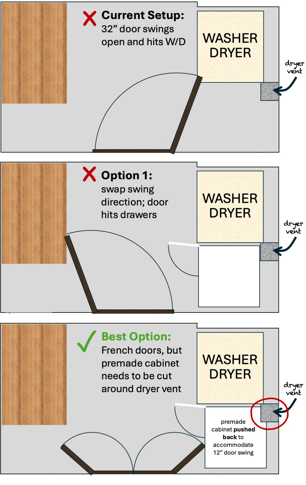
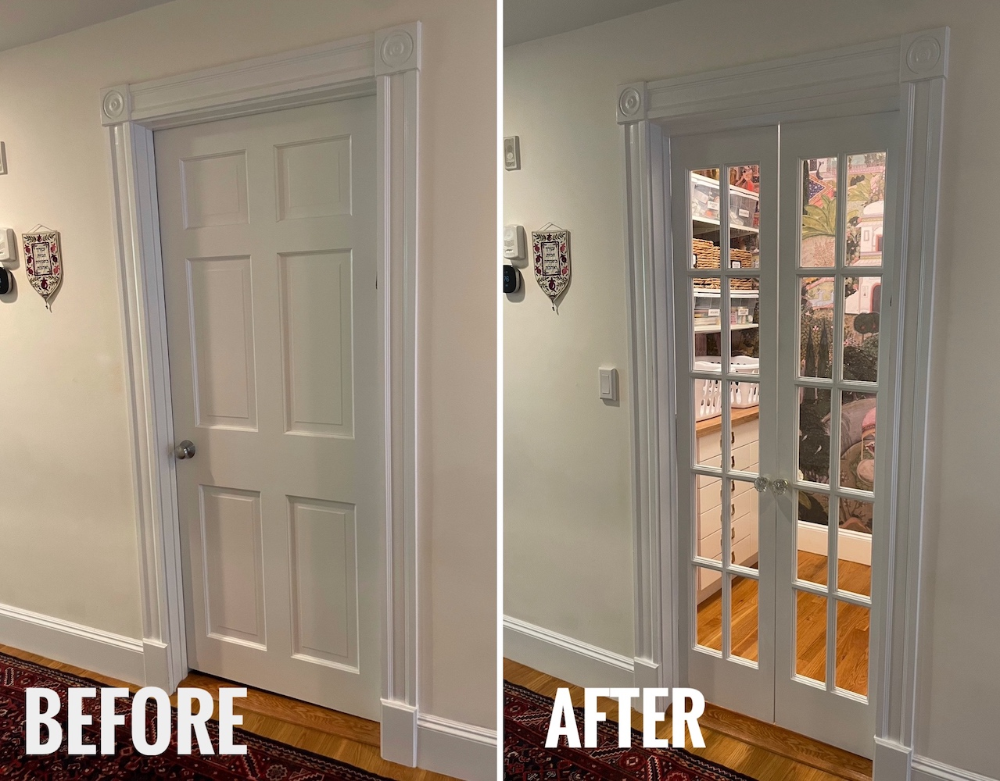
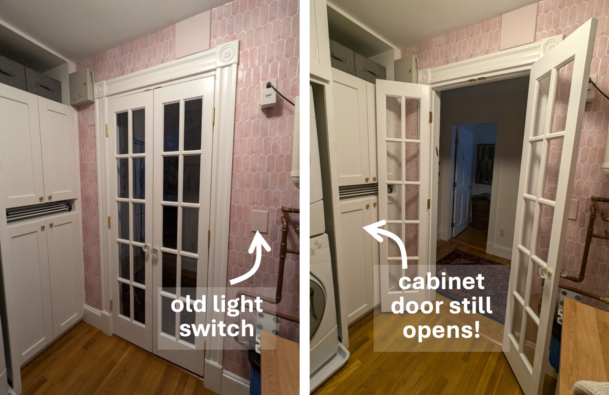
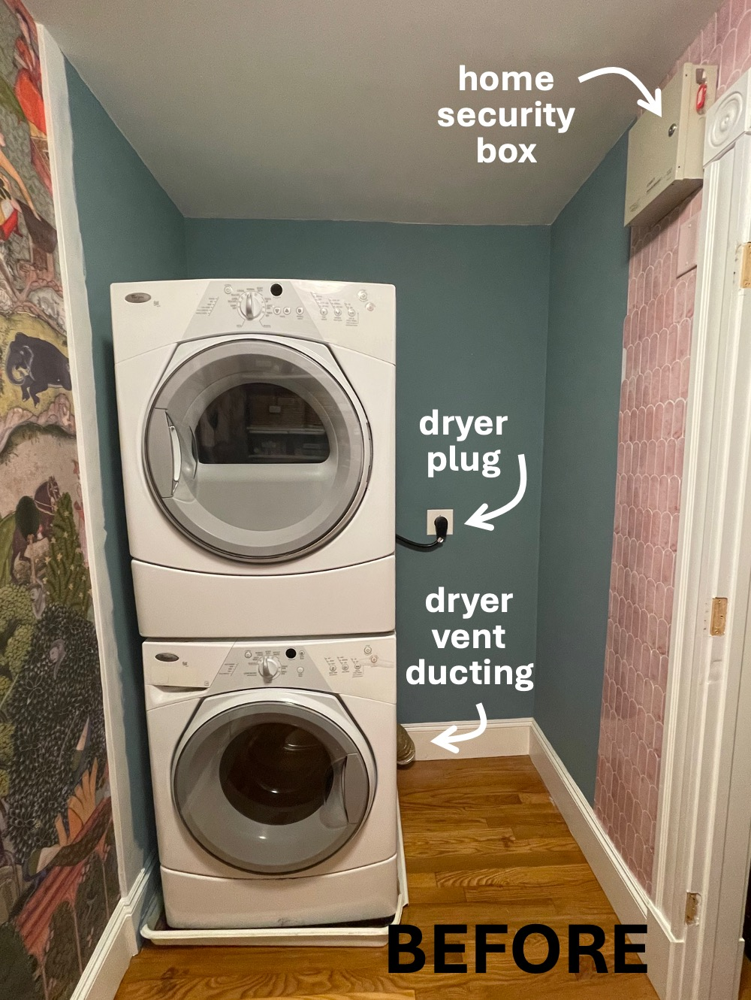
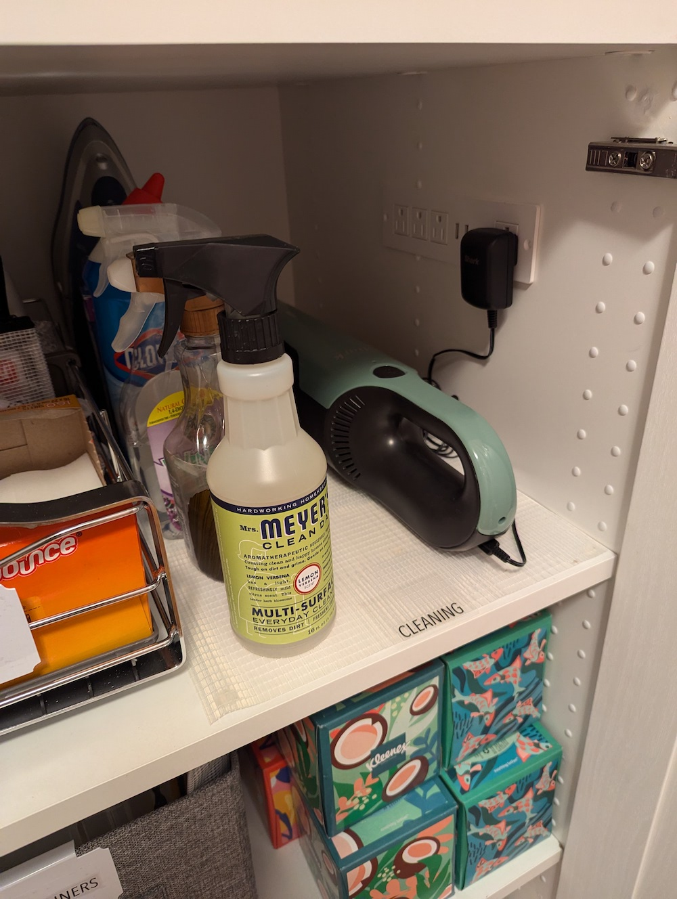

In engineering (and design), geometric constraints refer to limitations on a single entity (size, location) 
and dependencies on pairs of entities (distance, arc angle). Our laundry room is a *tight space* had an 
obscene set of geometric constraints to meet!

{: .mx-auto.d-block :}

* **Door frame** is only 32" wide and cannot be moved
* **Premade cabinet** is 24" wide, 24" deep and 90" tall (in a 93" tall room with a slanted floor), and requires 1.75" of rightside clearance for recessed plug point
* **Dryer vent ducting** requires 6" of clearance and overlaps with cabinet
* **Stacked washer/dryer** requires 3" clearance on both sides and above

## The Constraints

* [Step 1: French Doors](#step-1-french-doors)
* [Step 2: Premade Cabinet](#step-2-premade-cabinet)
* [Step 3: Custom Cabinetry Built-Ins](#step-3-custom-cabinetry-built-ins)

### Step 1: French doors

{: .mx-auto.d-block :}

Our door frame is 32x80", but the narrowest manufactured French doors are 48x80". 
I found [bifold window doors](https://www.amazon.com/gp/product/B07TYVGGL4) in the right size and
decided to install them to swing open instead using regular [3.5" hinges](https://www.amazon.com/gp/product/B071VY5BQH/) and [ball catch mechanisms](https://www.amazon.com/gp/product/B009E1X39Q/). 
The four main challenges: 

| Challenge | Solution | 
| --- | --- | 
| Door is unfinished. | Pine was sanded, primed, sanded, and painted twice! | 
| Bifold mechanism shortened door by 1.5". | Added material to the top of the door frame to fill the gap. | 
| Standard knob bore holes (2 1/8") don't fit. | Installed [antique mortise-style door knobs](https://www.amazon.com/gp/product/B0B74STSV9) instead. |
| Interior light switch is now blocked. | Rerouted the switch to the hallway using a [wireless receiver kit](https://www.amazon.com/gp/product/B09YHBHP8T/). | 

{: .mx-auto.d-block :}

### Step 2: Premade cabinet

I wanted to use a [premade 24x24x90" Ikea Sektion cabinet](https://www.ikea.com/us/en/p/sektion-high-cabinet-frame-white-70265445/) 
because of the fantastic options for drawers, shelves, and cabinet doors. This was *tight* though, because the unit needed space for a 
[recessed outet extension](https://www.amazon.com/gp/product/B0BL6LYZ6L/) and to accommodate 6x6" of dryer vent ducting
behind it and a 9x9x3" home security box in front.

{: .mx-auto.d-block :}

I wanted the option of leaving the doors fully open to walk in and out with a laundry basket. 
Luckily, Ikea Sektion makes 12" wide cabinet doors in 30" and 40" heights, 
which meant the left half of the cabinet could be accessible with the French doors open! I 
even found a [slim 9" cabinet organizer from Simple Human](https://www.simplehuman.com/products/pull-out-cabinet-organizer-9-inch)
to store all laundry supplies. 

{: .mx-auto.d-block :}

Leaving 2.5" to the right of the cabinet to accommodate a recessed outlet was *absolutely worth it* since our handheld
vacuum finally has a home! I filled the predrilled [shelf peg holes with plastic plugs](https://www.amazon.com/dp/B0BBB2LX37) because it looks cleaner but also allows me to switch up shelf heights later if I need!

{: .mx-auto.d-block :}

### Step 3: Custom cabinetry built-ins

I ended up hiring the only carpenter who responded (of the eight folks I contacted) to build and install a cabinet above 
the stacked washer/dryer. Unfortunately, his team failed to follow my instructions, and built cabinets around the 
washer and dryer instead of moving them out (as they promised to do). 

## Cost breakdown

| Materials | Cost (+ tax/shipping) | 
| --- | ---: | 
| Ikea Sektion tall base cabinet, 2 30" doors, 2 40" doors, 3 shelf packs, 2 hinge pairs | 0 |
| 3 packs [3/16" plastic hole plus](https://www.amazon.com/dp/B0BBB2LX37) | 22.28 | 
| 2 sheets 0.5" BCX plywood | 0 | 
| 6 flowery brass knobs | 0 
| SimpleHuman 9" pull-out cabinet organizer | 0 | 
| two new drain pans | 0 | 
| hole saw attachment for power drill | 0 | 
| recessed outlet extender | 0 | 
| [20" deep cloth bins (5-pack)](https://www.amazon.com/dp/B087MVST5P) | 46.74 | 
| [bin label clips](https://www.amazon.com/dp/B09WJ1M7V8) | 8.49 | 
| 2 compact accordion-style dry racks | 0 | 
| bifold French doors | 0 | 
| 6 brass hinges | 0 | 
| ball catch mechanism (x2) | 0 | 
| mortise-style door knobs | 0 | 
| wireless light switch receiver | 0 | 
| dryer vent repair technician visit | 274.00 | 
| [0.5" overlay cabinet hinges](https://www.homedepot.com/p/Everbilt-35-mm-105-1-2-in-Overlay-Soft-Close-Cabinet-Hinge-1-Pair-2-Pieces-H47228E-NP-CP/323200377) (2 pairs) | 27.48 | 
| 1 quart Chantilly Lace [semi-gloss paint](https://www.benjaminmoore.com/en-us/product/aura-interior-paint-semi-gloss-1-quart/N528?size=SIZE-004) | 46.74 | 
| custom carpentry labor | 0 |
| **TOTAL** | **$0** |

Check out how I finished the [utility half of the laundry room](../2024-06-26-laundry/), too! The room is now complete!