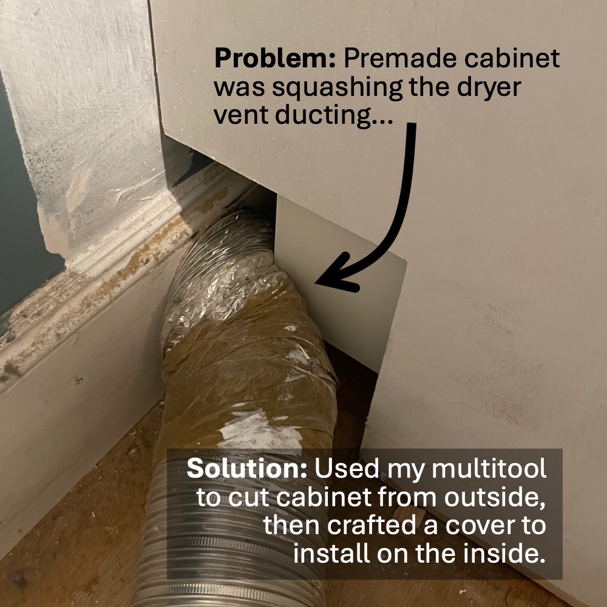
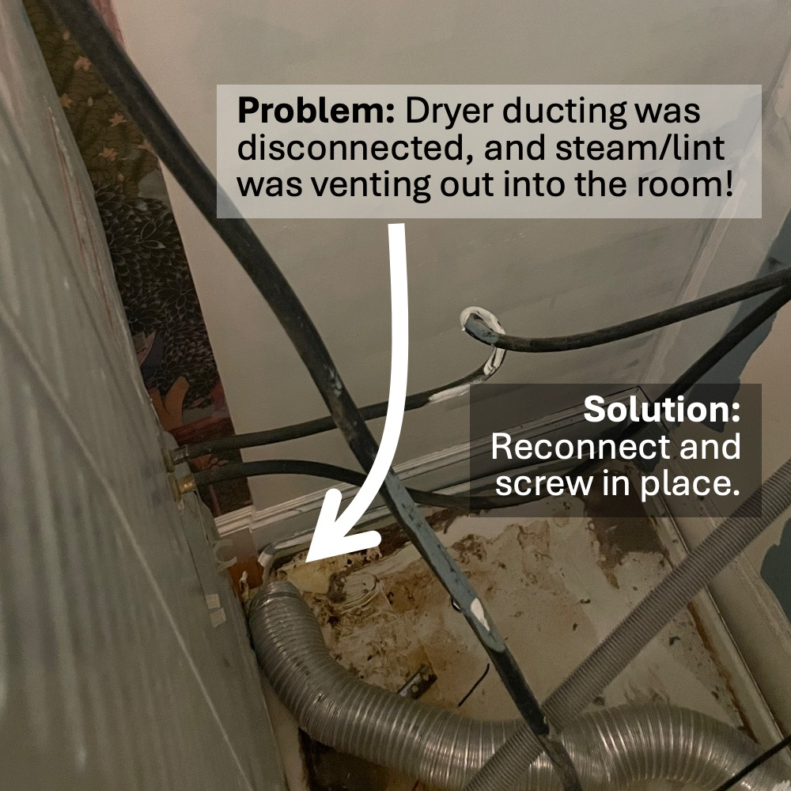

In engineering (and design), geometric constraints refer to limitations on a single entity :door: (size, location) 
and dependencies on pairs of entities :door:&#x2194:couch_and_lamp: (distance, arc angle). Our laundry room was a 
great exercise in satisfying geometric constraints!

{: .mx-auto.d-block :}

## The Constraints

* [Door frame](#step-1-french-doors) :door:
  * unmovable, 32" wide opening
* [Premade cabinet](#step-2-premade-cabinet) :package: :file_cabinet: :toolbox:
  * 24x24x90" (in a 93" tall room)
  * requires 2" buffer from wall to accommodate recessed plug point 
* [Stacked washer/dryer](#step-3-custom-cabinetry-built-ins) :basket: :soap:
  * emergency drain pipe is in the center of the floor (instead of in the baseboard) 
  * dryer ducting overlaps cabinet
  * normal outlet is behind washer, but dryer outlet is behind cabinet :electric_plug: :woman_facepalming: 
* [Storage](#step-4-organization-star_struck) 
  * detergent, dryer sheets, and dryer bags must be accessible
  * space for extra comforters, pillows, and clothes dry racks

## The Process

### Step 1: French Doors

{: .mx-auto.d-block :}

The narrowest manufactured French doors are 48" wide, so I installed 32" wide [bifold window doors](https://www.amazon.com/gp/product/B07TYVGGL4) instead.
The two 16" wide door slabs swing open using regular [3.5" hinges](https://www.amazon.com/gp/product/B071VY5BQH/) and [ball catch mechanisms](https://www.amazon.com/gp/product/B009E1X39Q/). 
We overcame some challenges:

| Challenge | Solution | 
| --- | --- | 
| Doors are unfinished. :evergreen_tree: | :heavy_check_mark: Pine was sanded, primed, sanded, and painted twice! :woman_artist: | 
| Unused bifold track shortened door slabs by 1.5". :door: | :heavy_check_mark: Added strips of wood to the top of the door frame to fill the gap. | 
| Standard door knob bore holes (2 1/8") don't fit. :hole: | :heavy_check_mark: Installed [antique mortise-style door knobs](https://www.amazon.com/gp/product/B0B74STSV9) instead. |
| Interior light switch is now blocked. :bulb: | :heavy_check_mark: Relocated the switch to the hallway using a [wireless receiver kit](https://www.amazon.com/gp/product/B09YHBHP8T/). | 

{: .mx-auto.d-block :}

### Step 2: Premade Ikea Pantry Cabinet

I used a [premade 24x24x90" Ikea Sektion cabinet](https://www.ikea.com/us/en/p/sektion-high-cabinet-frame-white-70265445/) 
because of the flexibility for shelves and cabinet doors. 

| Challenge | Solution | 
| --- | --- | 
| Cabinet is 90" high in a 93" high room. :ladder: | :heavy_check_mark: Custom build a ~3" base instead of using standard 4.5" legs |
| Regular outlet is inaccessible. :electric_plug: :no_entry_sign: | :heavy_check_mark: Leave 2" gap from wall to fit an [interior recessed outlet](https://www.amazon.com/gp/product/B0BL6LYZ6L/). |
| Dryer plug point is blocked. | :heavy_check_mark: Install a [removable access panel](https://www.homedepot.com/p/VENTS-US-8-5-8-in-x-11-3-4-in-Plastic-Access-Panel-D250X300/205728949). |
| Dryer vent ducting overlaps cabinet. | :heavy_check_mark: Cut corner of cabinet to accommodate! :carpentry_saw: | 
| 9x9x3" security box blocks cabinet front. :closed_lock_with_key: | :heavy_check_mark: Install [shorter cabinet doors](https://www.ikea.com/us/en/p/enkoeping-door-white-wood-effect-50505936/). |

{: .mx-auto.d-block :}

{: .mx-auto.d-block :}

**Half cabinet access.** The doors to the room must be fully open when I'm entering and exiting with a laundry basket.
Luckily, Ikea makes [12" wide cabinet doors](https://www.ikea.com/us/en/p/enkoeping-door-white-wood-effect-50505936/), 
meaning the left half of the cabinet can still be accessed even with the French doors open! 
I found a [slim 9" cabinet organizer from Simple Human](https://www.simplehuman.com/products/pull-out-cabinet-organizer-9-inch)
to slide out with my laundry supplies. 

{: .mx-auto.d-block :}

**Inside-cabinet outlet.** Thanks to our [recessed outlet extension](https://www.amazon.com/gp/product/B0BL6LYZ6L), our 
[handheld vacuum](https://www.amazon.com/gp/product/B08559K2DL) finally has a home! 
I filled the predrilled [shelf peg holes with removable plastic plugs](https://www.amazon.com/dp/B0BBB2LX37) to 
allow for shelf height switch-ups later on as needed.

{: .mx-auto.d-block :}

### Step 3: Custom Cabinetry Built-Ins

Since the start of the semester was imminent (and my time to complete the project would vanish), I hired the *only carpenter who responded* (of the eight folks I tried) to build the custom cabinet above 
the stacked washer/dryer. *Unfortunately, his team built cabinets **around the 
washer and dryer** instead of moving the appliances out first (as they were instructed and agreed to do).* :woman_facepalming:

:fire: **Problem 1: The dryer smells like fire!**
> The evening that my carpenter left, I tried to dry a wet floor towel (that our kiddo had dumped bath water onto). Within a few minutes, 
a *horrible burning smell and steam started to fill the room!* :scream: :fire_extinguisher: :woman_firefighter: :safety_vest:

I called the [Dryer Vent Wizards](https://www.dryerventwizard.com/locations/greater-boston) (highly recommend!), and they found
and fixed a couple of problems the next morning... 

{: .mx-auto.d-block :}
***Fix:** They used a multitool to cut up the cabinet from the outside (then I crafted and installed a box to cover the hole from the inside).*

{: .mx-auto.d-block :}
***Fix:** They reconnected and screwed in the dryer vent.*

Unfortunately, this led to another new problem...

:ocean: **Problem 2: The washer is leaking!**

> Because the washer/dryer are clipped and screwed together 
*and because my carpenter failed to leave a 3" gap above 
the unit like I asked,* :rage: we needed to pull the connected units straight back, which destroyed the drip pan front lip. :weary: 
Our washer (like many older, "high efficiency" automatic load-sensing units) sometimes 
has an [excess suds overflow leak](https://www.thespruce.com/why-is-my-washing-machine-leaking-2147313#toc-front-load-washer-leaks). :bathtub: :bucket:
We live in a 3rd-floor condo, and I'm not interested in a leak through the floor...

Getting a new drip pan in there was tricky! We couldn't plop the washer/dryer
on top (because of the built-in overhead cabinet), and we couldn't *slide the drip pan in with the washer/dryer* because 
the overflow drain pipe was in the middle of the floor! 

{: .mx-auto.d-block :}

**My solution!** :muscle: :sassy_woman:
1. Cut the front off a [new appliance drip pan](https://www.homedepot.com/p/Oatey-28-in-x-30-in-Plastic-Washing-Machine-Pan-with-1-in-Furnished-Drain-Adapter-34067/100080446), [predrill drain hole](https://www.acehardware.com/departments/tools/power-tool-accessories/hole-saws/2029552), and install it around drain pipe first. 
2. Slide the stacked washer/dryer into place over drip pan. 
3. Cut *another* new drip pan to get front lip + 6". 
4. Lift the front of washer/dryer with [manual jacks](https://www.amazon.com/gp/product/B0CH33RLV1/) and push new drip pan front into place. 
5. [Duct-tape](https://www.amazon.com/Gorilla-6025302-White-Tough-Wide/dp/B07LFZF9KN/) the drip pans together and seal with [clear silicone caulk](https://www.amazon.com/Gorilla-Waterproof-Silicone-Sealant-Squeeze/dp/B09X7G4V63).

### Step 4: Organization :star_struck:

I always planned for the cabinetry in this room to store extra comforters (for guests) :sleeping_bed:, 
specialty recycling
([textile recycling](https://www.cambridgema.gov/Services/textilesrecycling), broken electronics, [donations](https://www.facebook.com/groups/571919200610635)) :recycle:, 
extra air filters, tissues and toilet paper :roll_of_paper: :sneezing_face: :mask:, and my extra organization supplies and gifts :gift: (hidden on the top shelf). 

{: .mx-auto.d-block :}

I found these [extra-deep cloth bins](https://www.amazon.com/dp/B087MVST5P), [bin clip labels](https://www.amazon.com/dp/B09WJ1M7V8),
and fantastic [compact dry racks](https://www.containerstore.com/s/closet/laundry-room-accessories/compact-accordion-clothes-drying-rack/12d?productId=11004508), all of which are working out perfectly in this 24" wide cabinet! 

## Cost breakdown

I realize now that folks who do home projects are able to save money by reusing supplies! For this project, 
I used (but didn't need to newly purchase) my [oscillating multitool](https://www.amazon.com/DEWALT-DCS356B-Variable-Oscillating-Multi-Tool/dp/B07VBB55X5), 
[orbital sander](https://www.amazon.com/Ryobi-S652DGK-Squared-Orbital-Finishing/dp/B00OQOE73C/), and 
[tabletop BladeRunner saw](https://www.amazon.com/gp/product/B071P6GZN5/). I even had enough leftover 
[wood putty](https://www.amazon.com/DAP-540-Natural-Plastic-Wood-X/dp/B01IY7RGBQ/), 
[paintable caulk](https://www.homedepot.com/p/DAP-ALEX-FLEX-10-1-oz-White-Premium-Molding-and-Trim-Sealant-18542/206034500)* (and 
[caulk gun](https://www.homedepot.com/p/Anvil-10-oz-Drip-Free-Smooth-Rod-Caulk-Gun-HD-109T1/315070926)), 
[clear silicone sealant caulk](https://www.amazon.com/Gorilla-Waterproof-Silicone-Sealant-Squeeze/dp/B09X7G4V63)*, 
[white duct tape](https://www.amazon.com/Gorilla-6025302-White-Tough-Wide/dp/B07LFZF9KN/),
Benjamin Moore [Fresh Start primer](https://store.benjaminmoore.com/storefront/us/en/coating/interior-exterior-primers/benjamin-moore/fresh-start-high-hiding-all-purpose-primer/fresh-start/p/0046?size=SIZE-004), 
color-matched [pink](https://www.sherwin-williams.com/en-us/color/color-family/red-paint-colors/sw6288-rosebud) and white 
[semi-gloss paint](https://www.benjaminmoore.com/en-us/interior-exterior-paints-stains/product-catalog/awip/aura-interior-paint), [grippy contact paper](https://www.amazon.com/Non-Slip-Washable-Oil-Proof-Refrigerator-Adhesive/dp/B08BZ6NKZB), [glue dots](https://www.amazon.com/Glue-Dots-Removable-Value-Sheets/dp/B00161UBTW/)...

*\*Sealing the top of a caulk tube with a metal screw keeps it from drying out!*

| Materials | Cost (+ tax/shipping) | 
| --- | ---: |
| [bifold French doors](https://www.amazon.com/gp/product/B07TYVGGL4) | 563.08 | 
| [Ikea Sektion tall base cabinet](https://www.ikea.com/us/en/p/sektion-high-cabinet-frame-white-70265445/), 2 [30" doors](https://www.ikea.com/us/en/p/enkoeping-door-white-wood-effect-50505936/), 2 [40" doors](https://www.ikea.com/us/en/p/enkoeping-door-white-wood-effect-30505937/), 3 [shelf pair packs](https://www.ikea.com/us/en/p/utrusta-shelf-white-00265533/), 4 [soft-close hinge pairs](https://www.ikea.com/us/en/p/utrusta-hinge-w-b-in-damper-for-kitchen-80524882/) | 499.44 |
| dryer vent repair technician visit | 274.00 | 
| 2 [sheets 4'x8'x0.6" pine plywood](https://www.homedepot.com/p/Plytanium-23-32-in-x-4-ft-x-8-ft-BC-Sanded-Pine-Plywood-201428/100061386) | 106.21 | 
| 2 [compact accordion-style dry racks](https://www.containerstore.com/s/closet/laundry-room-accessories/compact-accordion-clothes-drying-rack/12d?productId=11004508) | 70.10 | 
| 2 [washing machine drip pans](https://www.homedepot.com/p/Oatey-28-in-x-30-in-Plastic-Washing-Machine-Pan-with-1-in-Furnished-Drain-Adapter-34067/100080446) | 65.88 | 
| [SimpleHuman 9" pull-out cabinet organizer](https://www.simplehuman.com/products/pull-out-cabinet-organizer-9-inch) | 60.00 | 
| [2-pack manual lift jacks](https://www.amazon.com/gp/product/B0CH33RLV1/) | 48.35 | 
| [20" deep cloth bins (5-pack)](https://www.amazon.com/dp/B087MVST5P) | 46.74 | 
| 1 quart Chantilly Lace [semi-gloss paint](https://www.benjaminmoore.com/en-us/product/aura-interior-paint-semi-gloss-1-quart/N528?size=SIZE-004) | 46.74 | 
| 6 [round flower brass knobs](https://www.amazon.com/gp/product/B0CDCQWP7J?th=1) | 38.23 | 
| 2 [ball catch mechanisms](https://www.amazon.com/gp/product/B009E1X39Q) | 37.97 | 
| [recessed outlet extender](https://www.amazon.com/gp/product/B0BL6LYZ6L) | 35.05 | 
| [0.5" overlay cabinet hinges](https://www.homedepot.com/p/Everbilt-35-mm-105-1-2-in-Overlay-Soft-Close-Cabinet-Hinge-1-Pair-2-Pieces-H47228E-NP-CP/323200377) (2 pairs) | 27.48 | 
| [mortise-style door knobs](https://www.amazon.com/gp/product/B0B74STSV9) | 24.85 | 
| 3 packs [3/16" plastic hole plugs](https://www.amazon.com/dp/B0BBB2LX37) | 22.28 | 
| [wireless light switch receiver](https://www.amazon.com/gp/product/B09YHBHP8T) | 21.24 | 
| [6-pack 3.5" brass door hinges](https://www.amazon.com/gp/product/B0CL5MDN2Y) | 18.88 | 
| [white plastic access panel](https://www.homedepot.com/p/VENTS-US-8-5-8-in-x-11-3-4-in-Plastic-Access-Panel-D250X300/205728949) | 17.36 | 
| [1" hole saw attachment for power drill](https://www.acehardware.com/departments/tools/power-tool-accessories/hole-saws/2029552) | 15.93 | 
| [bin label clips](https://www.amazon.com/dp/B09WJ1M7V8) | 8.49 | 
| [1-gang white switchplate cover](https://www.homedepot.com/p/Leviton-1-Gang-White-Blank-Plate-Nylon-Midway-Midsize-Wall-Plate-1-Pack-0PJ13-00W-R52-0PJ13-00W/100356907) | 1.04 |
| **TOTAL** | **$2049.34** |

Check out how I finished the [utility half of the laundry room](../2024-06-26-laundry/), too! Feels great to have this tiny and (now) amazingly functional room complete!