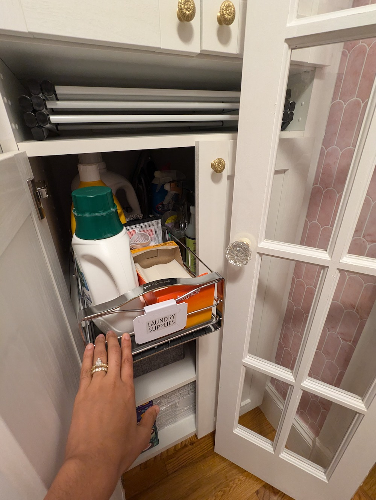

In engineering (and design), geometric constraints refer to limitations on a single entity :door: (size, location) 
and dependencies on pairs of entities :door:&#x2194:couch_and_lamp: (distance, arc angle). Our laundry room had 
several geometric constraints to satisfy!

:construction: **This page is under construction!** :construction:

{: .mx-auto.d-block :}

## The Constraints

* [Door frame](#step-1-french-doors) :door:
  * unmovable, 32" wide opening
* [Premade cabinet](#step-2-premade-cabinet) :package: :file_cabinet: :toolbox:
  * 24x24x90" (in a 93" tall room) and requires 1.75" of clearance from wall for recessed plug point 
* [Stacked washer/dryer](#step-3-custom-cabinetry-built-ins) :basket: :bucket:
  * emergency drain pipe is in the center of the floor (instead of in the baseboard) 
  * dryer vent ducting requires 6" of clearance and overlaps with cabinet
  * regular outlet is behind W/D, but dryer outlet is behind cabinet :electric_plug: :woman_facepalming: 

## The Process

### Step 1: French Doors

{: .mx-auto.d-block :}

The narrowest manufactured French doors are 48" wide, so I installed 32" wide [bifold window doors](https://www.amazon.com/gp/product/B07TYVGGL4) instead.
The two 16" wide door slabs swing open using regular [3.5" hinges](https://www.amazon.com/gp/product/B071VY5BQH/) and [ball catch mechanisms](https://www.amazon.com/gp/product/B009E1X39Q/). 
The four main challenges: 

| Challenge | Solution | 
| --- | --- | 
| Door is unfinished. 	:evergreen_tree: | :heavy_check_mark: Pine was sanded, primed, sanded, and painted twice! | 
| Bifold track shortened door slab by 1.5". :door: | :heavy_check_mark: Added strips of wood to the top of the door frame to fill the gap. | 
| Standard door knob bore holes (2 1/8") don't fit. :hole: | :heavy_check_mark: Installed [antique mortise-style door knobs](https://www.amazon.com/gp/product/B0B74STSV9) instead. |
| Interior light switch is now blocked. :bulb: | :heavy_check_mark: Relocated the switch to the hallway using a [wireless receiver kit](https://www.amazon.com/gp/product/B09YHBHP8T/). | 

{: .mx-auto.d-block :}

### Step 2: Premade Ikea Pantry Cabinet

I used a [premade 24x24x90" Ikea Sektion cabinet](https://www.ikea.com/us/en/p/sektion-high-cabinet-frame-white-70265445/) 
because of the flexibility for drawers, shelves, and cabinet doors. The unit required some tweaks:
* custom ~2.75" high base rather than standard 4.5" legs
* 2" gap from the wall to fit an interior [recessed outlet](https://www.amazon.com/gp/product/B0BL6LYZ6L/)
* [removable panel](https://www.homedepot.com/p/VENTS-US-8-5-8-in-x-11-3-4-in-Plastic-Access-Panel-D250X300/205728949) for accessing dryer outlet
* 6x6" cutout to accommodate dryer vent ducting
* doors that won't hit the 9x9x3" home security box in front

{: .mx-auto.d-block :}

{: .mx-auto.d-block :}

**Half cabinet access.** I need the French doors open to walk in and out with a laundry basket. 
Luckily, Ikea makes [12" wide cabinet doors](https://www.ikea.com/us/en/p/enkoeping-door-white-wood-effect-50505936/), 
meaning the left half of the cabinet can be accessed even with the French doors open! 
I found a [slim 9" cabinet organizer from Simple Human](https://www.simplehuman.com/products/pull-out-cabinet-organizer-9-inch)
to slide out with all laundry supplies. 

{: .mx-auto.d-block :}

**Recessed interior outlet.** Thanks to our [recessed outlet extension](https://www.amazon.com/gp/product/B0BL6LYZ6L), our 
[handheld vacuum](https://www.amazon.com/gp/product/B08559K2DL) finally has a home! 
I filled the predrilled [shelf peg holes with plastic plugs](https://www.amazon.com/dp/B0BBB2LX37) because it looks cleaner 
while still allowing shelf height switch-ups later on.

{: .mx-auto.d-block :}

### Step 3: Custom Cabinetry Built-Ins

Since the start of the semester was imminent (and my time to complete the project would vanish), I hired the *only carpenter who responded* (of the eight folks I tried) to build the custom cabinet above 
the stacked washer/dryer. Unfortunately, his team built cabinets **around the 
washer and dryer** instead of moving them out first (as they were instructed and agreed to do). 

:fire: **The dryer smells like a fire!** :fire: 

:ocean: **The washer is leaking!** :ocean: 

### Step 4: Organization 

About the great storage options! 

## Cost breakdown

| Materials | Cost (+ tax/shipping) | 
| --- | ---: | 
| custom carpentry labor | 1700.00 |
| [bifold French doors](https://www.amazon.com/gp/product/B07TYVGGL4) | 563.08 | 
| [Ikea Sektion tall base cabinet](https://www.ikea.com/us/en/p/sektion-high-cabinet-frame-white-70265445/), 2 [30" doors](https://www.ikea.com/us/en/p/enkoeping-door-white-wood-effect-50505936/), 2 [40" doors](https://www.ikea.com/us/en/p/enkoeping-door-white-wood-effect-30505937/), 3 [shelf pair packs](https://www.ikea.com/us/en/p/utrusta-shelf-white-00265533/), 4 [soft-close hinge pairs](https://www.ikea.com/us/en/p/utrusta-hinge-w-b-in-damper-for-kitchen-80524882/) | 499.44 |
| dryer vent repair technician visit | 274.00 | 
| 2 [sheets 4'x8'x0.6" pine plywood](https://www.homedepot.com/p/Plytanium-23-32-in-x-4-ft-x-8-ft-BC-Sanded-Pine-Plywood-201428/100061386) | 106.21 | 
| 2 [compact accordion-style dry racks](https://www.containerstore.com/s/closet/laundry-room-accessories/compact-accordion-clothes-drying-rack/12d?productId=11004508) | 70.10 | 
| 2 [washing machine drip pans](https://www.homedepot.com/p/Oatey-28-in-x-30-in-Plastic-Washing-Machine-Pan-with-1-in-Furnished-Drain-Adapter-34067/100080446) | 65.88 | 
| [SimpleHuman 9" pull-out cabinet organizer](https://www.simplehuman.com/products/pull-out-cabinet-organizer-9-inch) | 60.00 | 
| [20" deep cloth bins (5-pack)](https://www.amazon.com/dp/B087MVST5P) | 46.74 | 
| 1 quart Chantilly Lace [semi-gloss paint](https://www.benjaminmoore.com/en-us/product/aura-interior-paint-semi-gloss-1-quart/N528?size=SIZE-004) | 46.74 | 
| 6 [round flower brass knobs](https://www.amazon.com/gp/product/B0CDCQWP7J?th=1) | 38.23 | 
| 2 [ball catch mechanisms](https://www.amazon.com/gp/product/B009E1X39Q) | 37.97 | 
| [recessed outlet extender](https://www.amazon.com/gp/product/B0BL6LYZ6L) | 35.05 | 
| [0.5" overlay cabinet hinges](https://www.homedepot.com/p/Everbilt-35-mm-105-1-2-in-Overlay-Soft-Close-Cabinet-Hinge-1-Pair-2-Pieces-H47228E-NP-CP/323200377) (2 pairs) | 27.48 | 
| [mortise-style door knobs](https://www.amazon.com/gp/product/B0B74STSV9) | 24.85 | 
| 3 packs [3/16" plastic hole plugs](https://www.amazon.com/dp/B0BBB2LX37) | 22.28 | 
| [wireless light switch receiver](https://www.amazon.com/gp/product/B09YHBHP8T) | 21.24 | 
| [6-pack 3.5" brass door hinges](https://www.amazon.com/gp/product/B0CL5MDN2Y) | 18.88 | 
| [white plastic access panel](https://www.homedepot.com/p/VENTS-US-8-5-8-in-x-11-3-4-in-Plastic-Access-Panel-D250X300/205728949) | 17.36 | 
| [1" hole saw attachment for power drill](https://www.acehardware.com/departments/tools/power-tool-accessories/hole-saws/2029552) | 15.93 | 
| [bin label clips](https://www.amazon.com/dp/B09WJ1M7V8) | 8.49 | 
| **TOTAL** | **$3699.95** |

Check out how I finished the [utility half of the laundry room](../2024-06-26-laundry/), too! Feels great to have this tiny and (now) amazingly functional room complete!