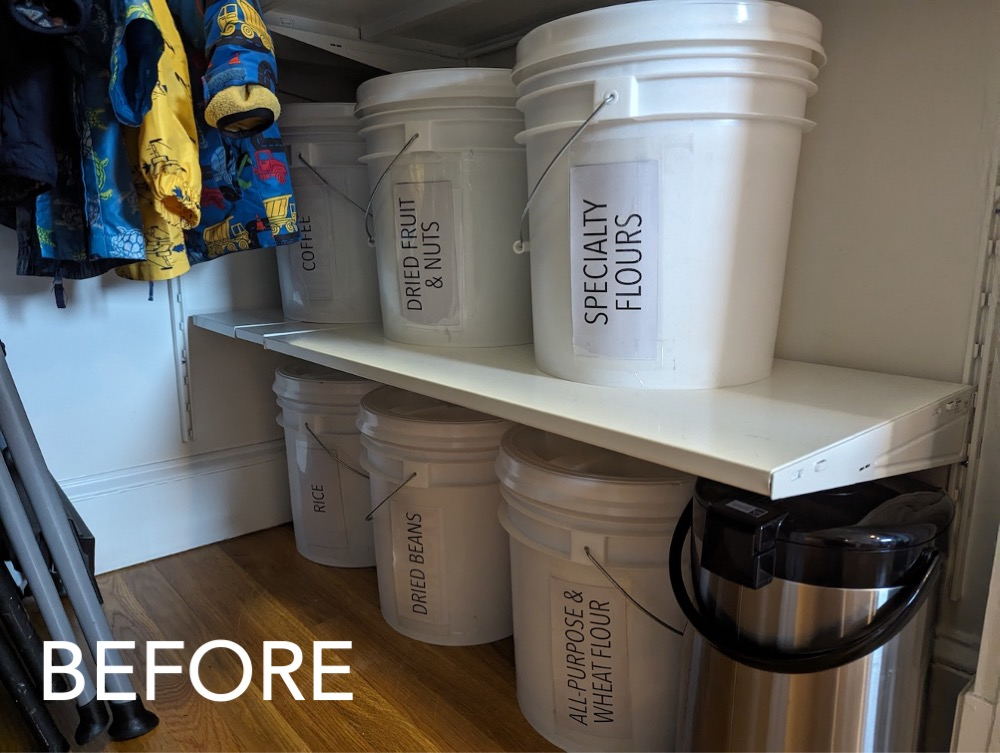
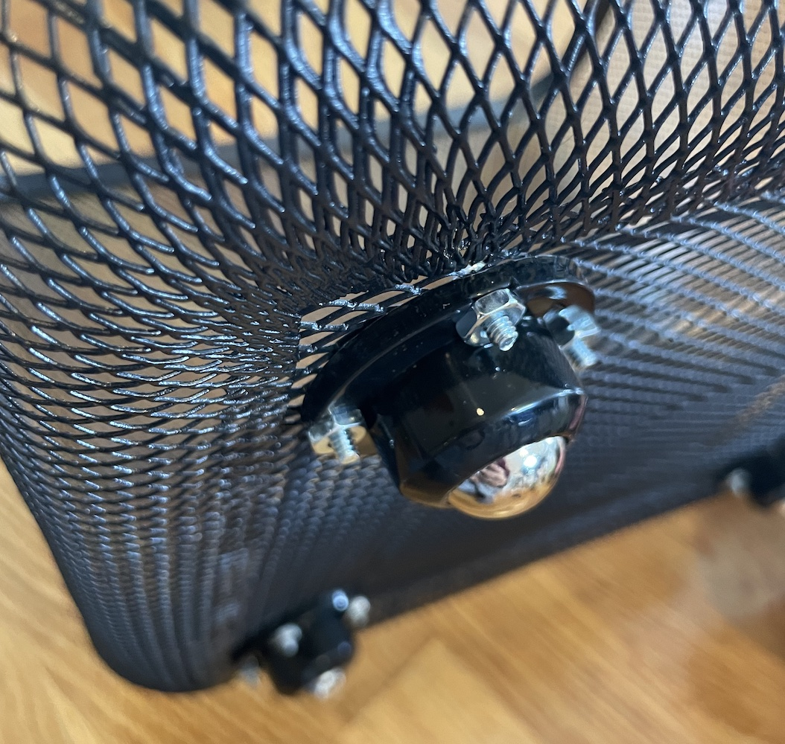
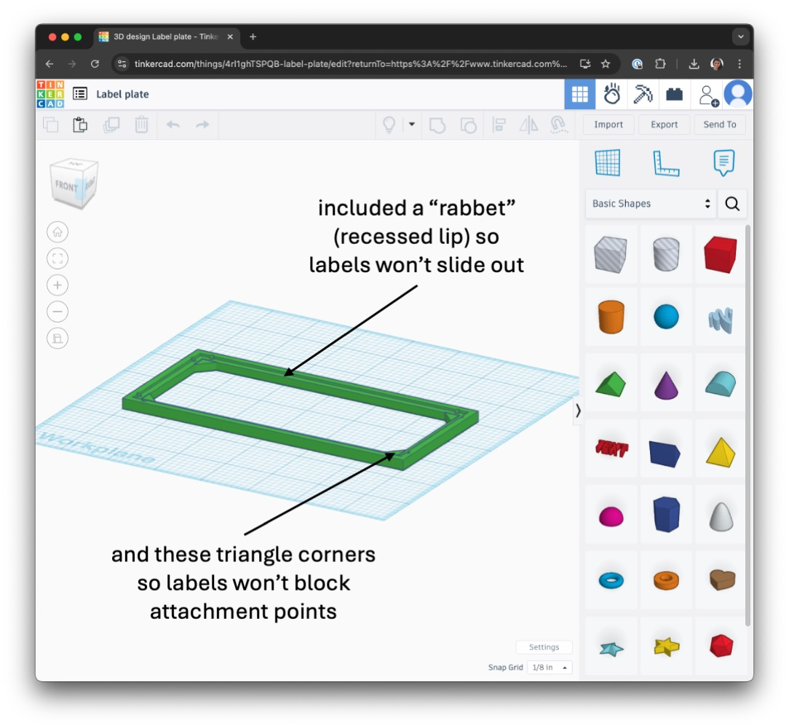
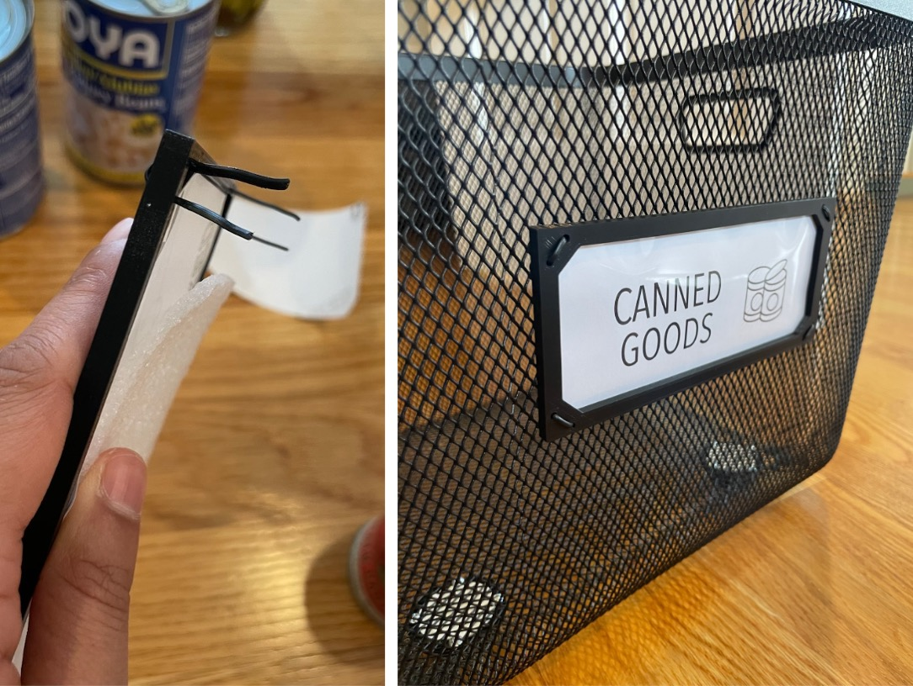
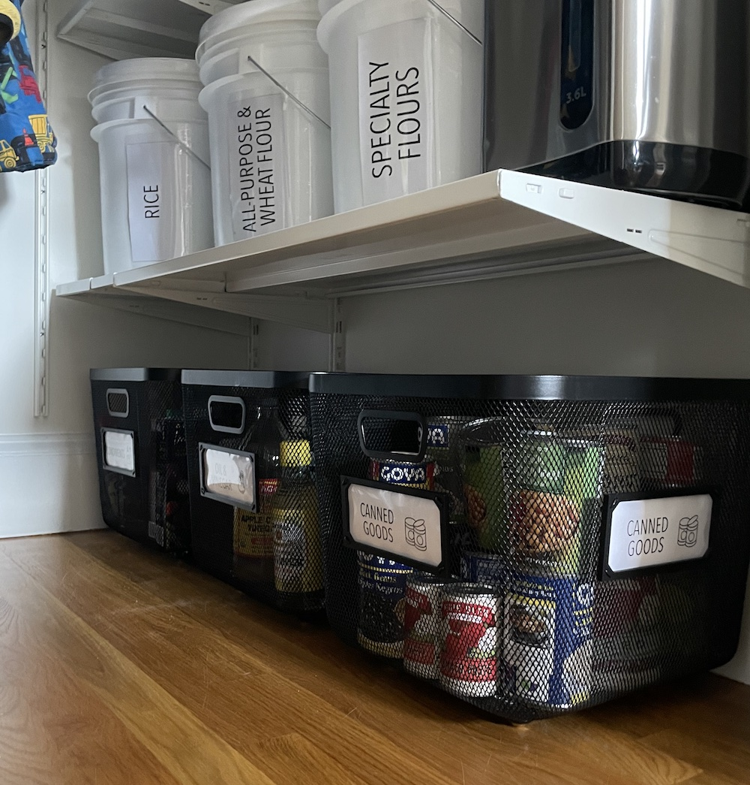

I redid [our entry closet](../2021-04-01-entry-closet) during Covid to make a pantry, but... (1) who knows how sturdy those shelves are :muscle: :grimacing:, and (2) we no longer buy 
commercial-sized quantity goods (phew) :package: :canned_food:! Time for yet another functional refactor of this space! :hammer:

So [if you remember](../2021-04-01-entry-closet), we had these six [large food-safe bins](https://www.amazon.com/gp/product/B01BLKPDHM/) at the bottom of our pantry:

{: .mx-auto.d-block :}

*BUT*, 3.5 years later, we weren't really filling them anymore. *AND* some other (super heavy) categories were overflowing their
bins on higher shelves. :weight_lifting:

### Constraints for the new bins
* Fit under the bottom [shelf brackets](https://www.ikea.com/us/en/p/boaxel-bracket-white-60448733/)
* Be easily wiped clean in case of spills :soap: :sponge:
* Be see-through enough to see contents :window:
* Store three heavy food categories (canned goods :canned_food:, oils and vinegars :champagne: :sake:, condiments :baby_bottle: :honey_pot:) directly on the floor
* Slide out without scratching the floor :skateboard:

### Step 1: Install wheels on mesh bins

I bought three [13" metal mesh bins with handles](https://www.target.com/p/large-metal-mesh-bin-black-brightroom-8482/-/A-86383818) 
which neatly tucked under the bottom shelf. 
Then, I attached four of these [discreet 1" appliance wheels](https://www.amazon.com/dp/B0C69FPVPB?th=1) to the bottom of each bin 
with [#6 3/4" machine screws and hex nuts](https://www.homedepot.com/p/Everbilt-6-32-x-3-4-in-Stainless-Steel-Phillips-Flat-Head-Machine-Screw-6-Pack-833681/320773347). 

{: .mx-auto.d-block :}

### Step 2: Custom labels

In case you've never tried it, *labeling wire mesh bins is not easy!*
Adhesives stick poorly to this patterned material, and clip-on labels are limited. 
*So,* I designed my own [label frames on TinkerCad](https://www.tinkercad.com/things/4rl1ghTSPQB-label-frame?sharecode=cwNn2gDKjLwdvM10SBTowvJ3qeFwapp3-Hj2iHge15o)! 

{: .mx-auto.d-block :}

I 3D-printed the frames with [black filament](https://www.amazon.com/HATCHBOX-3D-Filament-Dimensional-Accuracy/dp/B00J0ECR5I) to match the bins. 
I cut labels and [transparent covers](https://www.amazon.com/gp/product/B091BVB3GF) to size to fit into the frames, then 
attached the frames at each corner with black cable twist ties (saved in a drawer in my [newly organized utility room](../2024-06-26-laundry)). 

{: .mx-auto.d-block :}

**SO GOOD!** :raised_hands: :heart_eyes:

{: .mx-auto.d-block :}

These bins are holding up super well and (according to my husband, since I don't cook) make grabbing ingredients for meals much easier!