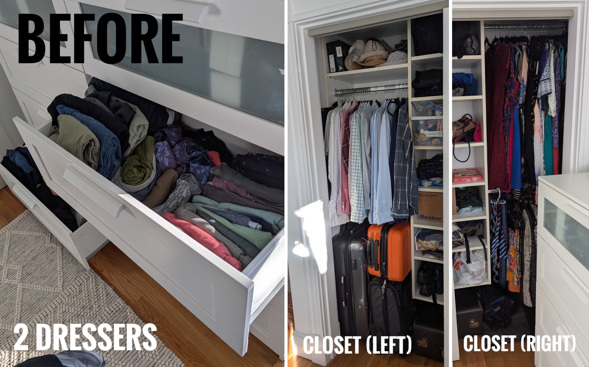
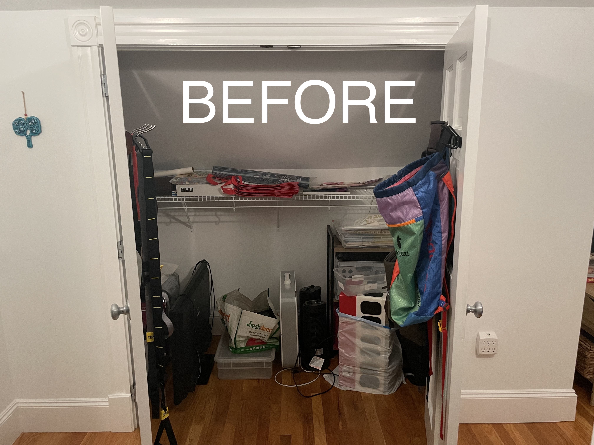
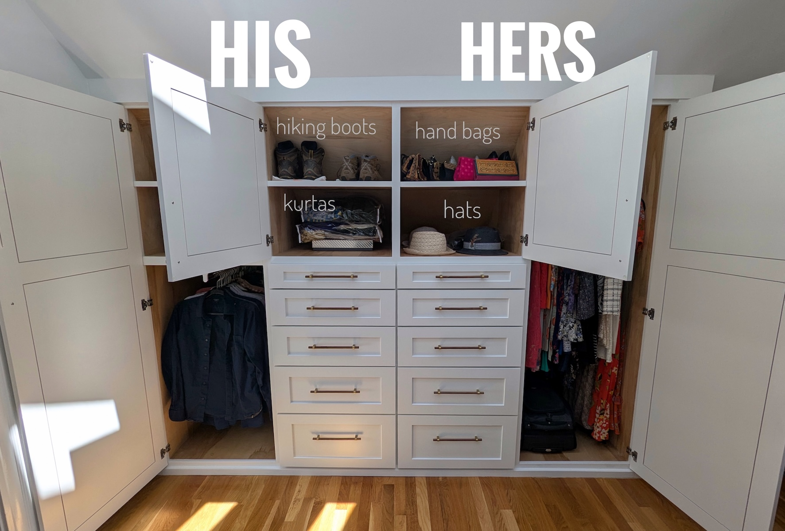

Like *Apollo 13* engineers :rocket: trying to [fit a square peg into a round hole using 
only what was on the table](https://youtu.be/ry55--J4_VQ?t=46), we had to turn an awkward, 
sloped-ceiling closet :house: into a wardrobe for 
two adults :necktie: :mans_shoe: :womans_hat: :dress: --- with no prefab solutions
(trust me, I looked).  

Jump ahead to read about the...
1. :x: [space constraints](#the-constraints) 
2. :heavy_check_mark: [solution](#the-design) 
3. :hammer: [construction process](#the-process)
4. :nerd_face: [organization!](#the-organization)

## The Constraints

The original closet is up against the roofline, with a 79" ceiling height in the 
front and only 48" at the back, but 40.5" deep.
[Prefab closet systems](https://www.ikea.com/us/en/cat/pax-system-19086/) are only 
20-24" deep, meaning I needed a custom solution to utilize the depth of the closet.

{: .mx-auto.d-block :}

Here is the pile of clothes (from our original bedroom, [soon to become my older son's](../2025-05-12-kid-bedroom)) 
that I needed to declutter and organize to fit in the space: 

{: .mx-auto.d-block :}

I *also* needed to clear out the stuff stashed in the original closet! 

{: .mx-auto.d-block :}
:point_up: *You can see that the builder-installed rod would never have accommodated long dresses.*

## The Design

I measured everything and designed a wardrobe with four 24"-wide and 36"-deep sections to 
accommodate a [30" pull-out rod](https://www.amazon.com/dp/B09BQ953P5) for hanging dress shirts :necktie:, 
[extra-deep drawers (30")](#1-clothes), and space to
[stash nested suitcases](#2-suitcases) behind full-length dresses. :luggage: :dress:

I maximized all dimensions while minimzing the cost of [plywood sheets](https://www.homedepot.com/pep/Columbia-Forest-Products-3-4-in-x-4-ft-x-8-ft-PureBond-Birch-Plywood-165921/100077837) and 
[drawer slides](https://www.rockler.com/blum-movento-heavy-duty-soft-close-undermount-drawer-slides-pairs), which skyrocket at dimensions over 30--36". :money_with_wings:

{: .mx-auto.d-block :}

{: .mx-auto.d-block :}

## The Process

This job needed specialty trades (i.e., [carpentry](#carpentry_saw-step-1-carpenter), 
[demo](#hammer_and_pick-step-2-contractor), [electrical](#electric_plug-step-3-electrician), 
[paint](#-step-4-painter)) that, although I would have loved to DIY, would have taken
me too long for a (likely) subpar end result. :shrug:

### :carpentry_saw: Step 1: Carpenter
I scoured FB groups for recommendations, contacted four carpenters for
   quotes, and eventually hired [Oak 'N' Flannel](https://www.facebook.com/OakNFlannel/), 
   based out of Western Mass, to build the cabinets off site :clamp: and 
   then deliver and install them. He did a *fantastic* job!

{: .mx-auto.d-block :}

### :hammer_and_pick: Step 2: Contractor
I again got quotes from four contractors, and hired someone 
   based in East Cambridge to demo the existing closet  and pull up 
   some hardwood to use in the [downstairs bedroom](../2025-05-12-kid-bedroom) for 
   another project. :muscle:

{: .mx-auto.d-block :}

### :electric_plug: Step 3: Electrician
When we uncovered a discolored electrical wire in the wall, 
I hired an electrician to check and seal the wire and 
relocate the outlet. :zap: :mechanic: *This was the hardest trade to nail down,* with three 
electricians telling me they were too busy, and another quoting me $8-12K
"just to check out the job". :raised_eyebrow:

{: .mx-auto.d-block :}

### 🎨 Step 4: Painter
Some drywall repair, replastering, and trim finishes were required, 
   and then I hired [Baldoyle Painting](https://baldoylepainting.com/) for priming and 
   all paint touchup! :artist:

{: .mx-auto.d-block :}

## The Organization

Would this even be a post without showing you how *organized* the wardrobe is, now?! :heart_eyes:
Check out the clever storage for [clothes](#1-clothes), [suitcases](#2-suitcases), [jewelry](#3-jewelry), and [scarves](#4-scarves)!

{: .mx-auto.d-block :}

### 1. Clothes
The [pull-out clothes rod](https://www.amazon.com/dp/B09BQ953P5) enabled us 
to use the full depth of the closet for my husband's dress shirts and pants, polos, and suits! 👔

{: .mx-auto.d-block :}

"[File folding](https://konmari.com/how-to-fold-clothes/)" clothes enables us to 
immediately see what we have and decide what to wear when getting ready. 
👕👖 This also saves time putting clean laundry away! 🧺

{: .mx-auto.d-block :}

### 2. Suitcases
Our [rolling suitcases](https://us.delsey.com/products/002071830-titanium-29-inch-checked-expandable-spinner) are nested and stored behind my hanging dresses. :dress: The front suitcase
holds our regularly-used [travel backpacks (Osprey 26+6)](https://www.osprey.com/daylitetm-expandable-travel-pack-26-6-5), which are some of the *best designed products* in our 
entire house. 🎒🧳 You know I love it.

{: .mx-auto.d-block :}

### 3. Jewelry
I store my (cheap, fake) [jewelry on trays](https://www.amazon.com/dp/B085T36TN5) in this shallow top drawer. :gem:
I decided years ago that I have no interest 
in owning "nice" jewelry that I'd be stressed to lose or break.

{: .mx-auto.d-block :}

I also spent a quick morning sawing the corner of my bulletin board and fixing the trim to fit against the slanted
ceiling to hang my bead necklaces! 	:prayer_beads:

{: .mx-auto.d-block :}

### 4. Scarves
My scarves used to be stored in an [over-the-door clear shoe organizer](https://www.amazon.com/Simple-Houseware-Pockets-Hanging-Organizer/dp/B07CG2R9ST?th=1), 
*which was great (!),*
but which wouldn't work in the new room. :door: :sun_with_face: Instead, I now hang them in a (sun-deprived) corner of the room 
while also covering up the ugly furnace access panel! :scarf:

{: .mx-auto.d-block :}
*:point_up: In our previous Cambridgeport apartment.*

{: .mx-auto.d-block :}

## Cost

Admittedly, this wardrobe solution was substantially more expensive than my previous DIY projects. 🤑
That said, *I have no regrets.* The space is absolutely beautiful and perfectly functional, which 
delights me! :heart_eyes:

| Materials                                                                                                                                     | Cost (+ tax/shipping) | 
|-----------------------------------------------------------------------------------------------------------------------------------------------|----------------------:|
| custom cabinetry build and installation                                                                                                       |              $7800.00 |
| closet demolition                                                                                                                             |               $800.00 |
| electrician to safely move outlet                                                                                                             |               $600.00 | 
| [West Elm walnut drawer pulls](https://www.westelm.com/products/8032531/)                                                                     |               $308.00 |
| painting fixed trim, priming new plaster, wall paint touchup |               $300.00 | 
| [30" pull out rod for dress shirts](https://www.amazon.com/dp/B09BQ953P5)                    |                $56.45 | 
| [curtain rod](https://www.amazon.com/dp/B0BBGQYLHL) for scarves                                                                               |                $35.05 |
| [jewelry trays](https://www.amazon.com/dp/B085T36TN5)                                                                                         |                $28.68 |
| [space-saving skirt hangers](https://www.amazon.com/dp/B07Y3BX6FN)                                                                            |                $22.60 | 
| space-saving [velvet-lined](https://www.amazon.com/dp/B01G3WS3PW) and [unlined hangers](https://www.amazon.com/dp/B0746SHPJ2) (already owned) |                     0 |
| clothes bins (already owned)                                                                                                                  |                     0 | 
| tie hanger (already owned)                                                                                                                    |                     0 | 
| [Chantilly Lace semi-gloss trim paint](https://www.benjaminmoore.com/en-us/paint-colors/color/oc-65/chantilly-lace) (already owned)           |                     0 | 
| [Ice Mist flat wall paint](https://www.benjaminmoore.com/en-us/paint-colors/color/oc-67/ice-mist) (already owned)                             |                     0 | 
| **TOTAL**                                                                                                                                     |          **$9950.78** | 

Finishing this built-in wardrobe enabled us to [move upstairs into the master bedroom](../2025-03-15-master-bedroom). 🛏️
That in turn required [redesigning our living room](../2025-04-12-living-room) to accommodate the 
relocated sleeper sofa 🛋️, and led to a [redesign of our son's new room](../2025-05-12-kid-bedroom) in our old bedroom as well. 📌
The many steps of the **Big Move of 2025!**