We recently moved our bedroom upstairs into a room that already functioned as 
an office :computer: :printer: 
*and* music room :banjo: :musical_keyboard: :accordion: :violin:. A dramatic reworking of the space was necessary
to accommodate these *triple utilities* while maintaining a calm, sleep-inducing retreat :bed: :sleeping:. 

**Jump ahead to see**
(1) the [transition from guest to master bedroom](#guest--master-bedroom-transition) :couch_and_lamp: :bed:,
(2) [office organization](#office-organization) :pencil: :pen:, and
(3) [music organization](#music-organization) :musical_score: :studio_microphone:.

## Room 1: The Master Bedroom

We originally had this side of the room set up as a guest bedroom with a [pullout sleeper sofa](https://www.americanleather.com/products/gaines/).

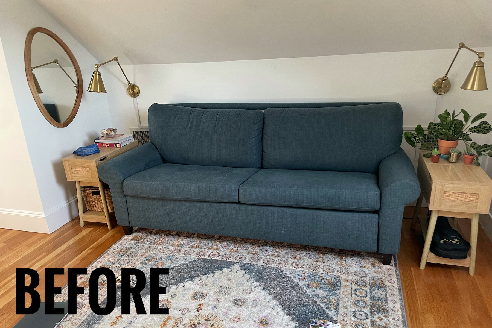{: .mx-auto.d-block :}

To transition this space into a master bedroom, we moved our actual bed upstairs
and the sleeper sofa [downstairs into the living room](../2025-04-12-living-room). :couch_and_lamp: :bed:

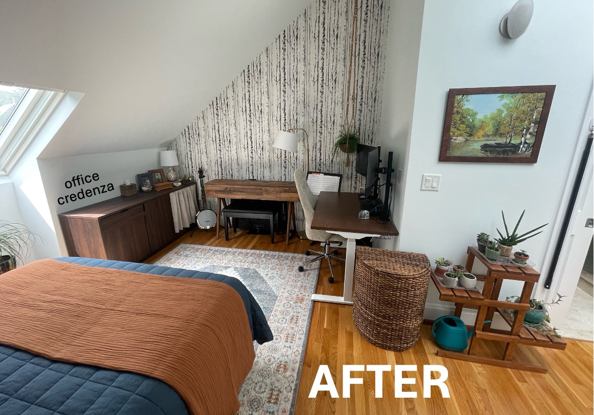{: .mx-auto.d-block :}

**Nightstands.** I sold the [old sofa side tables](https://www.amazon.com/gp/product/B0BLVPG6BV) and 
[wall sconces](https://www.amazon.com/dp/B0B4J8V625) :money_mouth_face: (lol, yeah right) 
and replaced them with a [side cabinet](https://www.target.com/p/withania-2-door-cabinet-threshold-8482/-/A-89207299) and 
[nightstand](https://www.overstock.com/products/safavieh-shyann-single-door-carved-nightstand-40656766?variant=61943056466079) with more practical storage 
and [swivel-arm wall sconces](https://www.amazon.com/dp/B087T4ZY8N) that we already owned. :bulb:

**Aesthetic Accessories.** My [jewelry](../2025-03-01-wardrobe/#organization) and [scarves](../2025-07-15-scarves)
didn't fit in our [custom wardrobe](../2025-03-01-wardrobe) :prayer_beads: :scarf:, so I 
hung them out here for easy access. Bonus benefit! :star_struck: They look nice displayed like this! 
:framed_picture:

*And check out the view from bed.* :point_down:
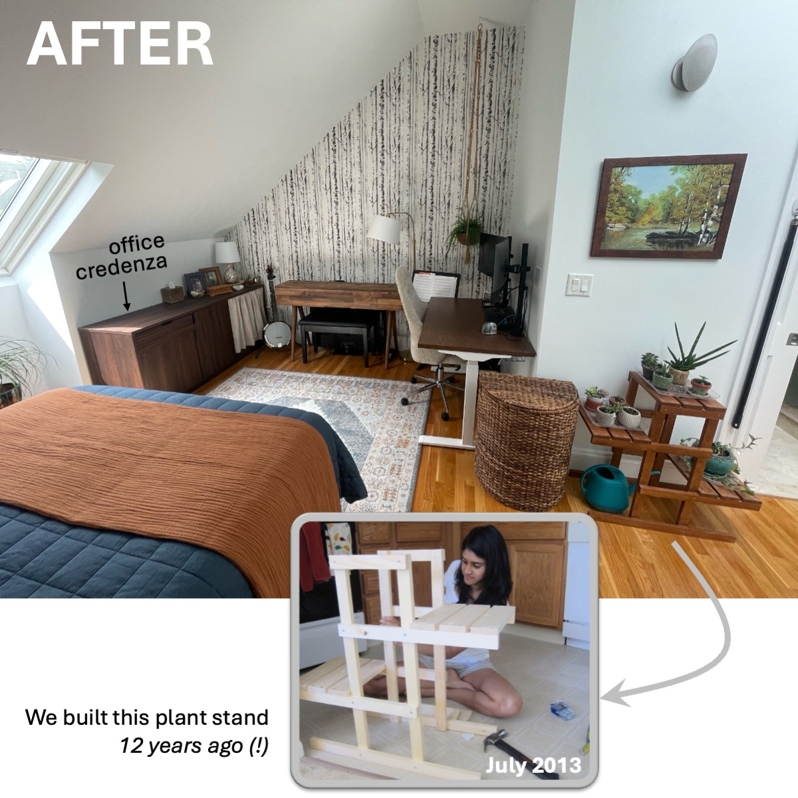{: .mx-auto.d-block :}

Not bad for functionally hiding office clutter to actually fall asleep at night! :relieved: :sleeping:

## Room 2: The Office

### Standing Desk
The **standing desk** had to go on the *only wall without a sloping ceiling*. 
:desktop_computer: :keyboard: :computer_mouse: I reduced
[stressful tech clutter](https://www.housedigest.com/1438812/david-bromstad-hgtv-home-office-bedroom/) 
by installing [monitor posts](https://www.amazon.com/dp/B0DCLHMFGX) and 
[drilling](https://www.acehardware.com/departments/tools/power-tool-accessories/hole-saws/2029552) [grommet holes for wires](https://www.amazon.com/dp/B07G83N99D). 
:see_no_evil:

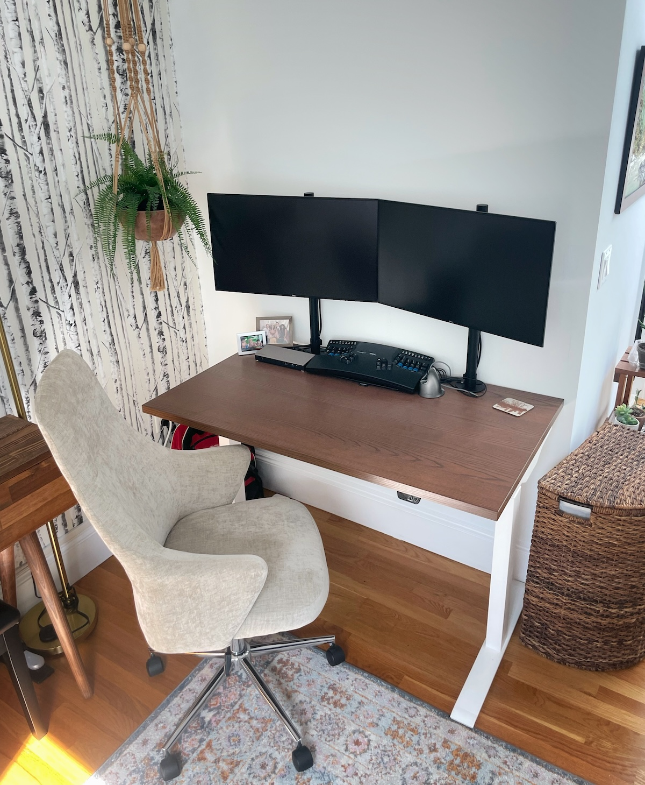{: .mx-auto.d-block :}

### Printers
How sneaky is this!? I hid the [**3D printer**](https://www.prusa3d.com/product/original-prusa-mini-semi-assembled-3d-printer-4/) inside 
the [office credenza](https://www.wayfair.com/organization-storage/pdp/loon-peak-bettye-1-drawer-credenza-w004342388.html) 
on a slide-out printer tray blocked with [café curtains](https://www.amazon.com/dp/B0CLGTVHPF). :ninja: :star_struck:

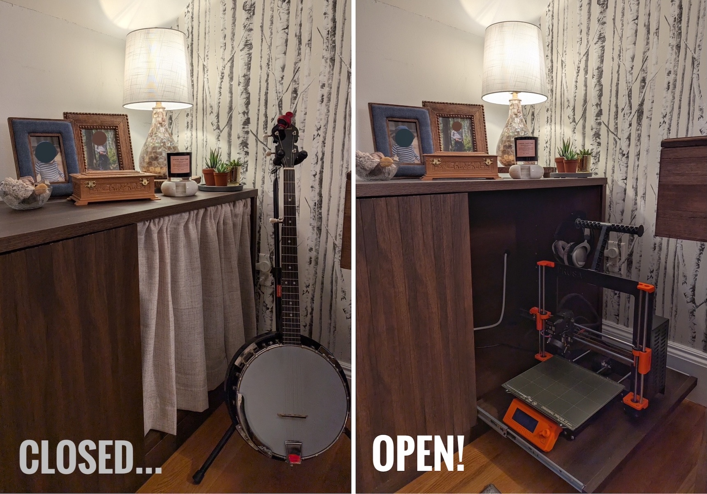{: .mx-auto.d-block :}
:point_up: *The printer works perfectly while tucked away, 
and the curtain [blocks drafts](https://www.reddit.com/r/3Dprinting/comments/1agk4aw/is_there_any_problem_of_leaving_my_3d_printer_in/), too!*

Our regular **laserjet printer** is also hidden in the middle section of 
the office credenza, 
and I arranged my paper types for easier DIY labeling. :printer:

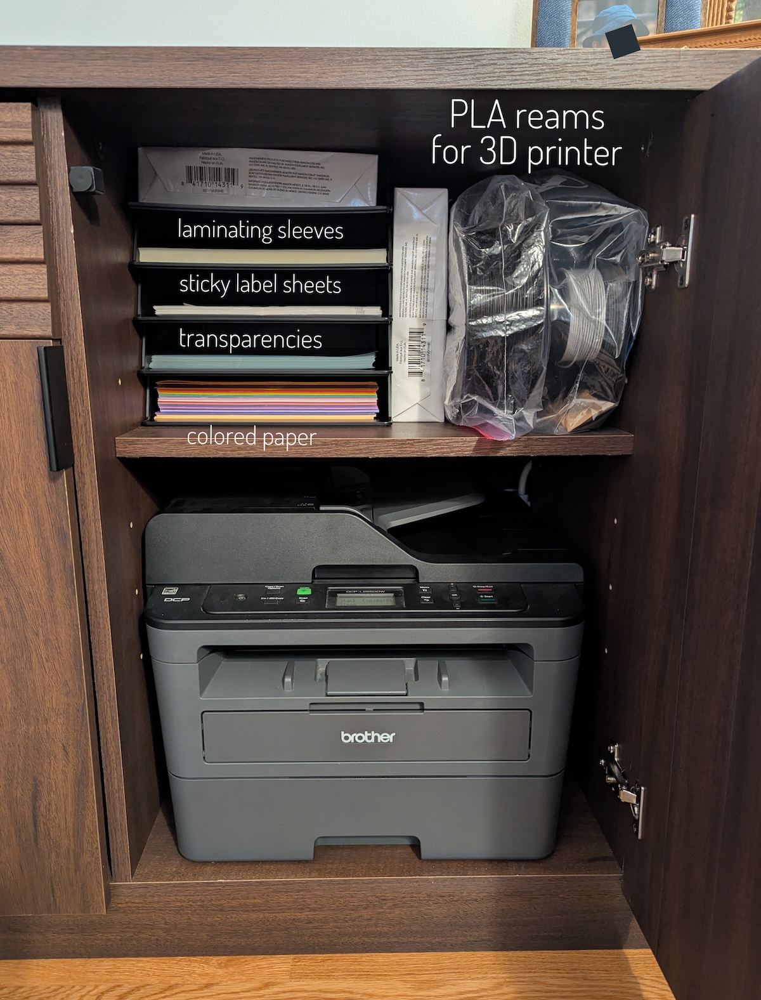{: .mx-auto.d-block :}

### File Storage

Guess who's [no longer pointlessly holding onto](https://shiragill.com/paperwork-organization-simplified/) 12-year-old rental leases?! 
Me!! :raising_hand_woman: ...As of two weeks ago. :grimacing:
I whittled down an enormous 2-drawer file cabinet of junk into this 
single crate. :file_cabinet:

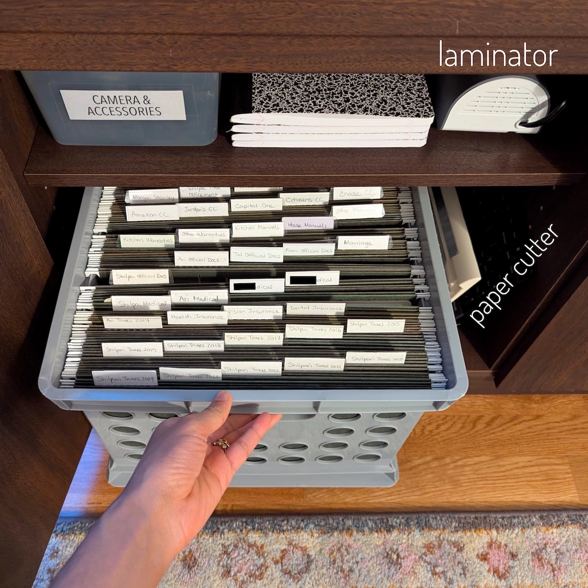{: .mx-auto.d-block :}

### Office Supplies

Our other office supplies are organized and 
labeled in the top drawer of the office credenza 
(using these [fantastic interlocking drawer organizers](https://www.amazon.com/dp/B01DAQ73P0))... :pen: :pencil: :pushpin:

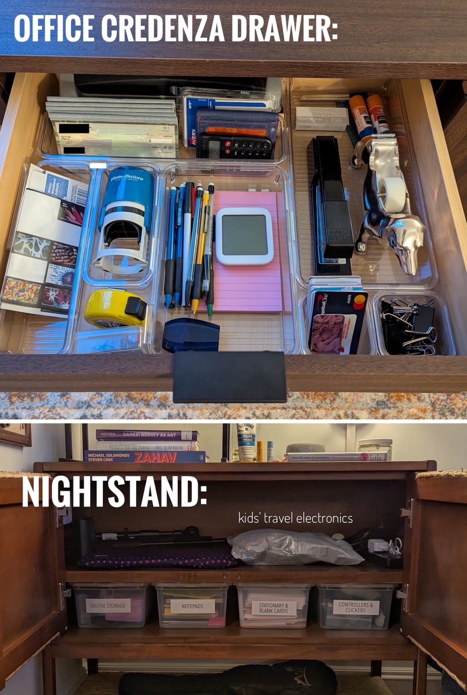{: .mx-auto.d-block :}

...and in the
[bedside cabinet](https://www.target.com/p/withania-2-door-cabinet-threshold-8482/-/A-89207299) 
(using these [clear bins](https://www.amazon.com/dp/B07DFBSTFR), which I also use 
for [kids' art supplies](../2022-09-01-kids-artwork) and [toy organization](../2022-12-30-toys)). :notebook: :computer_mouse: :video_game:

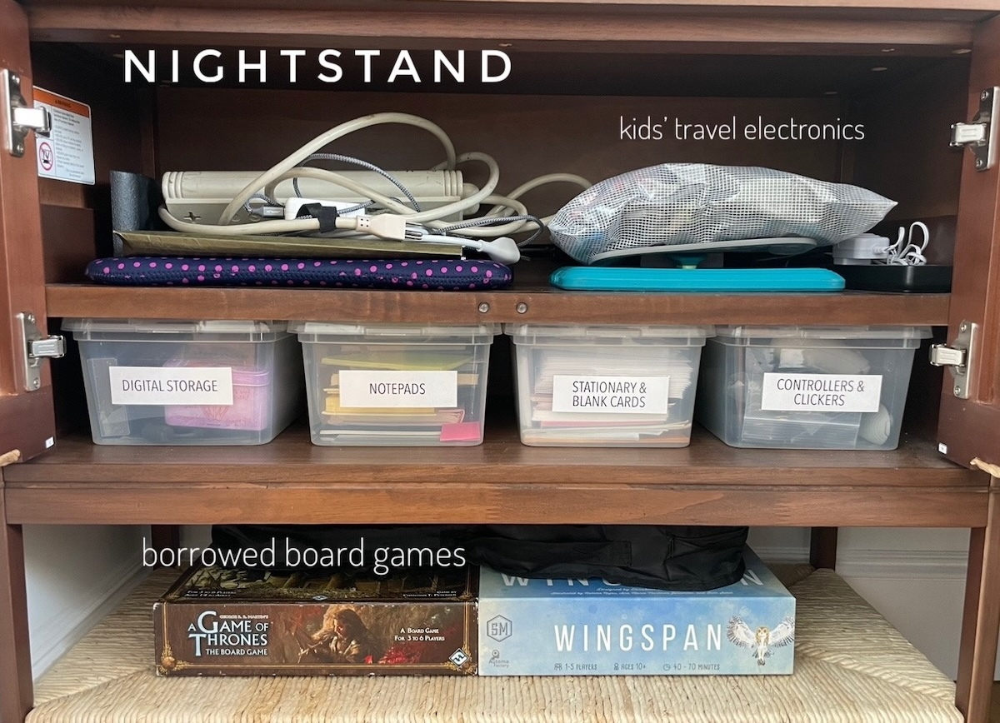{: .mx-auto.d-block :}

*A note about borrowed board games* (see above :point_up:). I like to keep borrowed items within sight (but out of the
way), so that I don't forget to return things when I'm finished! Turns out [loaning out and getting back borrowed items](https://www.reddit.com/r/questions/comments/1j40e9w/whose_responsibilty_is_it_to_return_borrowed_items/)
is a constant AITAH Reddit-thread topic... :thinking: :neutral_face:

## Room 3: The Music Room 

You probably [saw](#guest--master-bedroom-transition) the banjo :banjo: and digital piano :musical_keyboard: already. 

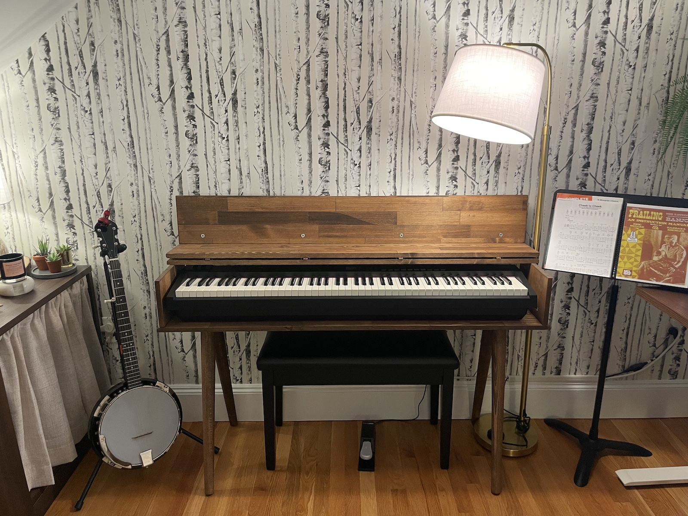{: .mx-auto.d-block :}

I found a [stand for our digital piano on Etsy](https://www.etsy.com/listing/1664543133/mid-century-modern-piano-keyboard-stand) (*not* that I recommend it) and a [piano bench](https://www.amazon.com/dp/B07BJ4DW86)
to store music. :point_down:  

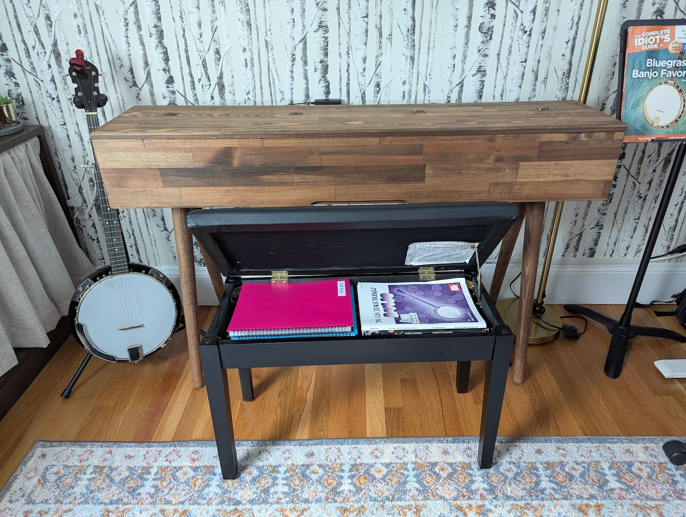{: .mx-auto.d-block :}

Organizing printed sheet music in these [sheet music organizers](https://www.amazon.com/dp/B08R8SW845) has been a game changer.

{: .mx-auto.d-block :}

Banjo *accoutrements* are also now tucked away (hidden, accessible, dust-free) in 
a pretty jewelry box that I was no longer using (because of my 
[gorgeous jewelry drawer](../2025-03-01-wardrobe#3-jewelry)). :banjo:

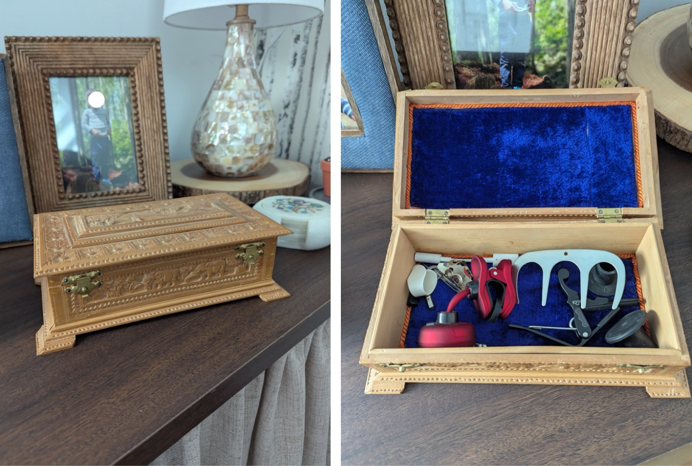{: .mx-auto.d-block :}

:eyes: You probably *didn't see* the accordion and digital piano travel case that fit under the 
bed out of sight (but within reach). :accordion: :musical_keyboard: 

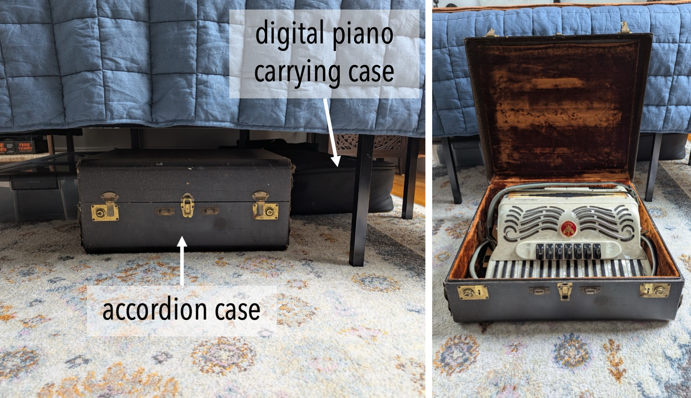{: .mx-auto.d-block :}

Our recording equipment :studio_microphone: :headphones: and amplifier :radio:
are now stored in the bedside tables, also accessible and out of sight. *We did it!* 

## Cost

After I moved my [workspace out to the loft](../2023-06-01-fireplace) in 2023, I felt bad for my husband's (*relatively super ugly*)
office space, and so I prettied-up the room for the first time then. 

Here are prices for the *new* design for our master bedroom, but I include costs from that former redesign separately below.

| Materials (2025)                                                                                                                                                                                                                          | Cost (+ tax/shipping) | 
|-------------------------------------------------------------------------------------------------------------------------------------------------------------------------------------------------------------------------------------------|----------------------:|
| [Etsy digital piano stand](https://www.etsy.com/listing/1664543133/mid-century-modern-piano-keyboard-stand)                                                                                                                               |               $551.81 | 
| [Quince Indigo Blue quilt set](https://www.quince.com/home/belgian-linen-quilt-set?color=indigo-blue&size=full%2Fqueen) and [Terracota blanket](https://www.quince.com/home/airy-cotton-gauze-blanket?color=terracotta&size=full%2Fqueen) |               $297.28 |
| [Withania 2-Door nightstand](https://www.target.com/p/withania-2-door-cabinet-threshold-8482/-/A-89207299)                                                                                                                                |               $178.50 | 
| [Safavieh Shyann Single-Door carved nightstand](https://www.overstock.com/products/safavieh-shyann-single-door-carved-nightstand-40656766?variant=61943056466079)                                                                         |               $130.50 | 
| [monitor arms](https://www.amazon.com/dp/B0DCLHMFGX) and [grommet covers](https://www.amazon.com/dp/B07G83N99D) for desk                                                                                                                  |               $113.66 | 
| [stackable letter trays](https://www.amazon.com/dp/B0CGLQ96X8)                                                                                                                                                                            |                $32.93 | 
| [2-pack Queen size pillows](https://www.amazon.com/dp/B09DSRLTQH)                                                                                                                                                                         |                $28.68 | 
| [tissue box cover](https://www.amazon.com/dp/B083HXQS1S)                                                                                                                                                                                  |                $15.93 | 
| [gold wall sconces](https://www.amazon.com/dp/B0B4J8V625) (SOLD)                                                                                                                                                                          |                  +$50 |
| [sofa end tables](https://www.amazon.com/gp/product/B0BLVPG6BV) (SOLD)                                                                                                                                                                    |                  +$70 |
| full size violin (SOLD) |                 +$150 |
| **TOTAL**                                                                                                                                                                                                                                 |          **$1079.29** |

Here are the costs from the previous office space renovation in 2023, where I ~~crossed out~~ items that
I've since sold or given away:

| Materials (2023) | Cost (+ tax/shipping) |
|------------------|------------------------:|
| [Wayfair office side table](https://www.wayfair.com/organization-storage/pdp/loon-peak-bettye-1-drawer-credenza-w004342388.html) | $372.93 |
| [6'x9' Loloi II "Clara" Pebble/Fiesta rug](https://www.amazon.com/Loloi-CLARCLA-07PPFD5377-Clara-Pebble-Fiesta/dp/B07QYX8S79) | $308.00 |
| [birch tree wallpaper](https://www.wayfair.com/decor-pillows/pdp/millwood-pines-wunsch-birch-18-l-x-205-w-peel-and-stick-wallpaper-roll-mxwx1133.html) | $182.71 |
| cozy office chair (HomeSense) | $156.16 |
| [~~sofa end tables~~](https://www.amazon.com/gp/product/B0BLVPG6BV) | $151.48 |
| [~~Poly & Bark Safie mirror~~](https://www.amazon.com/dp/B093CFVPM6) | $116.88 |
| [~~gold wall sconces~~](https://www.amazon.com/dp/B0B4J8V625) | $115.81 |
| [piano seat with storage](https://www.amazon.com/dp/B07BJ4DW86) | $95.61 |
| [gold floor lamp](https://www.amazon.com/dp/B07TR3N7ZW) | $70.65 |
| 4 [sheet music folders](https://www.amazon.com/dp/B08R8SW845) | $59.29 |
| [pink seashell table lamp](https://www.amazon.com/dp/B0783YWGX6) | $48.98 |
| [Macrame extra-long plant hanger](https://www.etsy.com/listing/803194558/plant-hanger-extra-long) | $39.67 |
| [self-watering pot for hanging fern](https://www.wayfair.com/outdoor/pdp/latitude-run-pollyanna-self-watering-resin-hanging-planter-w001369861.html) | $31.54 |
| [6-quart clear bins](https://www.amazon.com/dp/B07DFBSTFR) | $30.80 |
| [360° rotating flat plug extension cord](https://www.amazon.com/dp/B0721TYGVR) | $28.68 |
| [interlocking drawer organizers](https://www.amazon.com/dp/B01DAQ73P0) | $27.61 |
| [café curtain rod](https://www.amazon.com/dp/B00H2Q3LEC) and [café curtains](https://www.amazon.com/dp/B0CLGTVHPF) | $20.85 |
| [ceiling hook anchors](https://www.amazon.com/dp/B0C3WBWCZP) | $9.55 |
| [flat cord extender](https://www.amazon.com/dp/B0C3HFXGKJ) | $6.36 |
| **TOTAL** | **$1873.56** |

Moving our master bedroom required [building a custom wardrobe](../2025-03-01-wardrobe) :shirt: :dress:, 
[redesigning our living room](../2025-04-12-living-room) to accommodate the 
relocated sleeper sofa :couch_and_lamp:, and 
allowed us to [redesign our son's new bedroom](../2025-05-12-kid-bedroom) :car: :bed: as well. 
The many steps of the **Big Move of 2025!**