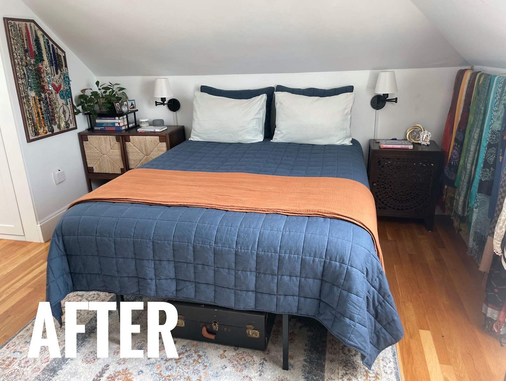
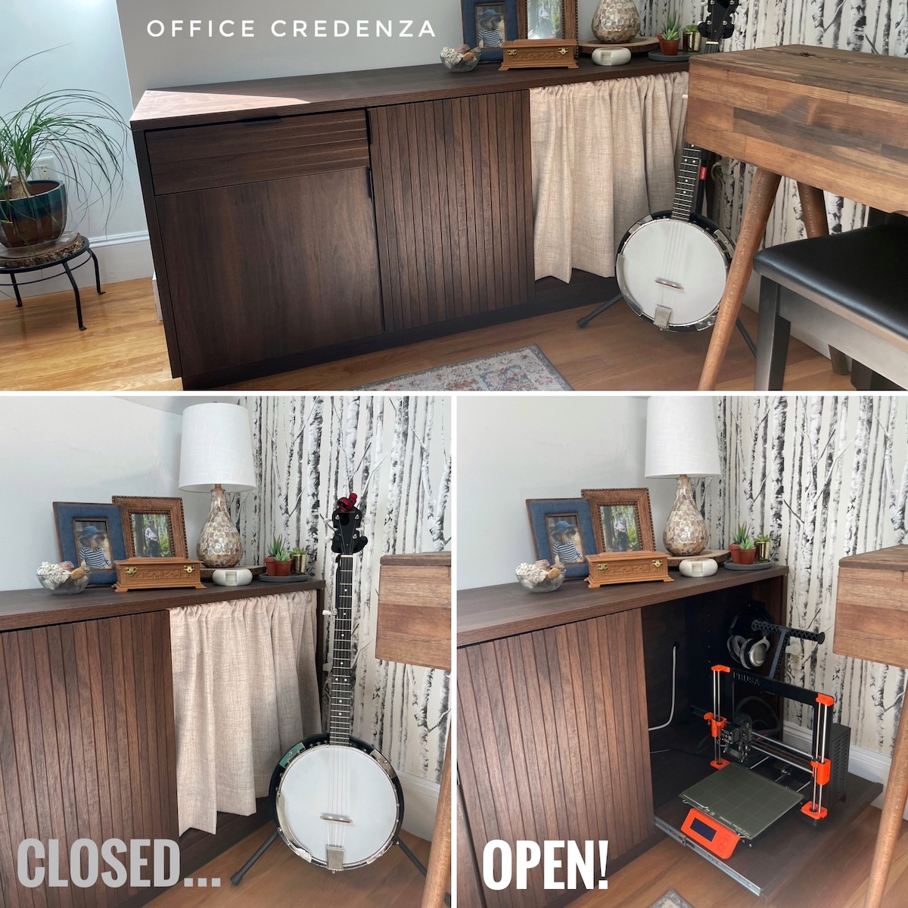
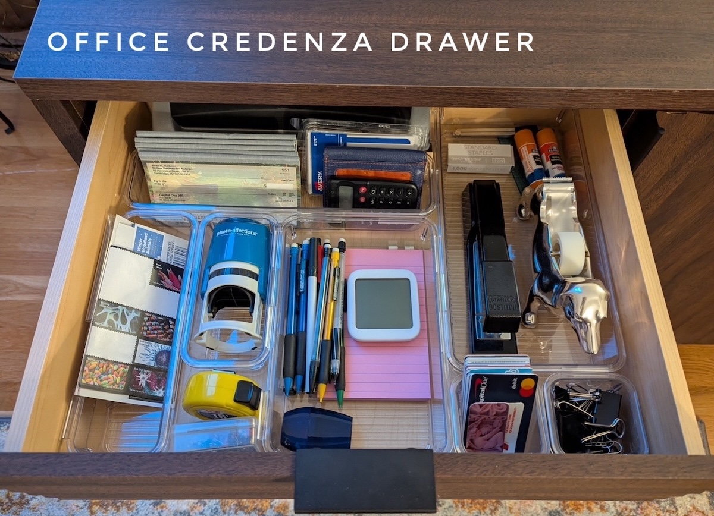
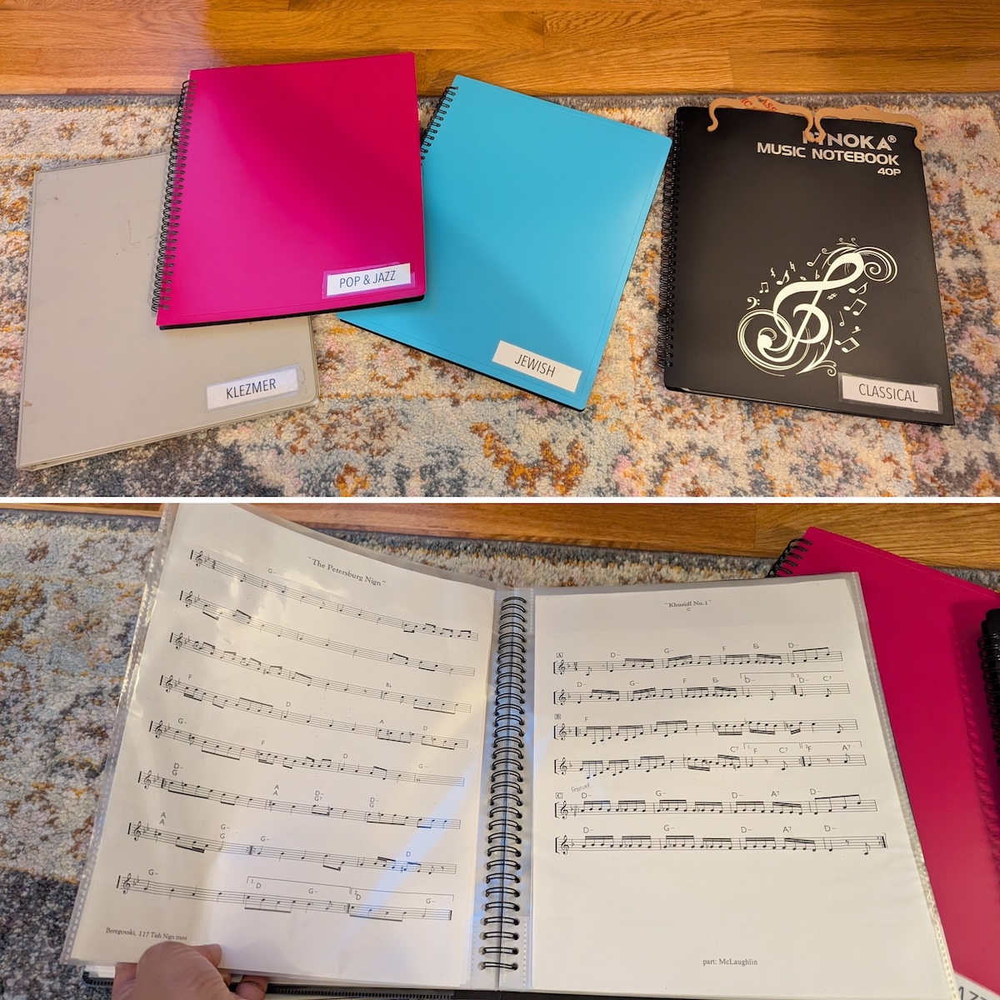

We recently moved our bedroom upstairs into a room that already functioned as 
an office :computer: :printer: 
*and* music room :banjo: :musical_keyboard: :accordion: :violin:. A dramatic reworking of the space was necessary
to accommodate these *triple utilities* while maintaining a calm, sleep-inducing retreat :bed: :sleeping:. 

Jump ahead to see 
(1) the [transition from guest to master bedroom](#guest--master-bedroom-transition) :couch_and_lamp: :bed:,
(2) [office organization](#office-organization) :pencil: :pen:, and
(3) [music organization](#music-organization) :musical_score: :studio_microphone:.

## Guest → Master Bedroom Transition

We originally had this side of the room set up as a guest bedroom with a [pullout sleeper sofa](https://www.americanleather.com/products/gaines/).

{: .mx-auto.d-block :}

To transition this space into a master bedroom, we moved our actual bed upstairs
and the sleeper sofa [downstairs into the living room](../2025-04-12-living-room). :couch_and_lamp: :bed:

{: .mx-auto.d-block :}

**Furniture.** I sold the [old sofa side tables](https://www.amazon.com/gp/product/B0BLVPG6BV) and 
[wall sconces](https://www.amazon.com/dp/B0B4J8V625) and replaced them with 
more practical furniture, including a [side cabinet](https://www.target.com/p/withania-2-door-cabinet-threshold-8482/-/A-89207299) 
and [nightstand](https://www.overstock.com/products/safavieh-shyann-single-door-carved-nightstand-40656766?variant=61943056466079)
that respectively store (hide?) recording equipment :studio_microphone: :headphones: and an amplifier :radio:.

**Underbed Storage.** The [accordion and keyboard case](#music-organization) fit under the bed :accordion: :musical_keyboard:,
and as does a box of shoes! :shoe:

**Functional "Wall Art".** My [jewelry and scarf organization](../2025-03-01-wardrobe/#organization) is discussed 
in depth in my post about our [custom wardrobe](../2025-03-01-wardrobe). :prayer_beads: :scarf:

{: .mx-auto.d-block :}

And check out the view! :point_up: Not bad for functionally hiding office thingies 
to make the room feel like a peaceful bedroom retreat!

## Office Organization

### The Desk
The **standing desk** *had* to go on the *only wall without a sloping ceiling*. 
:desktop_computer: :keyboard: :computer_mouse: I reduced
desktop clutter by installing [monitor posts](https://www.amazon.com/dp/B0DCLHMFGX) and 
[drilling](https://www.acehardware.com/departments/tools/power-tool-accessories/hole-saws/2029552) [grommet holes for wires](https://www.amazon.com/dp/B07G83N99D)
so that we wouldn't have to see [stressful work mess](https://www.housedigest.com/1438812/david-bromstad-hgtv-home-office-bedroom/) while trying to fall asleep. :relaxed: :see_no_evil:

{: .mx-auto.d-block :}

### The Printers
Check out how *cleverly* I hid the [**3D printer**](https://www.prusa3d.com/product/original-prusa-mini-semi-assembled-3d-printer-4/) inside 
the [sideboard](https://www.wayfair.com/organization-storage/pdp/loon-peak-bettye-1-drawer-credenza-w004342388.html) 
on a slide-out printer tray blocked with [cafe curtains](https://www.amazon.com/dp/B0CLGTVHPF). 

{: .mx-auto.d-block :}
:point_up: *The printer works perfectly while tucked away, and the curtain [blocks drafts](https://www.reddit.com/r/3Dprinting/comments/1agk4aw/is_there_any_problem_of_leaving_my_3d_printer_in/), too!*

Our regular **laserjet printer** is also hidden in the middle section of the side table :printer:.

{: .mx-auto.d-block :}

### File Storage

I whittled down an enormous 2-drawer file cabinet of junk (...rental leases from college? [No thanks](https://shiragill.com/paperwork-organization-simplified/).)
into this single crate.

{: .mx-auto.d-block :}

### Office Supplies

Our other office supplies are organized and 
labeled in the top drawer of the office credenza and in a new 
[bedside cabinet](https://www.target.com/p/withania-2-door-cabinet-threshold-8482/-/A-89207299) for 
easier access! 

{: .mx-auto.d-block :}

## Music Organization

You probably [saw](#guest--master-bedroom-transition) the banjo :banjo: and digital piano :musical_keyboard: already. 

{: .mx-auto.d-block :}

I found a [stand for our digital piano on Etsy](https://www.etsy.com/listing/1664543133/mid-century-modern-piano-keyboard-stand) (*not* that I recommend it) and a [piano bench](https://www.amazon.com/dp/B07BJ4DW86)
to store music in these [sheet music organizers](https://www.amazon.com/dp/B08R8SW845). 

{: .mx-auto.d-block :}

:eyes: What you *didn't see* was the recording equipment that is now stored in the bedside tables 
out of sight (and still within reach). The accordion is stored under the bed, along with the 
keyboard travel case. 

## Cost

I needed some new furniture to make everything work. I'm including prices for things I 
already had purchased, as well.

| Materials                                                                                                                                                                                                                                 | Cost (+ tax/shipping) | 
|-------------------------------------------------------------------------------------------------------------------------------------------------------------------------------------------------------------------------------------------|----------------------:|
| [Etsy digital piano stand](https://www.etsy.com/listing/1664543133/mid-century-modern-piano-keyboard-stand) |             $551.81 | 
| [Wayfair office side table](https://www.wayfair.com/organization-storage/pdp/loon-peak-bettye-1-drawer-credenza-w004342388.html) |               $372.93 | 
| [6'x9' Loloi II "Clara" Pebble/Fiesta rug](https://www.amazon.com/Loloi-CLARCLA-07PPFD5377-Clara-Pebble-Fiesta/dp/B07QYX8S79) |               $308.00 |
| [Quince Indigo Blue quilt set](https://www.quince.com/home/belgian-linen-quilt-set?color=indigo-blue&size=full%2Fqueen) and [Terracota blanket](https://www.quince.com/home/airy-cotton-gauze-blanket?color=terracotta&size=full%2Fqueen) |               $297.28 | 
| [birch tree wallpaper](https://www.wayfair.com/decor-pillows/pdp/millwood-pines-wunsch-birch-18-l-x-205-w-peel-and-stick-wallpaper-roll-mxwx1133.html) |               $182.71 | 
| [Withania 2-Door nightstand](https://www.target.com/p/withania-2-door-cabinet-threshold-8482/-/A-89207299) |               $178.50 | 
| cozy office chair (HomeSense) |               $156.16 | 
| [Safavieh Shyann Single-Door carved nightstand](https://www.overstock.com/products/safavieh-shyann-single-door-carved-nightstand-40656766?variant=61943056466079) |               $130.50 | 
| [monitor arms](https://www.amazon.com/dp/B0DCLHMFGX) and [grommet covers](https://www.amazon.com/dp/B07G83N99D) for desk |               $113.66 | 
| [piano seat with storage](https://www.amazon.com/dp/B07BJ4DW86) |                $95.61 | 
| [gold floor lamp](https://www.amazon.com/dp/B07TR3N7ZW) |                $70.65 | 
| 4 [sheet music folders](https://www.amazon.com/dp/B08R8SW845) |                $59.29 | 
| [pink seashell table lamp](https://www.amazon.com/dp/B0783YWGX6) |                $48.98 | 
| [black wall sconces](https://www.amazon.com/dp/B087T4ZY8N) |                $43.55 | 
| [Macrame extra-long plant hanger](https://www.etsy.com/listing/803194558/plant-hanger-extra-long) |                $39.67 | 
| [stackable letter trays](https://www.amazon.com/dp/B0CGLQ96X8) |                $32.93 | 
| [self-watering pot for hanging fern](https://www.wayfair.com/outdoor/pdp/latitude-run-pollyanna-self-watering-resin-hanging-planter-w001369861.html) |                $31.54 | 
| [6-quart clear bins](https://www.amazon.com/dp/B07DFBSTFR) |                $30.80 | 
| [360° rotating flat plug extension cord](https://www.amazon.com/dp/B0721TYGVR) |                $28.68 | 
| [2-pack Queen size pillows](https://www.amazon.com/dp/B09DSRLTQH) |                $28.68 | 
| [interlocking drawer organizers](https://www.amazon.com/dp/B01DAQ73P0) |                $27.61 | 
| [café curtain rod](https://www.amazon.com/dp/B00H2Q3LEC) and [café curtains](https://www.amazon.com/dp/B0CLGTVHPF) |                $20.85 | 
| [tissue box cover](https://www.amazon.com/dp/B083HXQS1S) |                $15.93 | 
| [ceiling hook anchors](https://www.amazon.com/dp/B0C3WBWCZP) |                 $9.55 | 
| [flat cord extender](https://www.amazon.com/dp/B0C3HFXGKJ) |                 $6.36 |
| [gold wall sconces](https://www.amazon.com/dp/B0B4J8V625) (SOLD)                                                                                                                                                                          |                  +$50 |
| [sofa end tables](https://www.amazon.com/gp/product/B0BLVPG6BV) (SOLD)                                                                                                                                                                    |                  +$70 |
| **TOTAL**                                                                                                                                                                                                                                 |          **$2762.23** |

Moving our master bedroom required [building a custom wardrobe](../2025-03-01-wardrobe), 
[redesigning our living room](../2025-04-12-living-room) to accommodate the 
relocated sleeper sofa, and 
allowed us to [redesign our son's new bedroom](../2025-05-12-kid-bedroom) as well. 
The many steps of the **Big Move of 2025!**