Part of our multi-step "Big Move of 2025" required moving our [sleeper sofa](https://www.americanleather.com/products/gaines/) from the 
[upstairs guest room](../2025-03-15-master-bedroom)
into the downstairs living room. Great opportunity to redesign the space for our 
family's next kids-only-no-babies chapter! :child: :thumbsup: :baby: :thumbsdown: 

**Skip ahead** to see some (1) *very satisfying* [before & afters](#before--after) :heavy_check_mark:,
(2) the [initial design inspiration](#the-design) :star:, and (3) [fun/functional projects](#the-details) in the space :hammer:!

## Before & After

Our living room wasn't *bad* before, it was just bare bones to [accommodate 
tiny babies](../2022-12-30-toys). :baby: Since our boys are now *kids*, :child: I thought our living room should 
feel more like the cozy family hangout space that we actually use it for. :video_game: :books:

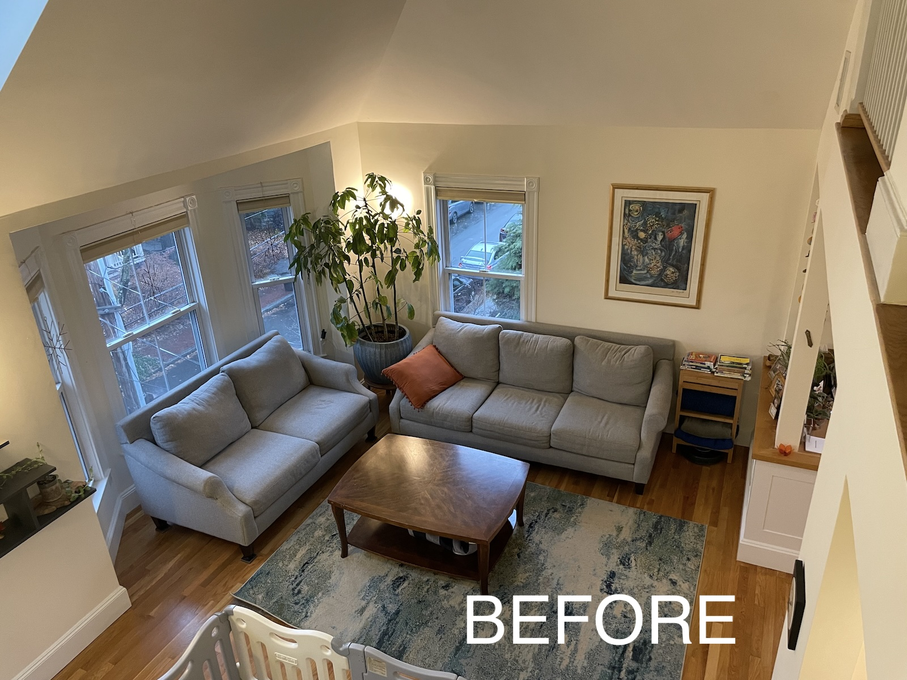{: .mx-auto.d-block :}

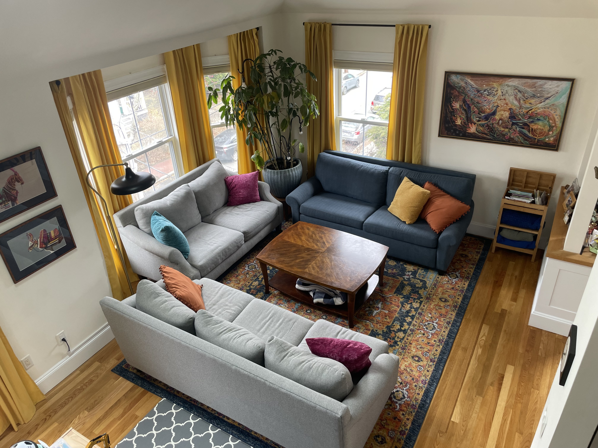{: .mx-auto.d-block :}

Notice that we kept the corner plant :deciduous_tree:, coffee table, couches, and blanket/books 
storage shelf (for now)! The two wall sconces were [removed and replaced](#lighting-in-a-tree) with switch-enabled 
outlets. :bulb:

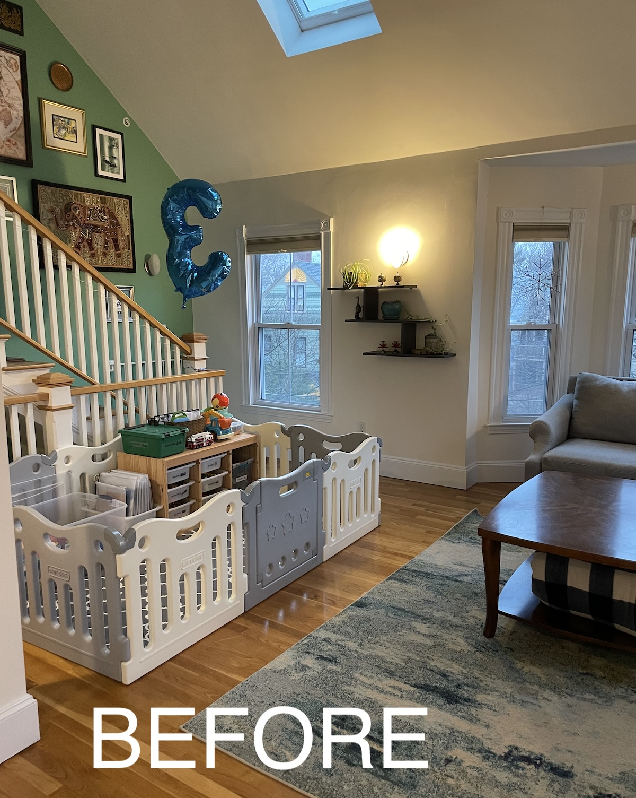{: .mx-auto.d-block :}

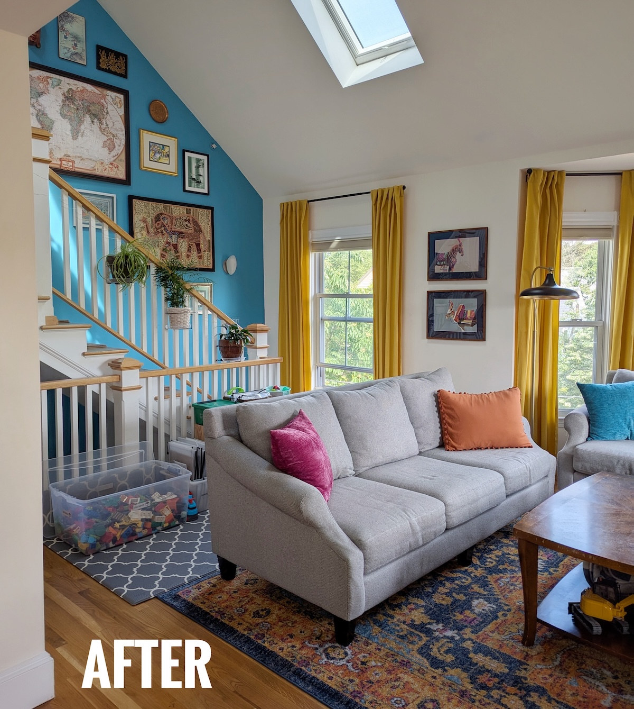{: .mx-auto.d-block :}

We removed that [great-for-childproofing-tchotchkes wall shelf](https://www.wayfair.com/storage-organization/pdp/zipcode-design-girouard-6-piece-accent-shelf-w004780316.html) because I kept 
hitting my head on it while picking up toys :face_with_head_bandage: :teddy_bear: and because it was blocking us from adding 
curtains to the side window. :window: We moved the plants into these [rail-mounted planters](https://www.amazon.com/dp/B0D79J6FYR) :potted_plant: (*aren't they awesome?!*),
but kept the [toys in the same place](../2022-12-30-toys) since it's still the perfect spot for them. :jigsaw: :bricks:

## The Design

I decided to try my luck with using [Havenly](https://havenly.com/) to get
some ideas for the space. My designer, [Mercedes Platas](https://havenly.com/interior-designers/mercedes-platas-14289), is a genius, 
and put together a design that incorporated the [sleeper sofa](https://www.americanleather.com/products/gaines/), 
existing sofas, and [art from Elena Kotliarker](https://www.elenakotliarker.com/) that I had been eyeing for years.
I never would have known how good [ochre (yellow) curtains](https://www.target.com/p/brylanehome-poly-cotton-canvas-back-tab-panel---48--w-96--l--ochre/-/A-90050366) 
could look in this room! :heart_eyes:

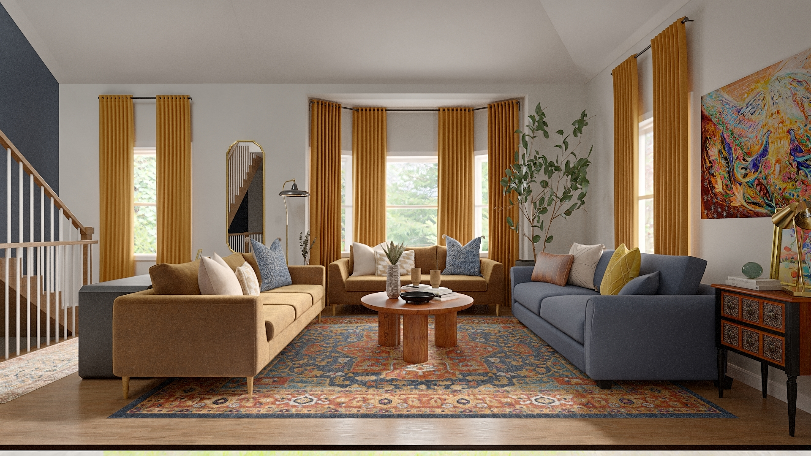{: .mx-auto.d-block :}

The dimensions weren't *quite* right (probably my mistake), and the sofa table and rug runner (left :point_up:) 
didn't actually fit, but I like the vibe!

## The Details

Home takes time. :house: Our living room is now in a semi-stable state, but I'll continue
to adapt it to fit our family's changing needs! **Keep reading** about my functional solutions
for this room:
- [hanging a complicated gallery wall](#framed_picture-evolution-of-the-gallery-wall-) :framed_picture:
- [leveling furniture on *super* slanted floors](#couch_and_lamp-3d-printed-furniture-levels) :couch_and_lamp:
- [customizing bay window curtain rods](#window-bay-window-curtains) :window:
- [installing lighting in a tree](#deciduous_tree-lighting-in-a-tree)! :deciduous_tree: :bulb:

### :framed_picture: Evolution of the Gallery Wall 

**Iteration 1.** When my husband and I first moved in together once we were married :ring: :person_with_veil:, we each came with a random assortment of 
artwork from our travels. :cambodia: :egypt: :thailand: :india: :vietnam: :israel: :nepal: :sri_lanka: :iran: :peru: I combined it all into a gallery wall in our first apartment in [Northampton, MA](https://en.wikipedia.org/wiki/Northampton,_Massachusetts) by laying the artwork
out on the floor onto craft paper, tracing the art, then taping the paper to the wall to put nails in. :framed_picture: :hammer:

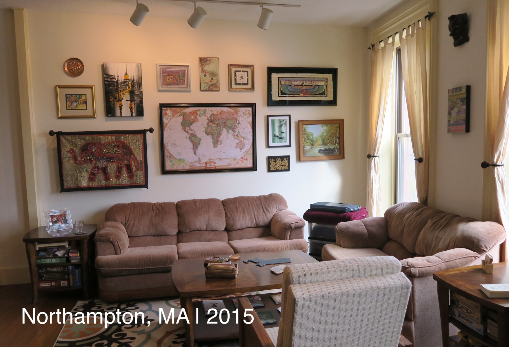{: .mx-auto.d-block :}

**Iteration 2.** I repeated the process when we moved into our tiny [Cambridgeport](https://en.wikipedia.org/wiki/Cambridgeport,_Cambridge,_Massachusetts) apartment in 2018.

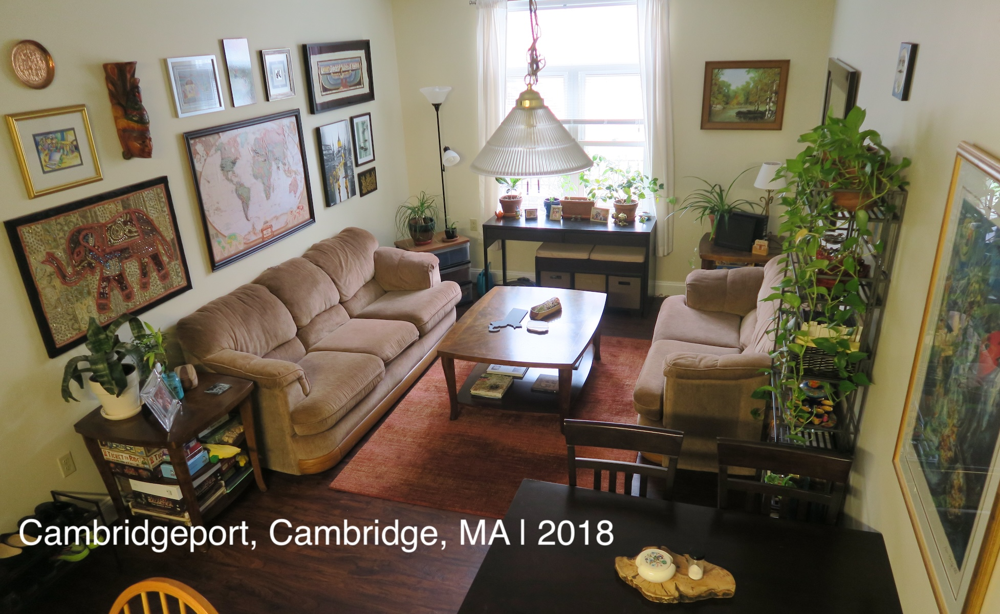{: .mx-auto.d-block :}

**Iteration 3.** And finally! Here is the gallery wall in our current condo. Hanging
all this over the staircase while keeping our necks intact was quite a feat! :ladder: :hammer: :face_with_head_bandage:
This time, I drew level +'s all over the craft paper and measured 40" up from
the stairs in order to lay the art out to arrange. I changed the wall color from [BM Stokes Forest Green](https://www.benjaminmoore.com/en-us/paint-colors/color/2035-40/stokes-forest-green) 
to [BM Ash Blue](https://www.benjaminmoore.com/en-us/paint-colors/color/2057-40/ash-blue),
which seems to work better in this north-facing room. :green_heart: :blue_heart:

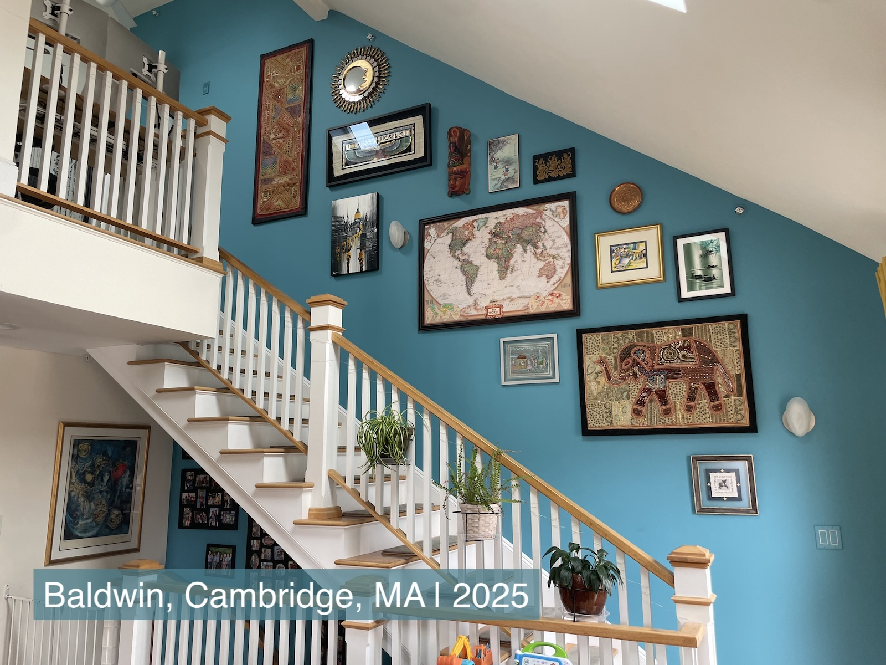{: .mx-auto.d-block :}

### :couch_and_lamp: 3D-Printed Furniture Levels

The floor in our 1890 condo slants *quite a bit* :face_with_spiral_eyes:, and the front of the sofa in the bay window 
was nearly two inches lower than the back. **(1)** I tried stacking furniture protector pads, which slid out of place and left sticky residue on the floor. :angry: 
**(2)** *Then* I got [anti-slip furniture casters](https://www.amazon.com/dp/B018H0NDRG)
and [wobble wedges](https://www.amazon.com/Wobble-Wedges-Rigid-Plastic-Shims/dp/B00435B9FS/?th=1), which were much better but kept collapsing... :shrug: 
**(3)** *Finally*, I designed [frames for the wobble wedges on TinkerCad](https://www.tinkercad.com/things/3RbVUoPeB7x-wobble-wedge-holder?sharecode=6Kn_11-EEqJm6C4Hw36rYxwQHIY3BJLc7ZpkYPgI5nE) and 3D printed them in [wood+PLA filament](https://www.amazon.com/dp/B088BRY1PN).
Success! :clap:

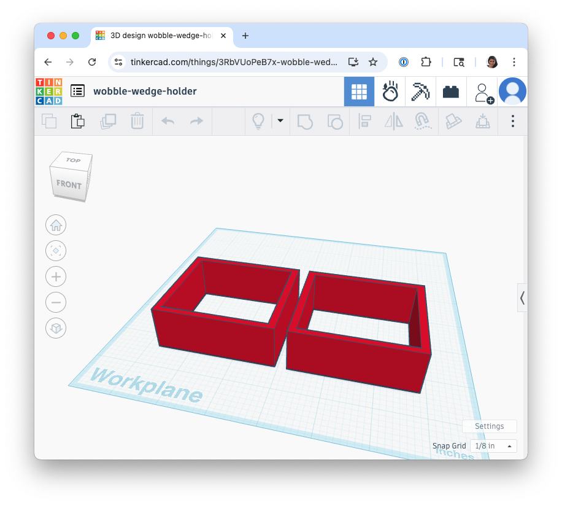{: .mx-auto.d-block :}

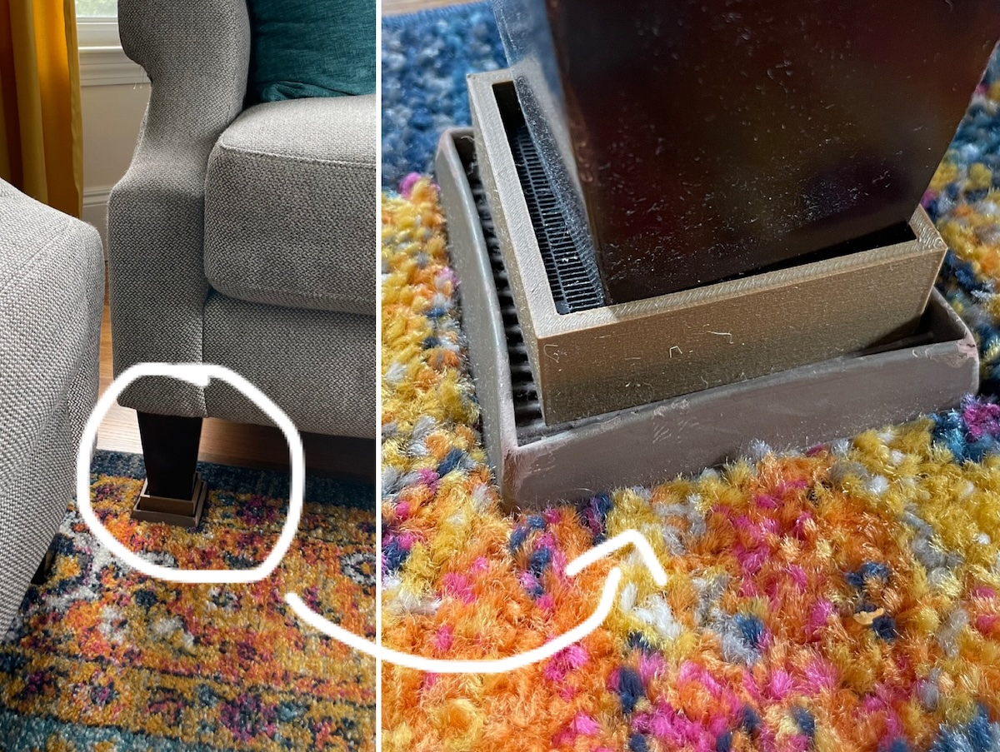{: .mx-auto.d-block :}

### :window: Bay Window Curtains

Our [design renderings](#the-design) were the *only thing* that convinced me to take on 
this project. :tipping_hand_woman:
I taped some [craft paper](https://www.michaels.com/product/paper-roll-by-recollections-24-x-20ft-10683716) to the ceiling of the bay window nook to copy the *exact size and angles*. 
Then, I used my [tabletop saw with metal-cutting blade](https://www.amazon.com/dp/B071P6GZN5?ref=ppx_yo2ov_dt_b_product_details&th=1) to cut the [curtain rods](https://www.target.com/p/36-34-66-34-cap-curtain-rod-oil-rubbed-bronze-threshold-8482/-/A-54567180) to size (accounting for the wall-to-rod distance of the 
[curtain hooks](https://www.amazon.com/dp/B08XYBQK7Y)), and connected the angles using these clever [angle connectors](https://www.amazon.com/dp/B08ZCCKPT2). 

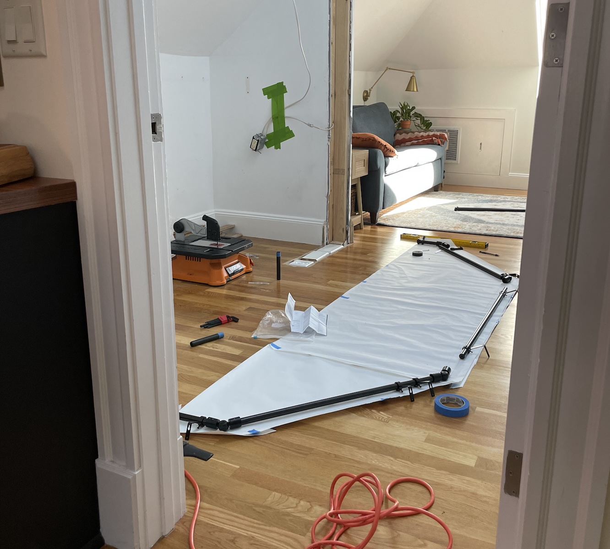{: .mx-auto.d-block :}

*Ta da!* :clap:

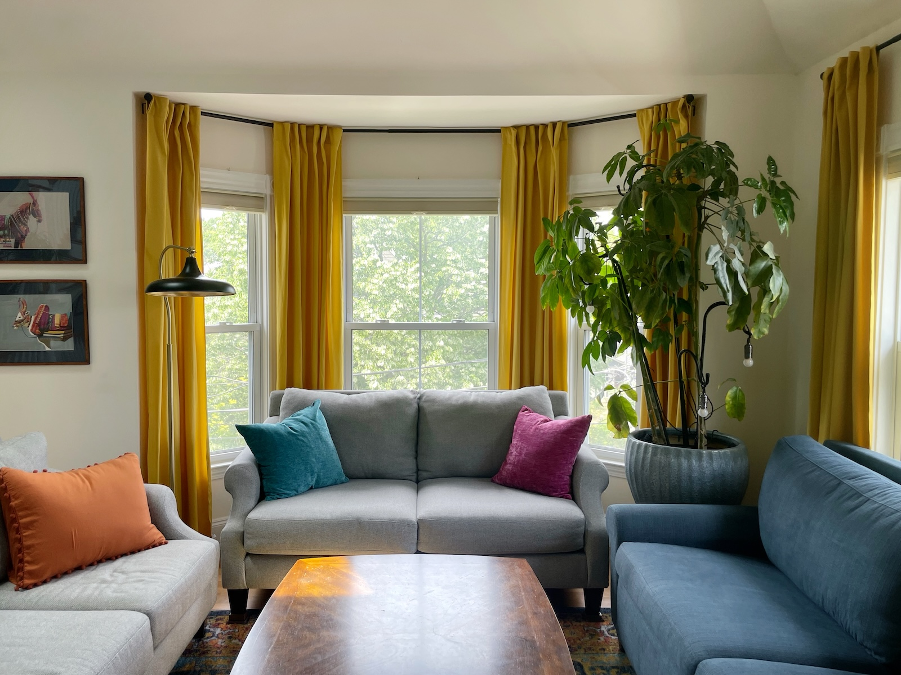{: .mx-auto.d-block :}

### :deciduous_tree: Lighting in a Tree

I had two (annoyingly placed) wall sconces removed and replaced with switch-operated outlets. The plant corner was too dark, though, 
so I installed these [four Shepherd's hooks](https://www.amazon.com/dp/B0881LM5Z1) directly into the [plant pot](https://www.amazon.com/dp/B07CTD9SDS) and strung up 
these [pendant light sockets](https://www.amazon.com/dp/B07XJN9KVR). 
I [experimented](https://www.amazon.com/dp/B0DBPFFTNJ) with 
[different](https://www.amazon.com/Gozelux-Equivalent-Dimmable-Brightness-Filament/dp/B0CLC8XRT4/ref=sr_1_1_sspa) 
[bulbs](https://www.amazon.com/dp/B07ZJ9V7XJ), and finally settled on 
[*low wattage, frosted bulbs*](https://www.amazon.com/dp/B0919JKD7F) that diffuse light :sparkle:, 
aren't blindingly bright at eye level :sunglasses:, and still look okay exposed during the daytime. :bulb:

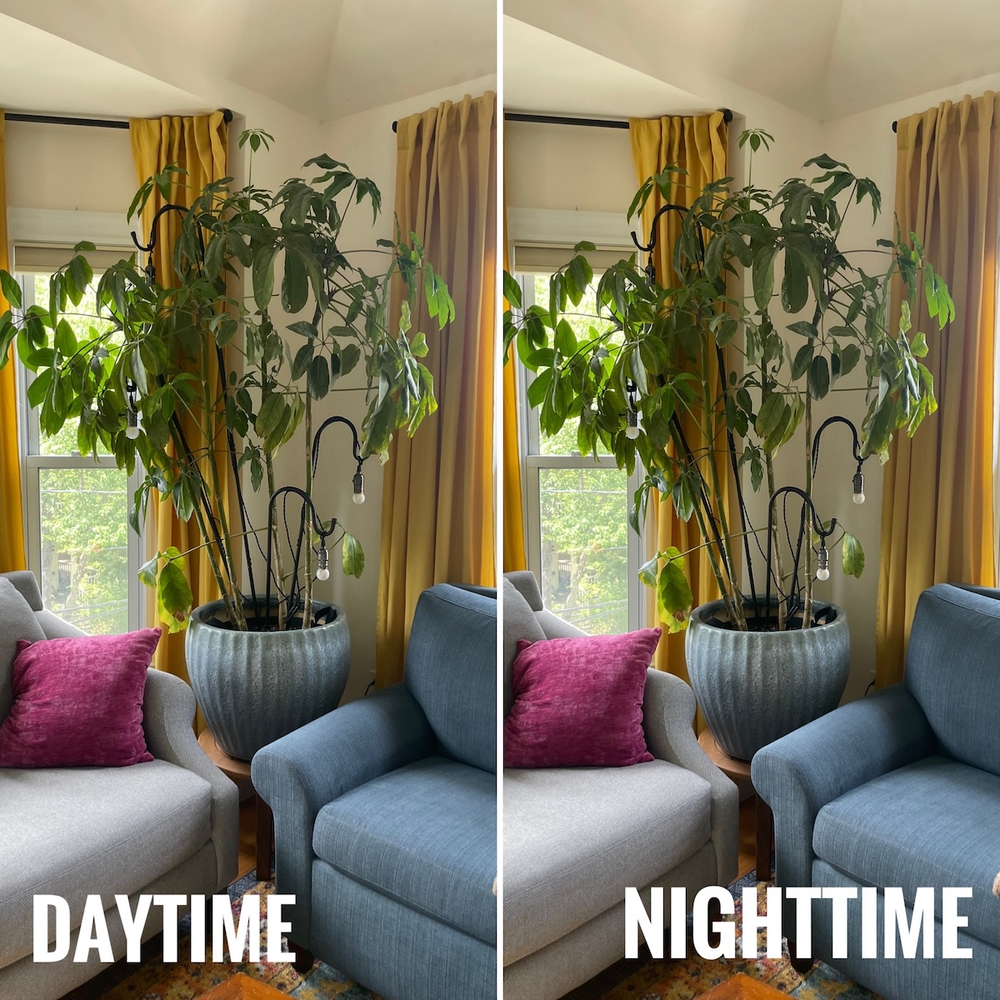{: .mx-auto.d-block :}

## Cost

Did I intend to redo the living room this year? *No!*
Remember that we were already installing a 
[custom wardrobe](../2025-03-01-wardrobe) and redoing the 
[master bedroom](../2025-03-15-master-bedroom) and my [kiddo's bedroom](../2025-05-12-kid-bedroom) during the **Big Move of 2025**... :money_with_wings: 

However, once I heard the quote for moving 
the sleeper sofa (see below), I realized that it was *now or never* to replace the [area rug](https://www.amazon.com/dp/B07CJ64MD5), since we'd never move that 
couch again. The process snowballed into changing up the entire room. :shrug: 

Here's one last "after" pic, though, to convince you (/me?!) that it was *all worth it!* :heart_eyes:

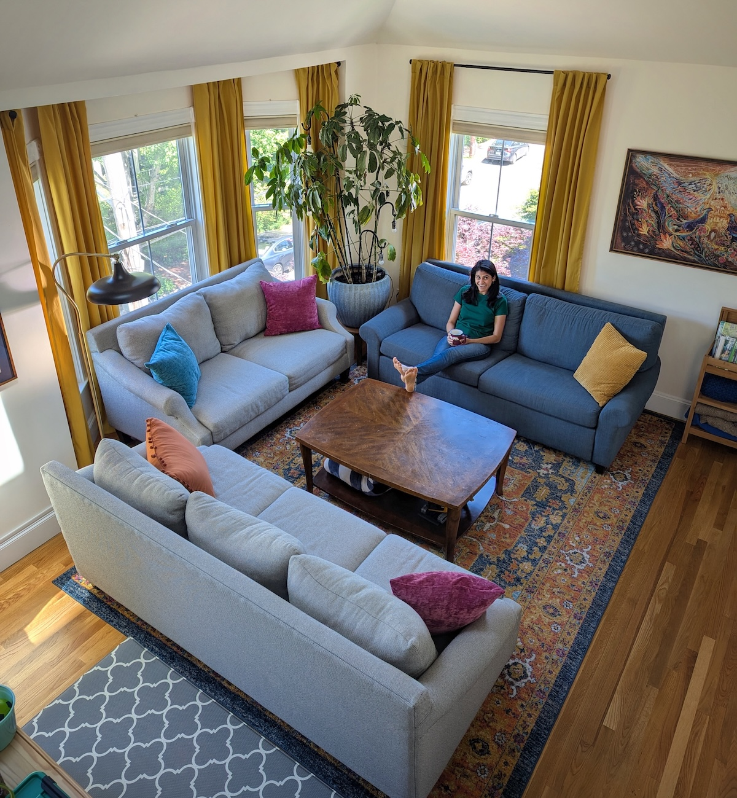{: .mx-auto.d-block :}

| Materials                                                                                                                                                       | Cost (+ tax/shipping) | 
|-----------------------------------------------------------------------------------------------------------------------------------------------------------------|-----------------------|
| painter to paint accent wall in [Benjamin Moore Ash Blue](https://www.benjaminmoore.com/en-us/paint-colors/color/2057-40/ash-blue) | $650.00               | 
| electrician to remove wall sconces & install switch-controlled outlets | $600.00               | 
| [Melo & Sons](http://meloandsons.com/) sleeper sofa relocation | $475.00               | 
| [Angel Wings #3 Spirit of Jerusalem stretched canvas print](https://fineartamerica.com/featured/the-angel-wings-3-spirit-of-jerusalem-elena-kotliarker.html) | $410.41               | 
| [RugPadUSA "Cloud Comfort" 7/16" custom rug pad](https://www.rugpadusa.com/products/cloud-comfort-7-16) | $295.76               | 
| 8 [yellow curtain panels](https://www.target.com/p/brylanehome-poly-cotton-canvas-back-tab-panel---48--w-96--l--ochre/-/A-90050366) | $266.96               | 
| [Safavieh Evoke 9'x12' area rug](https://www.amazon.com/dp/B07CJ64MD5) | $239.60               | 
| [Safavieh Stefan brass/black floor lamp](https://www.safaviehhome.com/products/safavieh-sh-stefan-floor-lamp-brass-goldsh) | $120.96               | 
| [custom framing](https://www.michaelscustomframing.com/) of stretched canvas | $100.30               | 
| Havenly design package | $99.50                | 
| [curtain rods](https://www.target.com/p/36-34-66-34-cap-curtain-rod-oil-rubbed-bronze-threshold-8482/-/A-54567180) | $74.38                | 
| [blue](https://www.amazon.com/dp/B07C1VSX1H), [yellow](https://www.amazon.com/dp/B088TB59NZ), and [magenta](https://www.amazon.com/dp/B0BZ3ZKWZY) pillow covers | $56.83                | 
| 3 [RailScapes clip-on rail planters](https://www.amazon.com/dp/B0D79J6FYR) | $53.11                | 
| [curtain rod angle connectors](https://www.amazon.com/dp/B08ZCCKPT2) | $38.22                | 
| [4-pack Shepherd's Hooks](https://www.amazon.com/dp/B0881LM5Z1) | $30.59                | 
| [4-pack throw pillow inserts](https://www.amazon.com/dp/B07TJYBLMG) | $26.74                | 
| [pendant light sockets](https://www.amazon.com/dp/B07XJN9KVR) | $23.36                | 
| [low watt bulbs](https://www.amazon.com/dp/B0919JKD7F) | $19.10                | 
| [curtain rod hanging hooks](https://www.amazon.com/dp/B08XYBQK7Y) | $19.10                | 
| [rug grippers](https://www.amazon.com/dp/B08B1DJR6X) | $13.80                |
| [BabyCare FunZone play pen](https://www.amazon.com/Baby-Care-Play-Mat-Grey/dp/B0789XTPCR/) (SOLD)                                                               | +$75                  |
| **TOTAL** | **$3538.72**          |