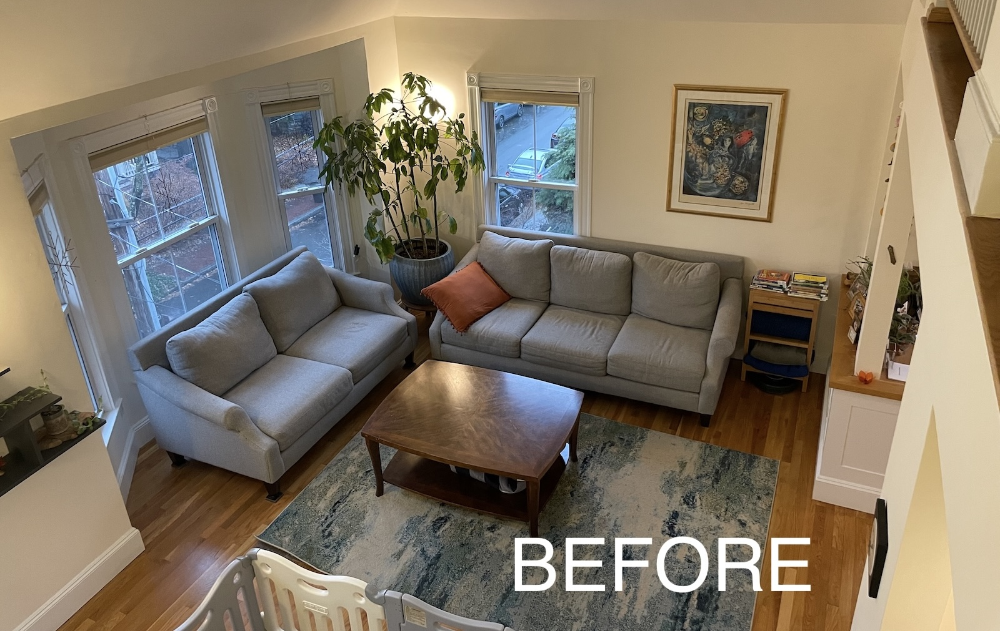

Part of our multi-step "Big Move of 2025" required moving our [sleeper sofa](https://www.americanleather.com/products/gaines/) from the 
upstairs guest room
into the downstairs living room. Great opportunity to redesign the space for our 
family's next kids-only-no-babies chapter!

## Before

Our living room wasn't *bad* before, it was just bare bones to [accommodate 
tiny babies](../2022-12-30-toys). Since our boys are now *kids*, I thought our living room should 
feel more like the cozy family hangout space that we actually use it for. 

{: .mx-auto.d-block :}

{: .mx-auto.d-block :}

## The Design

I decided to try my luck with using [Havenly](https://havenly.com/) to get
some ideas for the space. My designer, [Mercedes Platas](https://havenly.com/interior-designers/mercedes-platas-14289), is a genius, 
and put together a design that incorporated the [sleeper sofa](https://www.americanleather.com/products/gaines/), 
existing sofas, and [art from Elena Kotliarker](https://www.elenakotliarker.com/) that I had been eyeing for years.

{: .mx-auto.d-block :}

{: .mx-auto.d-block :}

## The Current Progress

Home takes time. Our living room is now in a semi-stable state, but it will continue
to evolve to meet our changing needs! 

{: .mx-auto.d-block :}

:construction: **Page under construction** :construction:

Stay tuned for further details about my solutions for curtains in the bay window, lighting, indoor plants, and 
the gallery wall!

## Cost

| Materials                                                                                                                                                       | Cost (+ tax/shipping) | 
|-----------------------------------------------------------------------------------------------------------------------------------------------------------------|-----------------------|
| painter to paint accent wall in [Benjamin Moore Ash Blue](https://www.benjaminmoore.com/en-us/paint-colors/color/2057-40/ash-blue) | $650.00               | 
| electrician to remove wall sconces & install switch-controlled outlets | $600.00               | 
| [Melo & Sons](http://meloandsons.com/) sleeper sofa relocation | $475.00               | 
| [Angel Wings #3 Spirit of Jerusalem stretched canvas print](https://fineartamerica.com/featured/the-angel-wings-3-spirit-of-jerusalem-elena-kotliarker.html) | $410.41               | 
| [RugPadUSA "Cloud Comfort" 7/16" custom rug pad](https://www.rugpadusa.com/products/cloud-comfort-7-16) | $295.76               | 
| 8 [yellow curtain panels](https://www.target.com/p/brylanehome-poly-cotton-canvas-back-tab-panel---48--w-96--l--ochre/-/A-90050366) | $266.96               | 
| [Safavieh Evoke 9'x12' area rug](https://www.amazon.com/dp/B07CJ64MD5) | $239.60               | 
| [Safavieh Stefan brass/black floor lamp](https://www.safaviehhome.com/products/safavieh-sh-stefan-floor-lamp-brass-goldsh) | $120.96               | 
| [custom framing](https://www.michaelscustomframing.com/) of stretched canvas | $100.30               | 
| Havenly design package | $99.50                | 
| [curtain rods](https://www.target.com/p/36-34-66-34-cap-curtain-rod-oil-rubbed-bronze-threshold-8482/-/A-54567180) | $74.38                | 
| [blue](https://www.amazon.com/dp/B07C1VSX1H), [yellow](https://www.amazon.com/dp/B088TB59NZ), and [magenta](https://www.amazon.com/dp/B0BZ3ZKWZY) pillow covers | $56.83                | 
| 3 [RailScapes clip-on rail planters](https://www.amazon.com/dp/B0D79J6FYR) | $53.11                | 
| [curtain rod angle connectors](https://www.amazon.com/dp/B08ZCCKPT2) | $38.22                | 
| [4-pack Shepherd's Hooks](https://www.amazon.com/dp/B0881LM5Z1) | $30.59                | 
| [4-pack throw pillow inserts](https://www.amazon.com/dp/B07TJYBLMG) | $26.74                | 
| [pendant light sockets](https://www.amazon.com/dp/B07XJN9KVR) | $23.36                | 
| [low watt bulbs](https://www.amazon.com/dp/B0919JKD7F) | $19.10                | 
| [curtain rod hanging hooks](https://www.amazon.com/dp/B08XYBQK7Y) | $19.10                | 
| [rug grippers](https://www.amazon.com/dp/B08B1DJR6X) | $13.80                |
| [BabyCare FunZone play pen](https://www.amazon.com/Baby-Care-Play-Mat-Grey/dp/B0789XTPCR/) (SOLD)                                                               | +$75                  |
| **TOTAL** | **$3538.72**          |