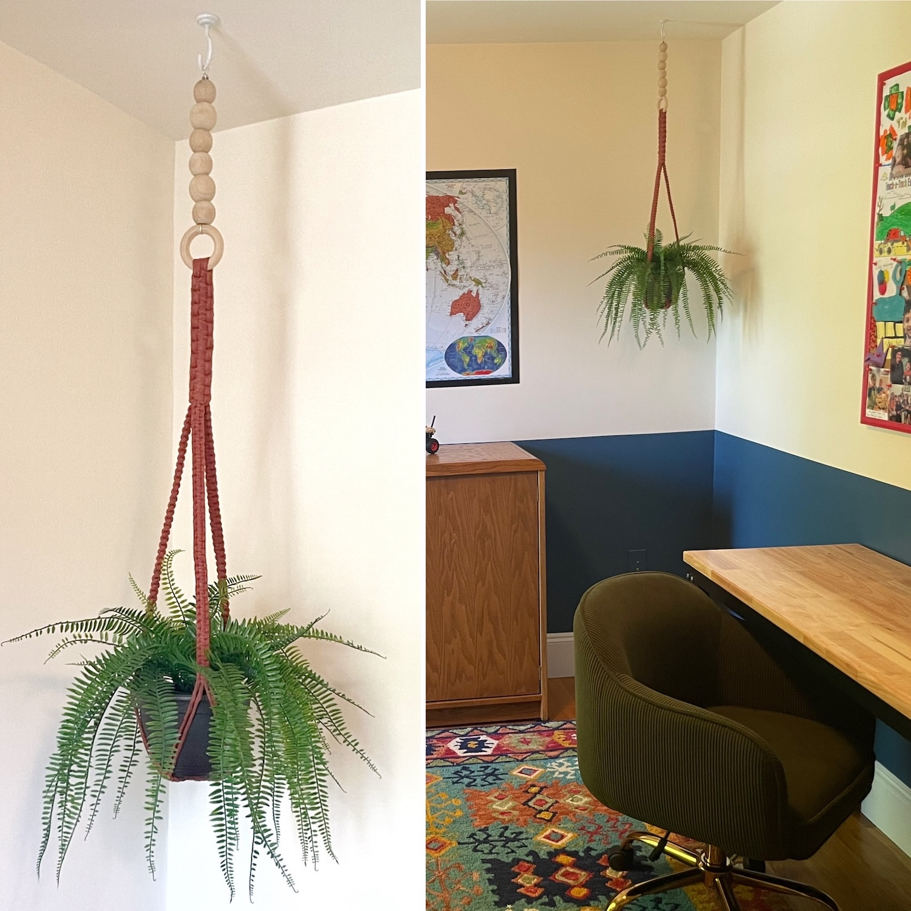

Perhaps my most controversial purge decision yet... I demoed the only closet in our
kiddo's soon-to-be bedroom. :scream: In my defense, (American) closets are just an [opportunity for
hoarding junk](https://civicscience.com/many-americans-ready-to-purge-their-closets/) :teddy_bear: :package:, and this 
particular closet totally crushed the flow of the room. :face_with_spiral_eyes:

## :construction: **Page (and also the room! :zany_face:) under construction** :construction:

**Jump ahead to see** the [argument for axing the closet](#why-axe-the-closet),
[before and after pictures](#before--afters), [construction process](#the-process), and all the [artsy details](#the-details)!

## Why axe the closet?

In the **original layout**, the main door opened into a wall. :no_entry:
The swing-open closet doors crushed the square footage, and replacing them with
sliding doors made accessing the closet frustrating. I also cannot stand having 
your [back to the main door](https://www.thespruce.com/feng-shui-lucky-directions-for-desk-or-bed-3975235#:~:text=Avoid%20Certain%20Positions,and%20creativity%20in%20your%20work) when at the desk. *We can do better.* :muscle: 

{: .mx-auto.d-block :}

In the **new layout**, the bed is tucked against [the east wall](https://redlotusletter.com/the-east-corner-of-health-growth-and-family/)
into a darker corner of the room. :sleeping: :moon: The 
[view from all other seats](https://www.newsweek.com/feng-shui-expert-furnish-room-command-position-1602833) is also much better! There is still the potential for underbed 
storage, and I found a [great dresser](#dresserwardrobe) for clothes. :shirt:

{: .mx-auto.d-block :}

> While planning this room, I discovered 
> [Cliff Tan's "Feng Shui Modern"](https://www.bloomsbury.com/us/feng-shui-modern-9781526639998/),
> which validated what "felt right" and provided a fantastic framework for spatial arrangement! :lotus_position: :yin_yang: :relieved:

## Before & Afters

I wanted the room to vibe with our [newly redecorated living room](../2025-04-12-living-room). *Mission accomplished!* :rocket: :yellow_heart: :blue_heart:

{: .mx-auto.d-block :}

{: .mx-auto.d-block :}

And here's the side with the (former) closet. We moved our clothes into a 
[custom wardrobe](../2025-03-01-wardrobe)
upstairs in the 
[new master bedroom](../2025-03-15-master-bedroom). Our kid's clothes are in his [new dresser](#dresserwardrobe)! :shirt: :jeans: :necktie:

{: .mx-auto.d-block :}

{: .mx-auto.d-block :}

## The Process

**Step 1: Soundproofing.** The walls were empty/thin enough to hear someone rolling over in bed between the bedrooms. :ear:
We added [Rockwool soundproofing insulation](https://www.homedepot.com/pep/ROCKWOOL-Safe-n-Sound-3-in-x-15-1-4-in-x-47-in-Soundproofing-and-Fire-Resistant-Stone-Wool-Insulation-Batt-59-7-sq-ft-RXSS31525/202531875)
on the leftmost wall (bordering the kitchen), followed by [1 lb mass loaded vinyl](https://www.homedepot.com/p/Technoflex-4-ft-x-10-ft-x-1-8-in-1-lb-Technowall-Mass-Loaded-Vinyl-Soundproofing-Barrier-Acoustic-Wall-MLV104810/325283436)
and finished up with [new plaster](https://www.masterclass.com/articles/plaster-vs-drywall-explained). 
The other interior (drywall) walls got 
[cellulose blown-in insulation](https://www.homedepot.com/pep/Greenfiber-25-lbs-Cellulose-Blown-In-Insulation-or-Spray-Applied-Insulation-INSSANC/311574454). :hear_no_evil: :shushing_face:

**Step 2: Floor patching.** Matching the hardwood to patch the floor was the most annoying. 
Luckily, contractors who demoed the [upstairs closet to make space for our wardrobe](../2025-03-01-wardrobe)
pulled up some of the hardwood that we were able to patch in here.

{: .mx-auto.d-block :}

**Step 3: (Re)painting.** Turns out, *plaster needs to cure*
before it can be painted, and [special primer](https://www.wickes.co.uk/Wickes-Trade-Matt-Emulsion-Paint-for-New-Plaster---Pure-Brilliant-White---10L/p/122443) needs to be used. Even [high quality painter's tape](https://www.frogtape.com/products/delicate-surface-painters-tape) will still 
rip off paint if the first paint coat doesn't cure long enough! *...Ask me how I know...* :roll_eyes: :woozy_face:

{: .mx-auto.d-block :}

## The Details

And now for the little projects that make this space feel like home! :blush:

### Bulletin Board

*Of course* a kid's room *needs* a [bulletin board](https://www.amazon.com/dp/B09GYQ88L9)!! The basic wood frame
was too *grown-up* for a *6-year-old* (in my and his opinion), so I painted it with 
red acrylic paint and sealed it with 
polyurethane. :art: :artist: *How fun!*

{: .mx-auto.d-block :}
:point_up: *An aside, a [sturdy workbench](https://havenly.com/products/details/Workbench-Rolling-Workbenches-For-Garage-Adjustable-Height-Wayfair-143767843) 
is WAY more functional for art projects, crafts, and Lego building than a traditional desk. 
You can also adjust the height as kids grow and eventually use it for homework and/or a computer.*

### Switchplates

I'll admit... this was extra. :shrug: I used [Samplize peel-and-stick color swatches](https://samplize.com/products/lucerne-af-530-12x12?variant=39756341837926) to 
cover the switchplates and [cable covers](https://www.amazon.com/dp/B07RZQXRQK) in [Benjamin Moore Lucerne](https://www.benjaminmoore.com/en-us/paint-colors/color/af-530/lucerne). 
I didn't need to sand/prime/paint anything, and we can easily change up the color (if ever needed).

{: .mx-auto.d-block :}

Ah, so satisfying... :lotus_position:

{: .mx-auto.d-block :}

{: .mx-auto.d-block :}

### Hanging Planter 

Apparently [this fantastic color](https://vintageunscripted.com/10-decades-of-color-the-1970s/#:~:text=The%201970s%20was%20the%20first%20great%20houseplant%20collecting%20era) is *vintage 70s*, 
which I'm starting to realize is my favorite decade for design. 🪩 :man_dancing:
The [macramé hanger](https://www.etsy.com/listing/1269880196/no-tassel-macrame-plant-hanger-in-colors?variation0=2803425809&variation1=2836434719) was shorter than I expected, 
so I drilled holes through
some [wooden craft balls](https://www.michaels.com/product/wood-head-beads-by-creatology-10334889) and strung them onto the 
hanger. 

{: .mx-auto.d-block :}

{: .mx-auto.d-block :}

:point_up: <i>From <a href="https://vintageunscripted.com/10-decades-of-color-the-1970s">Vintage Unscripted</a>, 1970s-style macramé plant hangers.</i>

### Glow-in-the-Dark Stars

I have to admit that the '90s had something going for it design-wise, though... [glow-in-the-dark stars](https://www.amazon.com/dp/B0085092R4)!!! :star: :star2: 
My kid *loves them*. Putting these up is not for the faint of heart; you have to stick adhesive putty on each one individually... :unamused: :face_exhaling:

### Dresser/Wardrobe

Stay tuned to see how I added handles to the wardrobe and arranged clothes into clothes bins!

## Cost

| Materials                                                                                                                                                                                                             | Cost (+ tax/shipping) | 
|-----------------------------------------------------------------------------------------------------------------------------------------------------------------------------------------------------------------------|-----------------------|
| closet demolition, floor patching, soundproofing walls (Rockwool + mass-loaded vinyl), plastering                                                                                                                     | $4440.00              | 
| wall repair, priming, painting in [BM Bare](https://www.benjaminmoore.com/en-us/paint-colors/color/oc-98/bare) (top) and [BM Lucerne](https://www.benjaminmoore.com/en-us/paint-colors/color/af-530/lucerne) (bottom) | $1700.00              | 
| [Gabrietta 2-drawer nightstand](https://havenly.com/products/details/Gabrietta-2-Drawer-Nightstand-Medium-Oak-Black-Safavieh-Couture-151813266)                                                                       | $294.84               | 
| [workbench as desk](https://havenly.com/products/details/Workbench-Rolling-Workbenches-For-Garage-Adjustable-Height-Wayfair-143767843)                                                                                | $273.99               | 
| [Arlo Home 8'x10' area rug](https://havenly.com/products/details/Arlo-Home-Hand-Tufted-Area-Rug-APN503A-Blue-Red-8-X-10-Safavieh-72810857)                                                                            | $259.20               | 
| [Zinus mattress](https://www.amazon.com/dp/B0CKYYT6VY)                                                                                                                                                                | $191.24               |
| [olive green swivel office chair](https://www.wayfair.com/Mercer41--Dinorah-Velvet-Office-Swivel-Chair-Height-Adjustable-X221006184-L10-K~W110995073.html)                                                     | $150.86               | 
| [Quince Indigo Blue duvet cover](https://www.quince.com/home/linen-duvet-cover?color=indigo-blue&size=full%2Fqueen)                                                                                                   | $142.72               | 
| [Zinus metal bed frame](https://www.amazon.com/dp/B00WNF67DO)                                                                                                                                                         | $113.68               |
| 3 [patent prints](https://fineartamerica.com/profiles/denny-h/collections/patent+art)                                                                                                                                 | $86.60                | 
| [wall-mounted full length mirror](https://www.amazon.com/dp/B0D6QFRN13)                                                                                                                                               | $84.99                | 
| [Big Joe bean bag chair](https://havenly.com/products/details/Big-Joe-Hug-Bean-Bag-Chair-Wayfair-54394491)                                                                                                            | $84.99                | 
| custom hem and curtain trim                                                                                                                                                                                           | $80.00                | 
| 2 [full sheet sets](https://www.target.com/p/cgk-linens-4-piece-microfiber-sheet-set-in-blue-stripes-size-full/-/A-89140441?preselect=89140441)                                                                       | $70.10                |
| [clothes drawer organizers](https://www.amazon.com/dp/B0D3DSQ5Z1)                                                                                                                                                     | $69.04                |
| [blackout ochre shades](https://www.amazon.com/dp/B0BXRNCZFR)                                                                                                                                                         | $65.82                | 
| [clear fillable side table lamp](https://www.amazon.com/dp/B0C277GJDB?th=1)                                                                                                                                           | $53.74                | 
| [3-pack gallery frames](https://www.michaels.com/product/3-pack-gallery-11-x-14-black-frame-with-mat-by-studio-decor-10738538)                                                                                        | $53.11                |
| [blackout curtain rods](https://www.target.com/p/28-34-48-34-loft-by-umbra-room-darkening-curtain-rod-darjeeling-bronze/-/A-14104935)                                                                                 | $52.04                | 
| [3'x4' bulletin board](https://www.amazon.com/dp/B09GYQ88L9)                                                                                                                                                          | $49.82                | 
| [paint sample sticky sheets](https://samplize.com/products/lucerne-af-530-12x12)                                                                                                                                      | $46.88                | 
| wardrobe (FB Marketplace)                                                                                                                                                                                             | $35.00                | 
| [rust macrame plant hanger](https://www.etsy.com/listing/1269880196/no-tassel-macrame-plant-hanger-in-colors?variation0=2803425809&variation1=2836434719) | $34.59                |
| [Loloi Not Named rust/multi throw pillow](https://havenly.com/products/details/Loloi-Not-Named-Rust-Multi-12-x-27-Cover-w-Poly-Loloi-Rugs-149052879)                                                                  | $33.60                | 
| [laminated world map](https://www.amazon.com/dp/0792283090)                                                                                                                                                           | $31.82                | 
| [mattress protector](https://www.amazon.com/dp/B08P2RG7ZM)                                                                                                                                                            | $30.70                | 
| [2-pack queen/standard pillows](https://www.amazon.com/dp/B09DSRLTQH)                                                                                                                                                 | $28.68                | 
| [glow-in-the-dark stick on stars](https://www.amazon.com/dp/B00009ENDT)                                                                                                                                               | $22.74                | 
| [handles for wardrobe](https://www.amazon.com/gp/product/B09K3PW3N8)                                                                                                                                                  | $18.05                | 
| [10' extension cord](https://www.amazon.com/dp/B0DPKKMPBD)                                                                                                                                                            | $14.86                | 
| [2-pack pillow protectors](https://www.amazon.com/dp/B08GKKKJ1H)                                                                                                                                                      | $8.60                 | 
| [anti-tip furniture anchors](https://www.amazon.com/dp/B092332ZM7) for wardrobe                                                                                                                                       | $8.49                 |
| [poster-hanging command strips](https://www.amazon.com/dp/B00BT0MW4W) | $7.35                 |
| [red thumb tacks](https://www.amazon.com/dp/B073TW1G8G)                                                                                                                                                               | $6.62                 |
| [wooden craft beads](https://www.michaels.com/product/wood-head-beads-by-creatology-10334889) | $2.41                 |
| [Ikea fake potted fern](https://www.ikea.com/us/en/p/fejka-artificial-potted-plant-indoor-outdoor-fern-30433945/) (already had) | 0 |
| red acrylic paint for bulletin board border (already had)                                                                                                                                                             | 0                     | 
| water-based polyurethane (already had)                                                                                                                                                                                | 0                     | 
| [white wool rug](https://www.amazon.com/Hauteloom-Huddlesford-Boho-Woven-Textured/dp/B086CDXF8N) (SOLD)                                                                                                               | +$75.00               |
| Ikea Brimnes [4-drawer chests](https://www.ikea.com/us/en/p/brimnes-4-drawer-chest-white-20572833) and [nightstands](https://www.ikea.com/us/en/p/brimnes-nightstand-white-10234942/) (SOLD)                          | +$200.00              | 
| **TOTAL**                                                                                                                                                                                                             | **$8372.17**          | 

Setting up our kid's room was the last big project of our **Big Move of 2025!** To relocate our bedroom
upstairs into the [master bedroom](../2025-03-15-master-bedroom) :bed:, 
we [built a custom wardrobe](../2025-03-01-wardrobe) :shirt: :dress: and
[redesigned our living room](../2025-04-12-living-room) to accommodate new furniture :couch_and_lamp:. *Time for the family to enjoy our new space!* :yellow_heart: :blue_heart: :orange_heart: :green_heart: