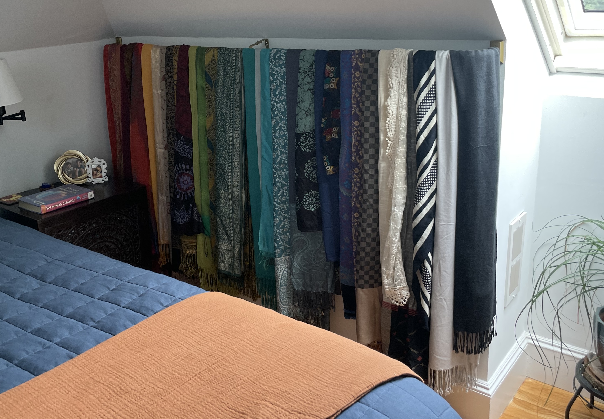

Even collections can be optimized. :raised_eyebrow: I admit, hoarding scarves might be off-brand for me, but I do love (and sometimes even wear!) them. :scarf: You know what's on-brand, though? Designing and building a super-custom, super-functional and super-pretty scarf display! :screwdriver: :star_struck: 

## Iteration 1: Over-the-Door
My scarves used to be stored in an [over-the-door clear shoe organizer](https://www.amazon.com/Simple-Houseware-Pockets-Hanging-Organizer/dp/B07CG2R9ST?th=1). :door: :shoe: 

{: .mx-auto.d-block :}
*:point_up: In our previous Cambridgeport apartment.*

* :heavy_check_mark: **Pros.** No permanent installation (great for rentals)! Easy to take scarves out and put back. 
* :x: **Cons.** Looks messy and is hard to find scarves when pockets are overflowing with 2+ scarves apiece. Installation requires a door far from sunny windows. :sun_with_face:

## Iteration 2: Curtain rod

**Constraint #1.** The only door in our [upstairs master bedroom](../2025-03-15-masted-bedroom) was flooded with light, so I worried about the scarves fading there.  
**Constraint #2.** There wasn't a good spot for my scarves in our new [clothes wardrobe](../2025-03-01-wardrobe), either! 

{: .mx-auto.d-block :}

**Two :owl: :parrot:, one :rock: ?!** We also had a *super-ugly* (but in a dark corner!) furnace access panel right next to the bed. :yawning_face: :weary: SOOOO...

{: .mx-auto.d-block :}

I put up a [curtain rod](https://www.amazon.com/dp/B0BBGQYLHL) to hang my scarves on instead.

{: .mx-auto.d-block :}

* :heavy_check_mark: **Pros.** Pretty enough! Easy to see all scarves at once. Covers the ugly furnace access panel. :raised_hands:
* :x: **Cons.** Hard to put scarves *back*, and looks messy when I try. Accessing the panel also required taking all scarves off... :persevere:

**Function >> form, *always.*** You know me. If accessing the furnace *and* the scarves was a pain, we needed a better solution. :woman_mechanic: :construction_worker_woman:

## Iteration 3: Custom swivel arms! 

I bought a strip of primed 1x4" wood from Home Depot :wood:, cut it to size (79"), painted it to [match the wall](https://www.benjaminmoore.com/en-us/paint-colors/color/oc-67/ice-mist) :woman_artist:, then screwed in [2.5" hinges](https://www.amazon.com/dp/B099S284GF), spaced ~1.5" apart,
and attached [8" stainless steel hooks](https://www.amazon.com/dp/B0DP6VT1K7) to each hinge with [double-sided, heavy-duty adhesive tape](https://www.amazon.com/Mounting-Removeable-Adhesive-Waterproof-Picture/dp/B09XLHCSP4) and [3mm Chicago screws/buttons/rivets](https://www.amazon.com/dp/B0BVL9T7BK). :screwdriver:

{: .mx-auto.d-block :}

Since I attached the entire contraption to the wall using [18" French cleats](https://www.amazon.com/dp/B08P7HLZBV), I can lift the organizer off the wall if needed for furnace access! :muscle:

{: .mx-auto.d-block :}

CHECK IT OUT! :heart_eyes: I left every fourth hook empty to (1) accommodate an expanding scarf collection :smiling_imp: and (2) so that the scarves I had covered the length of the wall. I also put white(r) scarves closer to the window just incase they got more light exposure.

{: .mx-auto.d-block :}

Andddddd I can easily fold over the hooks to access scarves one at a time and put them back without making a mess! :scarf: :clap:

{: .mx-auto.d-block :}

## Cost 

Totally worth it! And even better, it turned into a fun little afternoon project with my kids. :boy: *What could be better?* :blush:

{: .mx-auto.d-block :}

| Materials | Cost (+ tax/shipping) | 
|---|---:|
| 2 [18" French cleats](https://www.amazon.com/dp/B08P7HLZBV) | $33.90 | 
| 48 [2.5" hinges](https://www.amazon.com/dp/B099S284GF) | $27.07 | 
| [8" stainless steel hooks](https://www.amazon.com/dp/B0DP6VT1K7) | $23.17 | 
| 1x4 8' primed board | $11.14 | 
| 50 [3mm Chicago screws/buttons/rivets](https://www.amazon.com/dp/B0BVL9T7BK) | $9.55 |
[double-sided, heavy-duty adhesive tape](https://www.amazon.com/Mounting-Removeable-Adhesive-Waterproof-Picture/dp/B09XLHCSP4) (already owned) | $0 |
| **TOTAL** | **$104.83** |
