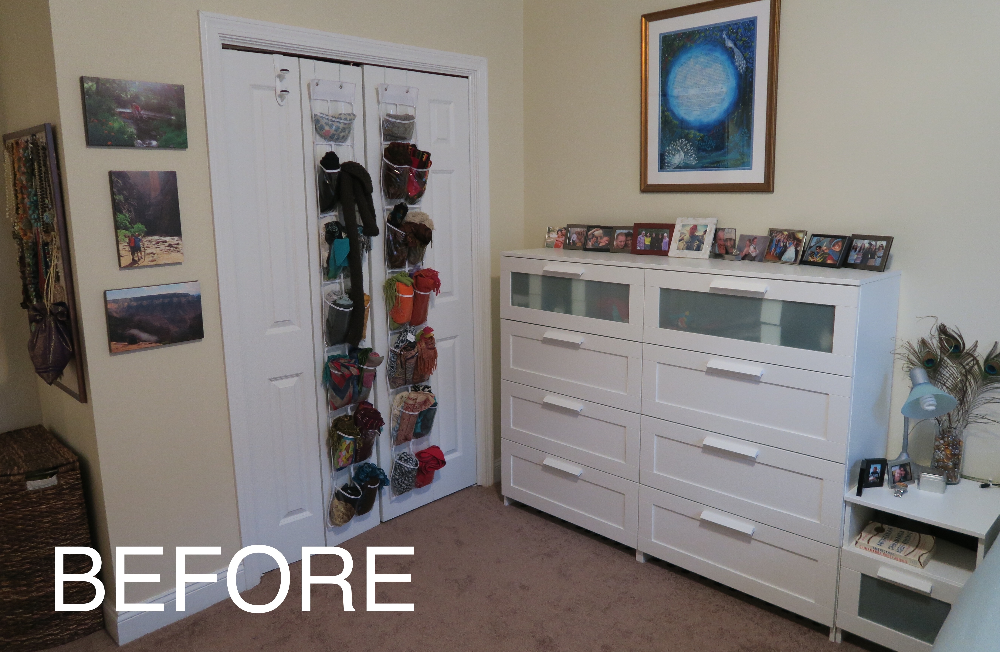

Even collections can be optimized. Yes, I admit, hoarding scarves might be wildly off-brand for me, but I love (and wear!) them. You know what's on-brand, though? Designing and building a super-custom, super-functional and super-pretty scarf display! :star_struck: :scarf: 

## Solution 1: Over-the-Door
My scarves used to be stored in an [over-the-door clear shoe organizer](https://www.amazon.com/Simple-Houseware-Pockets-Hanging-Organizer/dp/B07CG2R9ST?th=1):

{: .mx-auto.d-block :}
*:point_up: In our previous Cambridgeport apartment.*

| Pros | Cons | 
| --- | --- | 
| :heavy_check_mark: Easy to pull out and put back! | :x: Can be difficult to find scarves that are doubled up | 
| :heavy_check_mark: Pretty? | :x: Can look messy when pockets are overflowing | 
| :heavy_check_mark: No permanent installation, so great for rentals | :x: Requires door(s) away from sunny windows :sun_with_face: :door: | 

## Solution 2: Curtain rod

When we moved our [master bedroom upstairs](../2025-03-15-masted-bedroom), my scarves didn't work easily in our [clothes wardrobe](../2025-03-01-wardrobe). I put up a [curtain rod](https://www.amazon.com/dp/B0BBGQYLHL) in a (sun-deprived) corner of the room to cover up a *super ugly* (I'm not exaggerating) furnace access panel: 

{: .mx-auto.d-block :}

Ah, imagine falling asleep next to this instead: 

{: .mx-auto.d-block :}

| Pros | Cons | 
|---|---|
| :heavy_check_mark: Pretty! | :x: Looks messy every time a scarf is taken down to use. |
| :heavy_check_mark: Easy to find and grab what you want | :x: Hard to put back | 
| :heavy_check_mark: **Covered up the ugly furnace access panel** | :x: Accessing said panel required taking all the scarves off | 

Here's the thing, though. Function >>>> form (of course), and accessing the furnace *and* for accessing scarves was a pain in the :peach:. :scarf:

## Solution 3: Custom swivel arms! 

I bought a strip of wood from Home Depot :wood:, cut it to size (79"), painted it to [match the wall](https://www.benjaminmoore.com/en-us/paint-colors/color/oc-67/ice-mist) :woman_artist:, then screwed in 48 [2.5" hinges](https://www.amazon.com/dp/B099S284GF), spaced ~1.5" apart,
and attached [8" stainless steel hooks](https://www.amazon.com/dp/B0DP6VT1K7) to each hinge with [double-sided, heavy-duty adhesive tape](https://www.amazon.com/Mounting-Removeable-Adhesive-Waterproof-Picture/dp/B09XLHCSP4) and [3mm Chicago screws/buttons/rivets](https://www.amazon.com/dp/B0BVL9T7BK). :screwdriver:

{: .mx-auto.d-block :}

Since I attached the entire contraption to the wall using 2 [18" French cleats](https://www.amazon.com/dp/B08P7HLZBV), I can lift the organizer off the wall if needed for furnace access!

{: .mx-auto.d-block :}

CHECK IT OUT! :heart_eyes:

{: .mx-auto.d-block :}

Andddddd I can easily fold over the hooks to access scarves one at a time and put them back without making a mess! 

{: .mx-auto.d-block :}

## Cost 

Worth the cost, and there was even an added bonus of an afternoon well-spent with my kiddos helping me screw it all together! 

| Materials | Cost (+ tax/shipping) | 
|---|---|
| 2 [18" French cleats](https://www.amazon.com/dp/B08P7HLZBV) | $33.90 | 
| 48 [2.5" hinges](https://www.amazon.com/dp/B099S284GF) | $27.07 | 
| [8" stainless steel hooks](https://www.amazon.com/dp/B0DP6VT1K7) | $23.17 | 
| 1x4 8' primed board | $11.14 | 
| 50 [3mm Chicago screws/buttons/rivets](https://www.amazon.com/dp/B0BVL9T7BK) | $9.55 |
[double-sided, heavy-duty adhesive tape](https://www.amazon.com/Mounting-Removeable-Adhesive-Waterproof-Picture/dp/B09XLHCSP4) (already owned) | $0 |
| **TOTAL** | **$104.83** |
