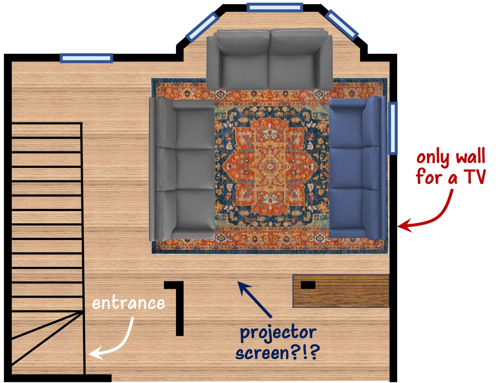
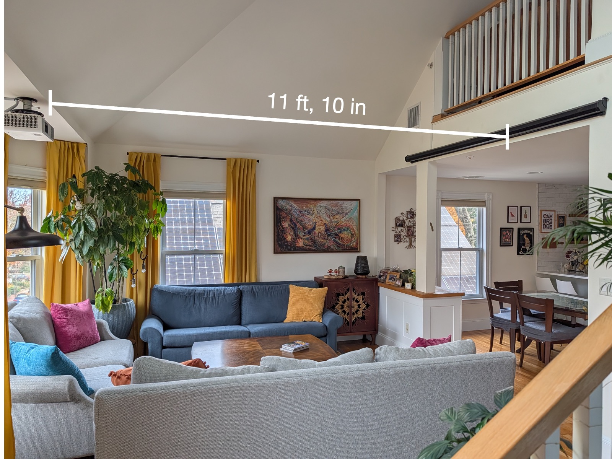
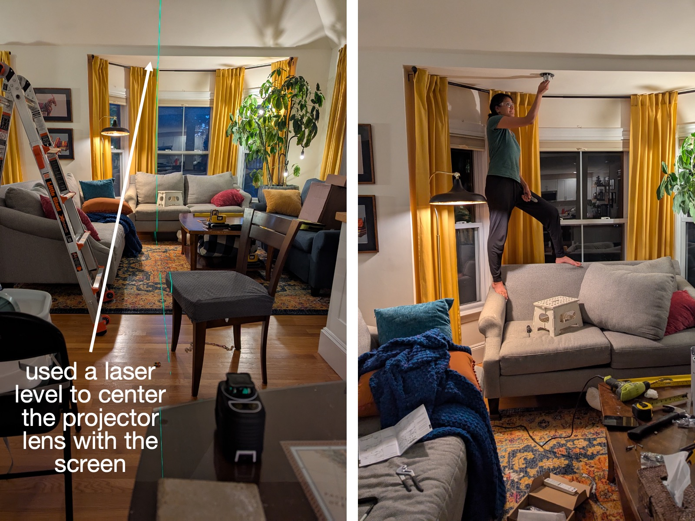
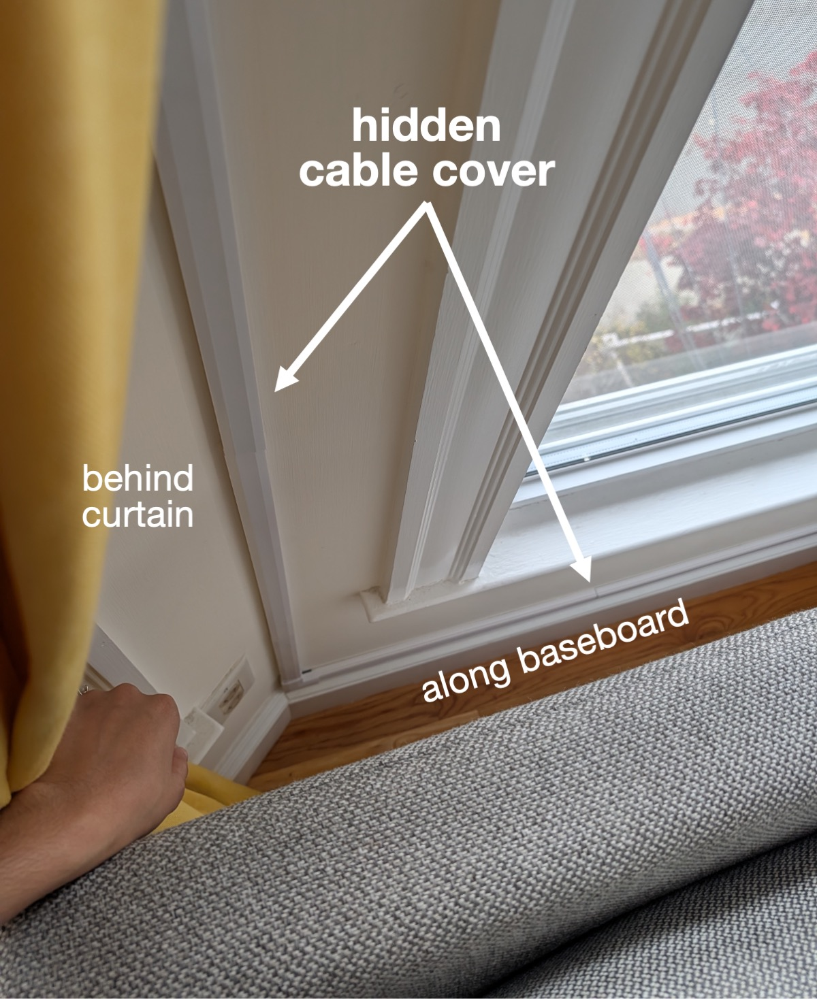
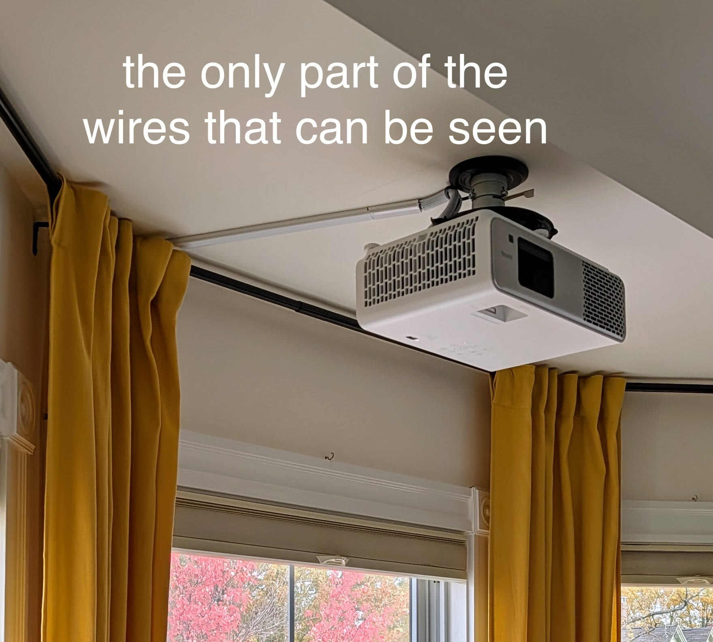
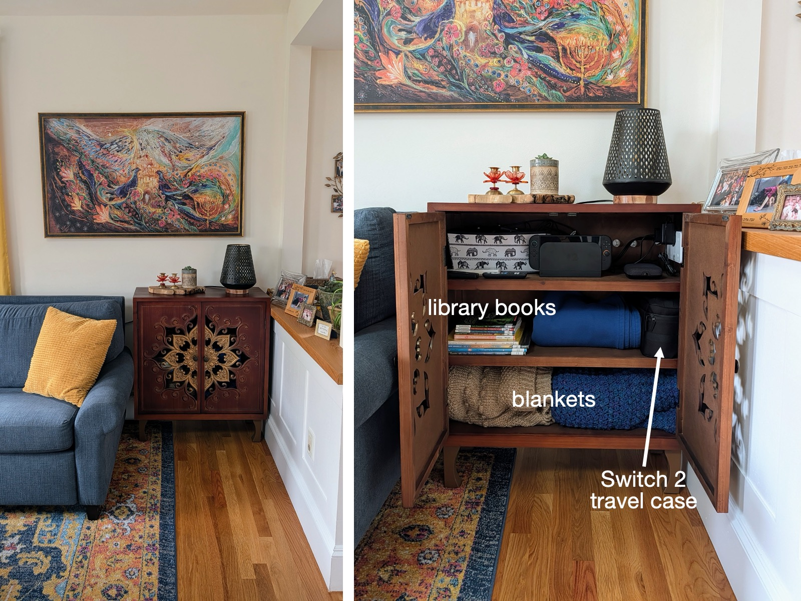
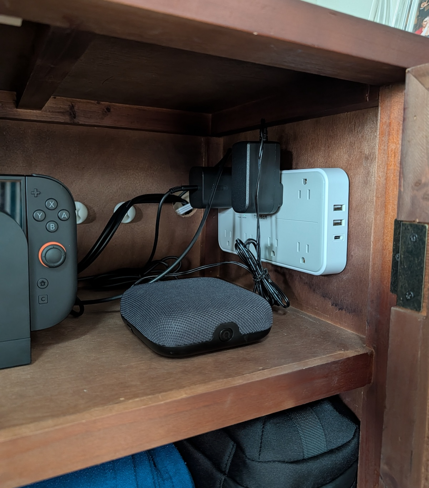
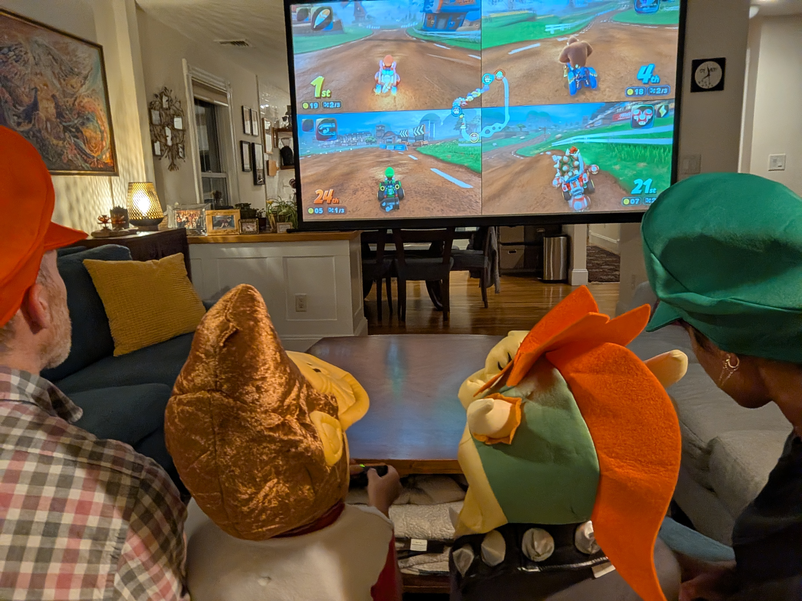
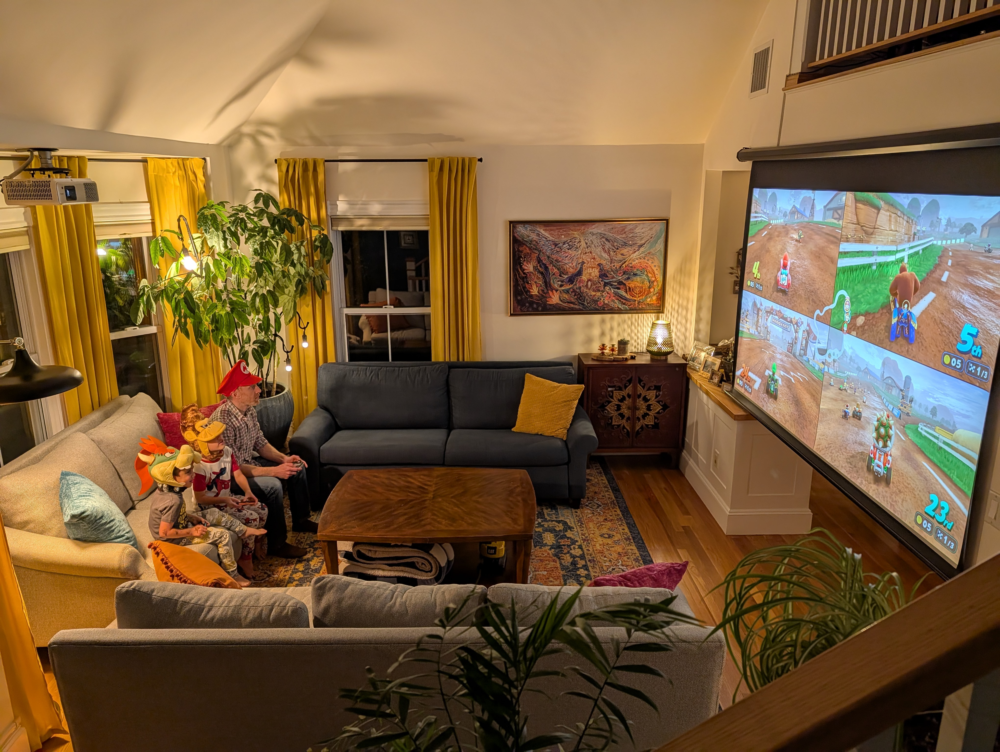

We wanted to channel that *Hangout-House Vibe:* fun, good food, comfy... But without a wall for a TV, we couldn’t host movie nights or video game showdowns. :clapper: :video_game: The fix? A projector! :film_projector: We may not be screen-free anymore (womp, [wHomp](https://www.mariowiki.com/Whomp) :mushroom: :rock:), but at least we're still screen-*hidden.* :see_no_evil:

## The Constraints

**Wall Space.** The only possible wall in the [living room](../2025-04-12-living-room) where a TV could go is awkwardly placed with respect to the couches *and* is the first thing you see [when you enter](../2025-11-01) (no thanks, ~~ugly black screens~~ :no_entry_sign: :tv:). The space above the dining-to-living room opening was just right for a drop-down projector screen, and as long as we kept cords out of sight, it could disappear when not in use. :see_no_evil:

{: .mx-auto.d-block :}

**Screen ⇔ Projector Distance.** We have a vaulted, cathedral ceiling, meaning there is no flexibility in the distance the projector can be from the screen. Turns out getting the right [zoom and throw distance](https://www.reddit.com/r/projectors/comments/14wd4wh/can_somebody_explain_zoom_and_throw_ratio/) to accommodate this mounting restriction is not trivial... :straight_ruler: :triangular_ruler:

{: .mx-auto.d-block :}

**Ambient Lighting.** The living room can be bright midday, and there are two skylights with no shades at all. :last_quarter_moon: Even though most of our watching would be at night, we needed something to work in a room with ambient light. :sunglasses: :sun_with_face:

In the end, after consulting [Reddit](https://www.reddit.com/r/projectors/comments/1jtxebl/benq_ht2060_vs_other_4k_in_similar_price/) and [Wirecutter](https://www.nytimes.com/wirecutter/reviews/best-cheap-projector/), we decided on a good-out-of-the-box "starter" [projector (BenQ HT2060)](https://www.amazon.com/dp/B0BWGXHVRV), [projector mount (BenQ CM00G3)](https://www.amazon.com/dp/B008CU53TI), and [screen (Elite Motorized)](https://www.amazon.com/dp/B0DGSS2WJV). :film_projector: 

## The Process

### Step 1: Installation (/make a mess)

I have no chill, and as soon as I found a projector that was going to work with our space, I ordered everything I needed *just three days* before we were hosting overnight guests in our house for a week. :woman_facepalming: :unamused: Since my installation attempts trashed our space (see :point_down:), I needed to work late nights to finish up before our guests arrived. :yawning_face: :waning_gibbous_moon: :last_quarter_moon: :waning_crescent_moon:

{: .mx-auto.d-block :}

### Step 2: Hide the wires
The *most satisfying* way to hide all the wires without snaking anything through the walls was to cover cables behind curtains and along the baseboard. :lotus_position_woman:

{: .mx-auto.d-block :}

The only two spots where cable covers can be seen: 

{: .mx-auto.d-block :}
*:point_up: Conveniently, the projector screen could be plugged into an outlet in our [loft space upstairs](../2023-06-01-fireplace)!*

### Step 3: Adapt cabinet for connections
I routed the projector’s (carefully hidden) [HDMI](https://www.amazon.com/dp/B0F97QMFNM) and [audio](https://www.amazon.com/dp/B001T21DU4) input cables over to a new [accent cabinet](https://www.wayfair.com/furniture/pdp/bungalow-rose-accent-cabient-w111866442.html) beside the couches. To keep things clean, I drilled a hole in the back of the cabinet to tuck in a [surge protector](https://www.amazon.com/dp/B08DKP7GLT) and thread the cables through. 

{: .mx-auto.d-block :}

{: .mx-auto.d-block :}

### Step 4: Koopa shell yo :peach:

The boys *love* Mario Kart (me too! :raising_hand_woman:) and insisted on going as their favorite characters (Donkey Kong and Bowser) for Halloween this year. :monkey_face: :dragon_face: :car: :turtle: :mushroom:

{: .mx-auto.d-block :}

{: .mx-auto.d-block :}

## Cost

We had been *talking about* getting a projector for *ages*, and we decided to finally go 
for it once the [living room refresh](../2025-04-12-living-room) was completed during the **Big Move of 2025**. :yellow_heart: :blue_heart: :orange_heart: :green_heart:

| Materials (Projector) | Cost (+ tax/shipping) | 
|----|----|
| [BenQ HT2060 Home Theater LED Projector](https://www.amazon.com/dp/B0BWGXHVRV) | $1167.69 |
| [Accent Table by Bungalow Rose](https://www.wayfair.com/furniture/pdp/bungalow-rose-accent-cabient-w111866442.html) | $371.86 |
| [Elite Screens Motorized 105" Projector Screen](https://www.amazon.com/dp/B0DGSS2WJV) | $255.32 |
| [BenQ CM00G3 Ceiling Mount](https://www.amazon.com/dp/B008CU53TI) | $83.94 |
| [Laser-Cut Iron Table Lamp](https://www.target.com/p/northlight-laser-cut-diamond-pattern-iron-table-lamp-with-wood-base-11-black-and-gold/-/A-92622795) | $76.49 |
| [8K Fiber Optic directional HDMI Cable, 50'](https://www.amazon.com/dp/B0F97QMFNM) | $53.11 |
| 3 packs of [153" cable hiders](https://www.amazon.com/dp/B07RZQXRQK) | $45.84 |
| [onn 4K Pro Streaming Device, Google TV](https://www.walmart.com/ip/onn-Google-TV-4K-Pro-Streaming-Device-New-2024-4K-UHD-resolution-Dolby-Vision-Dolby-ATMOS-Hands-Free-Voice-Control-Smart-Hub/5193222892) | $44.73 |
| [8-outlet surge protector, 6'](https://www.amazon.com/dp/B08DKP7GLT) | $23.90 |
| [Monoprice Premium 3.5mm audio cable, 50'](https://www.amazon.com/dp/B001T21DU4) | $23.79 |
| [Monoprice Power Cord, 25'](https://www.amazon.com/dp/B0743MK4GP) | $11.15 |
| [0.5" cord protector tubing cable](https://www.amazon.com/dp/B08PFB4HDT) | $10.61 |
| [flat plug extension cord, 7'](https://www.amazon.com/dp/B000HE8PEC) | $5.48 |
| **TOTAL** | **$2173.91**          |

I consider the cost of our first-ever (only-ever?!) video game system to be separate, although it is a *big part of the fun* of the new projector. :video_game: I'm open to game recommendations!

| Materials (Switch 2) | Cost (+ tax/shipping) | 
|----|----|
| [Nintendo Switch 2 + Mario Kart World](https://www.nintendo.com/us/store/products/nintendo-switch-2-mario-kart-world-digital-bundle-122179/) | $531.24 |
| 2 [Nintendo Switch 2 Pro Controller](https://www.target.com/p/nintendo-switch-2-pro-controller/-/A-94704613) | $181.67 |
| [Nintendo Switch 2 Joy-Con Controller](https://www.target.com/p/nintendo-switch-2-joy-con-2-l-r-light-blue-light-red/-/A-94704608) | $106.24 |
| [HORI Compact Carry All Travel Bag](https://www.amazon.com/dp/B0F63YMNM2) | $43.91 |
| [Boomerang Fu - Deluxe Edition](https://www.nintendo.com/us/store/products/boomerang-fu-switch/) | $21.24 | 
| [Etsy iron-on custom Mario name patch](https://www.etsy.com/listing/1887793076/custom-name-iron-on-patches-custom-text) | $22.20 |
| [Baba Is You](https://www.nintendo.com/us/store/products/baba-is-you-switch/) | $15.94 | 
| [Overcooked! 2](https://www.nintendo.com/us/store/products/overcooked-2-switch/) | $6.63 | 
| **TOTAL** | **$929.07**          |