Our teensy entryway used to be a master illusion: impossibly small but concealing a mountain of stuff. :circus_tent: :upside_down_face: I finally fixed the vibe so that guests would think they're walking into our actual home 
instead of accidentally into a storage closet. :coat: :scarf: :handbag: :boot:

## Come one, come all! 

During Covid, we transformed our entryway into a makeshift mudroom to avoid using the 
shared back stairwell. :boot: :kick_scooter: :military_helmet: :umbrella: But 
once we [reworked our basement storage unit](../2024-02-01-storage-unit), this space became the primary guest entrance (in need of an overhaul). [Scroll down](#problems--solutions) to see our issues and solutions! 

{: .mx-auto.d-block :}
*:point_up: The (old) view when you entered our unit from the shared condo hallway.*

:sparkle: *Ta da!* :sparkle: More welcoming than before, I hope. The art and mirror were relocated from our [old master bedroom](../2025-05-12-kid-bedroom) once we [moved upstairs](../2025-03-15-master-bedroom).

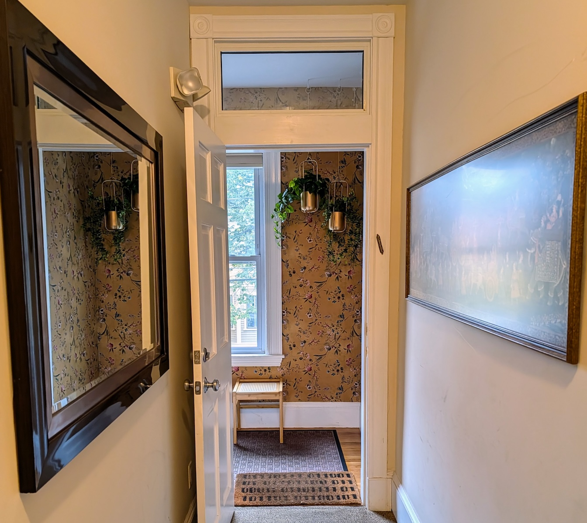{: .mx-auto.d-block :}

## Problems & Solutions

Jump ahead to see how we got around having a [teensy space](#problem-1-teensy-space) with [bulky storage](#problem-2-funhouse-furniture), an [off-center wall sconce](#problem-3-off-center-lighting), [wavy wall edges](#problem-4-wavy-corners-for-wallpapering), and a [scary stairwell](#problem-5-stairwell-of-doom).

### Problem 1: Teensy space
The entryway is *tiny* (7'8" x 3'10" = under 30 feet2) with the main door and stairwell right next to each other. :door:

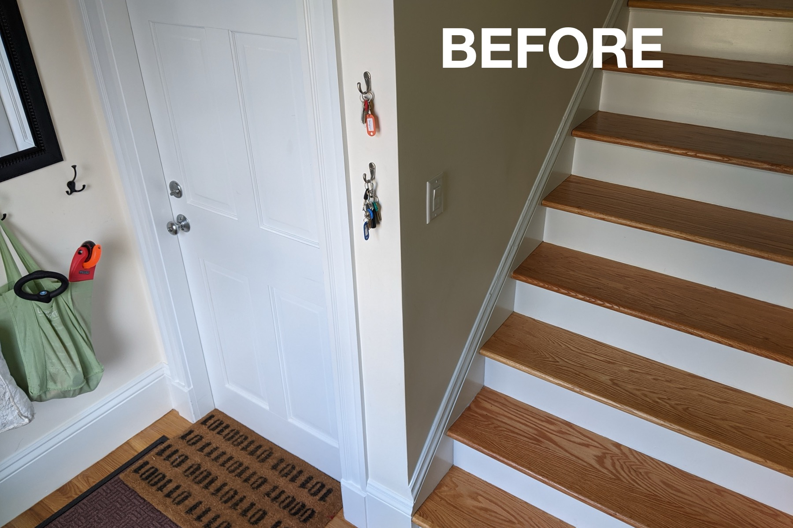{: .mx-auto.d-block :}

I use wall hooks for keys (check out my whole [ultra-organized key system](../2021-11-10-phone-wallet-keys)! :key:) and axed furniture to improve traffic flow.
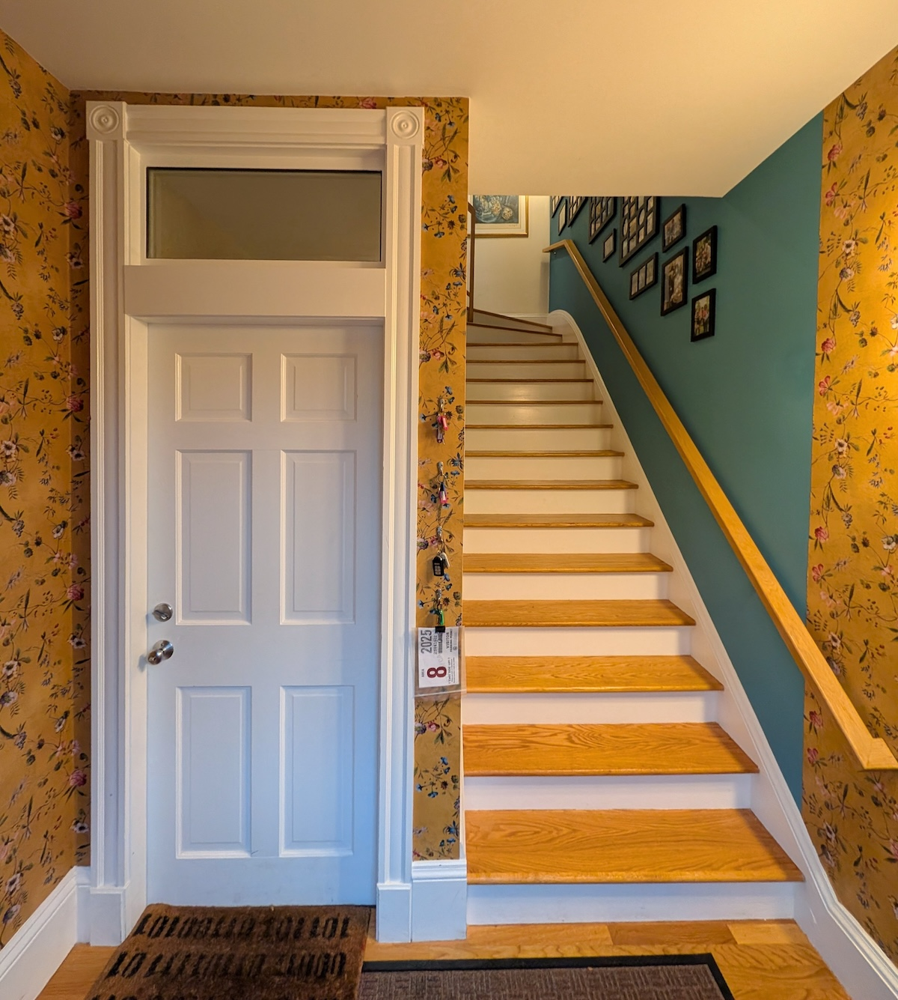{: .mx-auto.d-block :}

The [faux](https://www.michaels.com/product/hanging-philo-bush-by-ashland-10547222) [plants](https://www.michaels.com/product/green-hanging-eucalyptus-bush-by-ashland-10626930) in [hanging planters](https://www.wayfair.com/home/pdp/mercury-row-jansen-2-piece-metal-hanging-planter-w004840657.html?piid=812020647) are installed in the corner out of the way above head height. :potted_plant: :leaves: I keep one [little seat](wayfair.com/furniture/pdp/bay-isle-home-huftalen-solid-wood-vanity-stool-w100749114.html) for folks who need it.

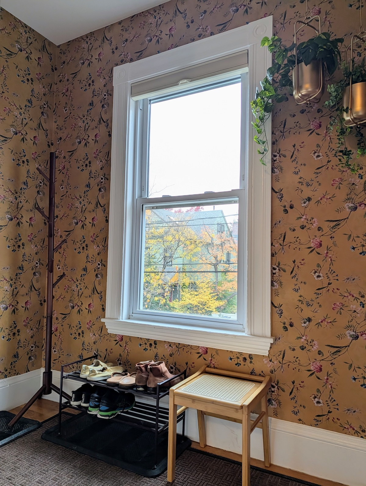{: .mx-auto.d-block :}

### Problem 2. Funhouse furniture?
We had a storage bench (carried over from our very first apartment) that housed torn mittens :gloves:, too-small (and forgotten about) seasonal outerwear :scarf: :snowman:, and (most recently) piles of missing toys and books :game_die: :teddy_bear: :books: that our younger kiddo kept stashing down here then forgetting and crying about losing! :sob: 	:clown_face: :woman_facepalming:

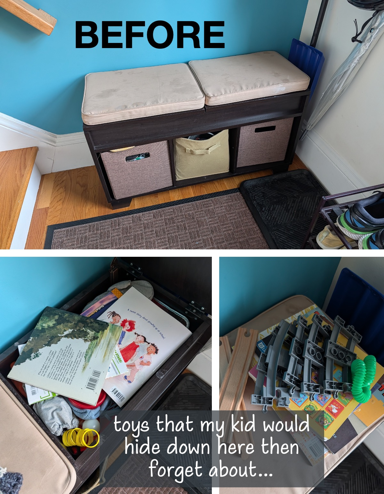{: .mx-auto.d-block :}

Now we only keep guests' shoes (with a [reminder to remove](https://www.temu.com/2d-flat-1pc-vintage-please-remove-shoes-metal-sign-rustic-farmhouse-decor-indoor-outdoor-wall-hanging-3-93x15-74-inch-brown-background-with-white-yellow-text--entryway-bedroom-bathroom-home-decor-indoor-decor-sign-rustic-metal--hang-design-metal-wall-art-decor-g-601101140857502.html?refer_page_name=goods&refer_page_id=10032_1762383773661_t9f3pktu3k&refer_page_sn=10032&_x_sessn_id=o6agtlytdn)) and a [coat rack](https://www.wayfair.com/decor-rugs/pdp/rebrilliant-adosinda-8-hook-freestanding-adjustable-solid-wood-coat-rack-for-bedroom-closet-entrance-w006544168.html?piid=450786870) in this space. :shoe: :coat: 

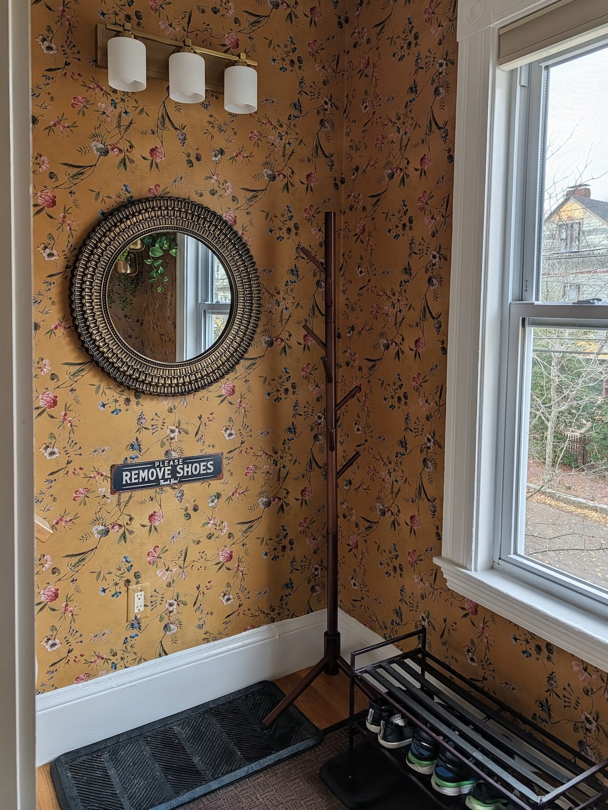{: .mx-auto.d-block :}

### Problem 3. Off-center lighting

Did you notice that [3-light wall fixture](https://www.amazon.com/dp/B0DJX3MQPX) :point_up:?! It's new. Our wall sconce has always been off-center, and it's always driven me nuts. :face_with_spiral_eyes: I decided to shift the connection box over 4" to where it belonged, and it turns out that my *neighbor's* junction box *is* perfectly centered (and perfectly in the way). :unamused: :woman_shrugging:

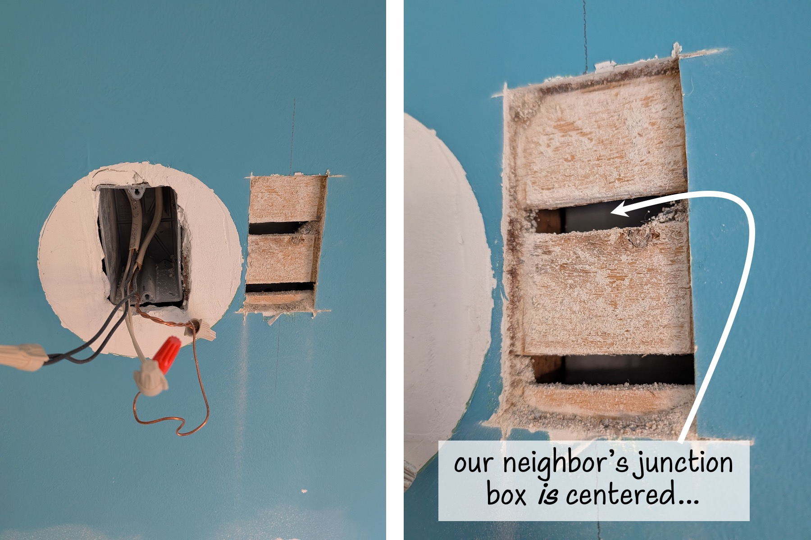{: .mx-auto.d-block :}

I found a new [wall sconce with a large baseplate](https://www.amazon.com/dp/B0DJX3MQPX) that I could hang centered but connect to the off-center junction box anyway. I scared myself enough reading about [NEC (electrical standards)](https://kdmfab.com/what-is-nec-code-for-junction-boxes/) and the [necessity of properly-connected ground wires](https://www.reddit.com/r/homeowners/comments/o4725b/what_exactly_does_grounding_electrical_do_and_how/) that I am now certain everything is connected safely. :zap:

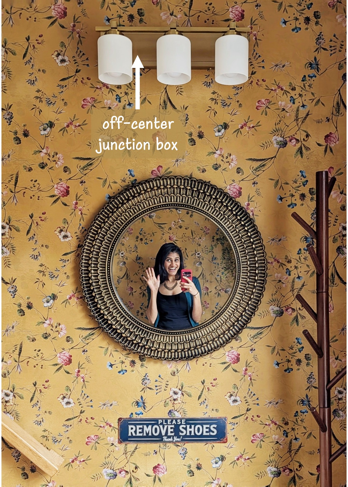{: .mx-auto.d-block :}

### Problem 4. Wavy corners for wallpapering
Once I solved the light fixture issue, it was time to wallpaper! This cheerful print is called ["Whispers of Chinoiserie" from GiffyWalls](https://www.giffywalls.com/products/whispers-of-chinoiserie-wallpaper). :hibiscus: :blossom: You'd *think* the process would be easier by my fourth time installing peel-and-stick wallpaper... ([bathroom](../2022-06-25-bathroom-reno) in 2022, [master](../2025-03-15-master-bedroom) + [office loft](../2023-06-01-fireplace) in 2023, [utility room](../2024-06-26-laundry) in 2024, and now here)! ...It's not.

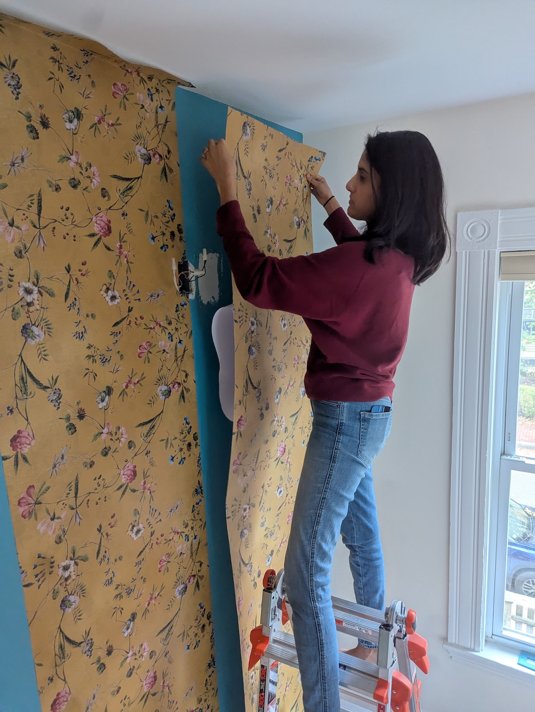{: .mx-auto.d-block :}

Getting around (wavy, uneven) corners is *still the absolute worst*. I nearly abandoned the effort after the first corner (of *three*!). 

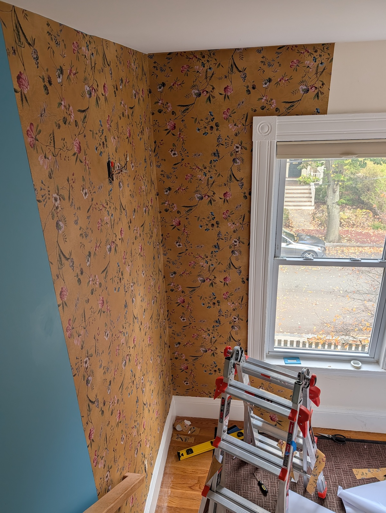{: .mx-auto.d-block :}

Luckily I powered through the rest! 

### Problem 5: Stairwell of doom
Finally, I tried to make the stairwell less... imposing / *prison-y* :fearful:... by adding a photo wall! I bought those [29-opening Adeco frames](https://www.amazon.com/Adeco-Decorative-Openings-3-25x2-75-rectangular/dp/B005LJHJFY/) on serious clearance during graduate school, and they are still going strong. :framed_picture:

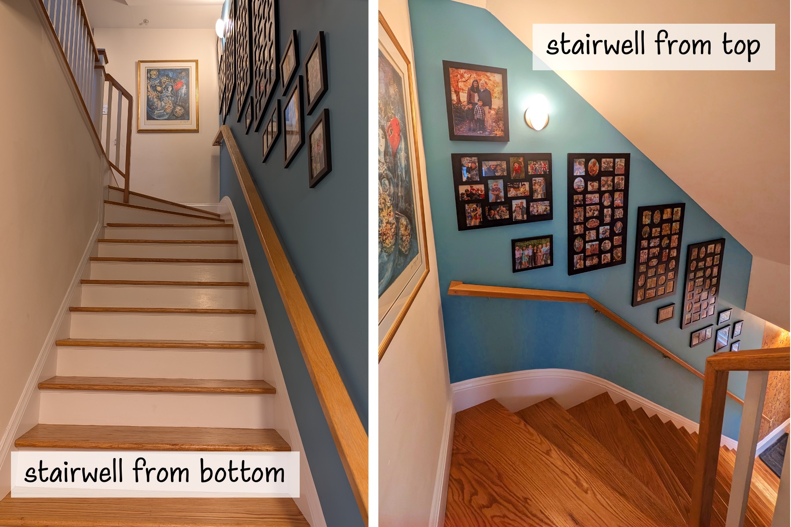{: .mx-auto.d-block :}

And just to close with a view of our home from the top of the stairs! :heart_eyes:

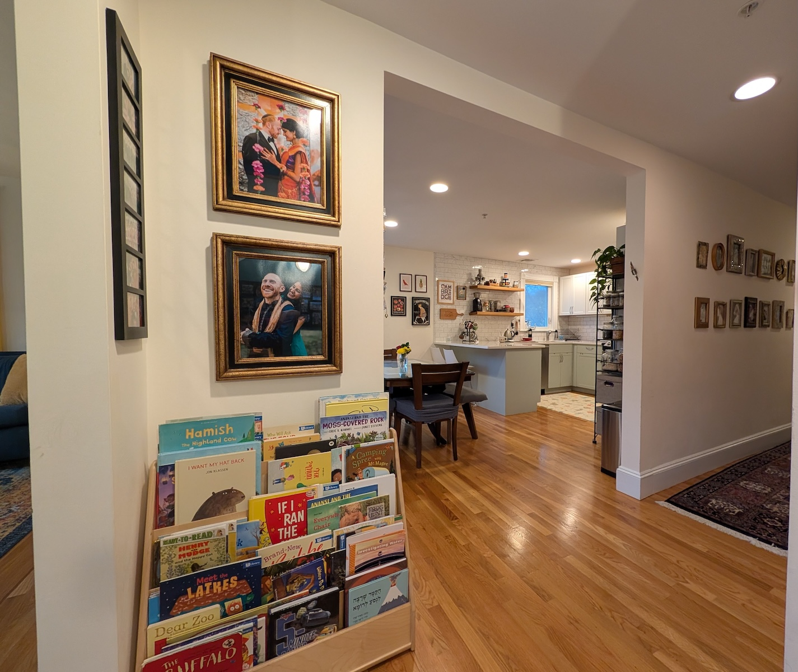{: .mx-auto.d-block :}
*:point_right: To the right into the kitchen and dining.*

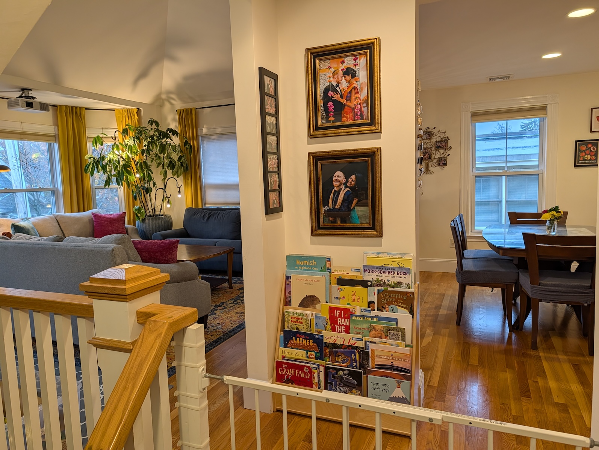{: .mx-auto.d-block :}
*:point_left: And to the left into our [living room](../2025-04-12-living-room)!*

## Cost

| Materials | Cost (+ tax/shipping) | 
|----|----|
| ["Whispers of Chinoiserie" peel-and-stick wallpaper](https://www.giffywalls.com/products/whispers-of-chinoiserie-wallpaper) | $713.47 |
| [Kumasinova round wall mirror](https://www.target.com/p/kumasinova-26-5-round-wooden-accent-mirror-with-woven-texture-decorative-wall-mirror-for-wall-decor-bathroom-bedroom-living-room-black-gold/-/A-1006666895) | $125.34 |
| [brass 3-light fixture](https://www.amazon.com/dp/B0DJX3MQPX) | $90.83 |
| [brass hanging planters](https://www.wayfair.com/home/pdp/mercury-row-jansen-2-piece-metal-hanging-planter-w004840657.html?piid=812020647) | $74.36 |
| [small wooden accent stool](wayfair.com/furniture/pdp/bay-isle-home-huftalen-solid-wood-vanity-stool-w100749114.html) | $58.43 |
| [faux hanging eucalyptus](https://www.michaels.com/product/green-hanging-eucalyptus-bush-by-ashland-10626930) and [faux hanging philo](https://www.michaels.com/product/hanging-philo-bush-by-ashland-10547222) | $40.14 |
| [8-hook coat rack](https://www.wayfair.com/decor-rugs/pdp/rebrilliant-adosinda-8-hook-freestanding-adjustable-solid-wood-coat-rack-for-bedroom-closet-entrance-w006544168.html?piid=450786870) | $37.18 |
| [ceiling hooks](https://www.amazon.com/dp/B09XTLRZS6) | $10.51 |
| [remove shoes sign](https://www.temu.com/2d-flat-1pc-vintage-please-remove-shoes-metal-sign-rustic-farmhouse-decor-indoor-outdoor-wall-hanging-3-93x15-74-inch-brown-background-with-white-yellow-text--entryway-bedroom-bathroom-home-decor-indoor-decor-sign-rustic-metal--hang-design-metal-wall-art-decor-g-601101140857502.html?refer_page_name=goods&refer_page_id=10032_1762383773661_t9f3pktu3k&refer_page_sn=10032&_x_sessn_id=o6agtlytdn) | $7.84 |
| storage bench (SOLD) | +$25 | 
| **TOTAL** | **$1133.10** |
