**The balance :balance_scale::** Non-functional tchotchkes collecting dust and cluttering up floorspace and surfaces? :x: :-1: 
Souvenirs and heirlooms that 
personalize a house 
and make it feel like home? :heavy_check_mark: :+1: My solution for this conundrum has been to 
intentionally use wall space to display sentimental items! :framed_picture:

**Jump ahead to read about** how it is [okay to update your gallery over time](#evolution-of-our-gallery-wall), 
[the hanging process](#the-process), and [categories of memoribilia that work as wall art](#the-stories). 

:warning: *Full disclosure:* This blog post is more for me than anyone else. :woman_shrugging:

## Evolution of Our Gallery Wall

### Iteration 1
When my husband and I moved in together after getting married :ring: :person_with_veil:, we had to combine 
two households’ worth of sentimental wall art into far fewer walls. :package: Here’s how it all came together in a 
gallery wall in our first apartment in [Northampton, MA](https://en.wikipedia.org/wiki/Northampton,_Massachusetts). :framed_picture: :hammer:

{: .mx-auto.d-block :}

### Iteration 2
I repeated the process when we moved into our tiny 
[Cambridgeport](https://en.wikipedia.org/wiki/Cambridgeport,_Cambridge,_Massachusetts) 
apartment in 2018. *Can you spy the updates I made?* :framed_picture:

{: .mx-auto.d-block :}
*:point_up: The [Sri Lankan prosperity mask](#4-gifts-from-family--friends) was a new gift, 
and I stretched the [elephant tapestry](#3-mutually-agreeable-artwork) onto a DIYed wooden
frame (instead of a [curtain rod](https://www.bedbathandbeyond.com/Home-Garden/Mosaic-Adjustable-Single-Curtain-Rod-With-Round-Finials/16592509/product.html)).*

### Iteration 3
And finally! Here is the gallery wall in our current condo! Hanging
all this over the staircase while keeping our necks intact was... not guaranteed... :ladder: :hammer: :face_with_head_bandage:

{: .mx-auto.d-block :}

## The Process

**For regular (non-stairwell) walls,** I began by laying out 
[craft paper](https://www.amazon.com/PerkHomy-Wrapping-Bulletin-Shipping-Covering/dp/B0CQZ1TYX9/) on the floor to match 
the size of the wall. :straight_ruler: *Then* 
I laid the artwork out on top of the paper until the arrangement looked good. :test_tube: :woman_shrugging: 
Next, I traced each piece and marked
with :heavy_multiplication_x:s exactly where each nail would have to go. :pen: :hammer: :pushpin:
I taped the paper onto the wall (with [painter's tape](https://www.amazon.com/ScotchBlue-Original-Multi-Surface-Painters-2090-24NC/dp/B00004Z4CP/?th=1)), 
and made sure all the traced
artwork edges were level. *Finally*, I put nails in as marked, 
pulled the craft paper down, and hung the artwork up 
with *no accidental holes!* :framed_picture: :art: :clap: 

**For the stairwell,** things were more complicated. I *started* with taping craft paper onto the 
wall.
I tore the paper around the existing wall sconces. :bulb: While the paper was up, 
I drew level :heavy_plus_sign:s all over the paper randomly, and also measured
40" up from each stair tread to draw a slanted line parallel to the stairs. :triangular_ruler: Finally, I took the paper down, flattened it on the floor, 
then laid artwork out as before. :hammer: :ladder:

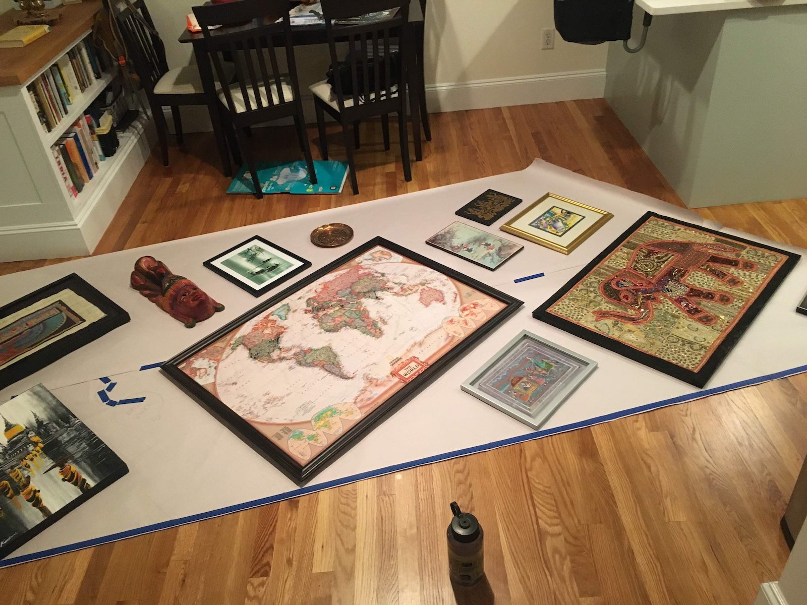{: .mx-auto.d-block :}

## The Stories

**I do, in fact, *love* sentimental items!** :heart_eyes: Here are the different types of memoribilia that I've been able to display on a wall instead of on a surface: 
1. [souvenirs from international trips](#1-souvenirs-from-international-trips) :airplane: (and my [DIY pinboard map](#diy-pinboard-map) :world_map:)
2. [family heirlooms](#2-extended-family-memories) :scroll:
3. [artwork that we picked out as a couple](#3-mutually-agreeable-artwork) :couple:
4. [gifts from friends and family](#4-gifts-from-family--friends) :gift:

### 1. Souvenirs from International Trips

:---:|:---:
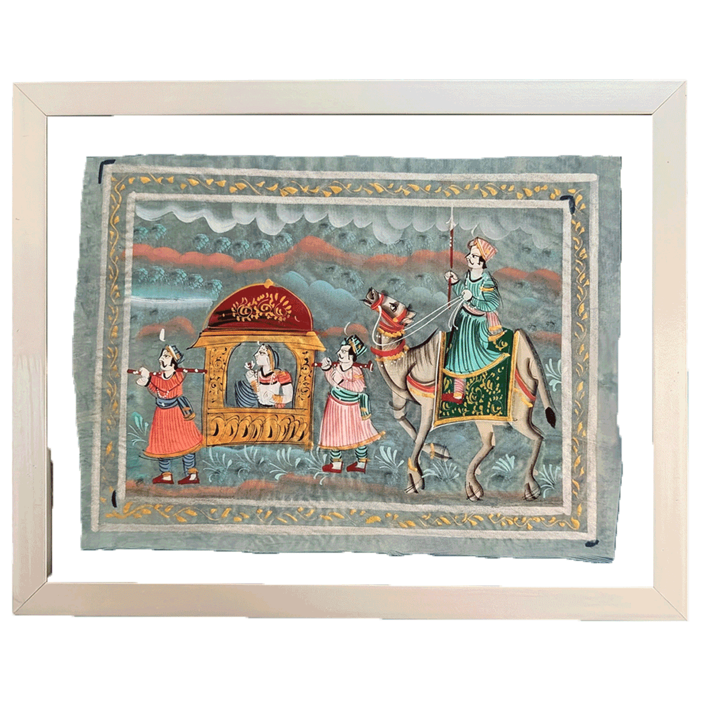 | **Rajasthan, India :india: January 2008** Growing up, trips to India mixed family time with travel. On one winter visit, we toured [Rajasthan](https://en.wikipedia.org/wiki/Rajasthan)---known for [Rajput warriors](https://www.youtube.com/watch?v=vYvl3CIX0zQ), [vivid textiles](https://www.pinterest.com/ideas/rajasthani-fabric/926573926612/), and miniature paintings---and I brought one home. :camel:
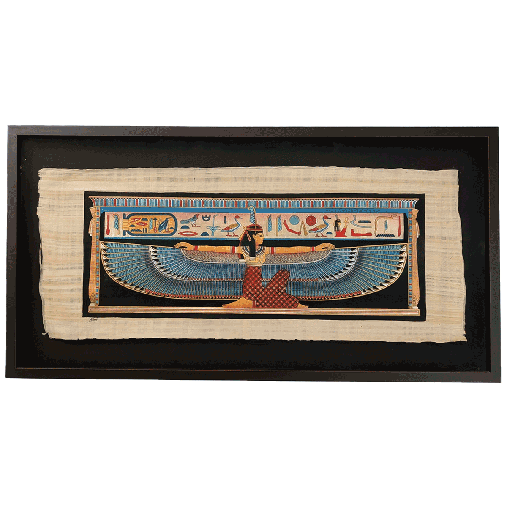 | **Cairo, Egypt :egypt: June 2010** During a Middle East & North Africa backpacking trip, ending in Barcelona for [Spain's first World Cup win](https://www.youtube.com/watch?v=3pCPQDxZzfY)! :soccer:, my husband Ari bought this [papyrus painting](https://www.metmuseum.org/essays/papyrus-in-ancient-egypt) of the [Egyptian goddess Ma'at](https://en.wikipedia.org/wiki/Maat). 
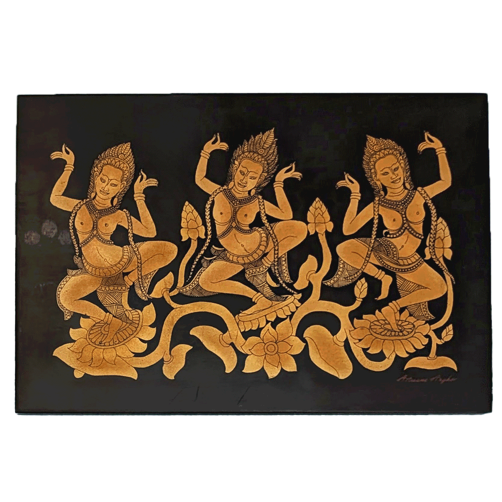 | **Siem Reap, Cambodia :cambodia: August 2011**  The following summer, I visited the [Angor Wat Temple](https://share.google/h75UgIojL5woqTMnw) and [Ta Prohm (Jungle Temple)](https://www.youtube.com/watch?v=WUzTdcDrtJ8), both of which were decorated with these *apsara (heavenly) dancer* carvings. :woman_dancing:
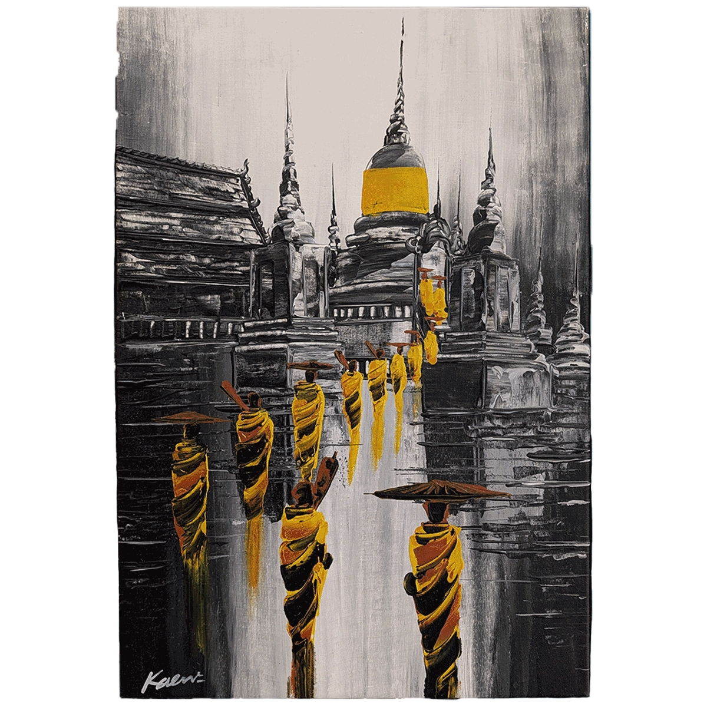 | **Bangkok, Thailand :thailand: August 2012** On another backpacking trip through Southeast Asia, Ari visited [Wat Saket (Golden Mount) Temple](https://www.tourismthailand.org/Attraction/wat-saket-and-the-golden-mount) in Bangkok. He came home with this painting, new motorcycle scars :motorcycle:, a Thai cookbook :hot_pepper: :hot_face:, and no regrets.

**DIY Pinboard Map.** Given all our travels, I thought a [pushpin world map](https://www.pushpintravelmaps.com/products/executive-world-travel-map-with-pins) would be fun. 
:world_map: :money_with_wings:
I decided to 
DIY my own 
using my husband's [laminated National Geographic world map](https://www.wayfair.com/school-furniture-and-supplies/pdp/national-geographic-maps-world-executive-wall-map-gw1004.html) 
(...ask for forgiveness, not permission! :angel:), a couple 
[sheets of 1/4" thick corkboard](https://www.amazon.com/Juvale-Cork-Board-Tiles-Corkboard/dp/B01FVWIU76/ref=sr_1_6), 
[mod-podge](https://www.michaels.com/product/mod-podge-matte-10326512),
and some [trim](https://www.homedepot.com/p/Ornamental-Mouldings-5-16-in-x-11-16-in-x-96-in-White-Hardwood-Panel-Colonial-Moulding-40-8WHW/202534033) 
and [stain](https://www.acehardware.com/departments/paint-and-supplies/stains-and-finishes/wood-stains/13711). *Ta da!* :round_pushpin:

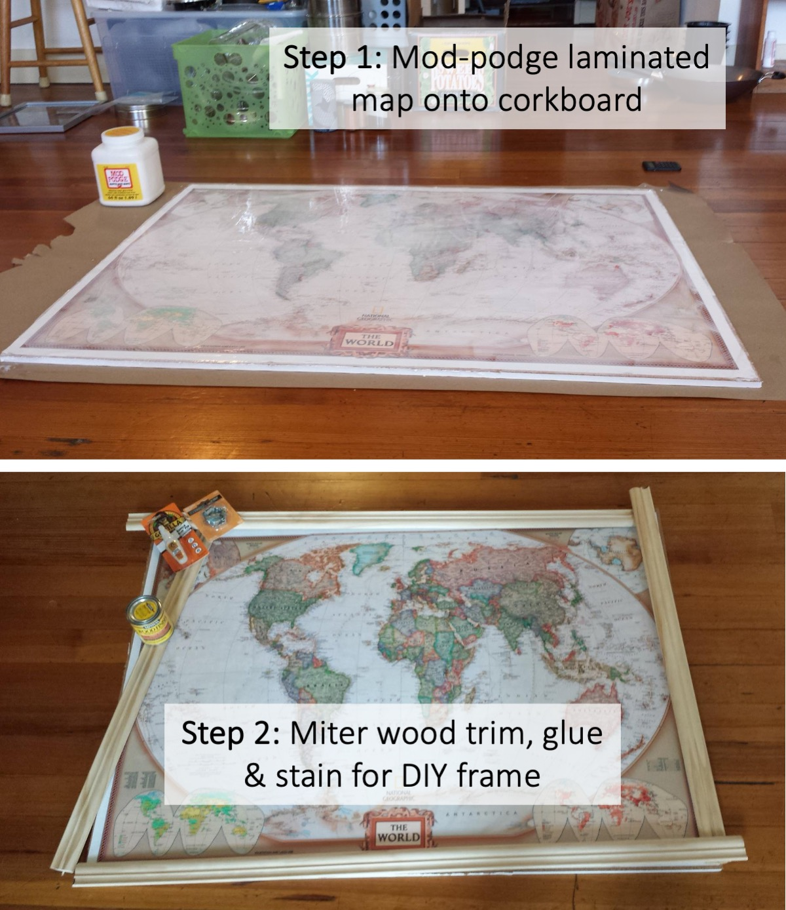{: .mx-auto.d-block :}

Our pins are colored for my trips :heart:, Ari's trips :yellow_heart: and trips we've taken together :blue_heart:.

### 2. Extended Family Memories

**Remembering loved ones.** My maternal grandmother’s brother, Nilakantan (*Nila Mama*, born 1920), 
was an endlessly interesting and kind person. 
He never had children of his own, which made him a super patient and fun uncle to his 
(great-)nieces and (great-)nephews. :family: :heart: :tada:

* **Iran :iran: ~1940.** Nila Mama served in the Indian Army (then part of the British Empire) during and after World War II. At a Red Sea posting, he was brought (despite only being a junior cadet) to a dinner hosted by the Shah of Iran to serve as a translator for his commanding officers. All guests received these custom brass plates. :point_down:

  :---:|:---:
  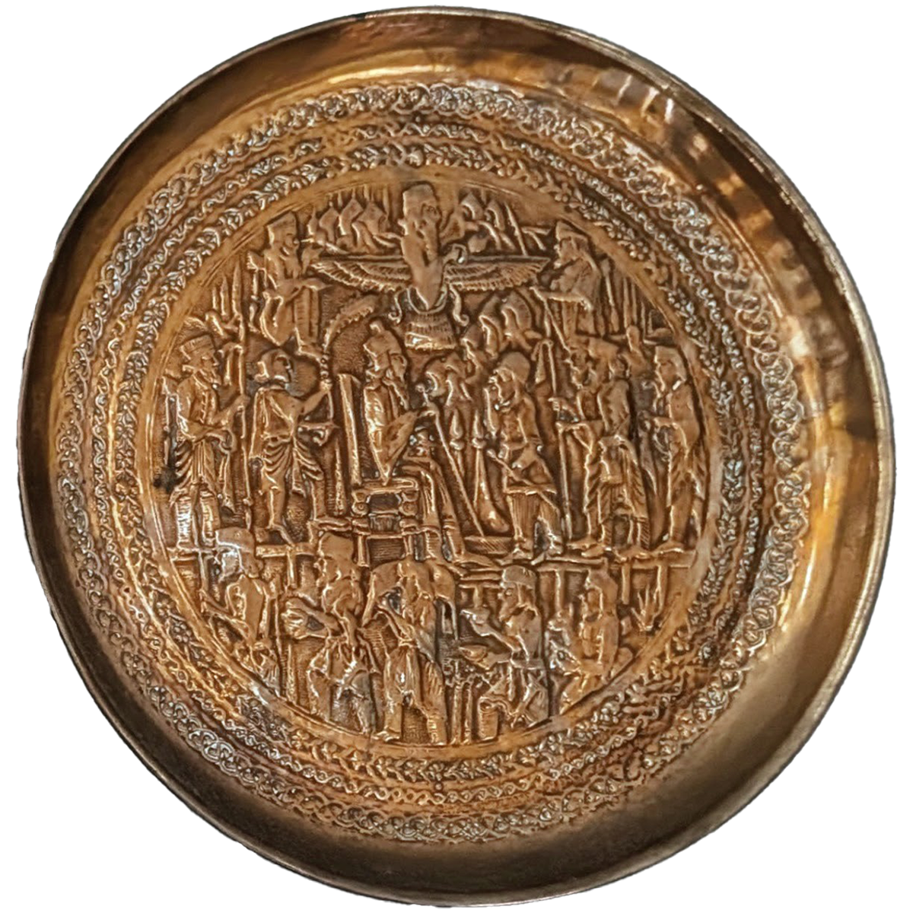 | 

* **Nepal :nepal: early 1950s.** Nila Mama was stationed in [Ladakh](https://en.wikipedia.org/wiki/Ladakh), a northern border region of [newly-independent India](https://www.britannica.com/topic/Indian-Independence-Movement). This painting was purchased during a weekend trip to Nepal. :point_down:

  :---:|:---:
  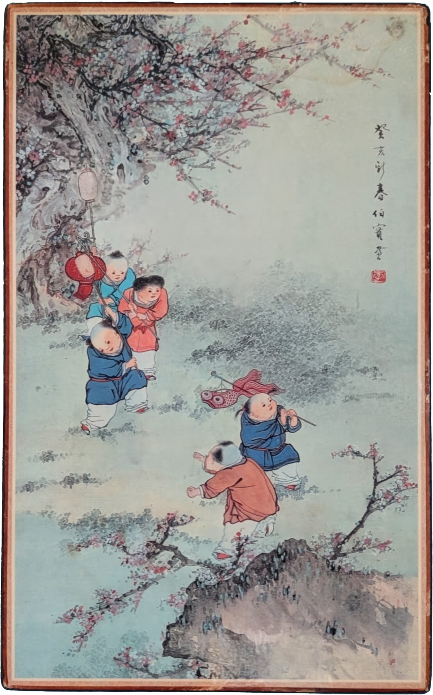 | 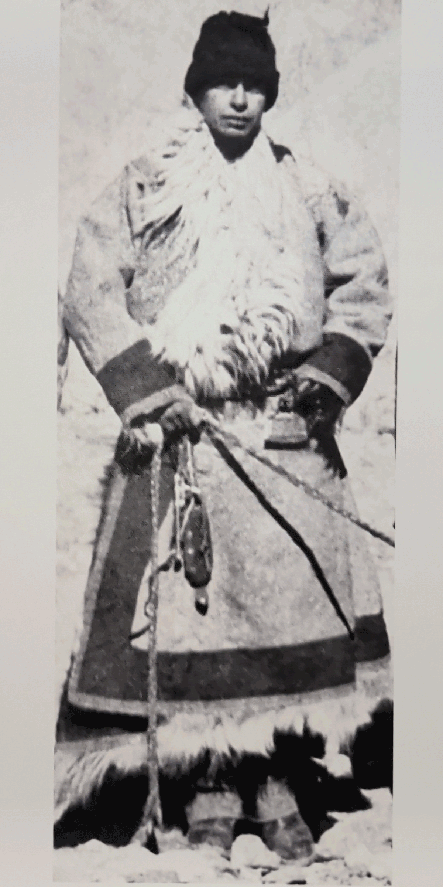

**Family pictures.** Family pictures are *essential* for personalizing a home, but displaying them in tabletop frames can be a slippery slope toward clutter... :camera:
I display family photos in our [entryway stairwell](../2025-11-01-entryway), and I also hung up pictures of our
extended family in our hallway: 

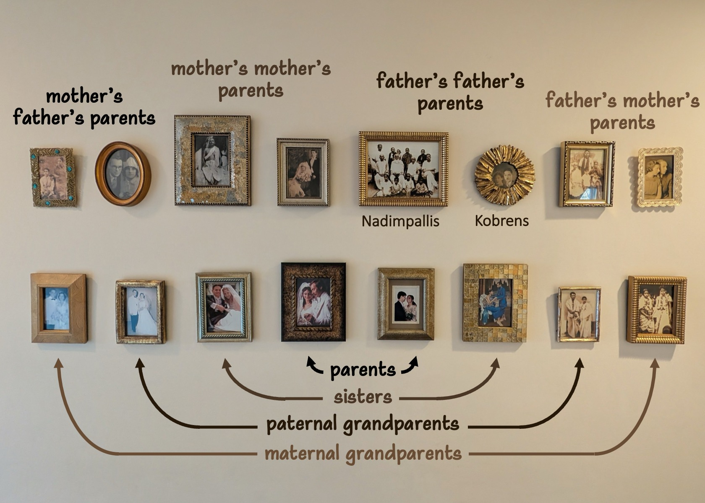{: .mx-auto.d-block :}
*:point_up: These were originally displayed at our wedding; afterward, I removed the frame stands and added [picture wire](https://www.amazon.com/Picture-Hanging-100-Feet-Braided-Supports/dp/B0CT9SBY57/?th=1) with [D-ring hooks](https://www.amazon.com/Pieces-Triangle-Picture-Hangers-Screws/dp/B0DWT9GGDJ/) so we could hang them on the wall.*

### 3. Mutually Agreeable Artwork

Buying art for your home happens *slowly* :stopwatch:. One of the underrated perks of our 30s (/a decade into marriage) 
has been getting to choose art together :ring: :framed_picture:, not out of urgency to fill walls, but out of shared, 
co-evolving taste and shared history. :couple: :heart:

:---:|:---:
 | **[Siona Benjamin](https://artsiona.com/) Print :india: :us: 2025** We finally bought [*Finding Home #46: Tikkun ha-Olam*](https://www.bluelikeme.com/products/tikkun-fh46-giclee-print) for our 10th anniversary after eyeing it since 2013--- a small moment that *felt* like a very *grown-up* milestone.
 | **Elephant Tapestry :india: 2014** We bought this in Bengaluru on our first trip to India together, at the same shop where I bought my [wedding lehenga](https://www.pinterest.com/search/pins/?q=red%20bridal%20lehenga). PSA: Treating wall tapestries with [fabric UV protector](https://www.amazon.com/ForceField-Sunblock-Fabric-Protector-Prevent/dp/B003VAWVR6) can help prevent fading!
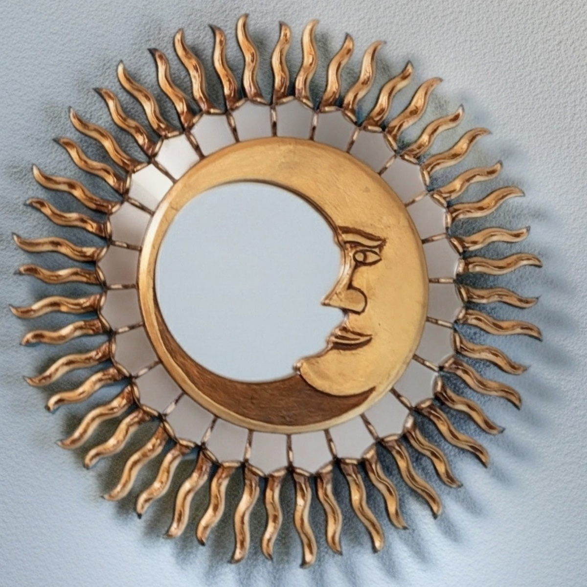 | **Peruvian [Sun/Moon Mirror](https://en.wikipedia.org/wiki/Huaca_de_la_Luna) :peru: 2019** When my sister got married, we chose this piece to mark our growing family and as inspiration to visit my brother-in-law’s [home country](https://en.wikipedia.org/wiki/Huaca_de_la_Luna).

### 4. Gifts from Family & Friends

Buying *any* art for someone else is risky---it can (and should!) be a personal choice. That said, we've
been lucky to receive a few keepers from family and friends that we genuinely love! :gift:

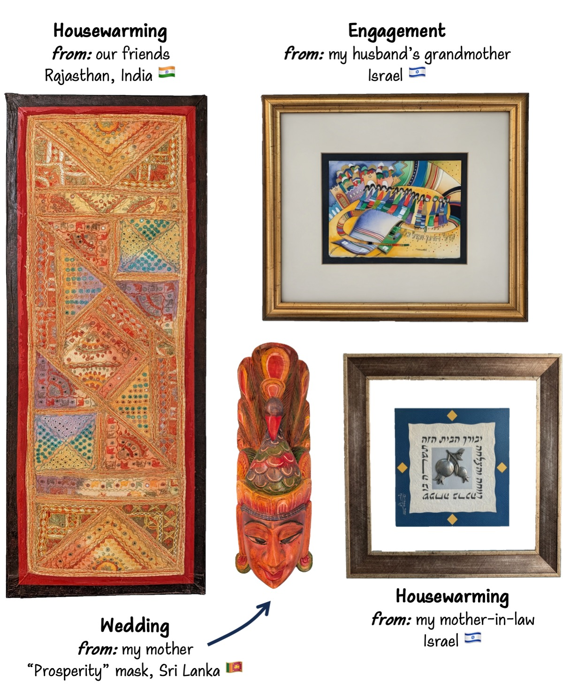{: .mx-auto.d-block :}

**Here it is, all together, one last time!**

{: .mx-auto.d-block :}

If you’re trying to balance sentimental pieces with constrained space, the gallery wall approach has worked well for us! :sparkle: