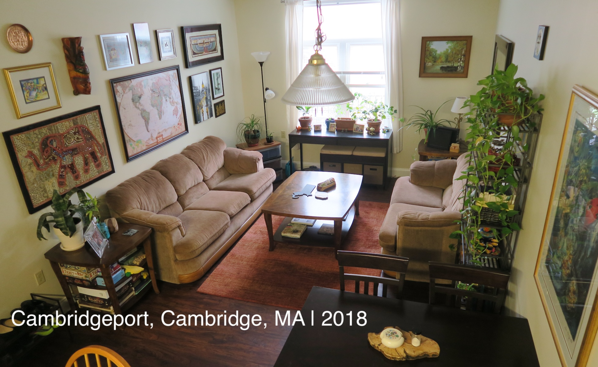
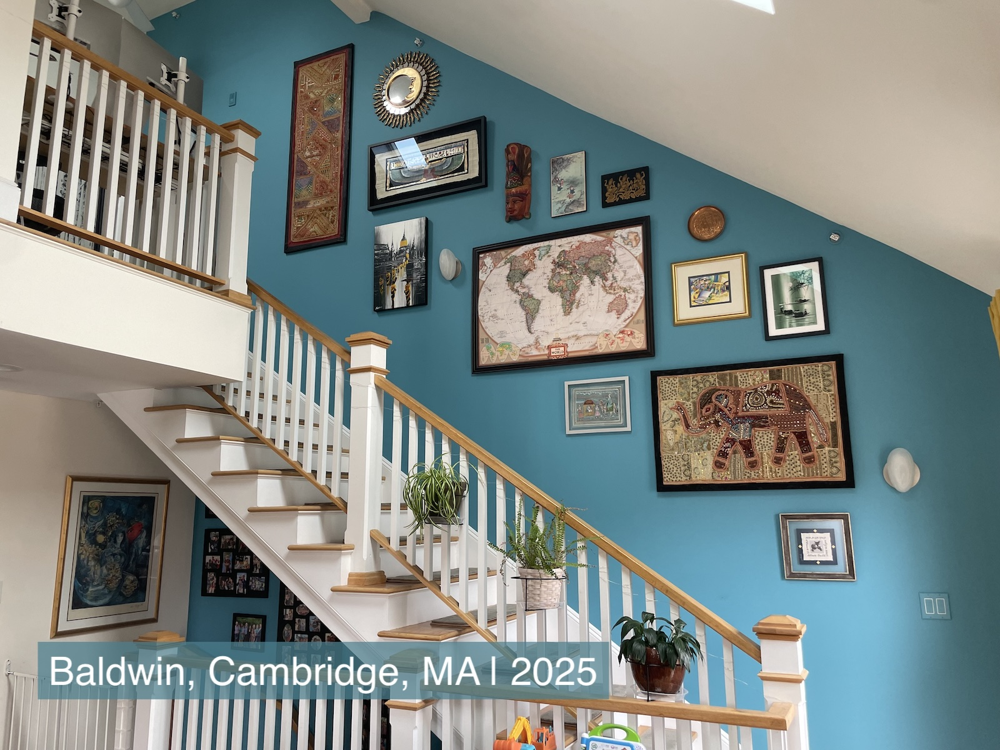

**The balance :balance_scale::** Non-functional tchotchkes collecting dust and cluttering up floorspace and surfaces? :x: :-1: 
Souvenirs and heirlooms that 
personalize a house 
and make it feel like home? :heavy_check_mark: :+1: My solution for this conundrum has been to 
intentionally use wall space to display sentimental items! :framed_picture:

**Jump ahead to read about** how it is [okay to update your gallery over time](#evolution-of-our-gallery-wall), 
[the hanging process](#the-process), and [categories of memoribilia that work as wall art](#the-stories). 

:warning: *Full disclosure:* This blog post is more for me than anyone else. :woman_shrugging:

## Evolution of Our Gallery Wall

### Iteration 1
When my husband and I first moved in together once we were married :ring: :person_with_veil:, we each came with a random assortment of 
artwork from our travels. :cambodia: :egypt: :thailand: :india: :vietnam: :israel: :nepal: :sri_lanka: :iran: :peru: 
Here's how I combined it all into a gallery wall in our first apartment in [Northampton, MA](https://en.wikipedia.org/wiki/Northampton,_Massachusetts). :framed_picture: :hammer:

{: .mx-auto.d-block :}

### Iteration 2
I repeated the process when we moved into our tiny 
[Cambridgeport](https://en.wikipedia.org/wiki/Cambridgeport,_Cambridge,_Massachusetts) 
apartment in 2018. *Can you spy the updates I made?* :framed_picture:

{: .mx-auto.d-block :}
*:point_up: Okay I'll just tell you. The [Sri Lankan prosperity mask](#4-gifts-from-family--friends) was a new gift, 
and I stretched the [elephant tapestry](#3-mutually-agreeable-artwork) onto a DIYed wooden
frame (instead of a [curtain rod](https://www.bedbathandbeyond.com/Home-Garden/Mosaic-Adjustable-Single-Curtain-Rod-With-Round-Finials/16592509/product.html)).*

### Iteration 3
And finally! Here is the gallery wall in our current condo! Hanging
all this over the staircase while keeping our necks intact was... not guaranteed... :ladder: :hammer: :face_with_head_bandage:

{: .mx-auto.d-block :}

## The Process

**For regular (non-stairwell) walls,** I began by laying out craft paper on the floor to match the size of the wall. *Then* 
I laid the artwork out on top of the paper until the arrangement looked good. :test_tube: Next, I traced each piece and marked
with :heavy_multiplication_x:s exactly where each nail would have to go. I taped the paper onto the wall (with painter's tape), 
and made sure all the traced
artwork edges were level. Finally, *easy peasy!* I put nails in as marked, 
pulled the craft paper down, and hung the artwork up 
with *no accidental holes!* :framed_picture: :art: :clap: 

**For the stairwell,** things were more complicated. I *started* with taping craft paper onto the wall (literally using the end of my broom to stick the paper up to the ceiling).
I tore the paper around the existing wall sconces. While the paper was hanging, I drew level :heavy_plus_sign:s all over the paper randomly, and also measured
40" up from each stair tread to draw a slanted line parallel to the stairs. Finally, I took the paper down, flattened it on the floor, 
then laid artwork out as before. :hammer: :ladder:

{: .mx-auto.d-block :}

## The Stories

**I do, in fact, *love* sentimental items!** :heart_eyes: Here are the different types of memoribilia that I've been able to display on a wall instead of on a surface: 
1. [souvenirs from international trips](#1-souvenirs-from-international-trips) :airplane: (and my [DIY pinboard map](#diy-pinboard-map) :world_map:)
2. [family heirlooms](#2-extended-family-memories) :scroll:
3. [artwork that we picked out as a couple](#3-mutually-agreeable-artwork) :couple:
4. [gifts from friends and family](#4-gifts-from-family--friends) :gift:

### 1. Souvenirs from International Trips

<!---->

:---:|:---:
 | **Rajasthan, India :india: January 2008** Growing up, every trip to India included time with family and time exploring new states (...30/70 ratio?!). On this winter visit, we traveled through [Rajasthan](https://en.wikipedia.org/wiki/Rajasthan), a North Indian state known for its [Rajput warriors](https://www.youtube.com/watch?v=vYvl3CIX0zQ), marble palaces, [brightly colored textiles and turbans](https://www.pinterest.com/ideas/rajasthani-fabric/926573926612/), and *intricate miniature paintings* (one of which I bought). :camel:
 | **Cairo, Egypt :egypt: June 2010** My husband Ari spent three months on a multi-country Middle East + North Africa trip (ending in Barcelona to catch [Spain's first-ever World Cup win](https://www.youtube.com/watch?v=3pCPQDxZzfY)! :soccer:). One of the stops was Egypt (of course) where he bought a [painting on papyrus](https://www.metmuseum.org/essays/papyrus-in-ancient-egypt) (of course) of the [Egyptian goddess Ma'at](https://en.wikipedia.org/wiki/Maat). 
 | **Siem Reap, Cambodia :cambodia: August 2011**  The following summer, I was in Cambodia with my family. We visited the [Angor Wat Temple](https://share.google/h75UgIojL5woqTMnw) and [Ta Prohm (Jungle Temple)](https://www.youtube.com/watch?v=WUzTdcDrtJ8), both of which were decorated with these *apsara (heavenly) dancer* carvings. :woman_dancing:
 | **Bangkok, Thailand :thailand: August 2012** On his backpacking trip through Southeast Asia, Ari visited [Wat Saket (Golden Mount) Temple](https://www.tourismthailand.org/Attraction/wat-saket-and-the-golden-mount) in Bangkok, Thailand. He came home with this painting, (at least) two new motorcycle scars :motorcycle:, a Thai cookbook :hot_pepper: :hot_face:, and no regrets.

**DIY Pinboard Map.** Given all our travels over the years, I thought a [pushpin world map](https://www.pushpintravelmaps.com/products/executive-world-travel-map-with-pins) would be fun. 
:world_map::money_with_wings:
But while we were both broke grad students, I decided to 
DIY my own 
using my husband's [laminated National Geographic world map](https://www.wayfair.com/school-furniture-and-supplies/pdp/national-geographic-maps-world-executive-wall-map-gw1004.html) 
(...ask for forgiveness, not permission! :woman_shrugging:), a couple 
[sheets of 1/4" thick corkboard](https://www.amazon.com/Juvale-Cork-Board-Tiles-Corkboard/dp/B01FVWIU76/ref=sr_1_6), 
[mod-podge](https://www.michaels.com/product/mod-podge-matte-10326512),
and some [trim](https://www.homedepot.com/p/Ornamental-Mouldings-5-16-in-x-11-16-in-x-96-in-White-Hardwood-Panel-Colonial-Moulding-40-8WHW/202534033) 
and [stain](https://www.acehardware.com/departments/paint-and-supplies/stains-and-finishes/wood-stains/13711). *Ta da!*

{: .mx-auto.d-block :}

Our pins are colored for my trips :heart:, Ari's trips :yellow_heart: and trips we've taken together :blue_heart:.

### 2. Extended Family Memories

**Remembering loved ones.** My maternal grandmother’s older brother, Nilakantan (*Nila Mama*, born 1920), 
was an endlessly interesting and deeply kind person. He served in the Indian Army (then part of the British Empire) 
and was stationed across the Middle East and South Asia during and after World War II. 
He never married or had children of his own, which meant he was a super patient and super fun uncle to his 
(great-)nieces and (great-)nephews.

:---:|:---:|:---:
 | **Around 1940**, Nila Mama was stationed at the Red Sea. The Shah of Iran hosted a dinner for dignitaries and higher-ups in the military. Although my uncle was an entry-level cadet at the time, his English was excellent. His commanding officer brought him to the dinner as a translator. All guests received these custom brass plates from the shah at the event. :iran: | 
 | **In the early 1950s**, Nila Mama was stationed in Ladakh, in the Northern, border region of a newly-indepent India. This painting was purchased during a weekend trip to Nepal. :nepal: | 

**Family pictures.** Family pictures are *essential* for personalizing a home, but displaying them in tabletop frames can be a slippery slope toward clutter... :camera:
I display family photos in our [entryway stairwell](../2025-11-01-entryway), and I also hung up pictures of our
extended family in our hallway: 

{: .mx-auto.d-block :}
*:point_up: These were originally displayed at our wedding; afterward, I removed the frame stands and added [picture wire](https://www.amazon.com/Picture-Hanging-100-Feet-Braided-Supports/dp/B0CT9SBY57/?th=1) with [D-ring hooks](https://www.amazon.com/Pieces-Triangle-Picture-Hangers-Screws/dp/B0DWT9GGDJ/) so we could hang them on the wall.*

### 3. Mutually Agreeable Artwork

Buying art for your home happens *slowly* :stopwatch:. One of the underrated perks of our 30s (/a decade into marriage) 
has been getting to choose art together :ring: :framed_picture:, not out of urgency or a desire to fill walls, but out of shared, 
co-evolving taste and shared history. :couple: :heart:

:---:|:---:
 | **Fave #1: Giclee print by [Siona Benjamin](https://artsiona.com/) (2025)** This piece is called [*Finding Home #46: Tikkun ha-Olam*](https://www.bluelikeme.com/products/tikkun-fh46-giclee-print), and we finally purchased it for our 10th wedding anniversary (after eyeing it since 2013). Deciding and being able to buy something we've been drawn to for over a decade felt like a *grown-up milestone*.
 | **Fave #2: Elephant Tapestry (2014)** We bought this in Bengaluru during our first India trip together at the same shop where I bought my [wedding lehenga](https://www.pinterest.com/search/pins/?q=red%20bridal%20lehenga). PSA: treating wall tapestries with [fabric UV protector](https://www.amazon.com/ForceField-Sunblock-Fabric-Protector-Prevent/dp/B003VAWVR6) is essential to prevent fading!
 | **Fave #3: Peruvian Sun/Moon Mirror (2019)** To celebrate our growing family when my sister got married, we chose this piece both as inspiration to visit my brother-in-law’s home country and as a way of welcoming him into our family.

### 4. Gifts from Family & Friends

Buying *any* tchotchke or art for someone else is risky---it can (and should!) be a personal choice. That said, we've
been lucky to receive a few keepers from family and friends that we genuinely love! :gift:

{: .mx-auto.d-block :}

**Here it is, all together, one last time!** I hope you're inspired to personalize your house with the sentimental pieces that make it *feel like home*---without cluttering up your square footage! :sparkle:

{: .mx-auto.d-block :}