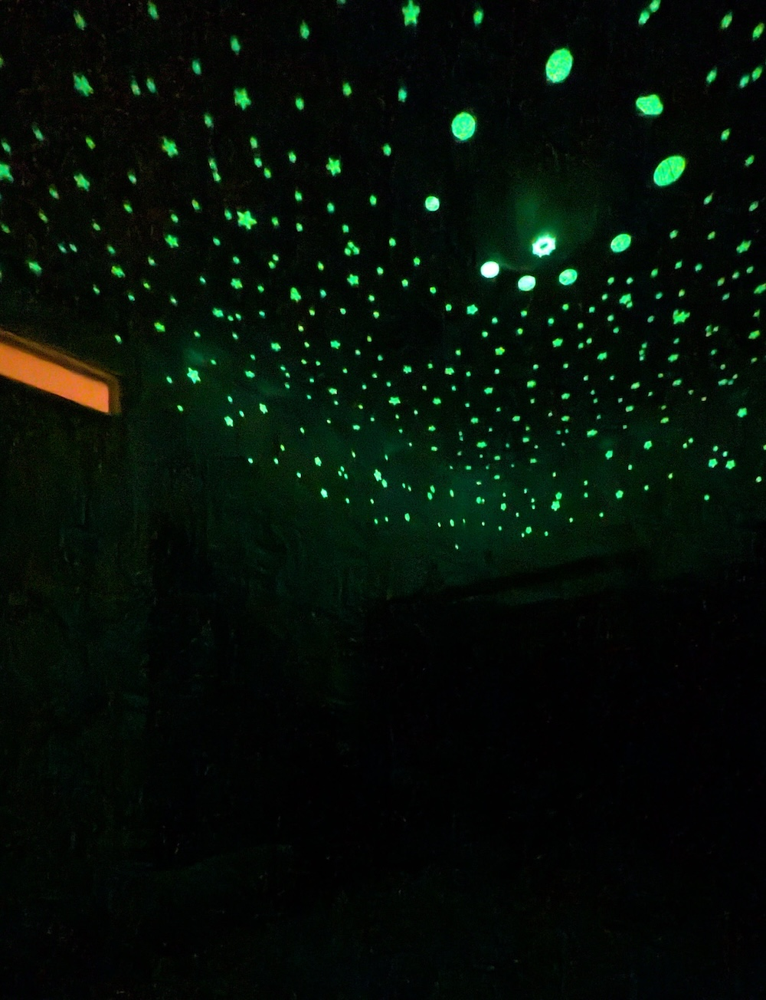

If those four words showed up in a [New York Times Connections](https://www.nytimes.com/games/connections) puzzle, I’m not sure I would ever find the category. :jigsaw: But in this case the answer is: **Things that replaced my son’s closet.** (Yes... I'm on a closet-demoing rampage.) :axe: :door:

**Skip ahead** to read about [why the original closet was no good](#another-closet-down), [construction process](#the-process), [color choices](#view-from-the-hallway), and 
the [*infinitely* improved organization](#organization).

## Another closet down

I already [axed our closet](../2025-03-01-wardrobe) and [axed my older son's closet](../2025-05-12-kid-bedroom) :axe:, so our home's last remaining closet (in this bedroom) needed to store some communal items :family: in addition to my younger son's things :boy:. The current space didn't allow for this separation, and the organization was lacking:  

{: .mx-auto.d-block :}

| Problems | 
|--|
| Inaccessible space above and to the sides of the closet doors. | 
| Closet doors get stuck on the rug and in their frames (and around fingers?! :pinching_hand:). |
| Entry door crashes into the closet! :door: | 
| Anddd (see :point_down:) Accessing items behind the divider wall was also infuriating. :rage: |

{: .mx-auto.d-block :}

So... :v: out closet :arrow_right: :wave: built-in wardrobe!

{: .mx-auto.d-block :}

> But **wHaT Ab0uT ReSaLe?!** It's okay if I don't turn a profit or break even on my house projects whenever we eventually sell this place. I spend money to improve the quality of my life *right now* for how we live! (Plus, with any luck, I don't intend to move imminently.)

### Considerations for the Space

* :mountain: **Mountains.** The kids wanted to keep them. 
* :sunrise_over_mountains: **Sunset Colors.** The colors had to (1) be ones my kid liked, (2) [vibe](../2025-04-12-living-room) with the [rest](../2025-05-12-kid-bedroom) of our [house](../2025-11-01-entryway), and (3) feel like a sunset-- my only idea to sort-of [tie in the existing mountains](#stage-3-final-touches).
* :hear_no_evil: **Soundproofing.** We want to be good neighbors and reduce others' perception of our noise as much as possible. 
* :paintbrush: **Artistic Kiddo.** Although I was able to [get rid of artwork](../2022-09-01-kids-artwork) with my older kid, our younger son loves (and is so proud of!) his art. We ran out of space to showcase it all! 

{: .mx-auto.d-block :}
*I love this picture, since their art looks like their two brains on display. :heart_eyes:*

## The Process

The construction section of this blog post is under construction. :warning: (teehee #punny)

### Stage 1: Closet demo & construction 

{: .mx-auto.d-block :}

I hired a local contractor to demo the existing closet, patch the ceiling, walls, and floors, then assemble and install some [Ikea pantries](#cost) with [1/2" poplar spacers](https://www.homedepot.com/p/Weaber-1-2-in-x-2-in-x-4-ft-S4S-Poplar-Board-27406/207058985) to accommodate the swing of cabinet doors + 3/8"-thick acoustic panels. :construction_worker_woman: :toolbox: :hammer:	The new pantry units had deeper usable space *and* a smaller footprint. :foot: We gained ~4" of floorspace and solved the entry door collision issue! :collision:

### Stage 2: Wall treatment

I custom-designed a pattern of [FeltRight acoustic panels](https://studiov2.feltright.com/?import=7F-yB9vS9P): they absorb sound :loud_sound: and double as a pinboard :pushpin: -- win-win! I got custom color samples that matched the panels, and found [Zinsser BIN primer](https://www.acehardware.com/departments/paint-and-supplies/primers/primers/1514165) for the wood, [Ikea doors](#cost) and *2-week-cured* plastered walls (I [learned my lesson](../2025-05-12-kid-bedroom#the-process) trying to paint fresh plaster...). 

It took *way longer* than I thought to sand, prime, paint *two* coats for coverage, *then* seal the cabinet frame and door edges with polyurethane. :weary:

{: .mx-auto.d-block :}

I paneled the wall with the window, too, since I wanted to [see the colors from the hallway](#view-from-the-hallway). :window: That meant I needed to paint the wall beforehand so that any gaps between tiles or around windows wouldn't be noticeable. :sassy_woman: :paintbrush:

{: .mx-auto.d-block :}

I also filled in the baseboard gap with a [flexi caulk strip](https://instatrim.com/products/instatrim-trim-strips-white?variant=39675875360856), since I suspect my kiddo would have tried to stuff cards and toys in there otherwise... :black_joker: :smiling_imp:

{: .mx-auto.d-block :}

### Stage 3: Final touches

My husband and I free-hand painted these mountains ~5 years ago by gradually
mixing in larger and larger amounts of [BM Hemlock](https://www.benjaminmoore.com/en-us/paint-colors/color/719/hemlock) with [BM Ice Mist](https://www.benjaminmoore.com/en-us/paint-colors/color/oc-67/ice-mist) (the existing wall color) as we moved from the background to foreground. :mountain: :mountain_snow: The kids didn't want to cover them up, so I came up with two ways to *try* and tie the room together: (1) [**glow-in-the-dark stars** around the walls](#stars) and (2) [**transitioning the mountains** to the sunset](#fabric-mountains).

{: .mx-auto.d-block :}

**Glow-in-the-dark stars.** I added [these stars](https://www.amazon.com/dp/B08GJMDXL9) to the ceiling, then extended them down around the room, above the mountains on the walls and to the acoustic panels (onto these [flat-head push pins](https://www.amazon.com/dp/B0F4MW4PFM) to stick). :night_with_stars:

{: .mx-auto.d-block :}
*Ha, yes, I put the sun onto the ceiling light fixture, then arranged the planets in order around it...* :sun_with_face: :ringed_planet: :stars: 

**Fabric mountain range.** To soften the abrupt transition from the mountains to the "sunset", I brought paint swatches to the [Fabric Corner in Arlington](https://www.fabriccornerinc.com/) to find some similarly-colored [batik cotton fabric](https://hoffmancaliforniafabrics.net/php/catalog/fabricshop.php?a=sc&Category=90) that I could cut into the shape of a mountain, edge-seal to prevent fraying with [Dritz Fray Check](https://www.dickblick.com/items/dritz-fray-check-liquid-seam-sealant-34-oz-bottle/) glue, and attach with [clear push pins](https://www.amazon.com/dp/B09ZL7KQMD). :scissors: :pushpin: I think it looks *weird* so I might change this up... 	:thinking:

{: .mx-auto.d-block :}

## View from the Hallway

The colors are a little *intense*, I know. 	:rainbow: :sunrise: 
But they're perfect for my kid (he wanted *even more* color than this :open_mouth:), 
and the palette felt fitting given our home's current aesthetic.

{: .mx-auto.d-block :}
:eyes: You can read more about our [family pictures wall](../2025-12-16-gallery-wall#family-pictures) and my [wall-mounted linens cabinet](../2022-01-18-linens).

{: .mx-auto.d-block :}
:point_left: I fixed up (...and axed the closet from) our [older son's bedroom](../2025-05-12-kid-bedroom) last year.

{: .mx-auto.d-block :}
:point_up: And here's the other end of the hallway looking into our [living room](../2025-04-12-living room).

## Organization
I've saved the best for last ! 

{: .mx-auto.d-block :}

Our son knows exactly which cabinet(s) are his for clothes and toys, and he's able to get himself dressed from these perfect-fit [Elfa mesh drawers](https://www.containerstore.com/s/elfa/best-selling-solutions/favorites-under-five-hundred/elfa-cabinet-closet-drawers/123d?productId=11021262). :shirt: :jeans: 

{: .mx-auto.d-block :}
:point_up: *I designed and [3D-printed label frames](https://www.tinkercad.com/things/gDFrcBXupzb-closet-drawers-label-frame?sharecode=Weu9Hm--0ZAtXcWf9c-KlVnPqU9vlfy96KD3_fv-FXY) and attached them with twist ties.*

We get *a lot* of hand-me-downs, so I knew I needed a spot to store in-between clothes sizes. :shirt: :shorts: :jeans: :coat: :athletic_shoe: 

| Kiddo | Outgrows? | Needs next size? |
| -- | -- | -- |
| Older | Transition bin | Size up bin! | 
| Younger | Donation bin (in [laundry room](../2024-09-20-laundry)) | Size up bin! |  

{: .mx-auto.d-block :}
:point_up: *Also designed [3D-printed cloth bin frames](https://www.tinkercad.com/things/e5gyOMqOENJ-cloth-bin-frames?sharecode=D52R3QdpjxtTu4_70WTPCq9W7q-OfFRMzE1CV9DBrT8) and attached them with [brass fasteners](https://www.amazon.com/dp/B08MPRHKP6) that I had leftover from my [utility room project](../2024-06-26-laundry).*

During seasonal shifts, I fill the "next size up" bins for both boys, so that I know where to go for extras before buying anything new! :seedling: :beach_umbrella: :fallen_leaf: :snowman_with_snow:

## Cost

Most of the cost was putting in the custom wardrobe to improve our storage situation. 

| Materials | Cost (+ tax/shipping) | 
|----|----------------------:|
| closet demo, floor & ceiling patching, and pantry installation labor |              $4900.00 |
| 4 Ikea [24x90" pantry Sektion units](https://www.ikea.com/us/en/p/sektion-high-cabinet-frame-white-70265445) and [short 30"](https://www.ikea.com/us/en/p/veddinge-door-white-20266782/) and [long 60"](https://www.ikea.com/us/en/p/veddinge-door-white-80266779/) doors, 1 [18x90" pantry](https://www.ikea.com/us/en/p/sektion-high-cabinet-frame-white-00265439/) with [short](https://www.ikea.com/us/en/p/veddinge-door-white-70266812/) and [long](https://www.ikea.com/us/en/p/veddinge-door-white-10266773/) doors, [suspension rail](https://www.ikea.com/us/en/p/sektion-suspension-rail-galvanized-60261527/), 7 [shelf packs](https://www.ikea.com/us/en/p/utrusta-shelf-white-00265533/), 5 [27" handles](https://www.ikea.com/us/en/p/billsbro-handle-anthracite-50576311/), 5 [21" handles](https://www.ikea.com/us/en/p/billsbro-handle-anthracite-10576313/), 10 [pantry leg pairs](https://www.ikea.com/us/en/p/sektion-leg-90556071/), 15 [cabinet hinge pairs](https://www.ikea.com/us/en/p/utrusta-hinge-w-b-in-damper-for-kitchen-80524882/),  |              $2236.50 | 
| FeltRight [sample pack](https://feltright.com/products/full-sample-kit), [wardrobe panels](https://studiov2.feltright.com/?import=7F-yB9vS9P) and [wall panels](https://studiov2.feltright.com/?import=IQmYgRs0Ye) |              $1224.56 |
| [Elfa closet drawers](https://www.containerstore.com/s/elfa/best-selling-solutions/favorites-under-five-hundred/elfa-cabinet-closet-drawers/123d?productId=11021262) |               $148.40 | 
| 8 custom color match samples, [Zinsser BIN primer](https://www.acehardware.com/departments/paint-and-supplies/primers/primers/1514165) |               $114.20 | 
| [poplar wood strips](https://www.homedepot.com/p/Weaber-1-2-in-x-2-in-x-4-ft-S4S-Poplar-Board-27406/207058985), [wood glue](https://www.homedepot.com/p/Titebond-III-16-oz-Ultimate-Wood-Glue-1414/100522343), [wood filler](https://www.homedepot.com/p/Varathane-3-75-oz-White-Wood-Filler-Putty-340261/305568203) |                $75.25 |
| [6-pack cloth bins](https://www.amazon.com/dp/B0FBKSJHJS) & [3-pack cloth bins](https://www.amazon.com/dp/B0D78Q42S5) |                $62.63 | 
| [flexi white trim 3/4"](https://instatrim.com/products/instatrim-trim-strips-white?variant=39675875360856) and [applicator tool](https://instatrim.com/products/instatrim-applicator-tool) |                $38.90 | 
| [2 3/8" yard of Batik cotton fabric](https://www.fabriccornerinc.com/) |                $35.38 |
| [kids' hangers](https://www.amazon.com/dp/B0B4RVT1GW) |                $15.93 | 
| [200 glow in the dark stars](https://www.amazon.com/dp/B0711T1VHS) |                $12.77 |
| [white tension clothes rod](https://www.amazon.com/dp/B0D9BP84SH) |                $10.61 |
| [200-pack clear pushpins](https://www.amazon.com/dp/B09ZL7KQMD) |                 $6.36 |
| [white upholstery tacks](https://www.amazon.com/dp/B0F4MW4PFM) |                 $6.19 | 
| [Dritz fray check glue](https://www.dickblick.com/items/dritz-fray-check-liquid-seam-sealant-34-oz-bottle/) |                 $6.15 | 
| [curtains](https://www.target.com/p/50-34-x84-34-blackout-textured-plaid-curtain-panel-ivory-threshold-8482/-/A-89197691) (already owned) |                    $0 | 
| [curtain rod](https://www.target.com/p/48-34-88-34-loft-by-umbra-room-darkening-curtain-rod-darjeeling-bronze/-/A-14104936) (already owned) |                    $0 | 
| [Ikea white Trofast storage unit and bins]() (SOLD) |                  +$60 | 
| **TOTAL** |          **$8833.83** |