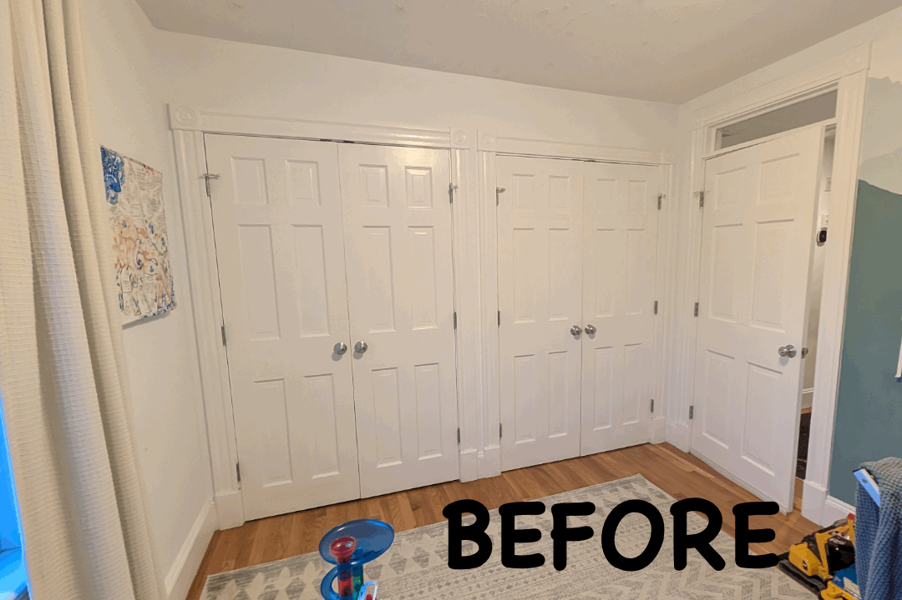
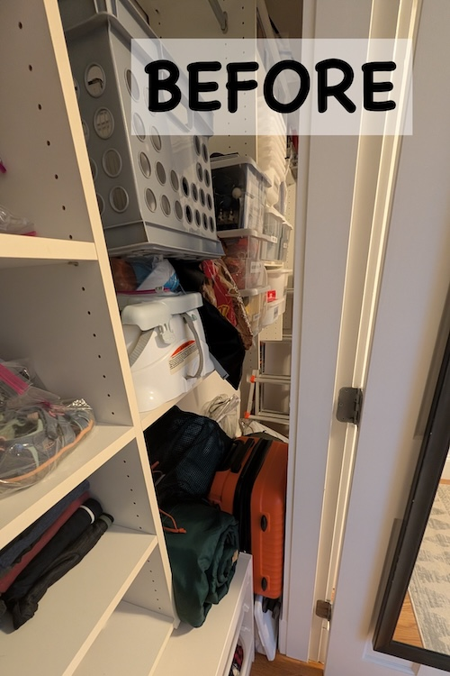
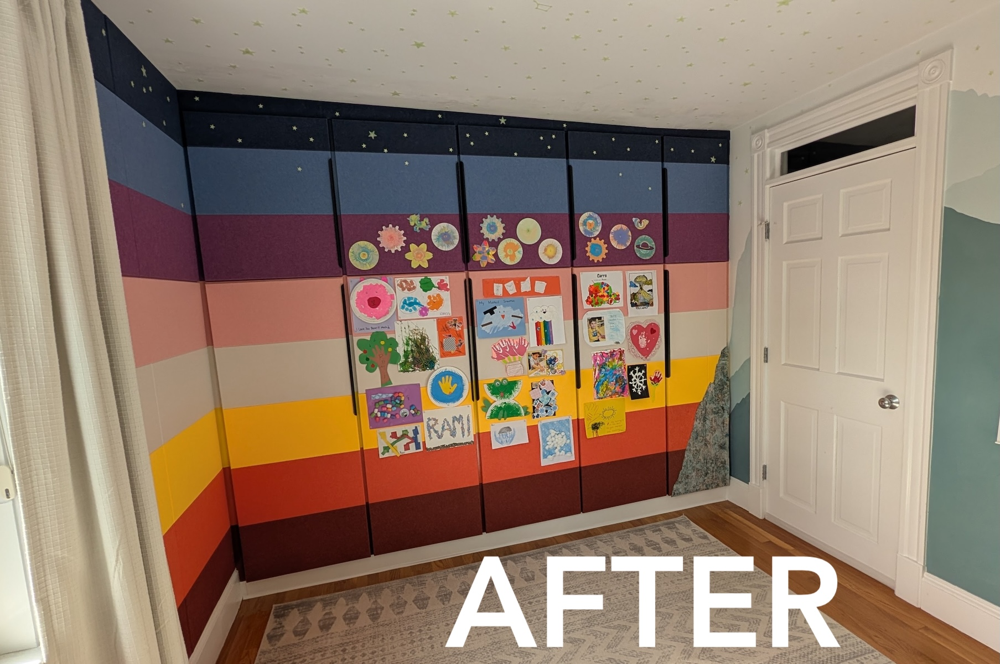
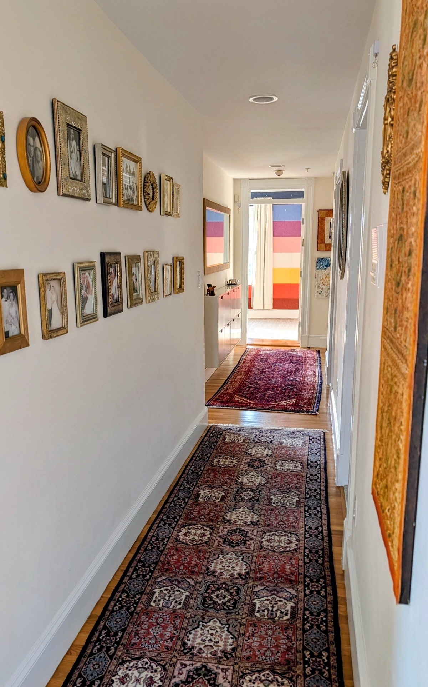
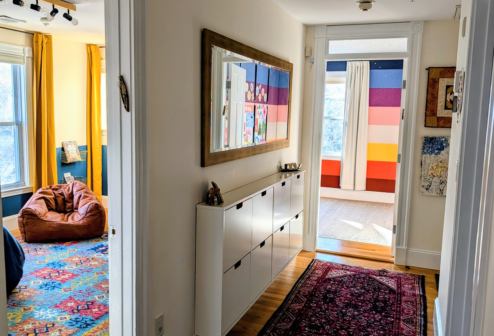
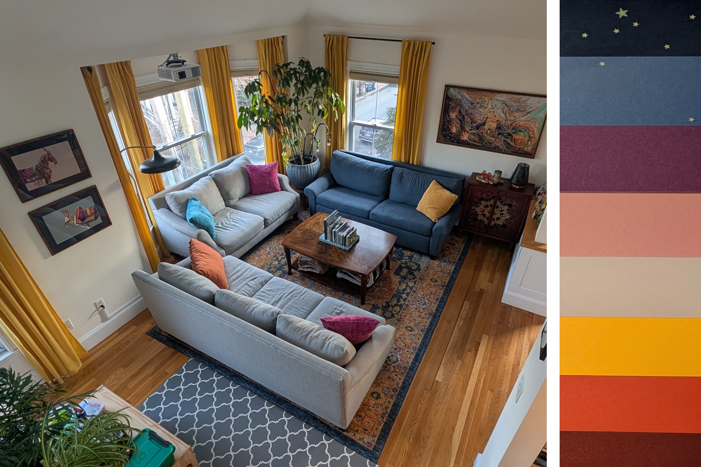

If those four words showed up in a [New York Times Connections](https://www.nytimes.com/games/connections) puzzle, I’m not sure I would ever find the category. :jigsaw: But in this case the answer is: **Things that replaced my son’s closet.** (Yes... I'm on a closet-demoing rampage.) :axe: :door:

**Skip ahead** to read about [why the original closet was no good](), [construction process](), [design choices](), and 
the [much improved organization]().

## Another closet down

At this point, I already [axed our closet](../2025-03-01-wardrobe) and [axed my older son's closet](../2025-05-12-kid-bedroom) :axe:, so our home's last remaining closet (in this bedroom) needed to store some family/household items :family: in addition to my younger son's things :boy:. The current space didn't allow for this separation, and the organization was lacking:  

{: .mx-auto.d-block :}
***Problems:** Unused/inaccessible space above and to the sides of the closet doors. Closet doors get stuck on the rug and in their frames (pinched fingers, anyone? :face_with_head_bandage: :pinching_hand:). Entry door crashes into the closet!* :door:

{: .mx-auto.d-block :}
*Accessing items behind the divider wall was also infuriating.* :rage:

So, I do what I do... :v: out closet :arrow_right: :wave: built-in wardrobe!

{: .mx-auto.d-block :}

**Sunset colors.** I wanted to pick colors that my kid liked, vibed with the rest of our house, and felt like a sunset since I couldn't think of any other way to sort-of tie in the existing mountains.

> But **wHaT Ab0uT ReSaLe?!** It's okay if I don't turn a profit or break even on my house projects whenever we eventually sell this place. I spend money to improve the quality of my life *right now* for how we live! (Plus, with any luck, I don't intend to move imminently.)

## The Process

The construction section of this blog post is under construction. :warning: (teehee #punny)

### Stage 1: Closet demo & construction 

* Pictures of demoed closet
* Installation (and links to) Ikea pantries and shelves with 1/2" spacers to accommodate door swing + panels
* Floor patching (+4" of floor space!)
* Wall/ceiling patching
* Filling in baseboard gap with flexi caulk

### Stage 2: Wall treatment

* Description of sound-absorbing tiles and pinboard quality
* Zinsser bin primer for wood and freshly-plastered walls, two coats of color-matched paint, then polyurethane as a top coat on cabinet frame and doors. 

### Stage 3: Final touches

* Glow-in-the-dark stars (with pushpin points for tiles)
* Filling in mountains with fabric (TBH, looking quite weird.)
* Selecting and hanging artwork that my kiddo is so proud of!

## View from the Hallway

The colors are a little *intense*, I know. 	:rainbow: :city_sunset: But they're perfect for my kiddo (he wanted *even more* color than this :open_mouth:), and the saturation level feels right given our home's current aesthetic.

{: .mx-auto.d-block :}
:eyes: You can read more about our [family pictures wall](../2025-12-16-gallery-wall#family-pictures) and my [wall-mounted linens cabinet](../2022-01-18-linens).

{: .mx-auto.d-block :}
:point_left: I fixed up (...and axed the closet from) our [older son's bedroom](../2025-05-12-kid-bedroom) last year.

{: .mx-auto.d-block :}
:point_up: And here's the other end of the hallway looking into our [living room](../2025-04-12-living room).

## Organization
I've saved the best for last ! 

{: .mx-auto.d-block :}

Details about labeling the wire mesh drawers and deep cloth bins are coming soon!

## Cost

Costs for the project are also coming soon! Stay tuned. 

| Materials | Cost (+ tax/shipping) | 
|----|----:|
| Test item | 0 | 