If those four words showed up in a [New York Times Connections](https://www.nytimes.com/games/connections) puzzle, I’m not sure I would ever find the category. :jigsaw: But in this case the answer is: **Things that replaced my son’s closet.** (Yes... I'm on a closet-demoing rampage.) :axe: :door:

**Skip ahead** to read about: 
<table>
  <tr>
    <td><strong>The <a href="#the-constraints">Constraints</a></strong></td>
    <td>
      • <a href="#constraint-storage">storage requirements</a> :basket: :ladder: 
      • <a href="#constraint-function">functionality</a> :hear_no_evil: 
      • <a href="#constraint-aesthetics">aesthetic preferences</a> :rainbow:
    </td>
  </tr>
  <tr>
    <td><strong>The <a href="#the-fix">Fix</a></strong></td>
    <td>AKA <a href="#the-fix">The "After" Pictures!</a> :star_struck:</td>
  </tr>
  <tr>
    <td><strong>The <a href="#the-process">Process</a></strong></td>
    <td>
      • <a href="#stage-1-closet-demo--construction">closet demo and wardrobe installation</a> :axe: 
      • <a href="#stage-2-painting-and-panel-installation">prep with paint</a> + acoustic panel install :paintbrush: 
      • <a href="#stage-3-tying-in-the-other-walls">tying in existing room elements</a> :mountain:
    </td>
  </tr>
  <tr>
    <td><strong>The <a href="#organization">Organization</a></strong></td>
    <td>
      • storage of <a href="#active-clothes">current clothing</a> and <a href="#in-between-clothes">in-between sizes</a> :shirt: :jeans:
    </td>
  </tr>
</table>

## The Constraints

As usual, **function » form** ! Here were the project requirements, in orer of importance (**:red_circle: critical, :orange_circle: important, :yellow_circle: desirable**): 

**1. :red_circle: :package: Communal storage needs separation.** I already [axed our closet](../2025-03-01-wardrobe) and [axed my older son's closet](../2025-05-12-kid-bedroom) :axe:, so our home's last remaining closet (in this bedroom) needed to store some communal items in addition to my younger son's things :family: :boy:. The current setup was not working.  

{: .mx-auto.d-block :}

{: .mx-auto.d-block :}

**2. :orange_circle: :paintbrush: Space to showcase kiddo's artwork** since he is *so* proud of it, and I don't have the heart to [get rid of it](../2022-09-01-kids-artwork). 

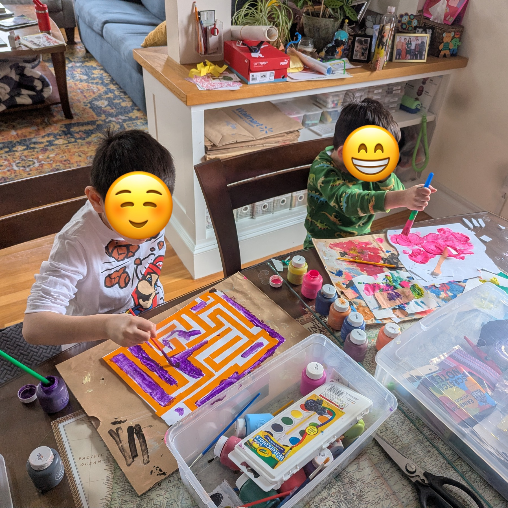{: .mx-auto.d-block :}
*I love this picture, since their art looks like their two brains on display. :heart_eyes:*

**3. :orange_circle: :loud_sound: Soundproof walls** for our neighbors' sakes. 

**4. :yellow_circle: :rainbow: Pick colors** that my kiddo loves! 

**5. :yellow_circle: :mountain: Keep painted mountains** on [the other walls](#stage-3-tying-in-the-other-walls), per the kids' request. 

## The Fix
So... :v: out closet → :wave: built-in wardrobe! I used [Ikea Sektion pantry units](https://www.ikea.com/us/en/cat/sektion-kitchen-ka005/) and covered them with [FeltRight acoustic tiles](https://studiov2.feltright.com/?import=7F-yB9vS9P). :pushpin:

{: .mx-auto.d-block :}

> **But aren't closets important for resale?** It's okay if we don't turn a profit on my house projects when we sell this place (in the distant future). Making these changes improves the quality of our lives *right now* !

| Closet Problems | Wardrobe Solutions | 
|--|--|
| :no_entry_sign: Inaccessible space above and to the sides of openings. | :heavy_check_mark: Deeper usable space from wall-to-wall and floor-to-ceiling. |
| :door: Doors get stuck on the rug and in their frames. :pinching_hand: Fingers get pinched! | :heavy_check_mark: Lighter, overlay cabinet doors with soft-close hinges raised off floor. |
| :collision: Entry door crashes into the closet! | :heavy_check_mark: Gained ~4" of floorspace *and* solved the collision issue! |

:heavy_check_mark: :hear_no_evil: :pushpin: **[Acoustic tile panels](https://studiov2.feltright.com/?import=7F-yB9vS9P)** are sound-dampening *and* double as pinboards, so we can hang up (and change up!) artistic creations.

:heavy_check_mark: :rainbow: **Color palette fits our aesthetic.** The colors are a little *intense*, I know. But they're perfect for my kid (he wanted *even more* color than this :open_mouth:), and they look cohesive from other parts of our home: 

{: .mx-auto.d-block :}
:eyes: You can read more about our [family pictures wall](../2025-12-16-gallery-wall#family-pictures) and my [wall-mounted linens cabinet](../2022-01-18-linens).

{: .mx-auto.d-block :}
:point_left: I fixed up (...and axed the closet from) our [older son's bedroom](../2025-05-12-kid-bedroom) last year.

{: .mx-auto.d-block :}
:point_up: And here's the other end of the hallway looking into our [living room](../2025-04-12-living room).

## The Process

### Stage 1: Closet demo & construction 

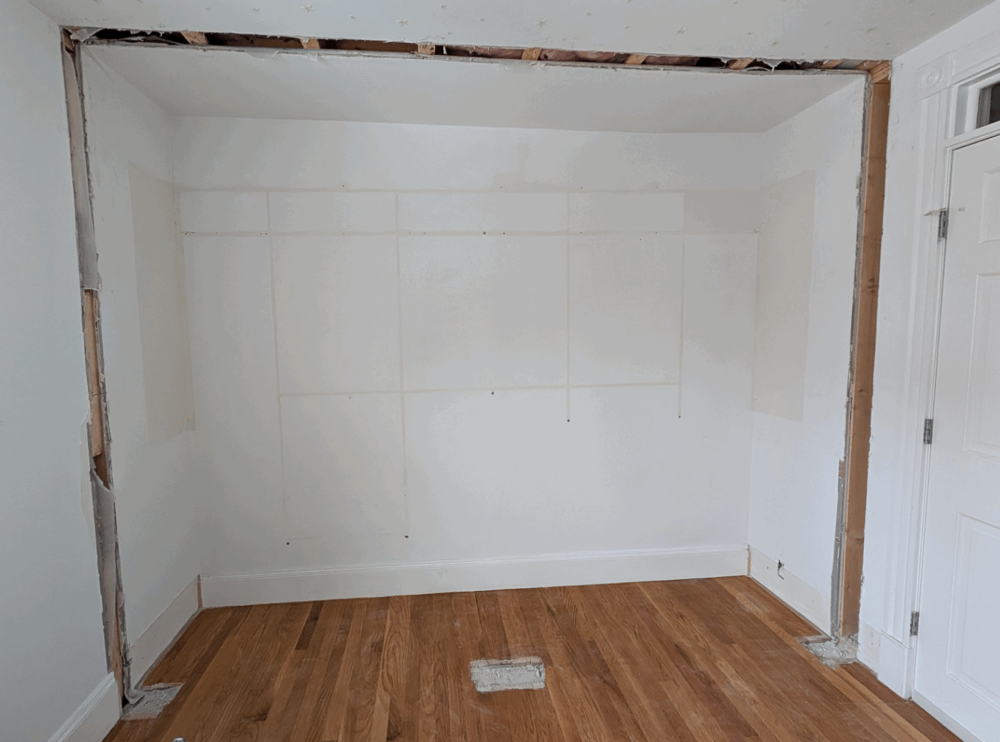{: .mx-auto.d-block :}

I hired a local contractor to demo the existing closet, patch the ceiling, walls, and floors, then assemble and install some [Ikea pantries](#cost) with [1/2" poplar spacers](https://www.homedepot.com/p/Weaber-1-2-in-x-2-in-x-4-ft-S4S-Poplar-Board-27406/207058985) to accommodate the swing of cabinet doors + 3/8"-thick acoustic panels. :construction_worker_woman: :toolbox: :hammer:	

### Stage 2: Painting and panel installation

**Step 1. Prep cabinet frame and doors.** I got custom color samples to match the panels, plus [Zinsser BIN primer](https://www.acehardware.com/departments/paint-and-supplies/primers/primers/1514165) for the wood, [Ikea doors](#cost) and fully-cured plaster walls (I [learned my lesson](../2025-05-12-kid-bedroom#the-process) from painting too soon...). It took a few weekends-- sanding, priming, two coats of paint, and sealing the cabinet frames and door edges with polyurethane. :weary:

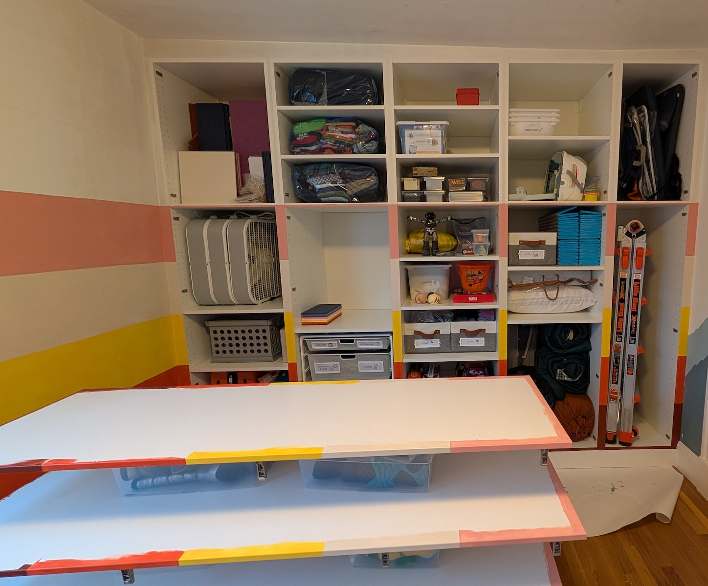{: .mx-auto.d-block :}

**Step 2. Paint wall.** I paneled the window wall too :window: so we could [see the colors from the hallway](#the-fix)... which meant painting underneath so gaps around tiles/windows wouldn’t show. :sassy_woman: :paintbrush:

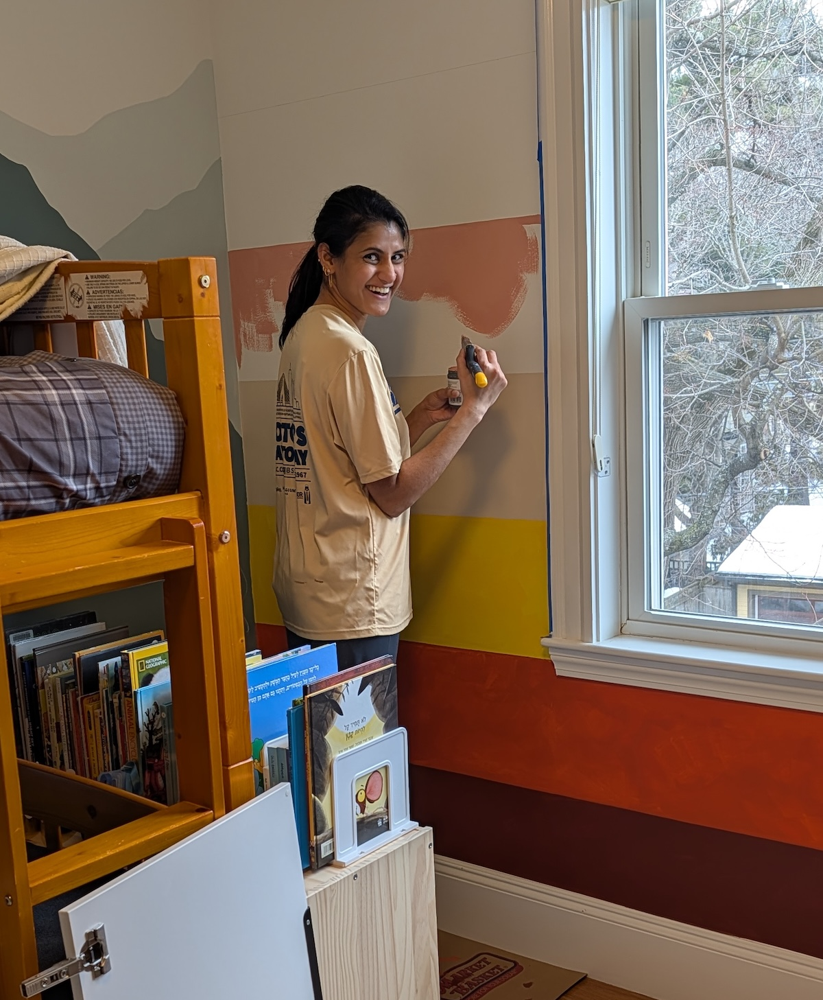{: .mx-auto.d-block :}

**Step 3. Install panels.** Panels were *super easy* to cut with box cutters and hang using the provided (renter-friendly!) adhesive strips. 

**Step 4. Fill baseboard gap** with a [flexi caulk strip](https://instatrim.com/products/instatrim-trim-strips-white?variant=39675875360856), since I suspect my kiddo would have tried to stuff cards and toys in there otherwise... :black_joker: :smiling_imp:

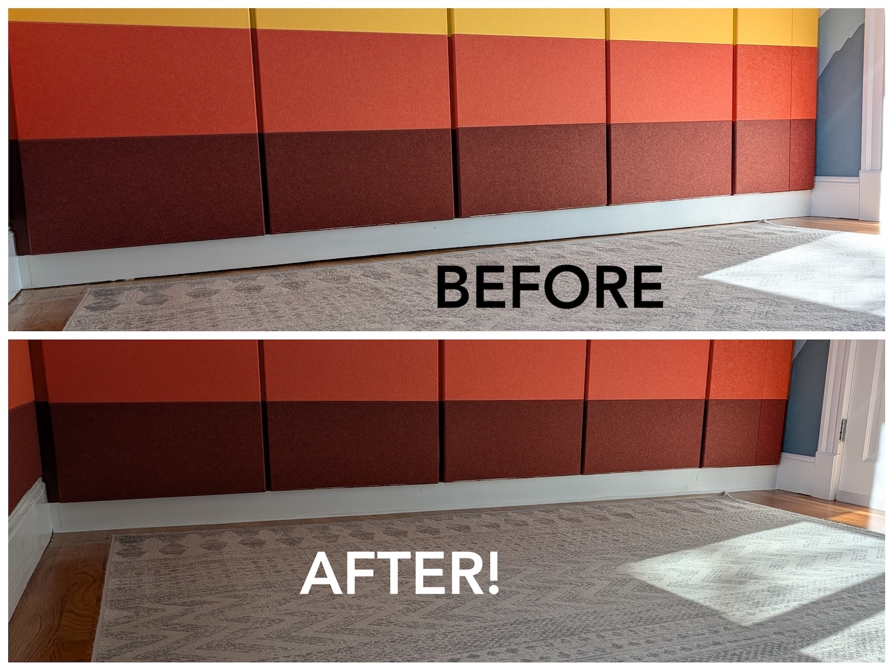{: .mx-auto.d-block :}

### Stage 3: Tying in the other walls 

My husband and I free-hand painted these mountains ~5 years ago by gradually
mixing in larger and larger amounts of [BM Hemlock](https://www.benjaminmoore.com/en-us/paint-colors/color/719/hemlock) with [BM Ice Mist](https://www.benjaminmoore.com/en-us/paint-colors/color/oc-67/ice-mist) (the existing wall color) as we moved from the background to foreground. :mountain: :mountain_snow: 

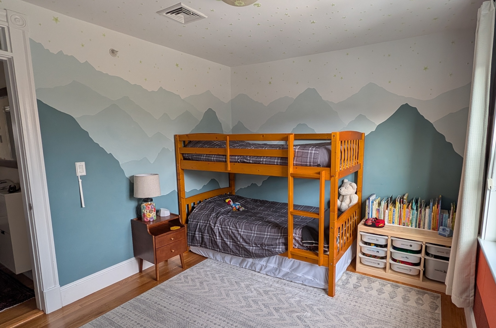{: .mx-auto.d-block :}

The kids didn't want to cover them up, so I came up with three ways to *try* and tie the room together.

**Step 1. Sunset color palette.** I picked colors that felt like a *sunset* between mountains. :sunrise_over_mountains:

{: .mx-auto.d-block :}

**Step 2. Fabric mountain range.** To soften the abrupt transition from the mountains to the "sunset", I matched paint swatches to [batik cotton fabric](https://hoffmancaliforniafabrics.net/php/catalog/fabricshop.php?a=sc&Category=90) options at the [Fabric Corner in Arlington](https://www.fabriccornerinc.com/). I cut the fabric into mountain shapes, [edge-sealed](https://www.dickblick.com/items/dritz-fray-check-liquid-seam-sealant-34-oz-bottle/) to prevent fraying, and attached with [clear push pins](https://www.amazon.com/dp/B09ZL7KQMD). :scissors: :pushpin: 

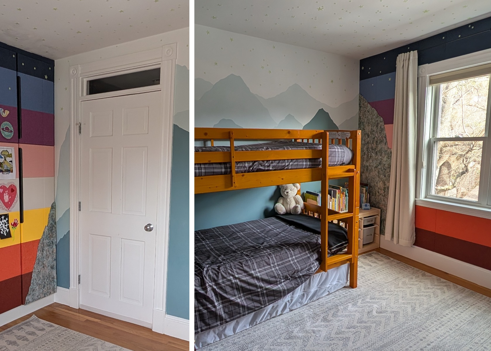{: .mx-auto.d-block :}
*Thoughts? I might change this up...*	:thinking:

**Step 3. Glow-in-the-dark stars.** I added [stars](https://www.amazon.com/dp/B08GJMDXL9) around the whole room, above the mountains on the walls and to the acoustic panels (onto these [flat-head push pins](https://www.amazon.com/dp/B0F4MW4PFM) to stick). :night_with_stars:

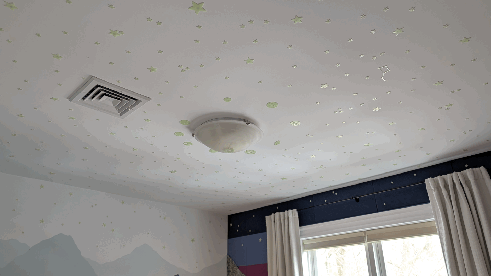{: .mx-auto.d-block :}
*The sun is on the ceiling light with the planets ordered around it.* :sun_with_face: :ringed_planet: :stars: 

## Organization
I've saved the best for last ! We finally have super accessible and intentional storage for **communal items** :ladder: :briefcase: :bed: (behind less-convenient doors 1, 4, 5) & **personal items** :tshirt: :teddy_bear: (behind easy-to-access door 2 and lower half of 3), with room to grow:

{: .mx-auto.d-block :}

**Clothes currently in rotation.** Our son knows exactly which cabinets are his, and these [24" wire mesh drawers](https://www.containerstore.com/s/elfa/best-selling-solutions/favorites-under-five-hundred/elfa-cabinet-closet-drawers/123d?productId=11021262) make it easy for him to access everything and get dressed independently. :shirt: :jeans: 

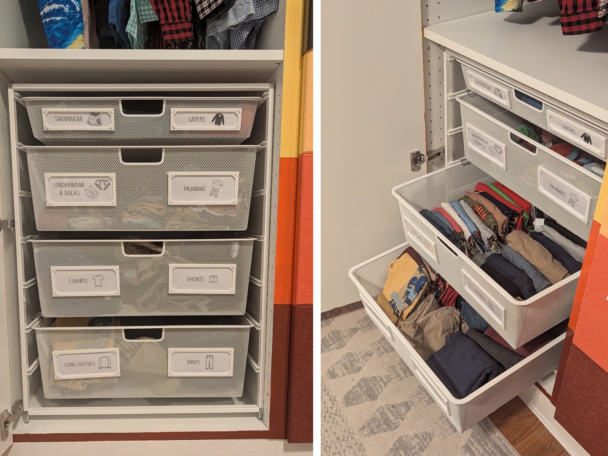{: .mx-auto.d-block :}
:point_up: *I adapted the [3D-printed label frames](https://www.tinkercad.com/things/gDFrcBXupzb-closet-drawers-label-frame?sharecode=Weu9Hm--0ZAtXcWf9c-KlVnPqU9vlfy96KD3_fv-FXY) that I originally designed for our [pantry bin project](../2024-08-15-entry-closet) and attached them with twist ties.*

**In-between size storage.** We get *a lot* of hand-me-downs, so I needed a spot to store in-between clothes sizes that could be easily accessed when needed. :shirt: :shorts: :jeans: :coat: :athletic_shoe: 

| Kiddo | Outgrown clothes? | Needs next size up? |
| -- | -- | -- |
| Older | Transition bin | Size up bin! | 
| Younger | Donation bin (in [laundry room](../2024-09-20-laundry)) | Size up bin! |  

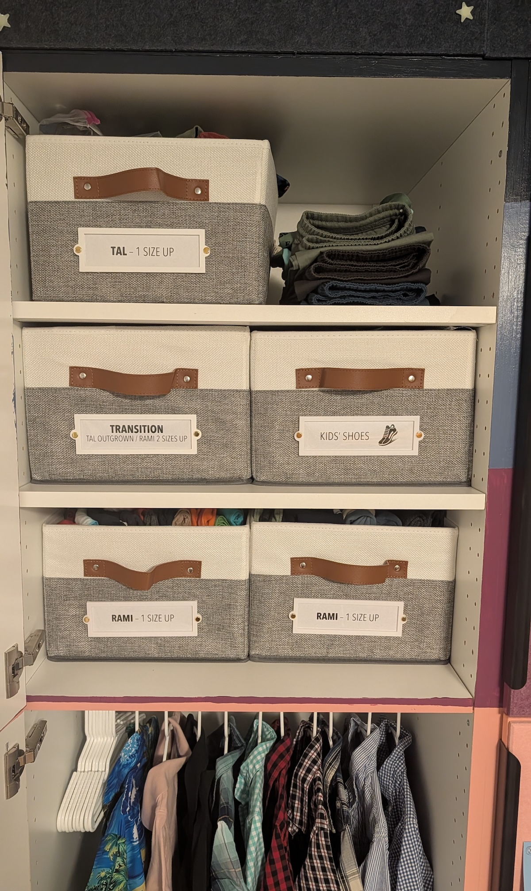{: .mx-auto.d-block :}
:point_up: *I also designed [3D-printed cloth bin frames](https://www.tinkercad.com/things/e5gyOMqOENJ-cloth-bin-frames?sharecode=D52R3QdpjxtTu4_70WTPCq9W7q-OfFRMzE1CV9DBrT8) and attached them with [brass fasteners](https://www.amazon.com/dp/B08MPRHKP6) that I had leftover from my [utility room project](../2024-06-26-laundry).*

**Seasonal rotation.** I fill the "next size up" bins for both boys twice yearly (:seedling:+:beach_umbrella: / :fallen_leaf:+:snowman_with_snow:), so that I know where to go for extras as soon as they're needed instead of scrambling in the moment and/or unnecessarily buying new!

## Cost

Our biggest expense was the custom wardrobe for better storage. :basket: Luckily, that'll stay even if the room style changes later.

*Most importantly...* we have one happy boy! :heart_eyes: 

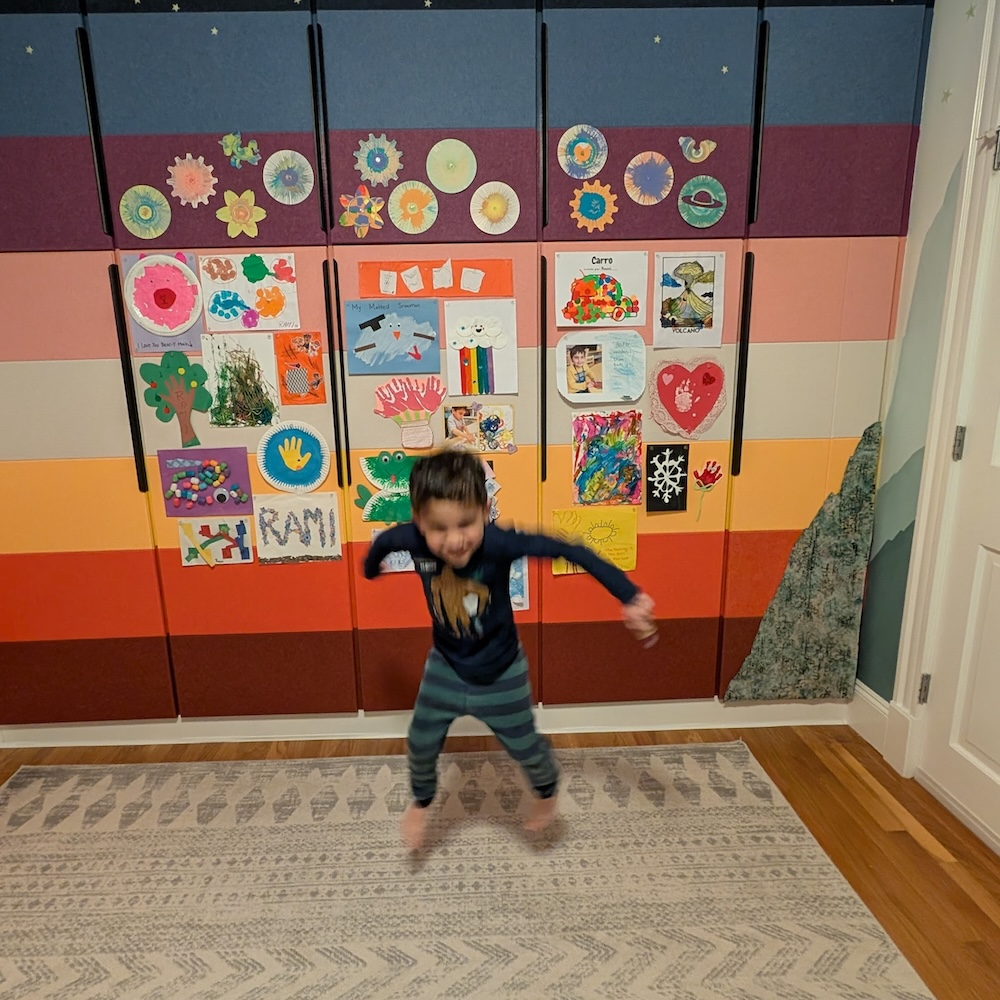{: .mx-auto.d-block :}

| Materials | Cost (+ tax/shipping) | 
|----|----------------------:|
| closet demo, floor & ceiling patching, and pantry installation labor |              $4900.00 |
| 4 Ikea [24x90" pantry Sektion units](https://www.ikea.com/us/en/p/sektion-high-cabinet-frame-white-70265445) and [short 30"](https://www.ikea.com/us/en/p/veddinge-door-white-20266782/) and [long 60"](https://www.ikea.com/us/en/p/veddinge-door-white-80266779/) doors, 1 [18x90" pantry](https://www.ikea.com/us/en/p/sektion-high-cabinet-frame-white-00265439/) with [short](https://www.ikea.com/us/en/p/veddinge-door-white-70266812/) and [long](https://www.ikea.com/us/en/p/veddinge-door-white-10266773/) doors, [suspension rail](https://www.ikea.com/us/en/p/sektion-suspension-rail-galvanized-60261527/), 7 [shelf packs](https://www.ikea.com/us/en/p/utrusta-shelf-white-00265533/), 5 [27" handles](https://www.ikea.com/us/en/p/billsbro-handle-anthracite-50576311/), 5 [21" handles](https://www.ikea.com/us/en/p/billsbro-handle-anthracite-10576313/), 10 [pantry leg pairs](https://www.ikea.com/us/en/p/sektion-leg-90556071/), 15 [cabinet hinge pairs](https://www.ikea.com/us/en/p/utrusta-hinge-w-b-in-damper-for-kitchen-80524882/)  |              $2236.50 | 
| FeltRight [sample pack](https://feltright.com/products/full-sample-kit), [wardrobe panels](https://studiov2.feltright.com/?import=7F-yB9vS9P) and [wall panels](https://studiov2.feltright.com/?import=IQmYgRs0Ye) |              $1224.56 |
| [Elfa closet drawers](https://www.containerstore.com/s/elfa/best-selling-solutions/favorites-under-five-hundred/elfa-cabinet-closet-drawers/123d?productId=11021262) |               $148.40 | 
| 8 custom color match samples, [Zinsser BIN primer](https://www.acehardware.com/departments/paint-and-supplies/primers/primers/1514165) |               $114.20 | 
| [poplar wood strips](https://www.homedepot.com/p/Weaber-1-2-in-x-2-in-x-4-ft-S4S-Poplar-Board-27406/207058985), [wood glue](https://www.homedepot.com/p/Titebond-III-16-oz-Ultimate-Wood-Glue-1414/100522343), [wood filler](https://www.homedepot.com/p/Varathane-3-75-oz-White-Wood-Filler-Putty-340261/305568203) |                $75.25 |
| [6-pack cloth bins](https://www.amazon.com/dp/B0FBKSJHJS) & [3-pack cloth bins](https://www.amazon.com/dp/B0D78Q42S5) |                $62.63 | 
| [flexi white trim 3/4"](https://instatrim.com/products/instatrim-trim-strips-white?variant=39675875360856) and [applicator tool](https://instatrim.com/products/instatrim-applicator-tool) |                $38.90 | 
| [2 3/8" yards of Batik cotton fabric](https://www.fabriccornerinc.com/) |                $35.38 |
| [kids' hangers](https://www.amazon.com/dp/B0B4RVT1GW) |                $15.93 | 
| [200 glow in the dark stars](https://www.amazon.com/dp/B0711T1VHS) |                $12.77 |
| [white tension clothes rod](https://www.amazon.com/dp/B0D9BP84SH) |                $10.61 |
| [200-pack clear pushpins](https://www.amazon.com/dp/B09ZL7KQMD) |                 $6.36 |
| [white upholstery tacks](https://www.amazon.com/dp/B0F4MW4PFM) |                 $6.19 | 
| [Dritz fray check glue](https://www.dickblick.com/items/dritz-fray-check-liquid-seam-sealant-34-oz-bottle/) |                 $6.15 | 
| [curtains](https://www.target.com/p/50-34-x84-34-blackout-textured-plaid-curtain-panel-ivory-threshold-8482/-/A-89197691) (already owned) |                    $0 | 
| [curtain rod](https://www.target.com/p/48-34-88-34-loft-by-umbra-room-darkening-curtain-rod-darjeeling-bronze/-/A-14104936) (already owned) |                    $0 | 
| [Ikea white Trofast storage unit and bins]() (SOLD) |                  +$60 | 
| **TOTAL** |          **$8833.83** |