Kids grow. New possessions arrive. Old habits disappear. :baby: :boy: :man: :man_beard: Our dining room pony-wall bookshelf has been (re)optimized so many times that a walk-through of notable versions is warranted. :crayon: :books: :game_die: Even perfectly organized spaces are never truly "finished" ! 

**Pony-wall bookcase: Enabling kid independence *and* supervision.** While this built-in was originally designed just to disguise a [structural post](../2023-06-01-fireplace), it turned out to be the perfect spot for messy kid-tivities:

* :heavy_check_mark: kid accessible
* :heavy_check_mark: only 11" deep
* :heavy_check_mark: adjacent to the spill-ready dining table
* :heavy_check_mark: near a sink and [broom](../2024-08-15-entry-closet) :broom: :soap:

**Jump ahead** to read about [our current organization system](#v30-organization-details), newly optimized for 4- and 7-year-old schoolkids! 

## Initial Commit: Bookshelf for Books

When we first moved in with our 6-month-old, we thought *books* were a perfectly reasonable thing to store on a *bookshelf*. :books:

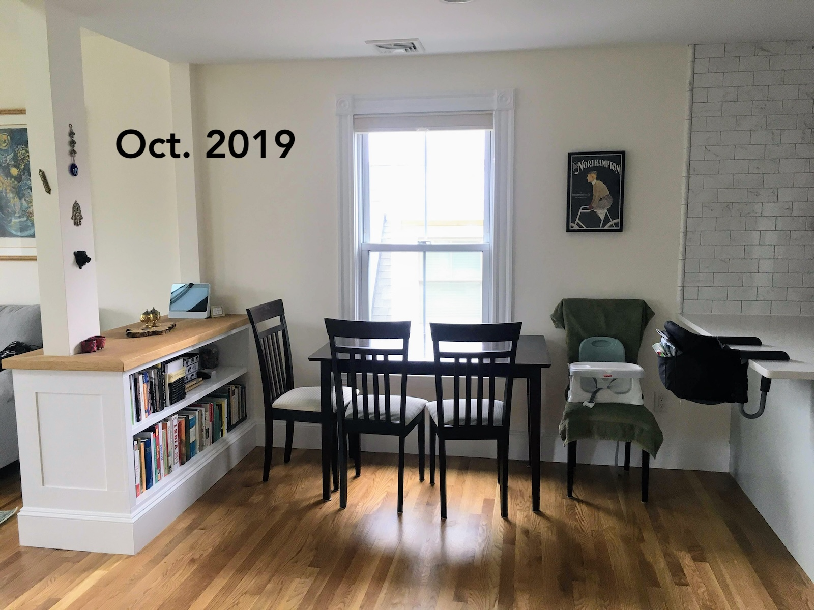{: .mx-auto.d-block :}

...Parent *amateurs*. :woman_facepalming: In no time at all, our kiddo was pulling up onto the shelf :arrow_up:, and pulling down all the books :arrow_down: ! :grimacing:

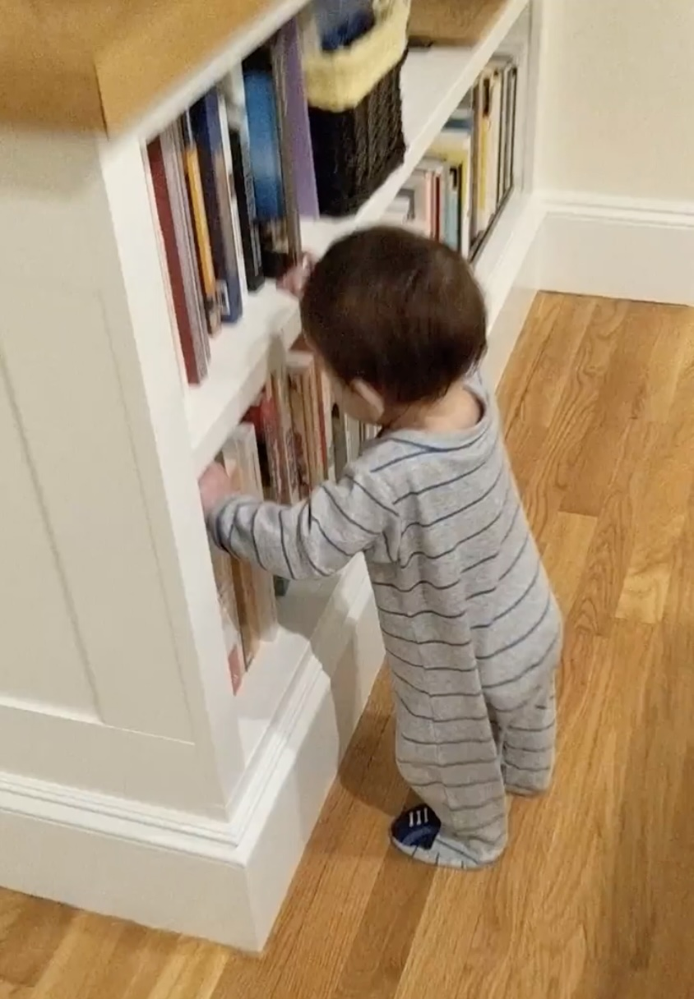{: .mx-auto.d-block :}

We moved the books [upstairs](../2023-06-01-fireplace) :books: and started keeping kids' games and art activities here, instead. :game_die: :art:

## Second Commit: Babyproofing Toddler Activities

In what felt like another blink, kiddo #2 had arrived. Our older son's games were *not* baby-safe, and [the art supply stash was reaching critical overload](../2022-09-01-kids-artwork). :boom: :paintbrush: :orange_book: 

**Problem 1: Swallowable game pieces.** Games needed to be toddler accessible (and put-away-able) but still baby-proofed. These [4x6 photo boxes](https://www.containerstore.com/s/office/craft-hobby/iris-16-case-4-x-6-photo-and-craft-storage-carrier/12d?productId=11004246) were ideal! :jigsaw:  

**Problem 2: Drawing tools are messy.** These [Ikea glis boxes](https://www.ikea.com/us/en/p/glis-box-with-lid-clear-40604116/) are light, easily opened and closed (with small hands), and otherwise stay shut. :crayon: :pencil:

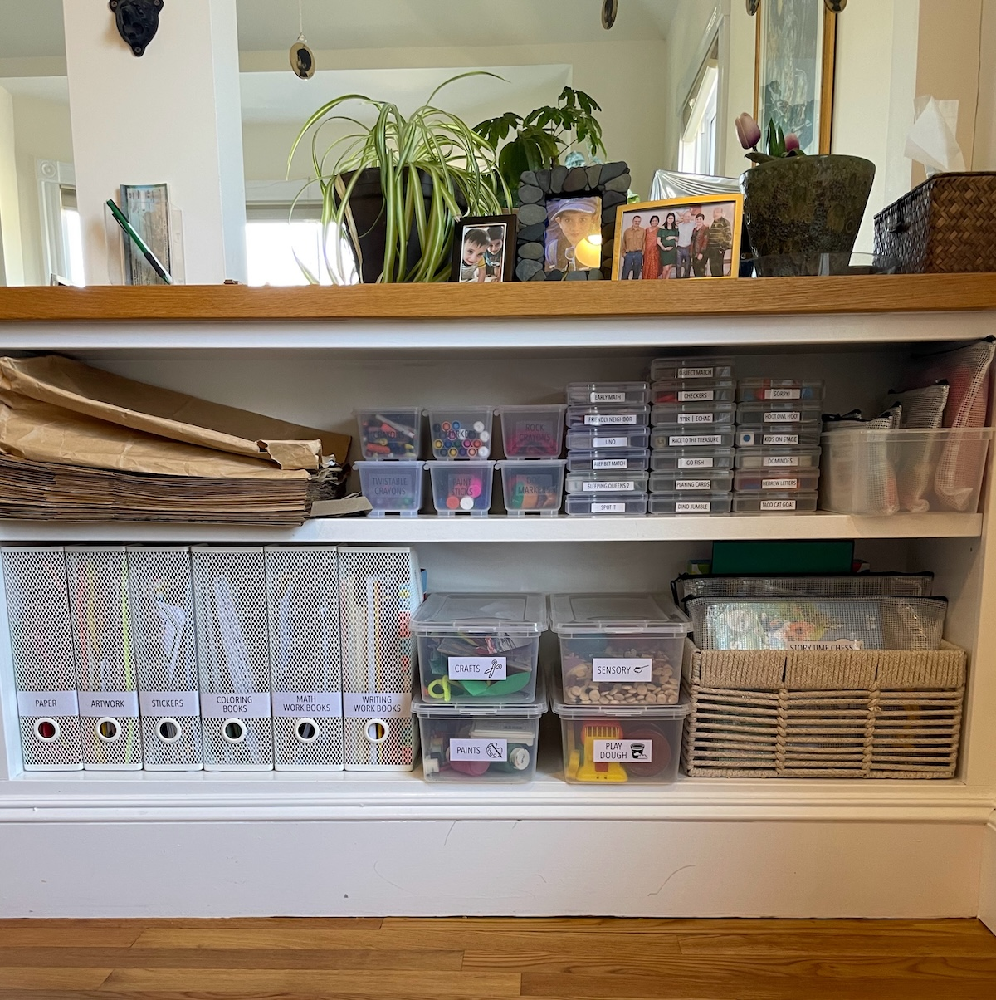{: .mx-auto.d-block :}

**Problem 3: Workbooks need protection.** Six (indestructible) [metal magazine holders](https://www.ikea.com/us/en/p/droenjoens-magazine-file-white-10439694/) held workbooks and became one of the more frequently modified components of our system:

<table style="width:100%; border-collapse:collapse; margin:1em 0;">
  <tr>
    <th colspan="2" style="padding:8px;">v2.1: Tiny Kids</th>
  </tr>
  <tr>
    <td style="width:50%; vertical-align:top; padding:10px; background:#e6ffed;">
      <strong style="color:#22863a;">+</strong>
      Mess protection, Artwork, Paper, Stickers, Coloring Books, Workbooks
    </td>
    <td style="width:50%; vertical-align:top; padding:10px; background:#ffeef0;">
      <strong style="color:#cb2431;">−</strong>
    </td>
  </tr>
  <tr>
  <th colspan="2" style="padding:8px;">v2.2: We Have a Preschooler!</th>
</tr>
  <tr>
    <td style="vertical-align:top; padding:10px; background:#e6ffed;">
      <strong style="color:#22863a;">+</strong>
      Math, Writing
    </td>
    <td style="vertical-align:top; padding:10px; background:#ffeef0;">
      <strong style="color:#cb2431;">−</strong>
      Mess protection, Workbooks
    </td>
  </tr>
  <tr>
  <th colspan="2" style="padding:8px;">v2.3: Kids Can't Share...</th>
</tr>
  <tr>
    <td style="vertical-align:top; padding:10px; background:#e6ffed;">
      <strong style="color:#22863a;">+</strong>
      Shared, Rami, Tal
    </td>
    <td style="vertical-align:top; padding:10px; background:#ffeef0;">
      <strong style="color:#cb2431;">−</strong>
      Coloring Books, Math, Writing
    </td>
  </tr>
  <tr>
  <th colspan="2" style="padding:8px;">v2.4: Real Homework Begins</th>
</tr>
  <tr>
    <td style="vertical-align:top; padding:10px; background:#e6ffed;">
      <strong style="color:#22863a;">+</strong>
      Writing/Drawing, Math/Chess, Language
    </td>
    <td style="vertical-align:top; padding:10px; background:#ffeef0;">
      <strong style="color:#cb2431;">−</strong>
      Paper, Stickers
    </td>
  </tr>
</table>

*"Artwork" has been our only bin constant... I stuff the kids' art in here, and when it's finally too full, we play "keep or rid" to make space.* :bulb:

## Third Commit: Two Schoolkids, More Stuff

Fast-forward, and suddenly our younger kiddo is in preschool! :mortar_board: This came with new goodies and new challenges.

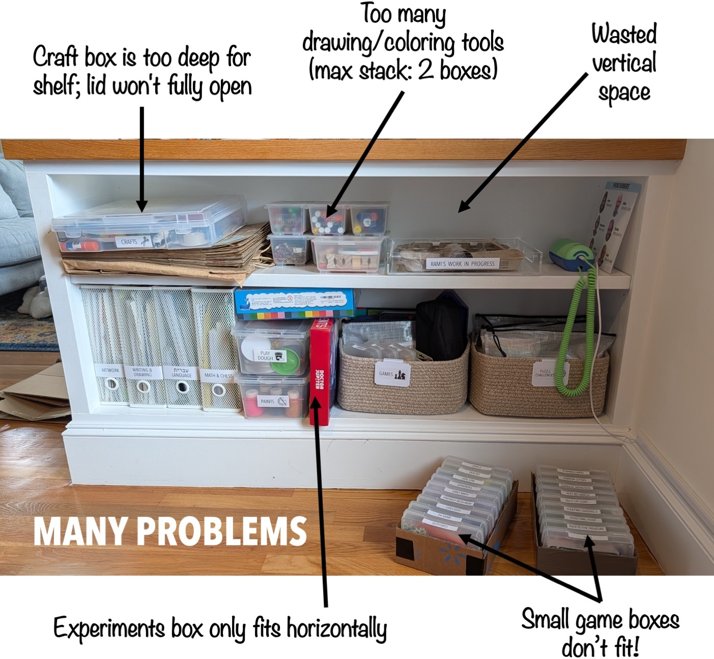{: .mx-auto.d-block :}

Here's how our pony-wall bookshelf is currently optimized: 

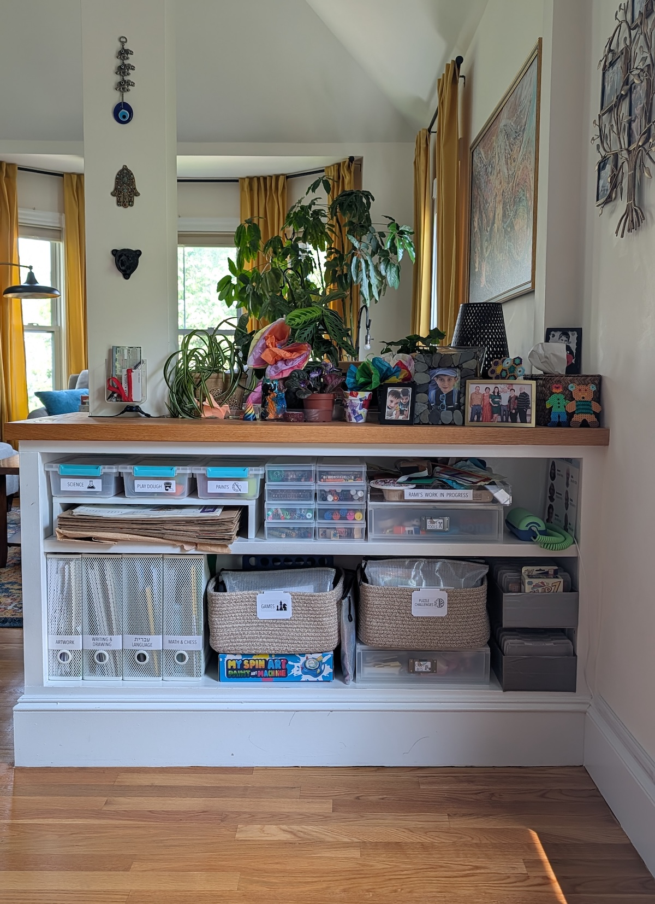{: .mx-auto.d-block :}

## v3.0: Organization Details

In a recurring theme (of life), solving one problem tends to create new problems: 

| Problem 1: Big Crafting Tools | Fix-for-Now | 
|---|---|
| :scissors: *Most favorite* [paper cutter](https://a.co/d/01xskXnm) is too long for [existing shoeboxes](https://www.containerstore.com/s/closet/shoe-storage/our-shoe-box/12d?productId=10001753) | :heavy_check_mark: Found a [14" craft box](https://www.michaels.com/product/12-x-12-clear-scrapbook-case-by-simply-tidy-10575615)! | 
| ↳ ... :rage: "Amma, where's XYZ?" since bin can't fully flip open ↳ ... :face_with_head_bandage: Bin sticks out past shelf | :heavy_check_mark: Separated "tools" from consumable "supplies" and sorted into [pull-out drawers](https://www.containerstore.com/s/office/craft-hobby/like-it-landscape-paper-drawer/12d?productId=10027354) | 

:point_down: **Craft Tools** stores a [paper cutter](https://a.co/d/01xskXnm), [regular kid scissors](https://a.co/d/00hD9JGV), [pattern scissors](https://a.co/d/0htLiGOP), [hole punchers](https://a.co/d/07F3p1CU), [glitter glue](https://a.co/d/0cmMJNp2), [Scotch tape](https://a.co/d/05QjX3c3), a [mini stapler](https://a.co/d/05SV3mnG), [glue sticks](https://a.co/d/01Pbznbp), and [scratch notes](https://a.co/d/0ckik5DV). :scissors:

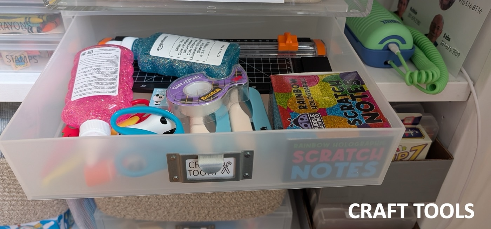{: .mx-auto.d-block :}

:point_down: **Craft "Bits"** stores turnover items like beads, pom poms, stickers, pipe cleaners, and popsicle sticks. :thread: :yarn: 

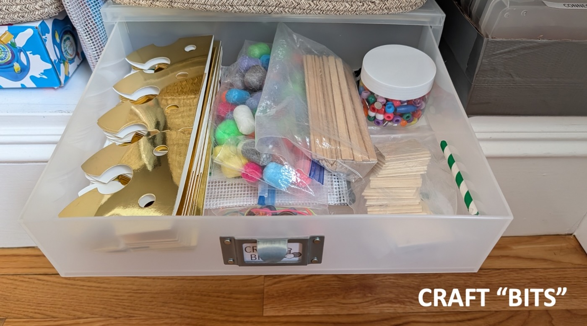{: .mx-auto.d-block :}

| Problem 2: Work-in-Progress | Fix-for-Now | 
|---|---|
| 🚧 Half-finished craft projects are constantly left out on table. | :heavy_check_mark: Preschool teacher suggests a ["work-in-progress" tray](https://a.co/d/0egp33Et). | 
| ↳ ... :game_die: Space for small game boxes is gone to accommodate work tray. | :heavy_check_mark: Installed [L-brackets](https://a.co/d/01hjisKv) to stack games on DIYed short mini shelf |

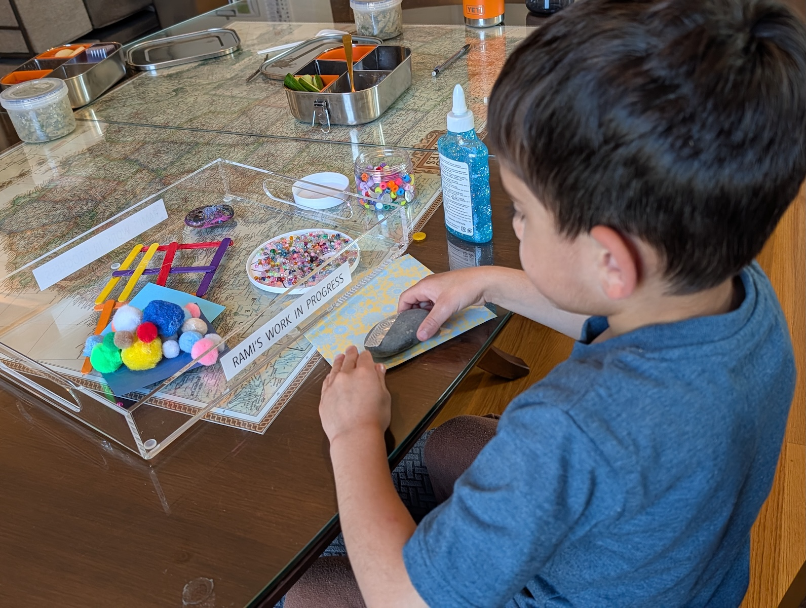{: .mx-auto.d-block :}
*The "work-in-progress" tray has been a mixed success: Half-finished crafts **are** returned here :clap: ...but rarely finished.* :upside_down_face: :shrug:

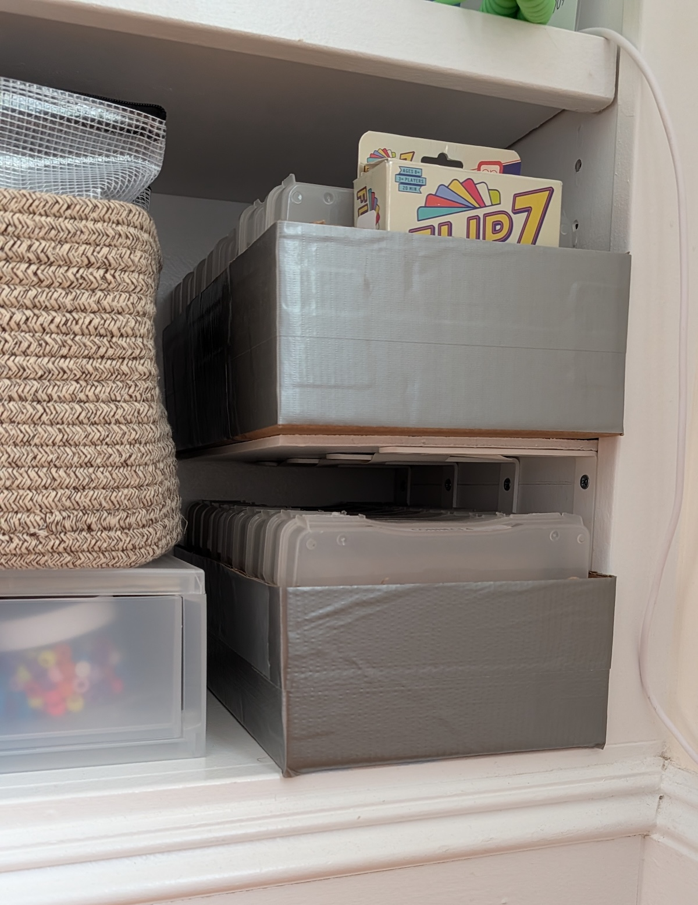{: .mx-auto.d-block :}
:point_up: *I made baskets from cardboard and duct tape (like for our [upstairs games cabinet](../2023-06-01-fireplace)), since the kids were adamant about these card games staying here.* :spades: :diamonds: :clubs: :hearts:

| Problem 3: Diverse writing implements | Fix-for-Now | 
|---|---|
| :art: Too many actively-used art supplies, and [existing boxes](https://www.ikea.com/us/en/p/glis-box-with-lid-clear-40604116/) don't stack deeply enough | :heavy_check_mark: Found perfectly sized [stackable pencil cases](https://a.co/d/08WF3pME). | 

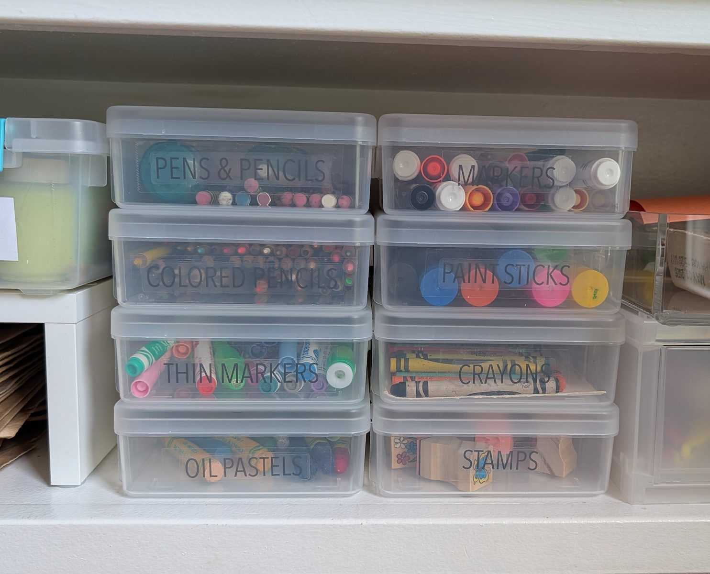{: .mx-auto.d-block :}

| Problem 4: New phone! | Fix-for-Now | 
|---|---|
| :phone: Kiddos want to call their own friends and grandparents | :heavy_check_mark: We got a [Tin Can](https://tincan.kids/)! (...it's been amazing) | 
| ↳ ... :hammer: Phone isn't wall-mountable and must be within reach, displacing some games | :heavy_check_mark: Moved games into [cloth bins](https://a.co/d/0bdjSUww) on lower shelf | 

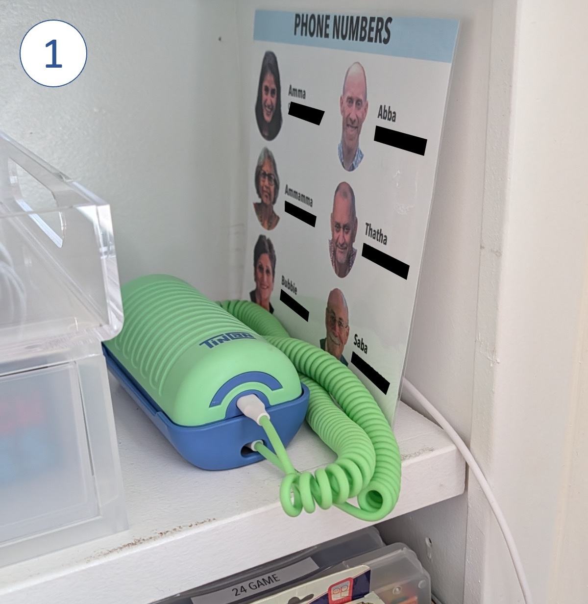{: .mx-auto.d-block :}
*We bought the [Tin Can](https://tincan.kids/) so the kids could call family members (and memorize their phone numbers). Now, their friends are getting them, too, so they can call each other!* :phone: 

After donating and [relocating](../2025-08-01-projector) games where possible, I divided what was left into two [cloth bins](https://a.co/d/0bdjSUww): **(1) partner / group games** like Connect 4, Chess :chess_pawn: :game_die: and **(2) individual puzzle challenge games** like [Gravity Maze](https://a.co/d/06fjUURQ), [Laser Maze](https://a.co/d/032zweX6), [Rush Hour](https://a.co/d/0b3MuJwf), [Happy Cube Pro](https://a.co/d/06xWftwA), [Chocolate Fix](https://puzzlesrusmore.au/products/thinkfun-chocolate-fix), [Pentanimo](https://www.mysweetmuffin.com/products/djeco-pentanimo-logic-sologic). :black_joker:

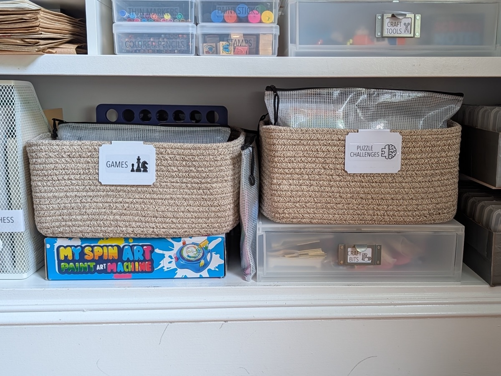{: .mx-auto.d-block :}

| Problem 5: Third messy activity to store | Fix-for-Now | 
|---|---|
| :art: Paints and play dough need to be in sealable bins | :heavy_check_mark: Found clear [shoebox bins](https://www.containerstore.com/s/closet/shoe-storage/our-shoe-box/12d?productId=10001753) that stack! | 
| ↳ ... :test_tube: New addition = [science experiments](https://a.co/d/04PFcXLN)! Box doesn't fit, and should be stored upright. | :heavy_check_mark: Used a [monitor riser](https://a.co/d/0jlOWPHG) as a shelf to stack *three* [click-shut boxes](https://a.co/d/01HQWnOl) on top | 

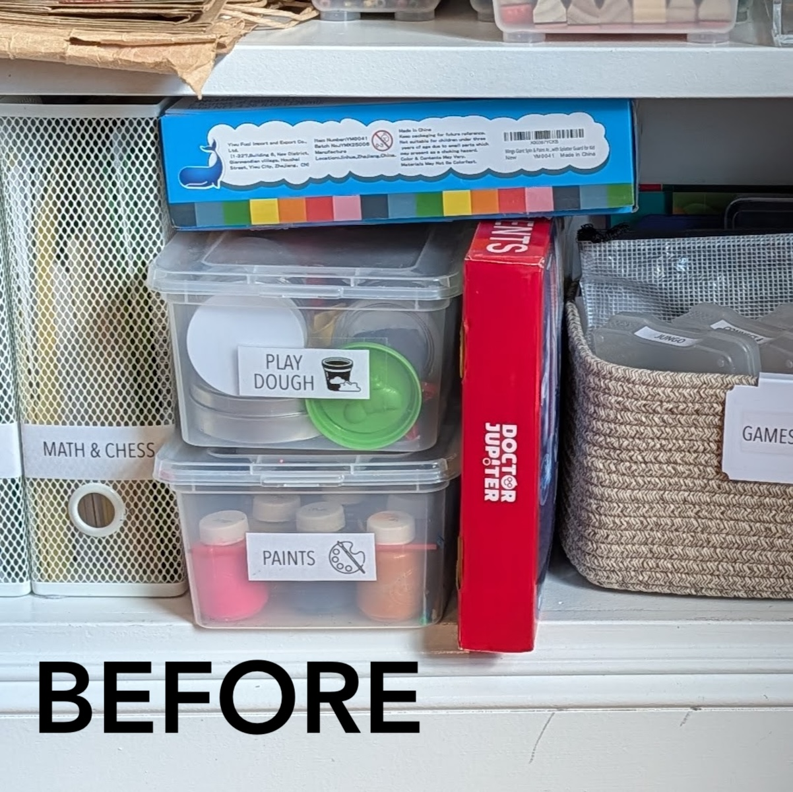{: .mx-auto.d-block :}

Paper grocery and takeout bags are easy to stash here and make excellent art canvases! *However,* 18"-wide cabinet shelves for stacking over them *do not exist*... :unamused: We're using a [computer monitor riser stand](https://a.co/d/0jlOWPHG) instead to stack these new [click-shut bins](https://a.co/d/01HQWnOl) above. And yes, this switch-up was totally worth it to accommodate our excellent [science experiments kit](https://a.co/d/04PFcXLN)! :alembic: :test_tube:

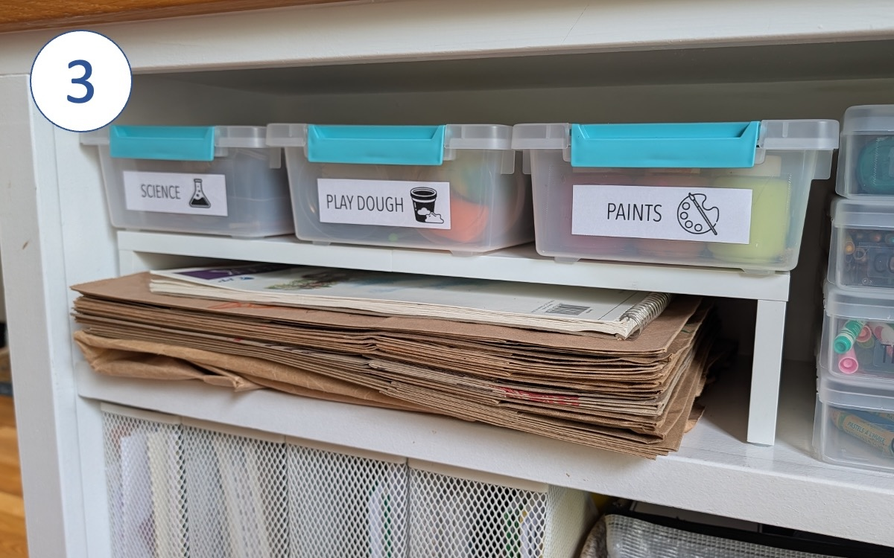{: .mx-auto.d-block :}

## Ongoing Feature Requests

I always knew that the storage solutions I implement will eventually need to be updated. My previous blog posts describe [art solutions](../2022-09-01-kids-artwork) and [toy storage](../2022-12-30-toys) for little kids. :baby: I love finding new fixes to foster independence for our older kids, too ! :boy: 

*The current snapshot again (soon to be updated, I'm sure :wink:):*

{: .mx-auto.d-block :}