In our household, my husband owns the *"cooking"* stack (planning, shopping, dishwashing). :+1: = less management and mental load for me. :-1: = I rarely interact with our food prep systems, so I miss opportunities to optimize them. :muscle: = new, specialized spices and baking storage systems! :hot_pepper: :cake: 

## Time for an Audit

Our food storage and prep systems weren't *bad*. :shrug: In fact, these spaces worked well for years! But great organization is designed around behaviors, and behaviors change... In recent years: 

* My husband dramatically leveled up his cooking and baking skills :man_cook: :bread: (so he deserves the best tools).
* Our set of regularly-used spices, flours, and grains expanded and diversified. :hot_pepper: :garlic: :ear_of_rice:
* We host our friends *and their multiple kids* at least once a week for dinner, so cooking and baking in larger quantities (efficiently and cleanly) is important. 

## Exhibit A. Spices

### Iteration 1: Original Spice Organization

Commonly-used spices were stored in a vertical rack in the cabinet right next to the stove, and "backstock" (refills) were stored in the pantry. :garlic:

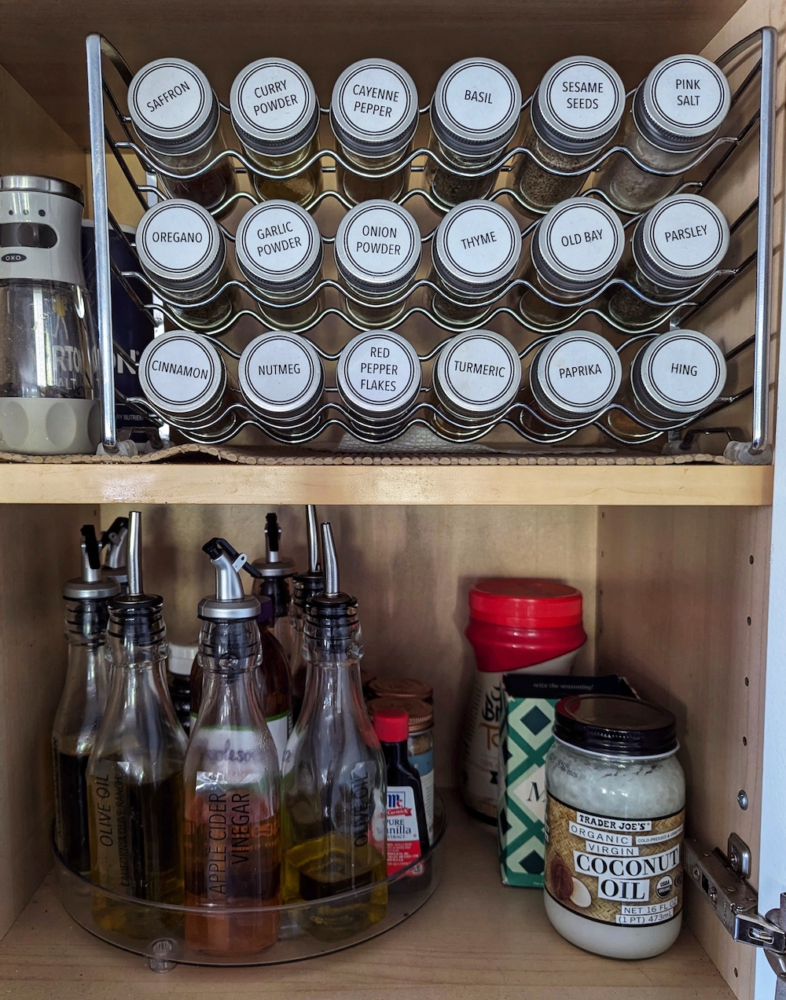{: .mx-auto.d-block :}

### Emerging Spicy Problems

**Complementary spices, not backstock,** started to accumulate in the pantry as recipes became more adventurous. :hot_pepper: :rice: My husband began leaving additional spice jars around the kitchen, or otherwise he would inefficiently head back to the pantry to grab spices as needed. :face_exhaling:

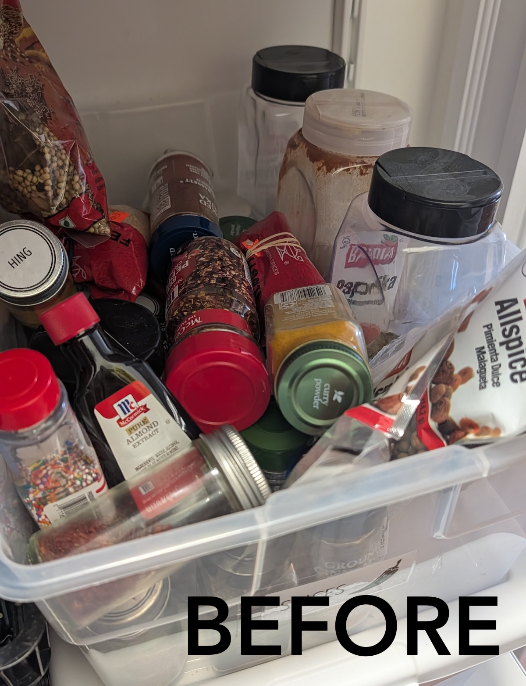{: .mx-auto.d-block :}

Eventually, the hard-to-see pantry inventory led to half-empty containers and accidental purchases of duplicate spices we already had! :scream: :confounded:

**Spices are sold by weight**, not volume. I hadn't realized that 3oz spice jars would rarely fit the full contents of a newly-purchased spice, *but a 4oz spice jar would!* :heavy_check_mark:

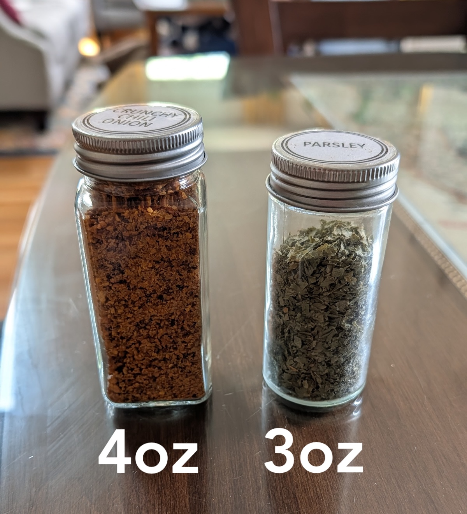{: .mx-auto.d-block :}

**The new stoveside [salt well](https://a.co/d/0cQhm1Dh)** requires frequent refilling, so purchasing salt in a much larger (and harder to store) box was more efficient and economical. 

### The Spices Fix! 

So I got to work...

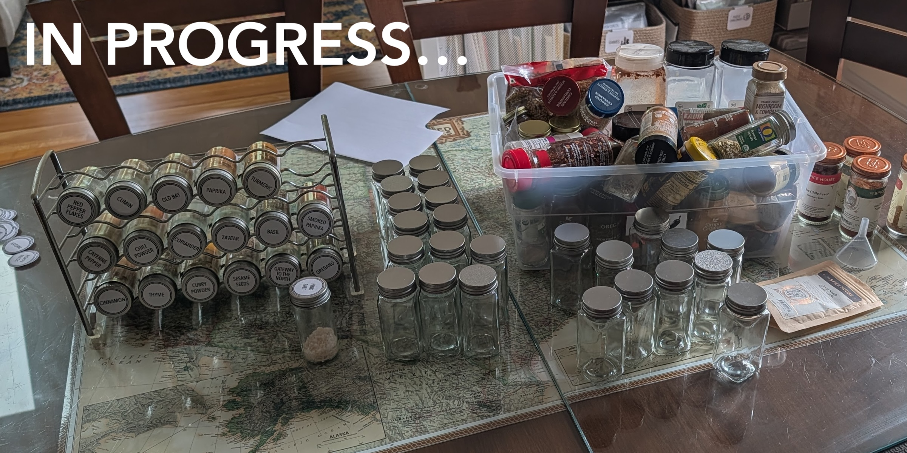{: .mx-auto.d-block :}

I moved all of our spices into [4oz square jars](https://a.co/d/08B7kfnO) that wouldn't roll around on a [new spice rack](https://www.walmart.com/ip/KFFKFF-Removable-Seasoning-Rack-Cabinets-Quadruple-Layered-Spice-Holder-Condiment-Containers-Kitchen-Organizer-Counter-Kitchen-Pantry-Cabinet-Dimensi/15749108088?sid=f61755bd-cc50-4222-9600-45e015b3bee1) that now extends the full width of the cabinet to store more frequently-accessed spices. The salt refill box is now on the top cabinet shelf (instead of the pantry) next to the [masala dabba](https://en.wikipedia.org/wiki/Masala_dabba). 

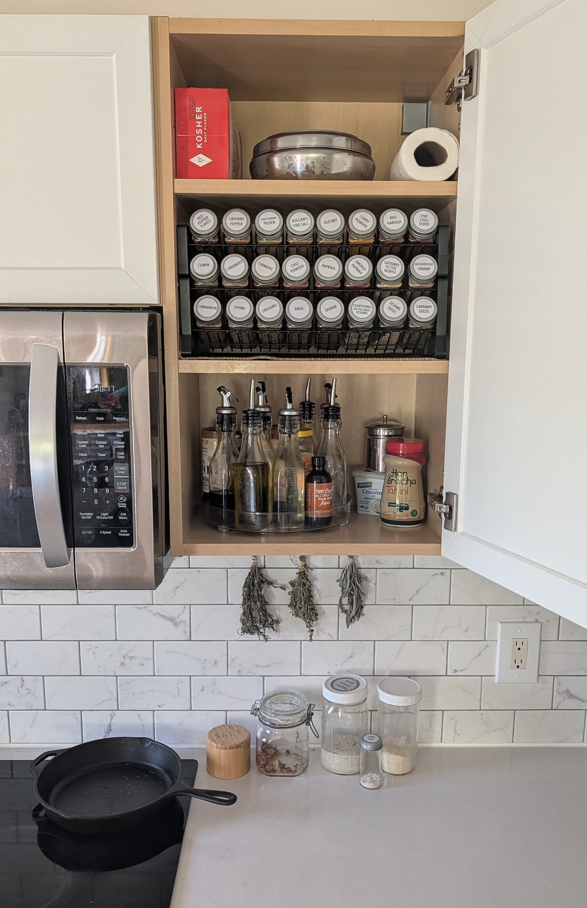{: .mx-auto.d-block :}

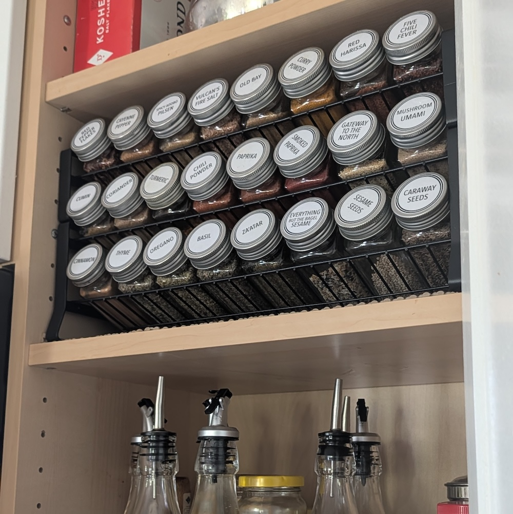{: .mx-auto.d-block :}

The pantry now houses complementary (not overflow) spices *by design*, except in rare cases where a newly purchased spice isn't immediately transferrable in its entirety to a 4oz jar. Lids are labeled! :relaxed: :star_struck:

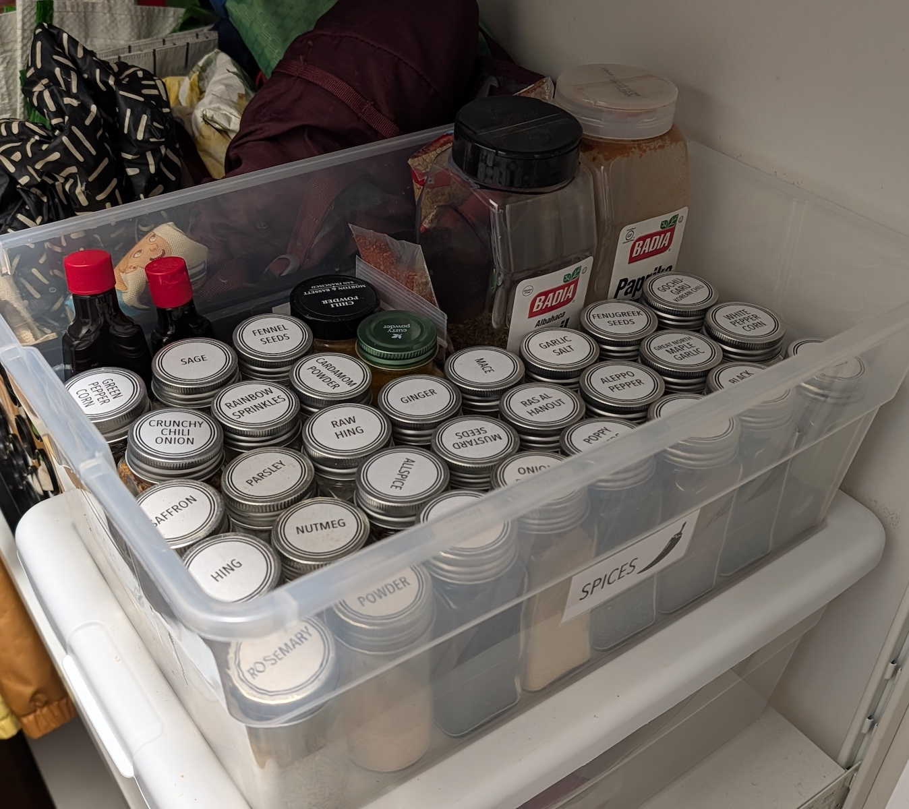{: .mx-auto.d-block :}

## Exhibit B. Flours

### Iteration 1: Bulk grain buckets

We had been using [5-gallon food-safe buckets](https://www.amazon.com/gp/product/B01BLKPDHM/) for storing all sorts of specialty grains and flours that we pick up in bulk once per year through our [grain share CSA](https://localgrain.org/). 

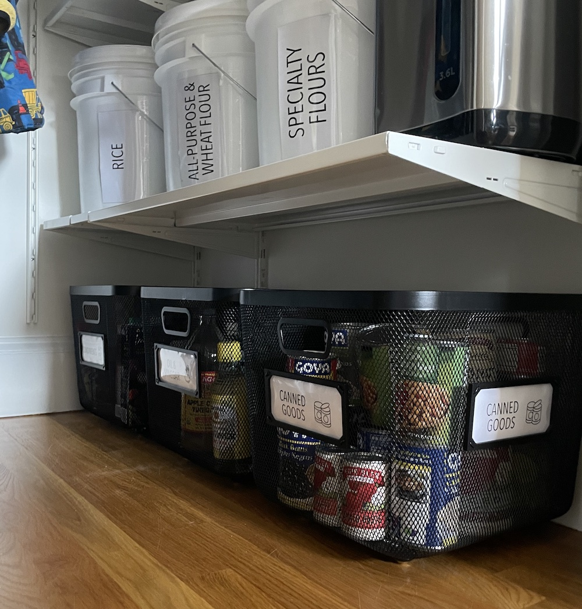{: .mx-auto.d-block :}

### Emerging Baking Problems

:x: **Grains were getting lost.** Stored in nondescript, opaque bags in the original [food-safe bins](https://www.amazon.com/gp/product/B005CJVME2), they were easy to forget. 

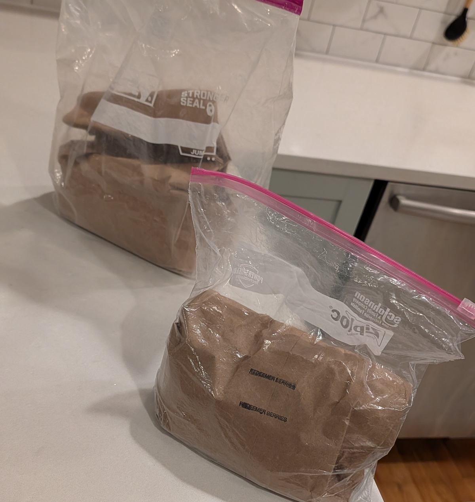{: .mx-auto.d-block :}

:x: **Whole-wheat blends need multiple raw ingredients.** Blending custom proportions of freshly-milled raw wheat berry varieties and groats (yum! :yum:) requires storage of multiple (identical-looking) flours next to their unprocessed counterparts. :bread: :baguette_bread: :face_with_spiral_eyes:

:x: **Countertop stand mixer is far from baking ingredients.** More frequent (and intricate) baking projects (that the kids love to help with) finally justified the purchase of a [KitchenAid stand mixer](https://www.kitchenaid.com/countertop-appliances/stand-mixers/bowl-lift-stand-mixers/p.kitchenaid-5-5-quart-bowl-lift-stand-mixer.KSM55SXXXAG.html). :clap: :cake: It's heavy enough to live permanently on the counter, and the optimal setup should accommodate countertop flour storage nearby, too.

### The Flour Fix!

After reading about professional baking kitchens, I decided to buy [ProKeeper+ containers](https://a.co/d/034c0FHA), which are optimized for [flours](https://a.co/d/0dYsjQWr) and various [types of sugar](https://a.co/d/0dYsjQWr). 

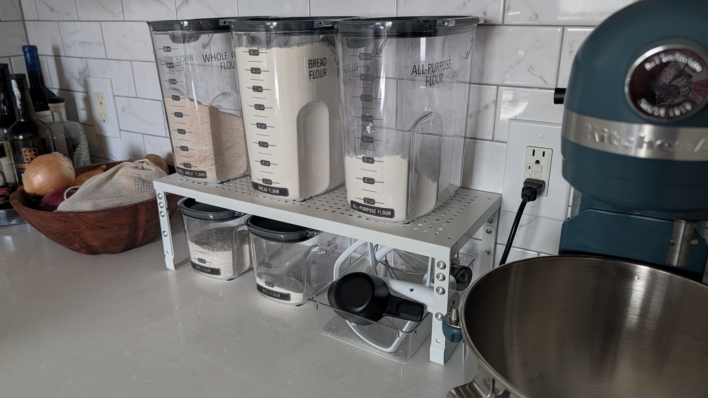{: .mx-auto.d-block :}
*The [flour containers](https://shop.kingarthurbaking.com/items/prokeeper-flour-storage-container) fit standard-sized bags and [include magnetic levelers](https://shop.kingarthurbaking.com/items/small-flour-keeper). The [brown sugar container](https://shop.kingarthurbaking.com/items/prokeeper-brown-sugar-storage-container) includes a terracotta disc to prevent clumping, and the [powdered sugar container](https://shop.kingarthurbaking.com/items/prokeeper-powdered-sugar-storage-container) comes with a dusting spoon.*

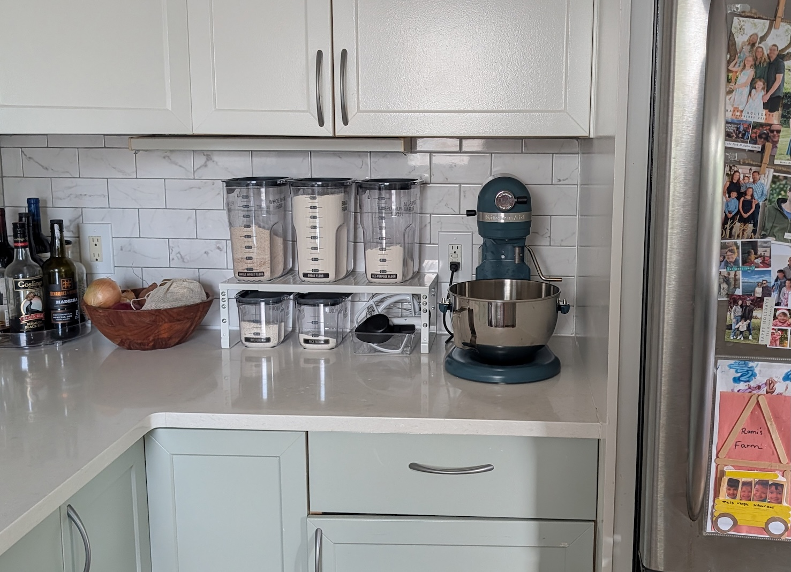{: .mx-auto.d-block :}

In the pantry, we finally [ditched](https://www.facebook.com/BuyNothingProject/) the opaque bins, and began storing other specialty flours and sugars in ProKeeper+ containers on the shelf. The unmilled grains are stored in [16-cup Rubbermaid Brilliance containers](https://a.co/d/0ex6oQvh) directly behind their milled flour versions.

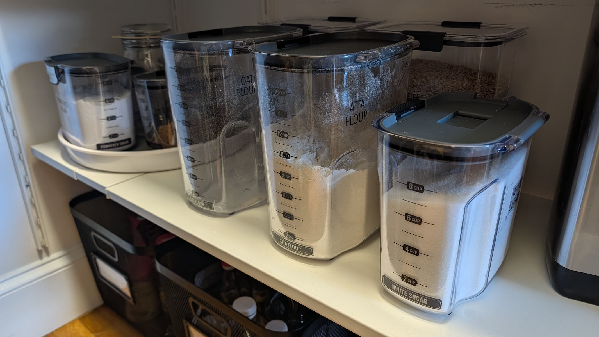{: .mx-auto.d-block :}

In the corner, I added a [15" lazy susan](https://www.target.com/p/15-34-lazy-susan-turn-table-brightroom-8482/-/A-83445782) for sugars and other baking ingredients.

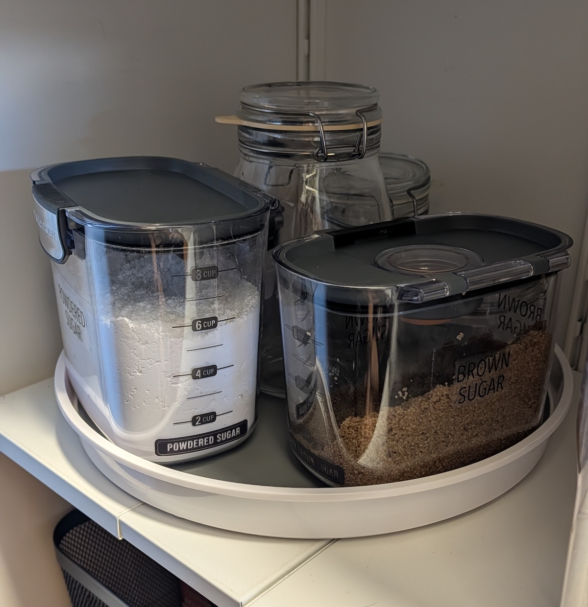{: .mx-auto.d-block :}

## Cost (New Products)

It feels silly to detail "costs", because the amazing bread and baked goodies all three of my boys make me is *priceless.* :yum: :bread: :cake: :pie:

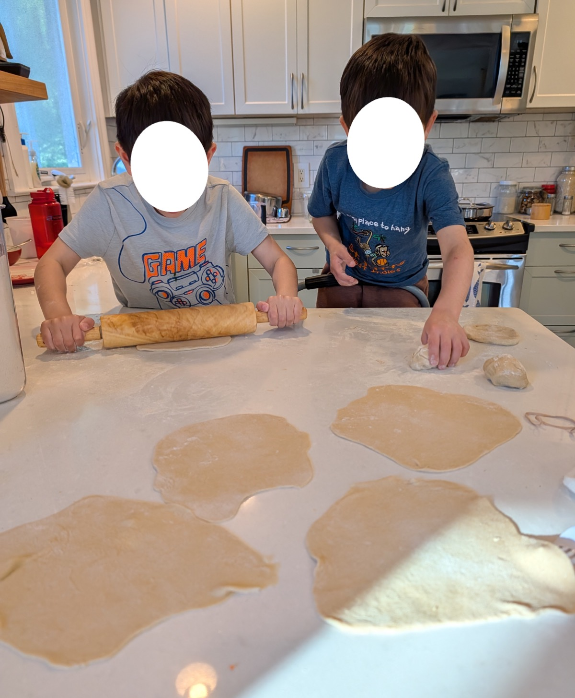{: .mx-auto.d-block :}

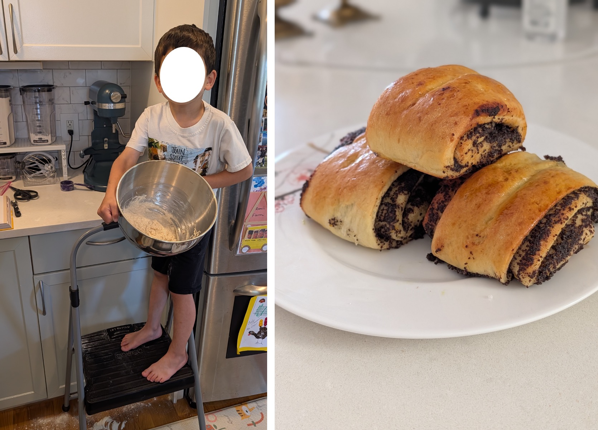{: .mx-auto.d-block :}

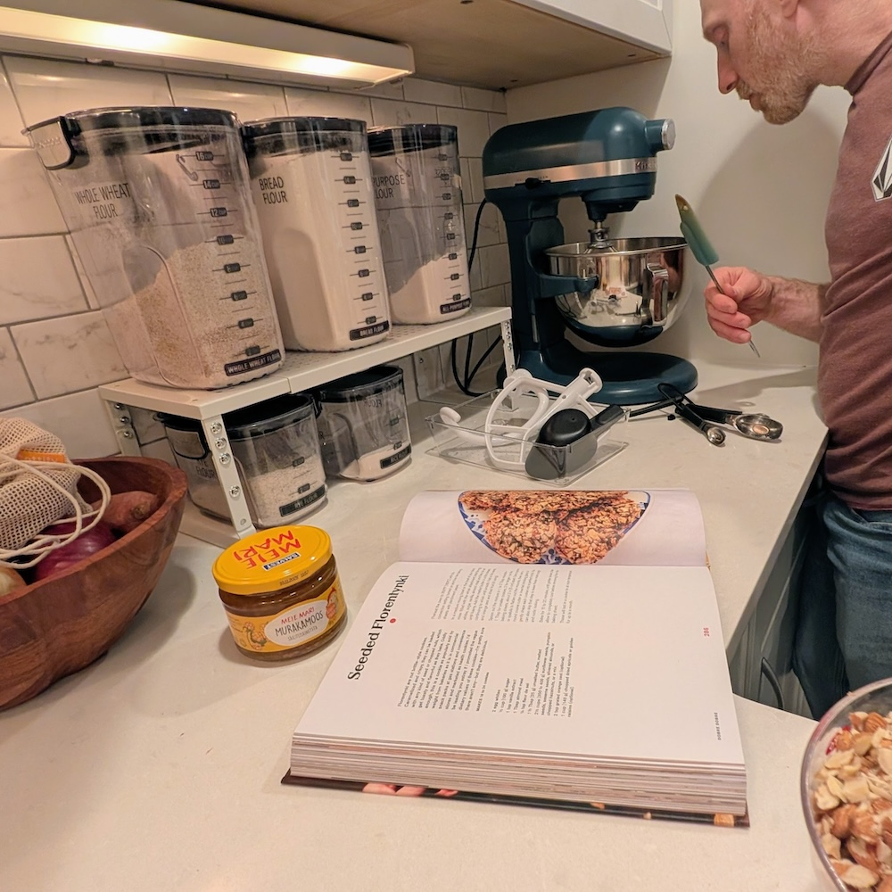{: .mx-auto.d-block :}

**My contribution** to the family baking escapades is to make our spaces look good and function as well as possible ! 

| Materials | Cost (+ tax/shipping) | 
|----|----------------------:|
| 4-pack [ProKeeper+ 4-qt large flour containers](https://a.co/d/034c0FHA) | $106.23 |
| 2 boxes [4oz spice jars](https://a.co/d/08B7kfnO) | $57.32 | 
| [5-piece ProKeeper+ baking containers](https://a.co/d/0dYsjQWr) | $51.91 | 
| 2-pack [ProKeeper+ 1.5-qt specialty flour containers](https://a.co/d/0dYsjQWr) | $42.49 | 
| [expandable countertop shelf](https://a.co/d/07TPhMan) | $34.07 | 
| [16" wide spice rack](https://www.walmart.com/ip/KFFKFF-Removable-Seasoning-Rack-Cabinets-Quadruple-Layered-Spice-Holder-Condiment-Containers-Kitchen-Organizer-Counter-Kitchen-Pantry-Cabinet-Dimensi/15749108088?sid=f61755bd-cc50-4222-9600-45e015b3bee1) | $24.43 | 
| [15" lazy susan](https://www.target.com/p/15-34-lazy-susan-turn-table-brightroom-8482/-/A-83445782) | $12.75 | 
| **TOTAL** |          **$329.20** |