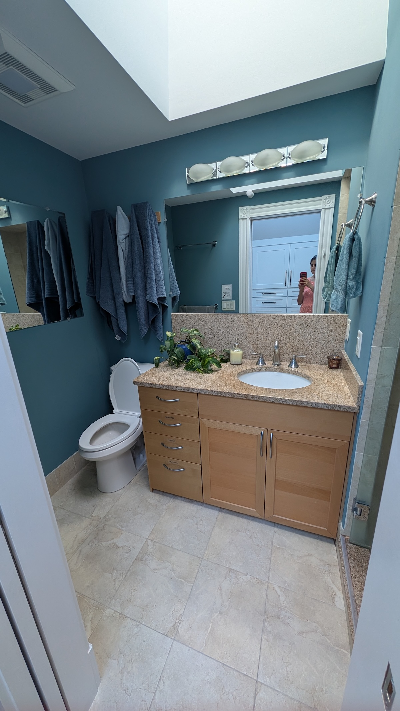
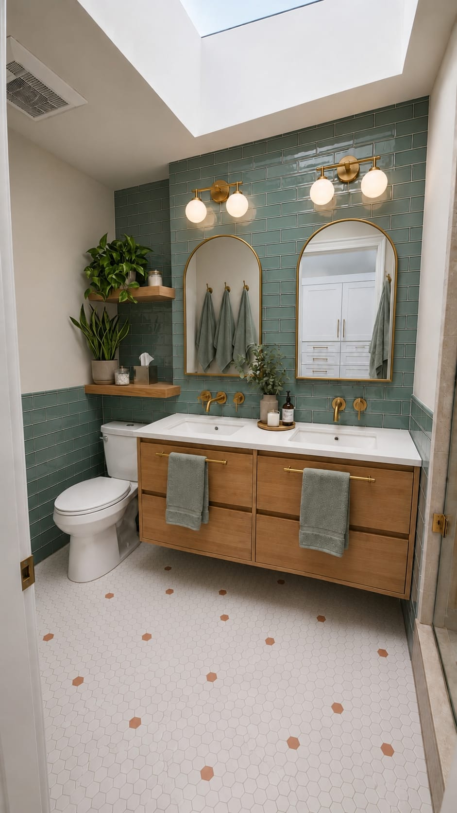
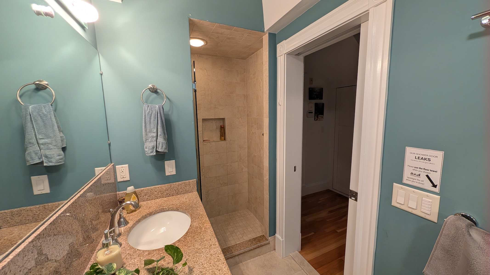
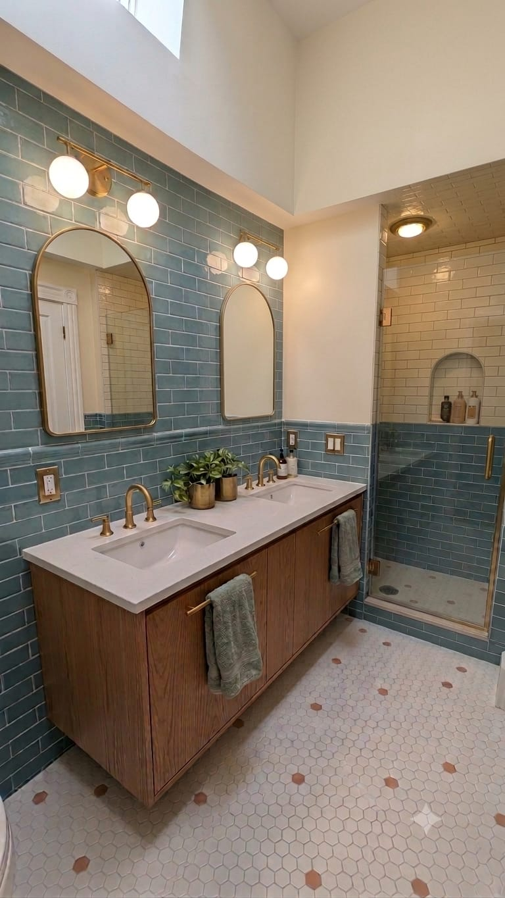

Like everyone else, while scheming about redoing our bathroom, I tried to generate some AI renderings of our space and was met with disappointment. I did use AI to code a to-scale 3D rendering though, and my mind is blown with how I accomplished this complete design in one weekend before making any expensive mistakes. 

## The Constraints

Our current master bathroom is absolutely non-functional:

| Problem | What it Means | 
|---|---|
| :x: Pocket door falls off track. | We get stuck inside! |
| :x: Sink drainpipe is incorrectly installed. | Sink doesn't drain... | 
| :x: Shower threshold installed at an outward angle. | Water flows out all over the floor. | 
| :x: Vanity has one sink. | No. | 
| :x: No storage. | No. | 

Since we finally [moved our bedroom upstairs](../2025-03-15-master-bedroom) last year, we've been thinking hard
about starting to use the master bathroom instead of sharing with our kids in the [downstairs bathroom](../2022-06-25-bathroom-reno).

## The Inspiration (Renderings)

{: .mx-auto.d-block :}

{: .mx-auto.d-block :}

And another angle, using Gemini to render the space according to my specifications: 

{: .mx-auto.d-block :}

{: .mx-auto.d-block :}

Clearly, AI randomly switches up finishes, sizes, and dimensions, resulting in some slop where it's genuinely hard to imagine whether and how everything will fit. 

## Actual 3D Rendering

I used Claude Code to then build a to-scale, interactive, 3D view of the bathroom. I sourced real products, provided their OBJ files where possible, and had them positioned in the space. Check out this rendering! **Drag to orbit, scroll to
zoom, right-drag to pan.**

<iframe
  src="{{ '/bathroom/' | relative_url }}"
  title="Shilpa's Master Bathroom Plans — interactive 3D"
  style="width:100%; height:75vh; min-height:480px; border:0; border-radius:8px;"
  allowfullscreen
  loading="lazy">
</iframe>

  Not loading or hard to interact with inline?
  <a href="{{ '/bathroom/' | relative_url }}">Open the full-screen version →</a>

## Costs

To be clear, so far I have spent $0. But I did find exact products that will fit my needs (all in the above rendering)!

| Materials | Cost | 
| --- | ---:| 
| two [wall-mounted faucets](https://www.kohler.com/en/products/bathroom-faucets/shop-bathroom-sink-faucets/purist-widespread-wall-mount-bathroom-sink-faucet-trim-with-6-1-4-spout-and-lever-handles-requires-valve-t14413-4?skuId=T14413-4-2MB) | $1581.82 | 
| two [arched cabinet mirrors](https://www.kohler.com/en/products/mirrors-and-medicine-cabinets/shop-mirrors-and-medicine-cabinets/verdera-20-x-34-arched-framed-medicine-cabinet-left-hinged-36540?skuId=36540-BGL) | $1298.02 | 
| [toilet](https://www.kohler.com/en/products/toilets/shop-toilets/highline-comfort-height-two-piece-elongated-1-28-gpf-toilet-w-class-five-flush-technology-left-hand-trip-lever-and-concealed-trapway-76301?skuId=76301-96) | $577.87 | 
| two [Ikea vanities](https://www.ikea.com/us/en/p/aengsjoen-bathroom-vanity-with-drawers-oak-effect-00535337/) (to be shortened) | $518.00 | 
| two [vanity sconce lights](https://www.fergusonhome.com/lark-85002/s1829094?uid=4337746) | $359.98 |
| three [appliance pulls](https://www.rejuvenation.com/products/archie-appliance-pull/) | $284.97 | 
| [shower head](https://www.kohler.com/en/products/showers/shop-shower-heads/forte-2-5-gpm-single-function-wall-mount-showerhead-with-katalyst-air-induction-spray-10282-ak?skuId=10282-AK-BN) | $148.35 | 
| 3x12" [blue/green subway tile](https://www.tilebar.com/product/lancaster-3x12-open-seas-ceramic-tile.html) | $107.06/box |
| 3x12" [cream/vanilla subway tile](https://www.tilebar.com/product/lancaster-3x12-vanilla-ceramic-tile.html) | $107.06/box |
| [shower knob](https://www.kohler.com/en/products/showers/shop-shower-trims-valves/elate-rite-temp-valve-trim-ts35320-4?skuId=TS35320-4-2MB) | $80.92 | 
| five [bathroom hooks](https://www.wayfair.com/Delta--Cassidy%E2%84%A2-Wall-Mounted-Towel-Hook-79735-L7245-K~DLT6421.html) | $75.90 |
| [14x22" arched shower niche](https://stonetooling.com/ez-niche-plus-arch-square-rectangle/) | $64.47 | 
| [toilet paper holder](https://www.wayfair.com/Delta--Tissue-Holder-76247-L6143-K~CBKB4233.html) | $40.86 | 
| [mirror door angle restrictors](https://www.kraftmaid.com/whisper-touch-angle-restrictor-clip-wtharc/) | $5.00 | 
| 2" white hex tile (to be sourced) | $0.00 | 
| 2" terracota hex tile (to be sourced) | $0.00 | 
| 24x80" [6-panel colonist mirror door slab](https://www.lowes.com/pd/JELD-WEN-Colonist-Primed-6-Panel-Hollow-Core-Mirrored-Glass-Molded-Composite-Slab-Door-Common-24-in-x-80-in-Actual-24-in-x-80-in/50018010) (to be sourced) | $0.00 | 
| **TOTAL** |          **$5250.28** |

Now, let's see how inspired I'm feeling to really get this project done... wish me luck!